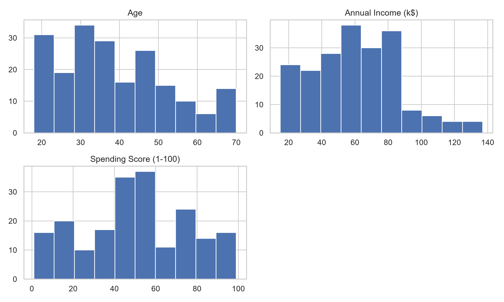
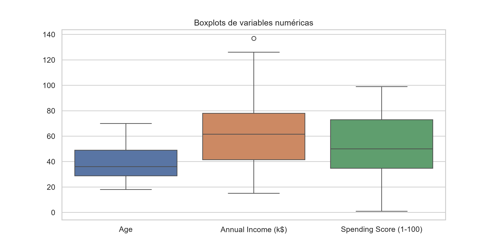
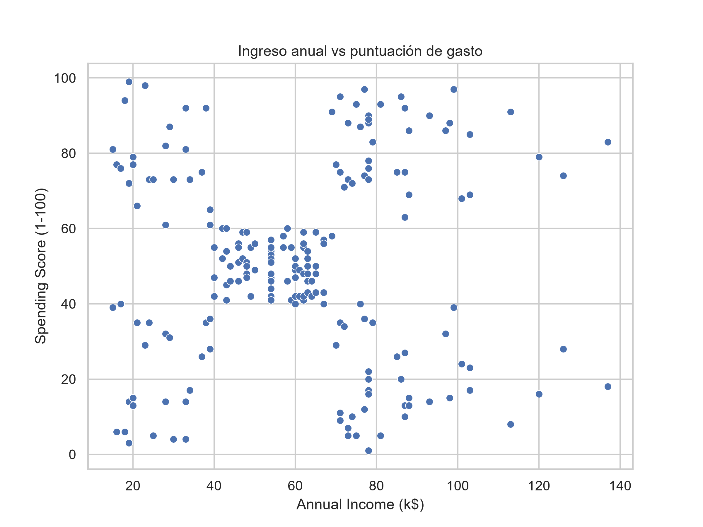
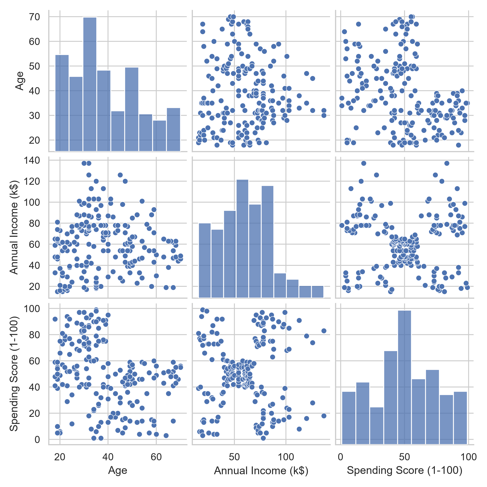
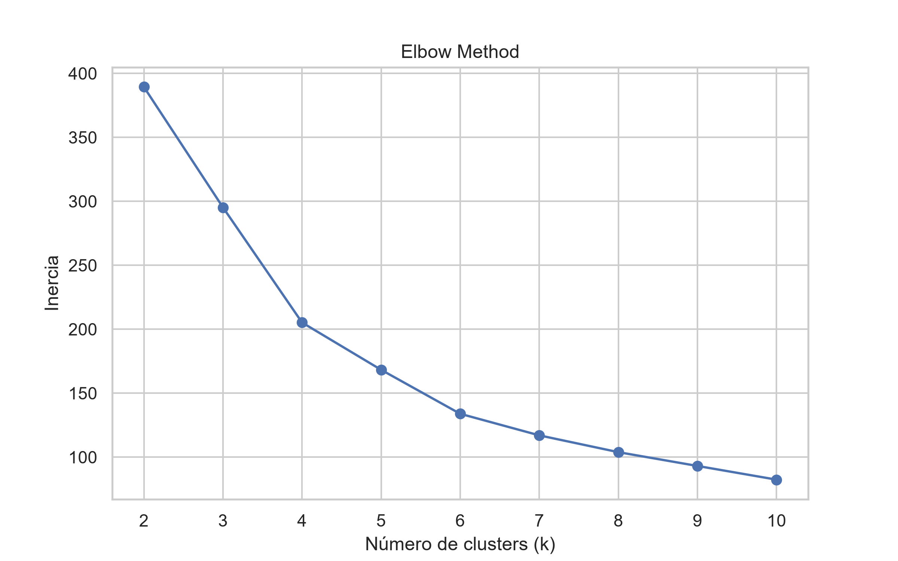
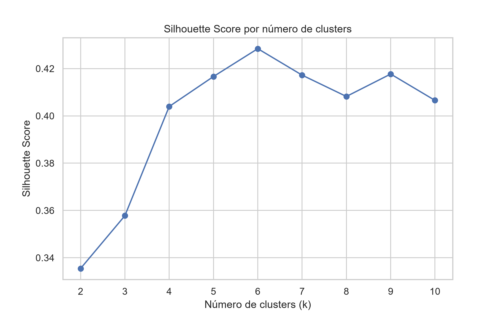
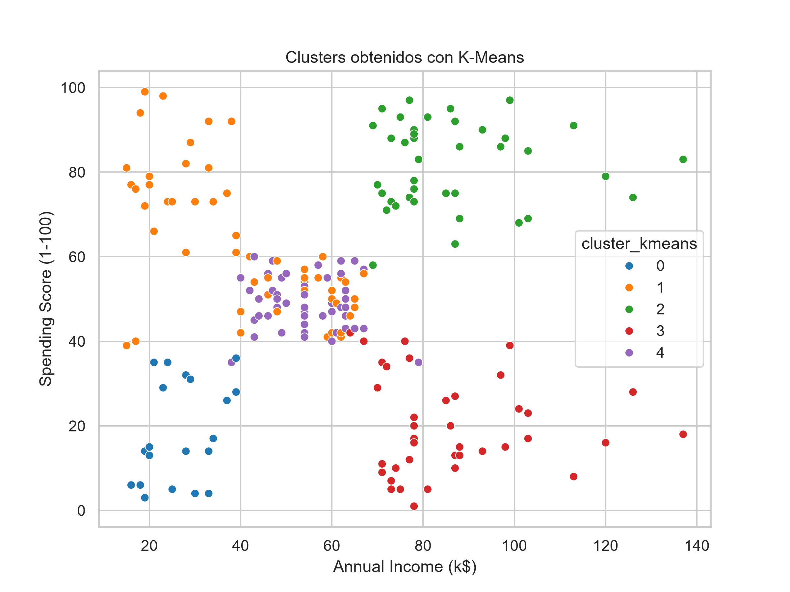
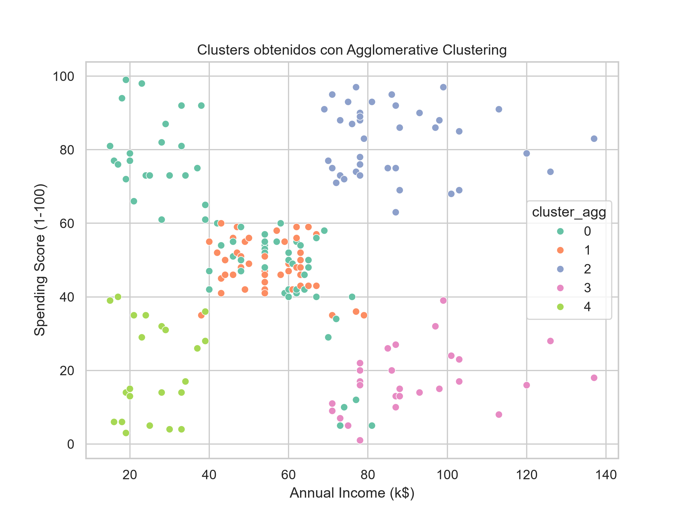

# Informe De Segmentacion De Clientes Mediante Aprendizaje no Supervisado

**Nombre del estudiante:** [Por completar]  
**Matricula:** [Por completar]  
**Asignatura:** Fundamentos de IA  
**Fecha:** 28 de junio de 2026

## 1. Introducción Buenas Termino Primero

La segmentación de clientes es una técnica habitual en analítica de negocio porque permite agrupar personas con comportamientos parecidos y, con eso, tomar decisiones mas precisas. En lugar de tratar a toda la base de clientes como un único bloque, el analysis no supervisado ayuda a detectar grupos con patrones de consumo distintos. Eso tiene valor para marketing, ventas, promociones y priori Todo bien sale ratito alta ya no me acuerdo zacion comercial.

En esta actividad se trabajo con un conjunto de datos de clientes de un centro comercial. Las variables disponibles incluyen identificador del cliente, genero, edad, ingreso annual y puntuacion de gasto. El estudio se centro en identificar segmentos de clientes usando las variables numericas y comparar dos metodos de clustering para decidir cual ofrece una mejor lectura de negocio.

La decision de cual ofrece mejor lectura proviende de un metodo llamado `silhouette score` o puntuacion de silueta que es una apuntacion atribuidada a cada cluster por la distancia y entre mas alto sea el puntaje es mejor.

## 2. Objetivo

Aplicar tecnicas de clustering sobre un conjunto de datos de clientes para identificar grupos con caracteristicas similares, comparar al menos dos metodos de segmentacion y analizar la utilidad potential de los resultados en un contexto real de negocio.

## 3. Descripción Del Dataset

El dataset que tenemos viene de parte De la de Kaggle que es la fuente Que nos entrega un CSV Sobre clientes de un centro comercial En el CSV se encuentran 5 columnas, Con 200 registros. Es un dataset pequeño Pero suficiente Para practicar la segmentación y lectura de clusters Parte de las columnas que tiene el archivo bien información básica sobre los clientes Que nos va ayudar a explorar las relaciones entre las edades los ingresos y el comportamiento de compra. 

### 3.1 Fuente De Datos

**Tabla 1**  
Descripción general del dataset

| Campo     | Descripcion                     |
| --------- | ------------------------------- |
| Dataset   | `Mall_Customers.csv`            |
| Fuente    | Kaggle, Mall Customers Dataset  |
| Registros | 200                             |
| Columnas  | 5                               |
| Contexto  | Clientes de un centro comercial |

### 3.2 Estructura Del Dataset

Las columnas del archivo son:

| Columna | Tipo | Significado |
|---|---|---|
| `CustomerID` | Entero | Identificador del cliente |
| `Genre` | Texto | Genero registrado (`Male` o `Female`) |
| `Age` | Entero | Edad del cliente |
| `Annual Income (k$)` | Entero | Ingreso annual en miles de dolares |
| `Spending Score (1-100)` | Entero | Puntuacion de gasto de 1 a 100 |

### 3.3 Descripcion De Variables Relevantes

- `CustomerID`: solo identifica cada fila. No describe comportamiento de negocio y no debe usarse como variable de clustering.
- `Genre`: variable categorica con dos valores.
- `Age`: ayuda a diferenciar clientes por etapa de vida.
- `Annual Income (k$)`: permite distinguir capacidad economica.
- `Spending Score (1-100)`: resume la propension de compra o gasto.

### 3.4 Observaciones Iniciales

El dataset tiene una forma sencilla de leer, pero eso no significa que su estructura sea simple. La edad y el ingreso muestran dispersion moderada, mientras que la puntuacion de gasto cubre casi toda la escala possible. Esa mezcla sugiere que existen segmentos comerciales distintos, no una poblacion uniforme.

## 4. Analysis Exploratorio De Los Datos

### 4.1 Exploracion Inicial

La revision inicial muestra lo siguiente:

- Resultado de `shape`: `(200, 5)`
- Tipos de datos: cuatro columnas numericas y una categorica
- Valores nulos: no se detectaron
- Duplicados: no se reportan en el analysis documentado

```text
Shape: (200, 5)

Columnas:
['CustomerID', 'Genre', 'Age', 'Annual Income (k$)', 'Spending Score (1-100)']

Info:
<class 'pandas.DataFrame'>
RangeIndex: 200 entries, 0 to 199
Data columns (total 5 columns):
 #   Column                  Non-Null Count  Dtype
---  ------                  --------------  -----
 0   CustomerID              200 non-null    int64
 1   Genre                   200 non-null    str
 2   Age                     200 non-null    int64
 3   Annual Income (k$)      200 non-null    int64
 4   Spending Score (1-100)  200 non-null    int64
```

La ausencia de nulos reduce el trabajo de limpieza. En este caso el preprocesamiento se concentro en seleccionar las variables utiles y estandarizarlas.

```text
CustomerID                0
Genre                     0
Age                       0
Annual Income (k$)        0
Spending Score (1-100)    0
dtype: int64
```

### 4.2 Estadística Descriptiva

**Tabla 2**  
Resumen estadistico principal

| Variable | Media | Desviacion estandar | Minimo | Mediana | Maximo |
|---|---:|---:|---:|---:|---:|
| Age | 38.85 | 13.97 | 18 | 36.00 | 70 |
| Annual Income (k$) | 60.56 | 26.26 | 15 | 61.50 | 137 |
| Spending Score (1-100) | 50.20 | 25.82 | 1 | 50.00 | 99 |

La edad promedio es 38.85 anos. La distribución va de clientes jovenes a clientes mayores, con una mediana de 36 anos. El ingreso annual promedio es 60.56 k$, con una dispersion amplia y una mediana cercana a la media. La puntuacion de gasto tiene una variacion fuerte y cubre casi toda la escala, lo que facilita encontrar grupos con conductas de consumo diferentes.

### 4.3 Visualizaciones Principales

**Figura 1**  
Histogramas de variables numericas



El histograma de edad muestra a los clientes Desde 18 años de edad hasta los 70 años se nota una inconcentración Importante más en edadas jóvenes y adultas tempranas Especialmente entre los 20 y 40 años. 

Por otro lado tenemos el histograma de ingreso annual Que muestra que muchos clientes tienen ingresos promedio entre 40 y 85000 dólares También tenemos en clientes con ingresos muy muy bajos cercanos de los 15 y 30 y muy pocos por encima de 100.

Por último El histograma de El puntuaje De gasto Muestra valores repetidos De todo rango pero tenemos una concentración mayor entre 40 y 60 Aunque tenemos Muchos clientes de pajo y alto Estas últimas para una segmentación porque existen diferencias reales en el comportamiento y en la capacidad de pago También se podría determinar como una capacidad de pago diferencial dependiendo las edades o el gasto económico que tengan las personas

**Figura 2**  
Boxplots de variables numericas



El boxplot De edad muestra Una mediana acerca de los 36 años aunque la caja cubre aproximadamente de los finales de los 20 acerca de los 49 años No notamos una valor esa típicos aquí.

Donde sí notamos valores atípicos provienen de boxplot De ingreso annual donde mostramos Un punto atípico acerca de los 137 lo cual indica que tenemos un cliente De alto ingreso Bastante arriba que la mayoría.

Y por último el boxplot de gasto Tiene una mediana cercana de los 50 puntos La caja relativamente amplia lo cual confirma que hay una variación En el gasto nos observan valores atípicos marcados.

Los boxplots muestran clientes con valores extremos, sobre todo en ingreso y gasto. No se eliminaron, porque no parecen errores de captura. Al contrario, probablemente representan segmentos reales: personas con alto ingreso y bajo gasto, o clientes con bajo ingreso y gasto alto. En un analysis de segmentacion, eliminar esos casos sin criterio puede borrar justamente los perfiles mas utiles.

**Figura 3**  
Dispersión entre ingreso annual y puntuación de gasto



Este gráfico de dispersión es 1 de los más importantes del análisis dado que muestra claramente que los clientes no están distribuidos como una nube completamente aleatoria sino hay zonas que podemos reconocer 

- Ingreso bajo y gasto bajo.
- Ingreso bajo y gasto alto.
- Ingreso medio y gasto medio.
- Ingreso alto y gasto bajo.
- Ingreso alto y gasto alto.

Son justamente las candidatas naturales para los clusters, Por ejemplo podemos ver que tenemos clientes de alto ingreso y Gasto alto que pueden set un segmento atractivo para campañas De marketing y en cambio también se nota que tenemos muchos clientes de alto de ingreso ato y gasto bajo que podrían requerir estrategias de activaciones o distintos promociones Para poder incentivar el gasto.

**Figura 4**  
Pairplot de variables numericas



El pairplot permite revisar relaciones entre todas las variables numéricas al mismo tiempo.

La relación más clara aparece entre `Annual Income (k$)` y `Spending Score (1-100)`. Se ven regiones separadas que luego los algoritmos de clustering intentan formalizar.

La relación entre `Age` y `Spending Score` sugiere que muchos clientes jóvenes tienen puntuaciones de gasto altas o medias, mientras que clientes mayores tienden a concentrarse más en gasto medio o bajo. No es una regla absoluta, pero sí un patrón visible.

La relación entre `Age` e `Annual Income` no muestra una separación tan fuerte. Por eso edad ayuda, pero no parece set la variable que más define los grupos visualmente.

### 4.5 Interpretacion Del Analysis Exploratorio

Las visualizaciones ayudan a ver tres cosas. Primero, el ingreso y el gasto no crecen de forma lineal, asi que hay espacio para clusters distintos. Segundo, la edad influye en parte del comportamiento, pero no domina todo el patron. Tercero, el plano `Annual Income (k$)` y `Spending Score (1-100)` ya sugiere grupos naturales. Esa es la razon por la que el clustering tiene sentido aqui.

## 5. Preprocesamiento De Los Datos

### 5.1 Seleccion De Variables

Para el clustering principal se usaron:

```python
["Age", "Annual Income (k$)", "Spending Score (1-100)"]
```

Estas variables se eligieron porque son numericas, comparables y tienen sentido directo para segmentar clientes. Permiten construir grupos por etapa de vida, capacidad economica y comportamiento de gasto.

### 5.2 Variables Excluidas

- `CustomerID`: se excluyo porque solo identifica registros.
- `Genre`: se excluyo en el modelo base porque es categorica y no aporta una lectura cuantitativa inmediata sin transformacion adicional.

Al incluir genero en el algoritmo se pudo usarlo como un dimension adicional de distancia. el genero no este correlacionado otras variables, al estar estándar puede separar clientes hombres y sugiere que genero no tiene una uso fuerte con las variables numérica grafica de K-Means sin genero muestra la segmentation principal ya se e bastante bien por ingreso, gasto Por eso, cuando se agrega genero, modelo fragmenta mas los clusters `silhouette` no mejora. si genero no esta muy correlación las variables de consumo, puede set parte de la composicion de los clusters, pero necesariamente mejorar la calidad segmentación.

**Figura 5**  
cluster k-means con genero

![[Pasted image 20260628180655.png]]

### 5.3 Escalado De Variables

Se aplico `StandardScaler` a las variables numericas. Sin escalado, la variable de ingreso podria dominar el calculo solo por tener una escala mas amplia que edad o gasto.

```text
array([[-1.42456879, -1.73899919, -0.43480148],
       [-1.28103541, -1.73899919,  1.19570407],
       [-1.3528021 , -1.70082976, -1.71591298],
       [-1.13750203, -1.70082976,  1.04041783],
       [-0.56336851, -1.66266033, -0.39597992]])
```

Cada fila sigue representando un cliente, pero los valores ya no están en años, miles de dólares o escala 1-100. Ahora están expresados como distancia respecto a la media de su variable.

Por ejemplo, en la primera fila:

- `-1.42456879` en edad significa que el cliente está bastante por debajo de la edad promedio.
- `-1.73899919` en ingreso significa que su ingreso está muy por debajo del promedio.
- `-0.43480148` en gasto significa que su gasto está un poco por debajo del promedio.

El escalado es necesario porque K-Means y Agglomerative Clustering dependen de distancias. Sin escalado, una variable con mayor rango podría pesar más aunque no sea más importante.

## 6. Aplicacion Del Primer Algoritmo De Clustering

### 6.1 Algoritmo Seleccionado

El primer algoritmo fue K-Means.

Se eligio porque es facil de interpretar, funciona bien con variables numericas estandarizadas y produce clusters que pueden representarse de forma clara en dos dimensions.

### 6.2 Busqueda Del Numero Optimo De Clusters

Se probaron valores de `k` entre 2 y 10 usando dos criterios:

- metodo del code
- silhouette score

La lectura de las metricas fue esta:

**Tabla 3**  
Resultados de K-Means por numero de clusters

| k | Inercia | Silhouette |
|---:|---:|---:|
| 2 | 389.386189 | 0.335472 |
| 3 | 295.212246 | 0.357793 |
| 4 | 205.225147 | 0.403958 |
| 5 | 168.247580 | 0.416643 |
| 6 | 133.868421 | 0.428417 |
| 7 | 117.011555 | 0.417232 |
| 8 | 103.873292 | 0.408207 |
| 9 | 93.092891 | 0.417693 |
| 10 | 82.385154 | 0.406554 |

El mejor silhouette se obtuvo con `k=6`, pero escogi en el notebook `k=5` por interpretabilidad. Esa decision fue porque: `k=5` sigue cerca del mejor valor y permite un relato de negocio mas limpio.

**Figura 6**  
Metodo del code



**Figura 7**  
Silhouette score por numero de clusters



### 6.3 Entrenamiento Del Modelo

Se entreno K-Means con `k=5`, `random_state=42` y `n_init=10`.

La configuracion final fue estable y reproducible. El modelo asigna a cada cliente un cluster segun la cercania a los centroides.

### 6.4 Resultados Obtenidos

**Figura 8** 

Clusters obtenidos con K-Means



**Tabla 4**  
Resumen de clusters K-Means

| Cluster | Edad media | Ingreso medio (k$) | Gasto medio | Tamaño |
|---:|---:|---:|---:|---:|
| 0 | 46.25 | 26.75 | 18.35 | 20 |
| 1 | 25.19 | 41.09 | 62.24 | 54 |
| 2 | 32.88 | 86.10 | 81.53 | 40 |
| 3 | 39.87 | 86.10 | 19.36 | 39 |
| 4 | 55.64 | 54.38 | 48.85 | 47 |

### 6.5 Interpretacion De Los Clusters

- Cluster 0: clientes de ingreso bajo y gasto bajo. Es un segmento de bajo valor inmediato.
- Cluster 1: clientes jovenes con ingreso bajo-medio y gasto medio-alto. Responden mejor a promociones y experiencias.
- Cluster 2: clientes de ingreso alto y gasto alto. Es el segmento mas valioso.
- Cluster 3: clientes de ingreso alto y gasto bajo. Tienen capacidad economica, pero no gastan mucho.
- Cluster 4: clientes de edad mayor, ingreso medio y gasto medio. Es un grupo estable, util para estrategias de retencion.

## 7. Aplicacion Del Segundo Algoritmo De Clustering

### 7.1 Algoritmo Seleccionado

El segundo algoritmo fue Agglomerative Clustering.

Se utilizo porque permite contrastar la estructura obtenida por K-Means con un enfoque jerarquico. Eso ayuda a verificar si los segmentos dependen de un solo metodo o si la tendencia aparece de forma mas general.

### 7.2 Parametros Utilizados

Se empleo `n_clusters=5` para mantener una comparacion directa con el modelo K-Means final. La evaluacion se hizo con `silhouette_score`.

### 7.3 Resultados Obtenidos

**Figura 8**  
Clusters obtenidos con Agglomerative Clustering



El resultado cuantitativo fue:

| Metodo | Numero de clusters | Silhouette |
|---|---:|---:|
| K-Means | 5 | 0.416643 |
| Agglomerative Clustering | 5 | 0.390028 |

### 7.4 Interpretacion De Resultados

Agglomerative Clustering encuentra una estructura parecida a K-Means, pero con menos calidad de separacion. En la visualizacion, algunas zonas centrales quedan repartidas de forma menos limpia. Eso coincide con su silhouette score mas bajo.

## 8. Comparacion De Algoritmos

### 8.1 Comparacion Cuantitativa

**Tabla 5**  
Comparacion de algoritmos de clustering

| Metodo | Numero de clusters | Silhouette score | Facilidad de interpretacion | Observaciones |
|---|---:|---:|---|---|
| K-Means | 5 | 0.416643 | Alta | Segmentos mas claros y faciles de explicar |
| Agglomerative Clustering | 5 | 0.390028 | Media | Valido para contraste, pero menos limpio visualmente |

### 8.2 Comparacion Cualitativa

K-Means resulto mas facil de interpretar y dio una separacion visual mas ordenada. Agglomerative Clustering fue util como control, pero no supero al modelo principal. Ambos dependen del escalado, pero K-Means se ajusto mejor a la geometria del problema. En este caso, la estructura de los datos parece mas cercana a centroides que a una division jerarquica pura.

### 8.3 Modelo Mas Adecuado

K-Means fue el metodo mas adecuado. No solo obtuvo mejor silhouette, sino que tambien genero clusters mas faciles de traducir a perfiles de negocio. Para un informe academico o una propuesta comercial, eso pesa tanto como la metrica.

## 9. Aplicaciones En Un Contexto Real

Los clusters obtenidos pueden usarse para varias decisiones reales:

- segmentacion de mercado por comportamiento de compra
- campanas personalizadas segun ingreso y gasto
- promociones para clientes de alto ingreso pero bajo gasto
- programas de fidelizacion para clientes jovenes con alto gasto
- estrategias de retencion para clientes de gasto medio y edad mayor

La utilidad no esta en etiquetar clientes por el simple hecho de agruparlos. Esta en traducir esos grupos en acciones concretas y distintas. Si todos reciben la misma campana, la segmentacion pierde valor.

## 10. Limitaciones Del Analysis

La primera limitacion es el tamano del dataset. Con 200 clientes se pueden ver tendencias, pero no se debe exagerar la generalizacion.

La segunda limitacion es la cantidad de variables. Solo se usaron edad, ingreso y gasto. Faltan variables de comportamiento mas cercanas al negocio, como frecuencia de compra, tipo de producto, ticket promedio o canal de compra.

La tercera limitacion es metodologica. K-Means y Agglomerative Clustering funcionan bien aqui, pero no son los unicos enfoques posibles. Otros metodos podrian capturar mejor estructuras irregulares o densidades distintas.

## 11. Conclusiones

El analysis permitio segmentar clientes de un centro comercial a partir de edad, ingreso annual y puntuacion de gasto. La exploracion inicial mostro que las variables tienen suficiente variacion para justificar clustering. El preprocesamiento fue directo, porque no habia nulos ni inconsistencias graves, y el escalado fue suficiente para preparar los datos.

Entre los dos metodos comparados, K-Means dio mejor resultado que Agglomerative Clustering. Aunque el valor optimo de silhouette aparecia en `k=6`, se eligio `k=5` por claridad interpretativa. Esa decision no maximiza la metrica, pero si mejora la lectura de negocio. Para esta actividad, esa eleccion es defendible.

Los segmentos encontrados son utiles y coherentes: clientes de alto ingreso y alto gasto, clientes con potential no activado, clientes jovenes con mayor gasto y clientes de bajo gasto. En una empresa real, esos grupos podrian convertirse en campañas diferenciadas, promociones especificas y estrategias de fidelizacion mas precisas.

Queda una limitacion obvia: el dataset es pequeno y tiene pocas variables. Por eso este informe debe leerse como una segmentacion inicial, no como una verdad definitiva sobre el comportamiento de todos los clientes.

## 13. Referencias

Kaggle. (n.d.). *Mall customers dataset* [Data set]. https://www.kaggle.com/datasets/shwetabh123/mall-customers

Pedregosa, F., Varoquaux, G., Gramfort, A., Michel, V., Thirion, B., Grisel, O., Blondel, M., Prettenhofer, P., Weiss, R., Dubourg, V., Vanderplas, J., Passos, A., Cournapeau, D., Brucher, M., Perrot, M., & Duchesnay, E. (2011). Scikit-learn: Machine learning in Python. *Journal of Machine Learning Research, 12*, 2825-2830.

Pandas development team. (n.d.). *pandas documentation*. https://pandas.pydata.org/docs/

Scikit-learn developers. (n.d.). *scikit-learn documentation*. https://scikit-learn.org/stable/

Waskom, M. L. (n.d.). *seaborn documentation*. https://seaborn.pydata.org/
