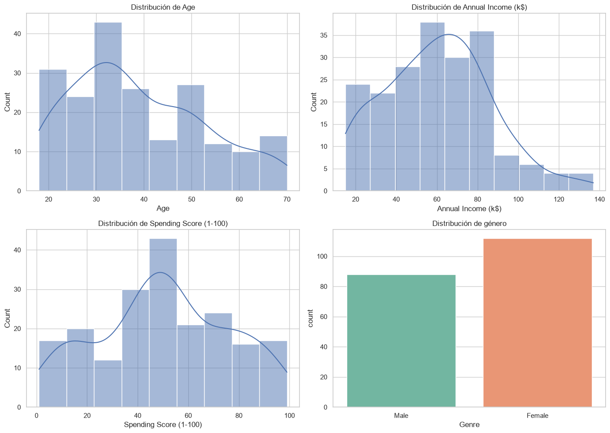
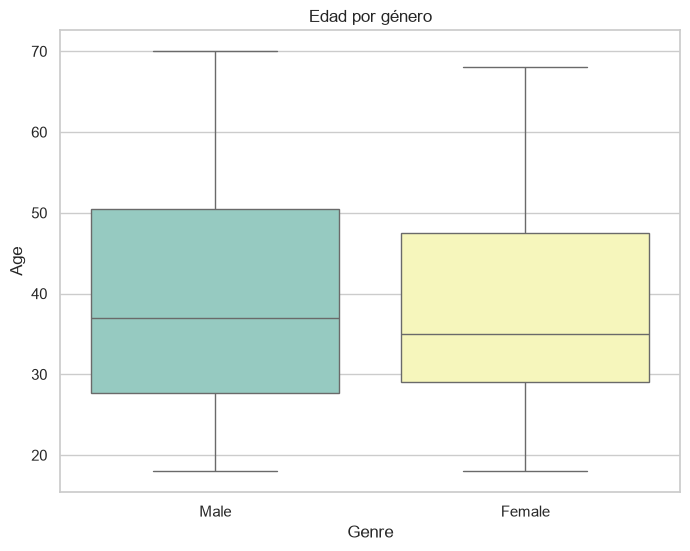
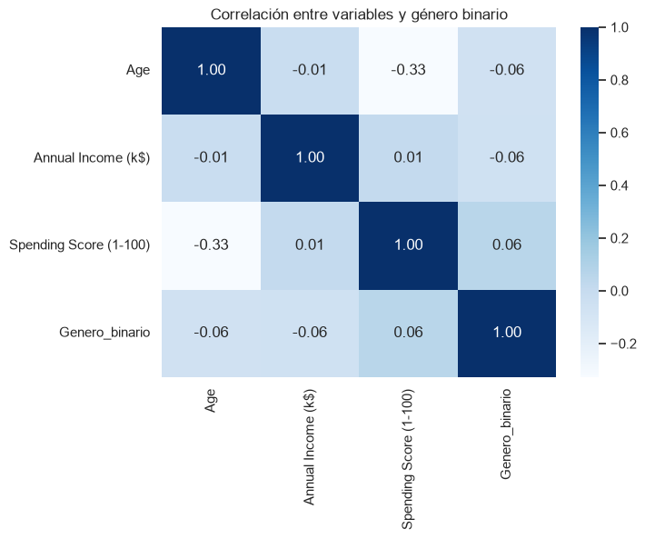
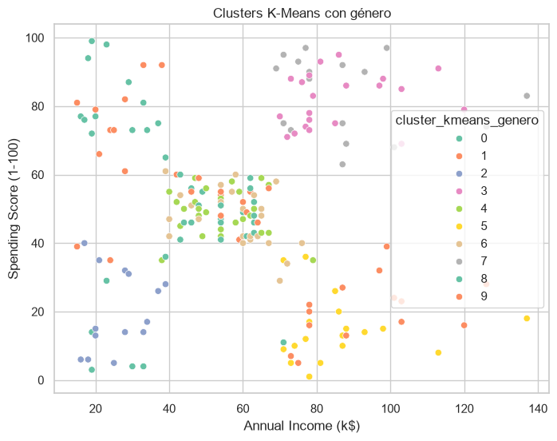
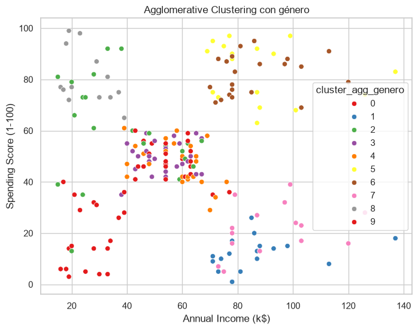

# Actividad 1. Segmentación de clientes mediante Aprendizaje No Supervisado

Versión actualizada para incorporar el género como variable de análisis, limpieza y comparación.

## Objetivo

Aplicar técnicas de clustering para identificar grupos homogéneos de clientes a partir de variables demográficas y de consumo, y validar si el género modifica la interpretación del perfilamiento.

## Entregables esperados

- Exploración inicial del dataset.
- Limpieza y procesamiento de datos.
- Análisis visual con comparaciones por género.
- Entrenamiento de al menos dos algoritmos de clustering.
- Reporte comparativo con y sin género.

## 1. Configuración inicial


```python
from pathlib import Path

import matplotlib.pyplot as plt
import pandas as pd
import seaborn as sns
from IPython.display import display
from sklearn.cluster import AgglomerativeClustering, KMeans
from sklearn.metrics import silhouette_score
from sklearn.preprocessing import StandardScaler

sns.set_theme(style="whitegrid")
plt.rcParams["figure.figsize"] = (8, 5)

BASE_DIR = Path.cwd()
DATASET_PATH = BASE_DIR / "Mall_Customers.csv"
FIGURES_DIR = BASE_DIR / "figuras_genero"
FIGURES_DIR.mkdir(exist_ok=True)
```

## 2. Carga del dataset


```python
df_raw = pd.read_csv(DATASET_PATH)
df_raw.head()
```


<div>
<style scoped>
    .dataframe tbody tr th:only-of-type {
        vertical-align: middle;
    }

    .dataframe tbody tr th {
        vertical-align: top;
    }

    .dataframe thead th {
        text-align: right;
    }
</style>
<table border="1" class="dataframe">
  <thead>
    <tr style="text-align: right;">
      <th></th>
      <th>CustomerID</th>
      <th>Genre</th>
      <th>Age</th>
      <th>Annual Income (k$)</th>
      <th>Spending Score (1-100)</th>
    </tr>
  </thead>
  <tbody>
    <tr>
      <th>0</th>
      <td>1</td>
      <td>Male</td>
      <td>19</td>
      <td>15</td>
      <td>39</td>
    </tr>
    <tr>
      <th>1</th>
      <td>2</td>
      <td>Male</td>
      <td>21</td>
      <td>15</td>
      <td>81</td>
    </tr>
    <tr>
      <th>2</th>
      <td>3</td>
      <td>Female</td>
      <td>20</td>
      <td>16</td>
      <td>6</td>
    </tr>
    <tr>
      <th>3</th>
      <td>4</td>
      <td>Female</td>
      <td>23</td>
      <td>16</td>
      <td>77</td>
    </tr>
    <tr>
      <th>4</th>
      <td>5</td>
      <td>Female</td>
      <td>31</td>
      <td>17</td>
      <td>40</td>
    </tr>
  </tbody>
</table>
</div>


## 3. Exploración inicial del conjunto de datos


```python
print("Shape:", df_raw.shape)
print("Columnas:", df_raw.columns.tolist())
df_raw.info()
df_raw.describe(include="all")
```

    Shape: (200, 5)
    Columnas: ['CustomerID', 'Genre', 'Age', 'Annual Income (k$)', 'Spending Score (1-100)']
    <class 'pandas.DataFrame'>
    RangeIndex: 200 entries, 0 to 199
    Data columns (total 5 columns):
     #   Column                  Non-Null Count  Dtype
    ---  ------                  --------------  -----
     0   CustomerID              200 non-null    int64
     1   Genre                   200 non-null    str  
     2   Age                     200 non-null    int64
     3   Annual Income (k$)      200 non-null    int64
     4   Spending Score (1-100)  200 non-null    int64
    dtypes: int64(4), str(1)
    memory usage: 7.9 KB
    


<div>
<style scoped>
    .dataframe tbody tr th:only-of-type {
        vertical-align: middle;
    }

    .dataframe tbody tr th {
        vertical-align: top;
    }

    .dataframe thead th {
        text-align: right;
    }
</style>
<table border="1" class="dataframe">
  <thead>
    <tr style="text-align: right;">
      <th></th>
      <th>CustomerID</th>
      <th>Genre</th>
      <th>Age</th>
      <th>Annual Income (k$)</th>
      <th>Spending Score (1-100)</th>
    </tr>
  </thead>
  <tbody>
    <tr>
      <th>count</th>
      <td>200.000000</td>
      <td>200</td>
      <td>200.000000</td>
      <td>200.000000</td>
      <td>200.000000</td>
    </tr>
    <tr>
      <th>unique</th>
      <td>NaN</td>
      <td>2</td>
      <td>NaN</td>
      <td>NaN</td>
      <td>NaN</td>
    </tr>
    <tr>
      <th>top</th>
      <td>NaN</td>
      <td>Female</td>
      <td>NaN</td>
      <td>NaN</td>
      <td>NaN</td>
    </tr>
    <tr>
      <th>freq</th>
      <td>NaN</td>
      <td>112</td>
      <td>NaN</td>
      <td>NaN</td>
      <td>NaN</td>
    </tr>
    <tr>
      <th>mean</th>
      <td>100.500000</td>
      <td>NaN</td>
      <td>38.850000</td>
      <td>60.560000</td>
      <td>50.200000</td>
    </tr>
    <tr>
      <th>std</th>
      <td>57.879185</td>
      <td>NaN</td>
      <td>13.969007</td>
      <td>26.264721</td>
      <td>25.823522</td>
    </tr>
    <tr>
      <th>min</th>
      <td>1.000000</td>
      <td>NaN</td>
      <td>18.000000</td>
      <td>15.000000</td>
      <td>1.000000</td>
    </tr>
    <tr>
      <th>25%</th>
      <td>50.750000</td>
      <td>NaN</td>
      <td>28.750000</td>
      <td>41.500000</td>
      <td>34.750000</td>
    </tr>
    <tr>
      <th>50%</th>
      <td>100.500000</td>
      <td>NaN</td>
      <td>36.000000</td>
      <td>61.500000</td>
      <td>50.000000</td>
    </tr>
    <tr>
      <th>75%</th>
      <td>150.250000</td>
      <td>NaN</td>
      <td>49.000000</td>
      <td>78.000000</td>
      <td>73.000000</td>
    </tr>
    <tr>
      <th>max</th>
      <td>200.000000</td>
      <td>NaN</td>
      <td>70.000000</td>
      <td>137.000000</td>
      <td>99.000000</td>
    </tr>
  </tbody>
</table>
</div>


## 4. Análisis exploratorio visual

En esta versión se añade una vista específica por género para validar si afecta la lectura de edad, ingreso y gasto.


```python
numeric_cols = ["Age", "Annual Income (k$)", "Spending Score (1-100)"]

fig, axes = plt.subplots(2, 2, figsize=(14, 10))
for ax, col in zip(axes.flat[:3], numeric_cols):
    sns.histplot(df_raw[col], kde=True, ax=ax, color="#4C72B0")
    ax.set_title(f"Distribución de {col}")

sns.countplot(data=df_raw, x="Genre", ax=axes.flat[3], palette="Set2")
axes.flat[3].set_title("Distribución de género")
plt.tight_layout()
plt.savefig(FIGURES_DIR / "distribuciones_iniciales.png", dpi=300)
plt.show()
```

    C:\Users\FoodLovers\AppData\Local\Temp\ipykernel_32748\1899793906.py:8: FutureWarning: 
    
    Passing `palette` without assigning `hue` is deprecated and will be removed in v0.14.0. Assign the `x` variable to `hue` and set `legend=False` for the same effect.
    
      sns.countplot(data=df_raw, x="Genre", ax=axes.flat[3], palette="Set2")
    


    

    


```python
plt.figure(figsize=(8, 6))
sns.boxplot(data=df_raw, x="Genre", y="Age", palette="Set3")
plt.title("Edad por género")
plt.savefig(FIGURES_DIR / "edad_por_genero.png", dpi=300)
plt.show()
```

    C:\Users\FoodLovers\AppData\Local\Temp\ipykernel_32748\3543472457.py:2: FutureWarning: 
    
    Passing `palette` without assigning `hue` is deprecated and will be removed in v0.14.0. Assign the `x` variable to `hue` and set `legend=False` for the same effect.
    
      sns.boxplot(data=df_raw, x="Genre", y="Age", palette="Set3")
    


    

    


```python
plt.figure(figsize=(8, 6))
sns.scatterplot(
    data=df_raw,
    x="Annual Income (k$)",
    y="Spending Score (1-100)",
    hue="Genre",
    palette="Set2"
)
plt.title("Ingreso anual vs puntuación de gasto por género")
plt.savefig(FIGURES_DIR / "ingreso_gasto_genero.png", dpi=300)
plt.show()
```


    

    


```python
pairplot = sns.pairplot(df_raw, vars=numeric_cols, hue="Genre", corner=True, palette="Set2")
pairplot.savefig(FIGURES_DIR / "pairplot_genero.png", dpi=300)
plt.show()
```


    

    


## 5. Preprocesamiento

Se limpia el dato de género, se convierte `Female` a `True` y `Male` a `False`, y se conserva una versión binaria para análisis y modelado.


```python
df = df_raw.copy()
df.columns = [col.strip() for col in df.columns]
df["Genero"] = df["Genre"].str.strip().str.lower().map({"female": True, "male": False})
df["Genero_binario"] = df["Genero"].astype(int)
df["Genero_label"] = df["Genero"].map({True: "Female", False: "Male"})
df = df.drop(columns=["Genre"])
df.isnull().sum()
```


    CustomerID                0
    Age                       0
    Annual Income (k$)        0
    Spending Score (1-100)    0
    Genero                    0
    Genero_binario            0
    Genero_label              0
    dtype: int64


```python
corr_df = df[["Age", "Annual Income (k$)", "Spending Score (1-100)", "Genero_binario"]].copy()
plt.figure(figsize=(7, 5))
sns.heatmap(corr_df.corr(), annot=True, cmap="Blues", fmt=".2f")
plt.title("Correlación entre variables y género binario")
plt.savefig(FIGURES_DIR / "corr_variables_genero.png", dpi=300)
plt.show()
```


    

    


## 6. Búsqueda del número óptimo de clusters para K-Means

Se evalúan dos escenarios: sin género y con género. Así se valida si la variable añade señal útil al reporte.


```python
features_base = ["Age", "Annual Income (k$)", "Spending Score (1-100)"]
features_gender = features_base + ["Genero_binario"]

X_base = df[features_base].copy()
X_gender = df[features_gender].copy()

scaler_base = StandardScaler()
X_base_scaled = scaler_base.fit_transform(X_base)

scaler_gender = StandardScaler()
X_gender_scaled = scaler_gender.fit_transform(X_gender)

k_values = range(2, 11)

metrics_base = []
for k in k_values:
    model = KMeans(n_clusters=k, random_state=42, n_init=10)
    labels = model.fit_predict(X_base_scaled)
    metrics_base.append({
        "k": k,
        "inertia": model.inertia_,
        "silhouette": silhouette_score(X_base_scaled, labels)
    })

metrics_base = pd.DataFrame(metrics_base)
metrics_base
```


<div>
<style scoped>
    .dataframe tbody tr th:only-of-type {
        vertical-align: middle;
    }

    .dataframe tbody tr th {
        vertical-align: top;
    }

    .dataframe thead th {
        text-align: right;
    }
</style>
<table border="1" class="dataframe">
  <thead>
    <tr style="text-align: right;">
      <th></th>
      <th>k</th>
      <th>inertia</th>
      <th>silhouette</th>
    </tr>
  </thead>
  <tbody>
    <tr>
      <th>0</th>
      <td>2</td>
      <td>389.386189</td>
      <td>0.335472</td>
    </tr>
    <tr>
      <th>1</th>
      <td>3</td>
      <td>295.212246</td>
      <td>0.357793</td>
    </tr>
    <tr>
      <th>2</th>
      <td>4</td>
      <td>205.225147</td>
      <td>0.403958</td>
    </tr>
    <tr>
      <th>3</th>
      <td>5</td>
      <td>168.247580</td>
      <td>0.416643</td>
    </tr>
    <tr>
      <th>4</th>
      <td>6</td>
      <td>133.868421</td>
      <td>0.428417</td>
    </tr>
    <tr>
      <th>5</th>
      <td>7</td>
      <td>117.011555</td>
      <td>0.417232</td>
    </tr>
    <tr>
      <th>6</th>
      <td>8</td>
      <td>103.873292</td>
      <td>0.408207</td>
    </tr>
    <tr>
      <th>7</th>
      <td>9</td>
      <td>93.092891</td>
      <td>0.417693</td>
    </tr>
    <tr>
      <th>8</th>
      <td>10</td>
      <td>82.385154</td>
      <td>0.406554</td>
    </tr>
  </tbody>
</table>
</div>


```python
plt.plot(metrics_base["k"], metrics_base["inertia"], marker="o")
plt.title("Elbow Method sin género")
plt.xlabel("Número de clusters (k)")
plt.ylabel("Inercia")
plt.savefig(FIGURES_DIR / "elbow_sin_genero.png", dpi=300)
plt.show()
```


    

    


```python
plt.plot(metrics_base["k"], metrics_base["silhouette"], marker="o")
plt.title("Silhouette Score sin género")
plt.xlabel("Número de clusters (k)")
plt.ylabel("Silhouette Score")
plt.savefig(FIGURES_DIR / "silhouette_sin_genero.png", dpi=300)
plt.show()
```


    

    


## 7. Entrenamiento del modelo K-Means final


```python
best_k_base = int(metrics_base.loc[metrics_base["silhouette"].idxmax(), "k"])
kmeans_base = KMeans(n_clusters=best_k_base, random_state=42, n_init=10)
df["cluster_kmeans_base"] = kmeans_base.fit_predict(X_base_scaled)
df[["cluster_kmeans_base"] + features_base + ["Genero_label"]].head()
```


<div>
<style scoped>
    .dataframe tbody tr th:only-of-type {
        vertical-align: middle;
    }

    .dataframe tbody tr th {
        vertical-align: top;
    }

    .dataframe thead th {
        text-align: right;
    }
</style>
<table border="1" class="dataframe">
  <thead>
    <tr style="text-align: right;">
      <th></th>
      <th>cluster_kmeans_base</th>
      <th>Age</th>
      <th>Annual Income (k$)</th>
      <th>Spending Score (1-100)</th>
      <th>Genero_label</th>
    </tr>
  </thead>
  <tbody>
    <tr>
      <th>0</th>
      <td>4</td>
      <td>19</td>
      <td>15</td>
      <td>39</td>
      <td>Male</td>
    </tr>
    <tr>
      <th>1</th>
      <td>4</td>
      <td>21</td>
      <td>15</td>
      <td>81</td>
      <td>Male</td>
    </tr>
    <tr>
      <th>2</th>
      <td>5</td>
      <td>20</td>
      <td>16</td>
      <td>6</td>
      <td>Female</td>
    </tr>
    <tr>
      <th>3</th>
      <td>4</td>
      <td>23</td>
      <td>16</td>
      <td>77</td>
      <td>Female</td>
    </tr>
    <tr>
      <th>4</th>
      <td>5</td>
      <td>31</td>
      <td>17</td>
      <td>40</td>
      <td>Female</td>
    </tr>
  </tbody>
</table>
</div>


```python
plt.figure(figsize=(8, 6))
sns.scatterplot(
    data=df,
    x="Annual Income (k$)",
    y="Spending Score (1-100)",
    hue="cluster_kmeans_base",
    palette="tab10"
)
plt.title("Clusters K-Means sin género")
plt.savefig(FIGURES_DIR / "kmeans_sin_genero.png", dpi=300)
plt.show()
```


    

    


## 8. K-Means con género como variable adicional


```python
metrics_gender = []
for k in k_values:
    model = KMeans(n_clusters=k, random_state=42, n_init=10)
    labels = model.fit_predict(X_gender_scaled)
    metrics_gender.append({
        "k": k,
        "inertia": model.inertia_,
        "silhouette": silhouette_score(X_gender_scaled, labels)
    })

metrics_gender = pd.DataFrame(metrics_gender)
metrics_gender
```


<div>
<style scoped>
    .dataframe tbody tr th:only-of-type {
        vertical-align: middle;
    }

    .dataframe tbody tr th {
        vertical-align: top;
    }

    .dataframe thead th {
        text-align: right;
    }
</style>
<table border="1" class="dataframe">
  <thead>
    <tr style="text-align: right;">
      <th></th>
      <th>k</th>
      <th>inertia</th>
      <th>silhouette</th>
    </tr>
  </thead>
  <tbody>
    <tr>
      <th>0</th>
      <td>2</td>
      <td>588.802677</td>
      <td>0.251815</td>
    </tr>
    <tr>
      <th>1</th>
      <td>3</td>
      <td>476.787554</td>
      <td>0.259513</td>
    </tr>
    <tr>
      <th>2</th>
      <td>4</td>
      <td>388.717861</td>
      <td>0.298397</td>
    </tr>
    <tr>
      <th>3</th>
      <td>5</td>
      <td>331.309884</td>
      <td>0.304060</td>
    </tr>
    <tr>
      <th>4</th>
      <td>6</td>
      <td>276.411760</td>
      <td>0.331074</td>
    </tr>
    <tr>
      <th>5</th>
      <td>7</td>
      <td>236.204947</td>
      <td>0.357377</td>
    </tr>
    <tr>
      <th>6</th>
      <td>8</td>
      <td>199.750461</td>
      <td>0.387993</td>
    </tr>
    <tr>
      <th>7</th>
      <td>9</td>
      <td>174.235477</td>
      <td>0.403092</td>
    </tr>
    <tr>
      <th>8</th>
      <td>10</td>
      <td>152.029834</td>
      <td>0.420764</td>
    </tr>
  </tbody>
</table>
</div>


```python
best_k_gender = int(metrics_gender.loc[metrics_gender["silhouette"].idxmax(), "k"])
kmeans_gender = KMeans(n_clusters=best_k_gender, random_state=42, n_init=10)
df["cluster_kmeans_genero"] = kmeans_gender.fit_predict(X_gender_scaled)

silhouette_base = silhouette_score(X_base_scaled, df["cluster_kmeans_base"])
silhouette_gender = silhouette_score(X_gender_scaled, df["cluster_kmeans_genero"])

print("Silhouette sin género:", silhouette_base)
print("Silhouette con género:", silhouette_gender)
```

    Silhouette sin género: 0.4284167762892593
    Silhouette con género: 0.42076374869477745
    


```python
plt.figure(figsize=(8, 6))
sns.scatterplot(
    data=df,
    x="Annual Income (k$)",
    y="Spending Score (1-100)",
    hue="cluster_kmeans_genero",
    palette="Set2"
)
plt.title("Clusters K-Means con género")
plt.savefig(FIGURES_DIR / "kmeans_con_genero.png", dpi=300)
plt.show()
```


    

    


```python
gender_mix_base = pd.crosstab(df["cluster_kmeans_base"], df["Genero_label"], normalize="index").round(2)
gender_mix_gender = pd.crosstab(df["cluster_kmeans_genero"], df["Genero_label"], normalize="index").round(2)

display(gender_mix_base)
display(gender_mix_gender)
```


<div>
<style scoped>
    .dataframe tbody tr th:only-of-type {
        vertical-align: middle;
    }

    .dataframe tbody tr th {
        vertical-align: top;
    }

    .dataframe thead th {
        text-align: right;
    }
</style>
<table border="1" class="dataframe">
  <thead>
    <tr style="text-align: right;">
      <th>Genero_label</th>
      <th>Female</th>
      <th>Male</th>
    </tr>
    <tr>
      <th>cluster_kmeans_base</th>
      <th></th>
      <th></th>
    </tr>
  </thead>
  <tbody>
    <tr>
      <th>0</th>
      <td>0.58</td>
      <td>0.42</td>
    </tr>
    <tr>
      <th>1</th>
      <td>0.64</td>
      <td>0.36</td>
    </tr>
    <tr>
      <th>2</th>
      <td>0.42</td>
      <td>0.58</td>
    </tr>
    <tr>
      <th>3</th>
      <td>0.54</td>
      <td>0.46</td>
    </tr>
    <tr>
      <th>4</th>
      <td>0.57</td>
      <td>0.43</td>
    </tr>
    <tr>
      <th>5</th>
      <td>0.62</td>
      <td>0.38</td>
    </tr>
  </tbody>
</table>
</div>


<div>
<style scoped>
    .dataframe tbody tr th:only-of-type {
        vertical-align: middle;
    }

    .dataframe tbody tr th {
        vertical-align: top;
    }

    .dataframe thead th {
        text-align: right;
    }
</style>
<table border="1" class="dataframe">
  <thead>
    <tr style="text-align: right;">
      <th>Genero_label</th>
      <th>Female</th>
      <th>Male</th>
    </tr>
    <tr>
      <th>cluster_kmeans_genero</th>
      <th></th>
      <th></th>
    </tr>
  </thead>
  <tbody>
    <tr>
      <th>0</th>
      <td>0.00</td>
      <td>1.00</td>
    </tr>
    <tr>
      <th>1</th>
      <td>0.00</td>
      <td>1.00</td>
    </tr>
    <tr>
      <th>2</th>
      <td>0.93</td>
      <td>0.07</td>
    </tr>
    <tr>
      <th>3</th>
      <td>1.00</td>
      <td>0.00</td>
    </tr>
    <tr>
      <th>4</th>
      <td>1.00</td>
      <td>0.00</td>
    </tr>
    <tr>
      <th>5</th>
      <td>0.00</td>
      <td>1.00</td>
    </tr>
    <tr>
      <th>6</th>
      <td>1.00</td>
      <td>0.00</td>
    </tr>
    <tr>
      <th>7</th>
      <td>0.00</td>
      <td>1.00</td>
    </tr>
    <tr>
      <th>8</th>
      <td>1.00</td>
      <td>0.00</td>
    </tr>
    <tr>
      <th>9</th>
      <td>1.00</td>
      <td>0.00</td>
    </tr>
  </tbody>
</table>
</div>


## 9. Segundo algoritmo de clustering


```python
agg_base = AgglomerativeClustering(n_clusters=best_k_base)
agg_gender = AgglomerativeClustering(n_clusters=best_k_gender)

df["cluster_agg_base"] = agg_base.fit_predict(X_base_scaled)
df["cluster_agg_genero"] = agg_gender.fit_predict(X_gender_scaled)

silhouette_agg_base = silhouette_score(X_base_scaled, df["cluster_agg_base"])
silhouette_agg_gender = silhouette_score(X_gender_scaled, df["cluster_agg_genero"])

print("Silhouette Agglomerative sin género:", silhouette_agg_base)
print("Silhouette Agglomerative con género:", silhouette_agg_gender)
```

    Silhouette Agglomerative sin género: 0.4201169558789579
    Silhouette Agglomerative con género: 0.4176254448686808
    


```python
plt.figure(figsize=(8, 6))
sns.scatterplot(
    data=df,
    x="Annual Income (k$)",
    y="Spending Score (1-100)",
    hue="cluster_agg_genero",
    palette="Set1"
)
plt.title("Agglomerative Clustering con género")
plt.savefig(FIGURES_DIR / "agg_con_genero.png", dpi=300)
plt.show()
```


    

    


## 10. Resumen e interpretación de clusters


```python
summary_kmeans_base = df.groupby("cluster_kmeans_base")[features_base].mean().round(2)
summary_kmeans_base["size"] = df["cluster_kmeans_base"].value_counts().sort_index()
summary_kmeans_base["female_share"] = df.groupby("cluster_kmeans_base")["Genero_binario"].mean().round(2)

summary_kmeans_gender = df.groupby("cluster_kmeans_genero")[["Age", "Annual Income (k$)", "Spending Score (1-100)", "Genero_binario"]].mean().round(2)
summary_kmeans_gender["size"] = df["cluster_kmeans_genero"].value_counts().sort_index()

display(summary_kmeans_base)
display(summary_kmeans_gender)

summary_kmeans_base.to_csv(FIGURES_DIR / "resumen_kmeans_sin_genero.csv")
summary_kmeans_gender.to_csv(FIGURES_DIR / "resumen_kmeans_con_genero.csv")
```


<div>
<style scoped>
    .dataframe tbody tr th:only-of-type {
        vertical-align: middle;
    }

    .dataframe tbody tr th {
        vertical-align: top;
    }

    .dataframe thead th {
        text-align: right;
    }
</style>
<table border="1" class="dataframe">
  <thead>
    <tr style="text-align: right;">
      <th></th>
      <th>Age</th>
      <th>Annual Income (k$)</th>
      <th>Spending Score (1-100)</th>
      <th>size</th>
      <th>female_share</th>
    </tr>
    <tr>
      <th>cluster_kmeans_base</th>
      <th></th>
      <th></th>
      <th></th>
      <th></th>
      <th></th>
    </tr>
  </thead>
  <tbody>
    <tr>
      <th>0</th>
      <td>56.33</td>
      <td>54.27</td>
      <td>49.07</td>
      <td>45</td>
      <td>0.58</td>
    </tr>
    <tr>
      <th>1</th>
      <td>26.79</td>
      <td>57.10</td>
      <td>48.13</td>
      <td>39</td>
      <td>0.64</td>
    </tr>
    <tr>
      <th>2</th>
      <td>41.94</td>
      <td>88.94</td>
      <td>16.97</td>
      <td>33</td>
      <td>0.42</td>
    </tr>
    <tr>
      <th>3</th>
      <td>32.69</td>
      <td>86.54</td>
      <td>82.13</td>
      <td>39</td>
      <td>0.54</td>
    </tr>
    <tr>
      <th>4</th>
      <td>25.00</td>
      <td>25.26</td>
      <td>77.61</td>
      <td>23</td>
      <td>0.57</td>
    </tr>
    <tr>
      <th>5</th>
      <td>45.52</td>
      <td>26.29</td>
      <td>19.38</td>
      <td>21</td>
      <td>0.62</td>
    </tr>
  </tbody>
</table>
</div>


<div>
<style scoped>
    .dataframe tbody tr th:only-of-type {
        vertical-align: middle;
    }

    .dataframe tbody tr th {
        vertical-align: top;
    }

    .dataframe thead th {
        text-align: right;
    }
</style>
<table border="1" class="dataframe">
  <thead>
    <tr style="text-align: right;">
      <th></th>
      <th>Age</th>
      <th>Annual Income (k$)</th>
      <th>Spending Score (1-100)</th>
      <th>Genero_binario</th>
      <th>size</th>
    </tr>
    <tr>
      <th>cluster_kmeans_genero</th>
      <th></th>
      <th></th>
      <th></th>
      <th></th>
      <th></th>
    </tr>
  </thead>
  <tbody>
    <tr>
      <th>0</th>
      <td>58.85</td>
      <td>48.69</td>
      <td>39.85</td>
      <td>0.00</td>
      <td>26</td>
    </tr>
    <tr>
      <th>1</th>
      <td>25.25</td>
      <td>41.25</td>
      <td>60.92</td>
      <td>0.00</td>
      <td>24</td>
    </tr>
    <tr>
      <th>2</th>
      <td>41.21</td>
      <td>26.07</td>
      <td>20.14</td>
      <td>0.93</td>
      <td>14</td>
    </tr>
    <tr>
      <th>3</th>
      <td>32.19</td>
      <td>86.05</td>
      <td>81.67</td>
      <td>1.00</td>
      <td>21</td>
    </tr>
    <tr>
      <th>4</th>
      <td>54.15</td>
      <td>54.23</td>
      <td>48.96</td>
      <td>1.00</td>
      <td>26</td>
    </tr>
    <tr>
      <th>5</th>
      <td>38.47</td>
      <td>85.89</td>
      <td>14.21</td>
      <td>0.00</td>
      <td>19</td>
    </tr>
    <tr>
      <th>6</th>
      <td>27.96</td>
      <td>57.36</td>
      <td>47.12</td>
      <td>1.00</td>
      <td>25</td>
    </tr>
    <tr>
      <th>7</th>
      <td>33.28</td>
      <td>87.11</td>
      <td>82.67</td>
      <td>0.00</td>
      <td>18</td>
    </tr>
    <tr>
      <th>8</th>
      <td>25.46</td>
      <td>25.69</td>
      <td>80.54</td>
      <td>1.00</td>
      <td>13</td>
    </tr>
    <tr>
      <th>9</th>
      <td>43.79</td>
      <td>93.29</td>
      <td>20.64</td>
      <td>1.00</td>
      <td>14</td>
    </tr>
  </tbody>
</table>
</div>


```python
summary_agg_base = df.groupby("cluster_agg_base")[features_base].mean().round(2)
summary_agg_base["size"] = df["cluster_agg_base"].value_counts().sort_index()
summary_agg_base["female_share"] = df.groupby("cluster_agg_base")["Genero_binario"].mean().round(2)

summary_agg_gender = df.groupby("cluster_agg_genero")[["Age", "Annual Income (k$)", "Spending Score (1-100)", "Genero_binario"]].mean().round(2)
summary_agg_gender["size"] = df["cluster_agg_genero"].value_counts().sort_index()

display(summary_agg_base)
display(summary_agg_gender)

summary_agg_base.to_csv(FIGURES_DIR / "resumen_agg_sin_genero.csv")
summary_agg_gender.to_csv(FIGURES_DIR / "resumen_agg_con_genero.csv")
```


<div>
<style scoped>
    .dataframe tbody tr th:only-of-type {
        vertical-align: middle;
    }

    .dataframe tbody tr th {
        vertical-align: top;
    }

    .dataframe thead th {
        text-align: right;
    }
</style>
<table border="1" class="dataframe">
  <thead>
    <tr style="text-align: right;">
      <th></th>
      <th>Age</th>
      <th>Annual Income (k$)</th>
      <th>Spending Score (1-100)</th>
      <th>size</th>
      <th>female_share</th>
    </tr>
    <tr>
      <th>cluster_agg_base</th>
      <th></th>
      <th></th>
      <th></th>
      <th></th>
      <th></th>
    </tr>
  </thead>
  <tbody>
    <tr>
      <th>0</th>
      <td>27.38</td>
      <td>57.51</td>
      <td>45.84</td>
      <td>45</td>
      <td>0.60</td>
    </tr>
    <tr>
      <th>1</th>
      <td>56.40</td>
      <td>55.29</td>
      <td>48.36</td>
      <td>45</td>
      <td>0.53</td>
    </tr>
    <tr>
      <th>2</th>
      <td>32.69</td>
      <td>86.54</td>
      <td>82.13</td>
      <td>39</td>
      <td>0.54</td>
    </tr>
    <tr>
      <th>3</th>
      <td>43.89</td>
      <td>91.29</td>
      <td>16.68</td>
      <td>28</td>
      <td>0.50</td>
    </tr>
    <tr>
      <th>4</th>
      <td>44.32</td>
      <td>25.77</td>
      <td>20.27</td>
      <td>22</td>
      <td>0.59</td>
    </tr>
    <tr>
      <th>5</th>
      <td>24.81</td>
      <td>25.62</td>
      <td>80.24</td>
      <td>21</td>
      <td>0.62</td>
    </tr>
  </tbody>
</table>
</div>


<div>
<style scoped>
    .dataframe tbody tr th:only-of-type {
        vertical-align: middle;
    }

    .dataframe tbody tr th {
        vertical-align: top;
    }

    .dataframe thead th {
        text-align: right;
    }
</style>
<table border="1" class="dataframe">
  <thead>
    <tr style="text-align: right;">
      <th></th>
      <th>Age</th>
      <th>Annual Income (k$)</th>
      <th>Spending Score (1-100)</th>
      <th>Genero_binario</th>
      <th>size</th>
    </tr>
    <tr>
      <th>cluster_agg_genero</th>
      <th></th>
      <th></th>
      <th></th>
      <th></th>
      <th></th>
    </tr>
  </thead>
  <tbody>
    <tr>
      <th>0</th>
      <td>56.55</td>
      <td>50.03</td>
      <td>41.34</td>
      <td>0.0</td>
      <td>29</td>
    </tr>
    <tr>
      <th>1</th>
      <td>38.83</td>
      <td>86.39</td>
      <td>11.67</td>
      <td>0.0</td>
      <td>18</td>
    </tr>
    <tr>
      <th>2</th>
      <td>24.57</td>
      <td>39.22</td>
      <td>59.65</td>
      <td>0.0</td>
      <td>23</td>
    </tr>
    <tr>
      <th>3</th>
      <td>54.08</td>
      <td>53.24</td>
      <td>49.52</td>
      <td>1.0</td>
      <td>25</td>
    </tr>
    <tr>
      <th>4</th>
      <td>27.96</td>
      <td>57.36</td>
      <td>47.12</td>
      <td>1.0</td>
      <td>25</td>
    </tr>
    <tr>
      <th>5</th>
      <td>33.28</td>
      <td>87.11</td>
      <td>82.67</td>
      <td>0.0</td>
      <td>18</td>
    </tr>
    <tr>
      <th>6</th>
      <td>32.19</td>
      <td>86.05</td>
      <td>81.67</td>
      <td>1.0</td>
      <td>21</td>
    </tr>
    <tr>
      <th>7</th>
      <td>44.60</td>
      <td>92.33</td>
      <td>21.60</td>
      <td>1.0</td>
      <td>15</td>
    </tr>
    <tr>
      <th>8</th>
      <td>25.46</td>
      <td>25.69</td>
      <td>80.54</td>
      <td>1.0</td>
      <td>13</td>
    </tr>
    <tr>
      <th>9</th>
      <td>41.54</td>
      <td>26.54</td>
      <td>20.69</td>
      <td>1.0</td>
      <td>13</td>
    </tr>
  </tbody>
</table>
</div>


## 11. Comparación de algoritmos

Aquí se deja una comparación directa entre los modelos con y sin género para evaluar si la variable aporta separación útil o solo ruido.


```python
comparison = pd.DataFrame([
    {
        "Metodo": "K-Means sin género",
        "Numero_clusters": df["cluster_kmeans_base"].nunique(),
        "Silhouette": silhouette_base,
        "Observacion": "Referencia base"
    },
    {
        "Metodo": "K-Means con género",
        "Numero_clusters": df["cluster_kmeans_genero"].nunique(),
        "Silhouette": silhouette_gender,
        "Observacion": "Valida el impacto del género"
    },
    {
        "Metodo": "Agglomerative sin género",
        "Numero_clusters": df["cluster_agg_base"].nunique(),
        "Silhouette": silhouette_agg_base,
        "Observacion": "Referencia jerárquica base"
    },
    {
        "Metodo": "Agglomerative con género",
        "Numero_clusters": df["cluster_agg_genero"].nunique(),
        "Silhouette": silhouette_agg_gender,
        "Observacion": "Jerárquico con variable de género"
    }
]).round(3)

display(comparison)
comparison.to_csv(FIGURES_DIR / "comparacion_algoritmos_genero.csv", index=False)
```


<div>
<style scoped>
    .dataframe tbody tr th:only-of-type {
        vertical-align: middle;
    }

    .dataframe tbody tr th {
        vertical-align: top;
    }

    .dataframe thead th {
        text-align: right;
    }
</style>
<table border="1" class="dataframe">
  <thead>
    <tr style="text-align: right;">
      <th></th>
      <th>Metodo</th>
      <th>Numero_clusters</th>
      <th>Silhouette</th>
      <th>Observacion</th>
    </tr>
  </thead>
  <tbody>
    <tr>
      <th>0</th>
      <td>K-Means sin género</td>
      <td>6</td>
      <td>0.428</td>
      <td>Referencia base</td>
    </tr>
    <tr>
      <th>1</th>
      <td>K-Means con género</td>
      <td>10</td>
      <td>0.421</td>
      <td>Valida el impacto del género</td>
    </tr>
    <tr>
      <th>2</th>
      <td>Agglomerative sin género</td>
      <td>6</td>
      <td>0.420</td>
      <td>Referencia jerárquica base</td>
    </tr>
    <tr>
      <th>3</th>
      <td>Agglomerative con género</td>
      <td>10</td>
      <td>0.418</td>
      <td>Jerárquico con variable de género</td>
    </tr>
  </tbody>
</table>
</div>


## 12. Conclusiones

Esta versión deja el género procesado como variable booleana y abre dos lecturas: la segmentación clásica sin género y la segmentación extendida con género. La comparación final debe usarse para decidir si el género mejora la separación de clusters o solo añade complejidad al reporte.
