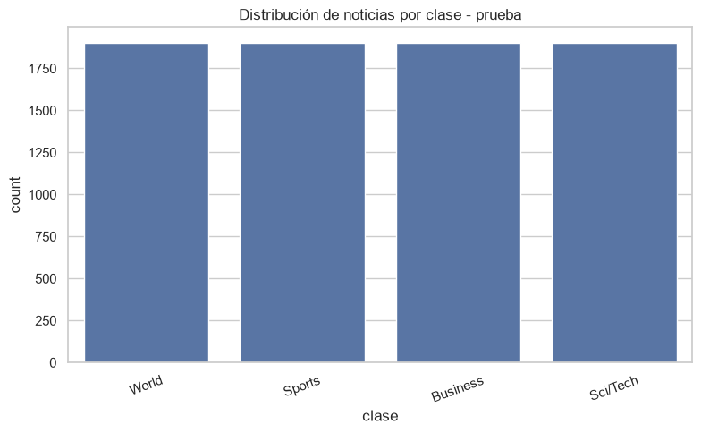
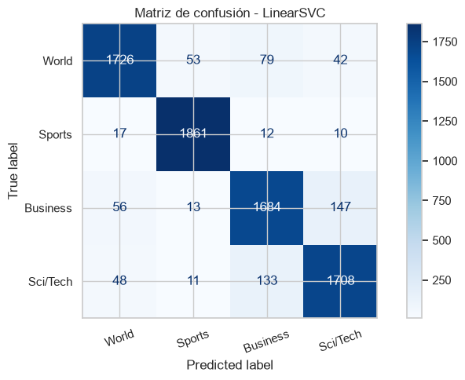
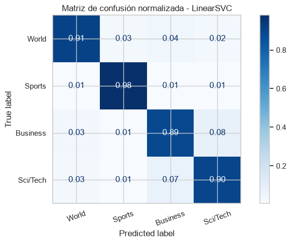

# Clasificación De Noticias Mediante Procesamiento De Lenguaje Natural

## Objetivo

Desarrollar y comparar varios modelos supervisados para clasificar noticias en categorías temáticas usando técnicas de PLN y representación vectorial del texto.

## Entregables Esperados

- Exploración del dataset y balance de clases
- Preprocesamiento del texto
- Vectorización y entrenamiento de al menos tres modelos
- Validación cruzada y métricas
- Análisis de errores y selección del modelo final

## 1. Configuración Inicial

Ejecuta esta celda primero. Si tu dataset usa otros nombres de archivo o columnas, ajústalos aquí.

```python
from pathlib import Path
import re

import numpy as np
import pandas as pd
import matplotlib.pyplot as plt
import seaborn as sns

from sklearn.model_selection import train_test_split, cross_val_score
from sklearn.feature_extraction.text import TfidfVectorizer
from sklearn.pipeline import Pipeline
from sklearn.metrics import (
    accuracy_score,
    precision_recall_fscore_support,
    classification_report,
    confusion_matrix,
    ConfusionMatrixDisplay
)
from sklearn.naive_bayes import MultinomialNB
from sklearn.linear_model import LogisticRegression
from sklearn.svm import LinearSVC

import nltk
from nltk.corpus import stopwords
from nltk.stem import WordNetLemmatizer
from nltk.tokenize import word_tokenize

sns.set_theme(style="whitegrid")
plt.rcParams["figure.figsize"] = (8, 5)

BASE_DIR = Path.cwd()
FIGURES_DIR = BASE_DIR / "figuras"
FIGURES_DIR.mkdir(exist_ok=True)

TRAIN_PATH = BASE_DIR / "ag-news-classificacion/train.csv"
TEST_PATH = BASE_DIR / "ag-news-classificacion/test.csv"

TRAIN_PATH, TEST_PATH

```

    (WindowsPath('C:/Users/FoodLovers/Documents/Unir-Notes/Maestría-Ingeniería-de-Software/07-Fundamentos-IA/Actividades/Actividad-02/ag-news-classificacion/train.csv'),
     WindowsPath('C:/Users/FoodLovers/Documents/Unir-Notes/Maestría-Ingeniería-de-Software/07-Fundamentos-IA/Actividades/Actividad-02/ag-news-classificacion/test.csv'))

## 2. Descarga De Recursos De NLTK

Ejecuta esta celda una sola vez si aún no tienes descargados estos recursos.

```python
# nltk.download("stopwords")
# nltk.download("punkt")
# nltk.download("punkt_tab")
# nltk.download("wordnet")
# nltk.download("omw-1.4")

```

## 3. Carga Del Dataset

Esta plantilla assume el formato común de AG News con `train.csv` y `test.csv`.

```python
train_df = pd.read_csv(TRAIN_PATH)
test_df = pd.read_csv(TEST_PATH)

# train_df.head()
test_df.head()

```

<div>
<style scoped>
    .dataframe tbody tr th:only-of-type {
        vertical-align: middle;
    }

    .dataframe tbody tr th {
        vertical-align: top;
    }

    .dataframe thead th {
        text-align: right;
    }
</style>
<table border="1" class="dataframe">
  <thead>
    <tr style="text-align: right;">
      <th></th>
      <th>Class Index</th>
      <th>Title</th>
      <th>Description</th>
    </tr>
  </thead>
  <tbody>
    <tr>
      <th>0</th>
      <td>3</td>
      <td>Fears for T N pension after talks</td>
      <td>Unions representing workers at Turner&nbsp;&nbsp; Newall…</td>
    </tr>
    <tr>
      <th>1</th>
      <td>4</td>
      <td>The Race is On: Second Private Team Sets Launc…</td>
      <td>SPACE.com - TORONTO, Canada -- A second\team o…</td>
    </tr>
    <tr>
      <th>2</th>
      <td>4</td>
      <td>Ky. Company Wins Grant to Study Peptides (AP)</td>
      <td>AP - A company founded by a chemistry research…</td>
    </tr>
    <tr>
      <th>3</th>
      <td>4</td>
      <td>Prediction Unit Helps Forecast Wildfires (AP)</td>
      <td>AP - It's barely dawn when Mike Fitzpatrick st…</td>
    </tr>
    <tr>
      <th>4</th>
      <td>4</td>
      <td>Calif. Aims to Limit Farm-Related Smog (AP)</td>
      <td>AP - Southern California's smog-fighting agenc…</td>
    </tr>
  </tbody>
</table>
</div>

## 4. Exploración Inicial

Revisa estructura, columnas, nulos y distribución de etiquetas.

```python
print("Train shape:", train_df.shape)
print("Test shape:", test_df.shape)
print("\nColumnas train:", train_df.columns.tolist())
print("\nInfo train:")
train_df.info()
print("\nColumnas test:", test_df.columns.tolist())
print("\nInfo test:")
test_df.info()

```

    Train shape: (120000, 3)
    Test shape: (7600, 3)
    
    Columnas train: ['Class Index', 'Title', 'Description']
    
    Info train:
    <class 'pandas.DataFrame'>
    RangeIndex: 120000 entries, 0 to 119999
    Data columns (total 3 columns):
     #   Column       Non-Null Count   Dtype
    ---  ------       --------------   -----
     0   Class Index  120000 non-null  int64
     1   Title        120000 non-null  str  
     2   Description  120000 non-null  str  
    dtypes: int64(1), str(2)
    memory usage: 2.7 MB
    
    Columnas test: ['Class Index', 'Title', 'Description']
    
    Info test:
    <class 'pandas.DataFrame'>
    RangeIndex: 7600 entries, 0 to 7599
    Data columns (total 3 columns):
     #   Column       Non-Null Count  Dtype
    ---  ------       --------------  -----
     0   Class Index  7600 non-null   int64
     1   Title        7600 non-null   str  
     2   Description  7600 non-null   str  
    dtypes: int64(1), str(2)
    memory usage: 178.3 KB

```python
print("\n nulls Train_df:")
print("\n",train_df.isnull().sum())
print("\n nulls test_df:")
test_df.isnull().sum()

```

     nulls Train_df:
    
     Class Index    0
    Title          0
    Description    0
    dtype: int64
    
     nulls test_df:
    


    Class Index    0
    Title          0
    Description    0
    dtype: int64

## 5. Preparación De Texto Y Etiquetas

Ajusta los nombres de columnas si tu versión del dataset usa etiquetas distintas.

```python
TEXT_COL_1 = "Title"
TEXT_COL_2 = "Description"
LABEL_COL = "Class Index"

CLASS_NAMES = {
    1: "World",
    2: "Sports",
    3: "Business",
    4: "Sci/Tech"
}
CLASS_ORDER = [CLASS_NAMES[label] for label in sorted(CLASS_NAMES)]

train_df["text"] = train_df[TEXT_COL_1].fillna("") + " " + train_df[TEXT_COL_2].fillna("")
test_df["text"] = test_df[TEXT_COL_1].fillna("") + " " + test_df[TEXT_COL_2].fillna("")

train_df["label"] = train_df[LABEL_COL]
test_df["label"] = test_df[LABEL_COL]
train_df["label_name"] = train_df["label"].map(CLASS_NAMES)
test_df["label_name"] = test_df["label"].map(CLASS_NAMES)

train_df[["label", "label_name", "text"]].head()

```

<div>
<style scoped>
    .dataframe tbody tr th:only-of-type {
        vertical-align: middle;
    }

    .dataframe tbody tr th {
        vertical-align: top;
    }

    .dataframe thead th {
        text-align: right;
    }
</style>
<table border="1" class="dataframe">
  <thead>
    <tr style="text-align: right;">
      <th></th>
      <th>label</th>
      <th>label_name</th>
      <th>text</th>
    </tr>
  </thead>
  <tbody>
    <tr>
      <th>0</th>
      <td>3</td>
      <td>Business</td>
      <td>Wall St. Bears Claw Back Into the Black (Reute…</td>
    </tr>
    <tr>
      <th>1</th>
      <td>3</td>
      <td>Business</td>
      <td>Carlyle Looks Toward Commercial Aerospace (Reu…</td>
    </tr>
    <tr>
      <th>2</th>
      <td>3</td>
      <td>Business</td>
      <td>Oil and Economy Cloud Stocks' Outlook (Reuters…</td>
    </tr>
    <tr>
      <th>3</th>
      <td>3</td>
      <td>Business</td>
      <td>Iraq Halts Oil Exports from Main Southern Pipe…</td>
    </tr>
    <tr>
      <th>4</th>
      <td>3</td>
      <td>Business</td>
      <td>Oil prices soar to all-time record, posing new…</td>
    </tr>
  </tbody>
</table>
</div>

```python
test_df[["label", "label_name", "text"]].head()
```

<div>
<style scoped>
    .dataframe tbody tr th:only-of-type {
        vertical-align: middle;
    }

    .dataframe tbody tr th {
        vertical-align: top;
    }

    .dataframe thead th {
        text-align: right;
    }
</style>
<table border="1" class="dataframe">
  <thead>
    <tr style="text-align: right;">
      <th></th>
      <th>label</th>
      <th>label_name</th>
      <th>text</th>
    </tr>
  </thead>
  <tbody>
    <tr>
      <th>0</th>
      <td>3</td>
      <td>Business</td>
      <td>Fears for T N pension after talks Unions repre…</td>
    </tr>
    <tr>
      <th>1</th>
      <td>4</td>
      <td>Sci/Tech</td>
      <td>The Race is On: Second Private Team Sets Launc…</td>
    </tr>
    <tr>
      <th>2</th>
      <td>4</td>
      <td>Sci/Tech</td>
      <td>Ky. Company Wins Grant to Study Peptides (AP) …</td>
    </tr>
    <tr>
      <th>3</th>
      <td>4</td>
      <td>Sci/Tech</td>
      <td>Prediction Unit Helps Forecast Wildfires (AP) …</td>
    </tr>
    <tr>
      <th>4</th>
      <td>4</td>
      <td>Sci/Tech</td>
      <td>Calif. Aims to Limit Farm-Related Smog (AP) AP…</td>
    </tr>
  </tbody>
</table>
</div>

```python
train_df["label"].value_counts().sort_index()
```

    label
    1    30000
    2    30000
    3    30000
    4    30000
    Name: count, dtype: int64

```python
test_df["label"].value_counts().sort_index()
```

    label
    1    1900
    2    1900
    3    1900
    4    1900
    Name: count, dtype: int64

```python
plt.figure(figsize=(8, 5))
sns.countplot(data=train_df, x="label_name", order=CLASS_ORDER)
plt.title("Distribución de noticias por clase - entrenamiento")
plt.xlabel("clase")
plt.xticks(rotation=20)
plt.tight_layout()
plt.savefig(FIGURES_DIR / "distribucion_clases_train.png", dpi=300)
plt.show()

```


```python
plt.figure(figsize=(8, 5))
sns.countplot(data=test_df, x="label_name", order=CLASS_ORDER)
plt.title("Distribución de noticias por clase - prueba")
plt.xlabel("clase")
plt.xticks(rotation=20)
plt.tight_layout()
plt.savefig(FIGURES_DIR / "distribucion_clases_test.png", dpi=300)
plt.show()

```



```python
train_df["text_length"] = train_df["text"].str.len()
train_df["text_length"].describe()

```

    count    120000.000000
    mean        236.460025
    std          66.529799
    min          17.000000
    25%         196.000000
    50%         232.000000
    75%         266.000000
    max        1012.000000
    Name: text_length, dtype: float64

```python
test_df["text_length"] = test_df["text"].str.len()
test_df["text_length"].describe()

```

    count    7600.000000
    mean      235.290395
    std        65.299706
    min       100.000000
    25%       196.750000
    50%       231.000000
    75%       266.000000
    max       892.000000
    Name: text_length, dtype: float64

## 6. Limpieza Y Normalización Del Texto

Revisa esta función y ajusta si decides conservar números, símbolos o stopwords.

```python
stop_words = set(stopwords.words("english"))
lemmatizer = WordNetLemmatizer()

def clean_text(text):
    text = str(text).lower()
    text = re.sub(r"[^a-zA-Z\s]", " ", text)
    tokens = word_tokenize(text)
    tokens = [token for token in tokens if token not in stop_words and len(token) > 2]
    tokens = [lemmatizer.lemmatize(token) for token in tokens]
    return " ".join(tokens)

```

```python
train_df["clean_text"] = train_df["text"].apply(clean_text)
test_df["clean_text"] = test_df["text"].apply(clean_text)

train_df[["text", "clean_text"]].head()

```

<div>
<style scoped>
    .dataframe tbody tr th:only-of-type {
        vertical-align: middle;
    }

    .dataframe tbody tr th {
        vertical-align: top;
    }

    .dataframe thead th {
        text-align: right;
    }
</style>
<table border="1" class="dataframe">
  <thead>
    <tr style="text-align: right;">
      <th></th>
      <th>text</th>
      <th>clean_text</th>
    </tr>
  </thead>
  <tbody>
    <tr>
      <th>0</th>
      <td>Wall St. Bears Claw Back Into the Black (Reute…</td>
      <td>wall bear claw back black reuters reuters shor…</td>
    </tr>
    <tr>
      <th>1</th>
      <td>Carlyle Looks Toward Commercial Aerospace (Reu…</td>
      <td>carlyle look toward commercial aerospace reute…</td>
    </tr>
    <tr>
      <th>2</th>
      <td>Oil and Economy Cloud Stocks' Outlook (Reuters…</td>
      <td>oil economy cloud stock outlook reuters reuter…</td>
    </tr>
    <tr>
      <th>3</th>
      <td>Iraq Halts Oil Exports from Main Southern Pipe…</td>
      <td>iraq halt oil export main southern pipeline re…</td>
    </tr>
    <tr>
      <th>4</th>
      <td>Oil prices soar to all-time record, posing new…</td>
      <td>oil price soar time record posing new menace e…</td>
    </tr>
  </tbody>
</table>
</div>

```python

test_df[["text", "clean_text"]].head()

```

<div>
<style scoped>
    .dataframe tbody tr th:only-of-type {
        vertical-align: middle;
    }

    .dataframe tbody tr th {
        vertical-align: top;
    }

    .dataframe thead th {
        text-align: right;
    }
</style>
<table border="1" class="dataframe">
  <thead>
    <tr style="text-align: right;">
      <th></th>
      <th>text</th>
      <th>clean_text</th>
    </tr>
  </thead>
  <tbody>
    <tr>
      <th>0</th>
      <td>Fears for T N pension after talks Unions repre…</td>
      <td>fear pension talk union representing worker tu…</td>
    </tr>
    <tr>
      <th>1</th>
      <td>The Race is On: Second Private Team Sets Launc…</td>
      <td>race second private team set launch date human…</td>
    </tr>
    <tr>
      <th>2</th>
      <td>Ky. Company Wins Grant to Study Peptides (AP) …</td>
      <td>company win grant study peptide company founde…</td>
    </tr>
    <tr>
      <th>3</th>
      <td>Prediction Unit Helps Forecast Wildfires (AP) …</td>
      <td>prediction unit help forecast wildfire barely …</td>
    </tr>
    <tr>
      <th>4</th>
      <td>Calif. Aims to Limit Farm-Related Smog (AP) AP…</td>
      <td>calif aim limit farm related smog southern cal…</td>
    </tr>
  </tbody>
</table>
</div>

## 7. Definición De Entrenamiento Y Prueba

Si tu dataset ya viene separado, esta sección solo deja listas las variables. Si tienes un único archivo, sustituye esto por `train_test_split`.

```python
X_train = train_df["clean_text"]
y_train = train_df["label"]
X_test = test_df["clean_text"]
y_test = test_df["label"]

len(X_train), len(X_test)

```

    (120000, 7600)

## 8. Vectorización Con TF-IDF

Ajusta los parámetros si quieres comparar configuraciones, pero documenta cualquier cambio.

```python
tfidf = TfidfVectorizer(
    max_features=20000,
    ngram_range=(1, 2),
    min_df=3,
    max_df=0.95
)

X_train_tfidf = tfidf.fit_transform(X_train)
X_test_tfidf = tfidf.transform(X_test)

X_train_tfidf.shape, X_test_tfidf.shape

```

    ((120000, 20000), (7600, 20000))

## 9. Entrenamiento De Modelos Supervisados

La plantilla incluye tres modelos recomendados para clasificación clásica de texto.

```python
nb_model = MultinomialNB()
nb_model.fit(X_train_tfidf, y_train)
nb_pred = nb_model.predict(X_test_tfidf)

lr_model = LogisticRegression(max_iter=1000)
lr_model.fit(X_train_tfidf, y_train)
lr_pred = lr_model.predict(X_test_tfidf)

svm_model = LinearSVC()
svm_model.fit(X_train_tfidf, y_train)
svm_pred = svm_model.predict(X_test_tfidf)

```

## 10. Evaluación De Métricas

Reporta Accuracy, Precision, Recall y F1-score. Después interpreta los resultados en una celda Markdown.

```python
def evaluate_model(name, y_true, y_pred):
    acc = accuracy_score(y_true, y_pred)
    precision, recall, f1, _ = precision_recall_fscore_support(
        y_true,
        y_pred,
        average="weighted"
    )
    return {
        "modelo": name,
        "accuracy": acc,
        "precision": precision,
        "recall": recall,
        "f1_score": f1
    }

results = [
    evaluate_model("Naive Bayes", y_test, nb_pred),
    evaluate_model("Logistic Regression", y_test, lr_pred),
    evaluate_model("LinearSVC", y_test, svm_pred)
]

results_df = pd.DataFrame(results)
results_df

```

<div>
<style scoped>
    .dataframe tbody tr th:only-of-type {
        vertical-align: middle;
    }

    .dataframe tbody tr th {
        vertical-align: top;
    }

    .dataframe thead th {
        text-align: right;
    }
</style>
<table border="1" class="dataframe">
  <thead>
    <tr style="text-align: right;">
      <th></th>
      <th>modelo</th>
      <th>accuracy</th>
      <th>precision</th>
      <th>recall</th>
      <th>f1_score</th>
    </tr>
  </thead>
  <tbody>
    <tr>
      <th>0</th>
      <td>Naive Bayes</td>
      <td>0.900263</td>
      <td>0.899927</td>
      <td>0.900263</td>
      <td>0.899832</td>
    </tr>
    <tr>
      <th>1</th>
      <td>Logistic Regression</td>
      <td>0.913684</td>
      <td>0.913537</td>
      <td>0.913684</td>
      <td>0.913513</td>
    </tr>
    <tr>
      <th>2</th>
      <td>LinearSVC</td>
      <td>0.918289</td>
      <td>0.918251</td>
      <td>0.918289</td>
      <td>0.918199</td>
    </tr>
  </tbody>
</table>
</div>

```python
results_df.to_csv(BASE_DIR / "metricas_modelos.csv", index=False)

```

## 11. Classification Report Del Mejor Modelo

Cambia `best_model_name` y `best_pred` si otro modelo obtiene mejor resultado.

```python
predictions = {
    "Naive Bayes": nb_pred,
    "Logistic Regression": lr_pred,
    "LinearSVC": svm_pred,
}

best_model_name = results_df.sort_values("f1_score", ascending=False).iloc[0]["modelo"]
best_pred = predictions[best_model_name]
labels = sorted(CLASS_NAMES)
target_names = [CLASS_NAMES[label] for label in labels]

print(best_model_name)
print(classification_report(y_test, best_pred, labels=labels, target_names=target_names))

```

    LinearSVC
                  precision    recall  f1-score   support
    
           World       0.93      0.91      0.92      1900
          Sports       0.96      0.98      0.97      1900
        Business       0.88      0.89      0.88      1900
        Sci/Tech       0.90      0.90      0.90      1900
    
        accuracy                           0.92      7600
       macro avg       0.92      0.92      0.92      7600
    weighted avg       0.92      0.92      0.92      7600
    
    

## 12. Matriz De Confusión

Genera la matriz de confusión del modelo final y comenta qué clases se confunden más.

```python
labels = sorted(CLASS_NAMES)
class_names = [CLASS_NAMES[label] for label in labels]

cm = confusion_matrix(y_test, best_pred, labels=labels)
disp = ConfusionMatrixDisplay(confusion_matrix=cm, display_labels=class_names)
disp.plot(cmap="Blues", values_format="d")
plt.title(f"Matriz de confusión - {best_model_name}")
plt.xticks(rotation=20)
plt.tight_layout()
plt.savefig(FIGURES_DIR / f"matriz_confusion_{best_model_name.lower()}.png", dpi=300)
plt.show()

cm_norm = confusion_matrix(y_test, best_pred, labels=labels, normalize="true")
disp_norm = ConfusionMatrixDisplay(confusion_matrix=cm_norm, display_labels=class_names)
disp_norm.plot(cmap="Blues", values_format=".2f")
plt.title(f"Matriz de confusión normalizada - {best_model_name}")
plt.xticks(rotation=20)
plt.tight_layout()
plt.savefig(FIGURES_DIR / f"matriz_confusion_{best_model_name.lower()}_normalizada.png", dpi=300)
plt.show()

```





## 13. Validación Cruzada

Usa pipelines para evitar fugas de información durante la vectorización.

```python
nb_pipeline = Pipeline([
    ("tfidf", TfidfVectorizer(max_features=20000, ngram_range=(1, 2), min_df=3, max_df=0.95)),
    ("model", MultinomialNB())
])

lr_pipeline = Pipeline([
    ("tfidf", TfidfVectorizer(max_features=20000, ngram_range=(1, 2), min_df=3, max_df=0.95)),
    ("model", LogisticRegression(max_iter=1000))
])

svm_pipeline = Pipeline([
    ("tfidf", TfidfVectorizer(max_features=20000, ngram_range=(1, 2), min_df=3, max_df=0.95)),
    ("model", LinearSVC())
])

```

```python
cv_nb = cross_val_score(nb_pipeline, X_train, y_train, cv=5, scoring="f1_weighted")
cv_lr = cross_val_score(lr_pipeline, X_train, y_train, cv=5, scoring="f1_weighted")
cv_svm = cross_val_score(svm_pipeline, X_train, y_train, cv=5, scoring="f1_weighted")

cv_results = pd.DataFrame([
    {"modelo": "Naive Bayes", "cv_f1_mean": cv_nb.mean(), "cv_f1_std": cv_nb.std()},
    {"modelo": "Logistic Regression", "cv_f1_mean": cv_lr.mean(), "cv_f1_std": cv_lr.std()},
    {"modelo": "LinearSVC", "cv_f1_mean": cv_svm.mean(), "cv_f1_std": cv_svm.std()}
])
cv_results

```

<div>
<style scoped>
    .dataframe tbody tr th:only-of-type {
        vertical-align: middle;
    }

    .dataframe tbody tr th {
        vertical-align: top;
    }

    .dataframe thead th {
        text-align: right;
    }
</style>
<table border="1" class="dataframe">
  <thead>
    <tr style="text-align: right;">
      <th></th>
      <th>modelo</th>
      <th>cv_f1_mean</th>
      <th>cv_f1_std</th>
    </tr>
  </thead>
  <tbody>
    <tr>
      <th>0</th>
      <td>Naive Bayes</td>
      <td>0.897162</td>
      <td>0.008342</td>
    </tr>
    <tr>
      <th>1</th>
      <td>Logistic Regression</td>
      <td>0.903738</td>
      <td>0.007320</td>
    </tr>
    <tr>
      <th>2</th>
      <td>LinearSVC</td>
      <td>0.897629</td>
      <td>0.008769</td>
    </tr>
  </tbody>
</table>
</div>

## 14. Análisis De Errores

Revisa ejemplos mal clasificados y comenta patrones observados.

```python
errors_df = pd.DataFrame({
    "texto_original": test_df["text"].values,
    "texto_limpio": X_test.values,
    "real": y_test.values,
    "real_nombre": y_test.map(CLASS_NAMES).values,
    "predicho": best_pred,
    "predicho_nombre": pd.Series(best_pred).map(CLASS_NAMES).values
})

errors_df = errors_df[errors_df["real"] != errors_df["predicho"]]
errors_df.head(20)

```

<div>
<style scoped>
    .dataframe tbody tr th:only-of-type {
        vertical-align: middle;
    }

    .dataframe tbody tr th {
        vertical-align: top;
    }

    .dataframe thead th {
        text-align: right;
    }
</style>
<table border="1" class="dataframe">
  <thead>
    <tr style="text-align: right;">
      <th></th>
      <th>texto_original</th>
      <th>texto_limpio</th>
      <th>real</th>
      <th>real_nombre</th>
      <th>predicho</th>
      <th>predicho_nombre</th>
    </tr>
  </thead>
  <tbody>
    <tr>
      <th>19</th>
      <td>Storage, servers bruise HP earnings update Ear…</td>
      <td>storage server bruise earnings update earnings…</td>
      <td>4</td>
      <td>Sci/Tech</td>
      <td>3</td>
      <td>Business</td>
    </tr>
    <tr>
      <th>23</th>
      <td>Some People Not Eligible to Get in on Google I…</td>
      <td>people eligible get google ipo google billed i…</td>
      <td>4</td>
      <td>Sci/Tech</td>
      <td>3</td>
      <td>Business</td>
    </tr>
    <tr>
      <th>24</th>
      <td>Rivals Try to Turn Tables on Charles Schwab By…</td>
      <td>rival try turn table charles schwab michael li…</td>
      <td>4</td>
      <td>Sci/Tech</td>
      <td>3</td>
      <td>Business</td>
    </tr>
    <tr>
      <th>36</th>
      <td>Venezuela Prepares for Chavez Recall Vote Supp…</td>
      <td>venezuela prepares chavez recall vote supporte…</td>
      <td>1</td>
      <td>World</td>
      <td>3</td>
      <td>Business</td>
    </tr>
    <tr>
      <th>41</th>
      <td>Retailers Vie for Back-To-School Buyers (Reute…</td>
      <td>retailer vie back school buyer reuters reuters…</td>
      <td>3</td>
      <td>Business</td>
      <td>4</td>
      <td>Sci/Tech</td>
    </tr>
    <tr>
      <th>47</th>
      <td>Dell Exits Low-End China Consumer PC Market&nbsp;&nbsp;H…</td>
      <td>dell exit low end china consumer market hong k…</td>
      <td>4</td>
      <td>Sci/Tech</td>
      <td>3</td>
      <td>Business</td>
    </tr>
    <tr>
      <th>56</th>
      <td>India's Tata expands regional footprint via Na…</td>
      <td>india tata expands regional footprint via nats…</td>
      <td>1</td>
      <td>World</td>
      <td>3</td>
      <td>Business</td>
    </tr>
    <tr>
      <th>79</th>
      <td>Live: Olympics day four Richard Faulds and Ste…</td>
      <td>live olympics day four richard fauld stephen p…</td>
      <td>1</td>
      <td>World</td>
      <td>2</td>
      <td>Sports</td>
    </tr>
    <tr>
      <th>83</th>
      <td>Intel to delay product aimed for high-definiti…</td>
      <td>intel delay product aimed high definition tv s…</td>
      <td>3</td>
      <td>Business</td>
      <td>4</td>
      <td>Sci/Tech</td>
    </tr>
    <tr>
      <th>100</th>
      <td>Olympic history for India, UAE An Indian army …</td>
      <td>olympic history india uae indian army major sh…</td>
      <td>2</td>
      <td>Sports</td>
      <td>1</td>
      <td>World</td>
    </tr>
    <tr>
      <th>110</th>
      <td>Yahoo! Ups Ante for Small Businesses Web giant…</td>
      <td>yahoo ups ante small business web giant yahoo …</td>
      <td>3</td>
      <td>Business</td>
      <td>4</td>
      <td>Sci/Tech</td>
    </tr>
    <tr>
      <th>120</th>
      <td>Oil prices bubble to record high The price of …</td>
      <td>oil price bubble record high price oil continu…</td>
      <td>1</td>
      <td>World</td>
      <td>3</td>
      <td>Business</td>
    </tr>
    <tr>
      <th>154</th>
      <td>Google Lowers Its IPO Price Range SAN JOSE, Ca…</td>
      <td>google lower ipo price range san jose calif si…</td>
      <td>1</td>
      <td>World</td>
      <td>3</td>
      <td>Business</td>
    </tr>
    <tr>
      <th>183</th>
      <td>Microsoft finalises three-year government deal…</td>
      <td>microsoft finalises three year government deal…</td>
      <td>4</td>
      <td>Sci/Tech</td>
      <td>3</td>
      <td>Business</td>
    </tr>
    <tr>
      <th>196</th>
      <td>Stock Prices Climb Ahead of Google IPO NEW YOR…</td>
      <td>stock price climb ahead google ipo new york in…</td>
      <td>1</td>
      <td>World</td>
      <td>3</td>
      <td>Business</td>
    </tr>
    <tr>
      <th>207</th>
      <td>Intuit Posts Wider Loss After Charge (Reuters)…</td>
      <td>intuit post wider loss charge reuters reuters …</td>
      <td>4</td>
      <td>Sci/Tech</td>
      <td>3</td>
      <td>Business</td>
    </tr>
    <tr>
      <th>240</th>
      <td>Bill Clinton Helps Launch Search Engine Former…</td>
      <td>bill clinton help launch search engine former …</td>
      <td>4</td>
      <td>Sci/Tech</td>
      <td>3</td>
      <td>Business</td>
    </tr>
    <tr>
      <th>258</th>
      <td>Ciena Posts a Loss, Forecasts Flat Sales &amp;lt;p…</td>
      <td>ciena post loss forecast flat sale deborah coh…</td>
      <td>4</td>
      <td>Sci/Tech</td>
      <td>3</td>
      <td>Business</td>
    </tr>
    <tr>
      <th>286</th>
      <td>Iraq Oil Exports Still Halved After Basra HQ A…</td>
      <td>iraq oil export still halved basra attack bagh…</td>
      <td>1</td>
      <td>World</td>
      <td>3</td>
      <td>Business</td>
    </tr>
    <tr>
      <th>293</th>
      <td>Swap Your PC, or Your President The producer o…</td>
      <td>swap president producer ad featuring user swit…</td>
      <td>4</td>
      <td>Sci/Tech</td>
      <td>1</td>
      <td>World</td>
    </tr>
  </tbody>
</table>
</div>

```python
errors_df.to_csv(BASE_DIR / "ejemplos_errores.csv", index=False)

```

## 15. Comparación Final Y Selección Del Modelo

Combina `results_df` y `cv_results`, luego justifica qué modelo eliges como final.

```python
final_comparison = results_df.merge(cv_results, on="modelo", how="left")
final_comparison

```

<div>
<style scoped>
    .dataframe tbody tr th:only-of-type {
        vertical-align: middle;
    }

    .dataframe tbody tr th {
        vertical-align: top;
    }

    .dataframe thead th {
        text-align: right;
    }
</style>
<table border="1" class="dataframe">
  <thead>
    <tr style="text-align: right;">
      <th></th>
      <th>modelo</th>
      <th>accuracy</th>
      <th>precision</th>
      <th>recall</th>
      <th>f1_score</th>
      <th>cv_f1_mean</th>
      <th>cv_f1_std</th>
    </tr>
  </thead>
  <tbody>
    <tr>
      <th>0</th>
      <td>Naive Bayes</td>
      <td>0.900263</td>
      <td>0.899927</td>
      <td>0.900263</td>
      <td>0.899832</td>
      <td>0.897162</td>
      <td>0.008342</td>
    </tr>
    <tr>
      <th>1</th>
      <td>Logistic Regression</td>
      <td>0.913684</td>
      <td>0.913537</td>
      <td>0.913684</td>
      <td>0.913513</td>
      <td>0.903738</td>
      <td>0.007320</td>
    </tr>
    <tr>
      <th>2</th>
      <td>LinearSVC</td>
      <td>0.918289</td>
      <td>0.918251</td>
      <td>0.918289</td>
      <td>0.918199</td>
      <td>0.897629</td>
      <td>0.008769</td>
    </tr>
  </tbody>
</table>
</div>

