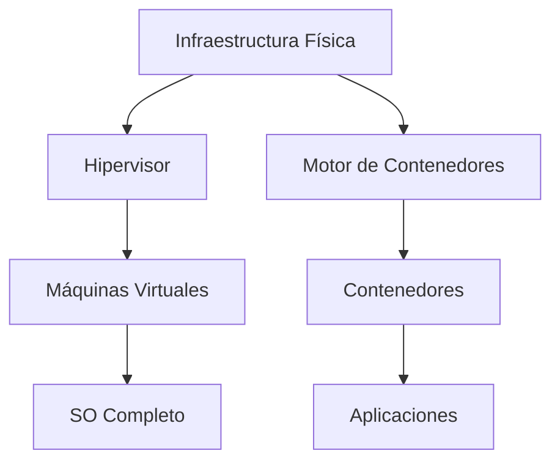
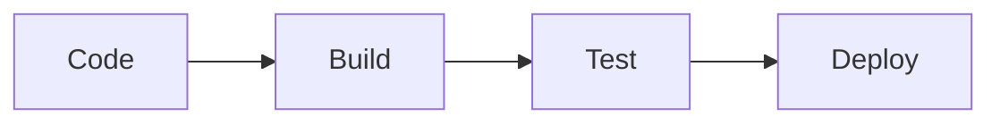

# Notas De Estudio: Administración De Sistemas, Virtualización, Cloud Computing Y DevOps

---

## 1. Introducción a la Asignatura

La asignatura cubre múltiples áreas fundamentales en la ingeniería de sistemas y software:

- Administración de sistemas (Windows y Linux)
    
- Virtualización y contenedores
    
- Cloud Computing (principalmente AWS)
    
- DevOps y CI/CD
    
- Seguridad transversal

**Idea clave:** La formación es integral y orientada a entornos reales empresariales.

---

## 2. Administración De Sistemas Windows

### 2.1 Definición

**Windows Server:** Sistema operativo orientado a la gestión empresarial, que permite administrar usuarios, recursos y servicios en red.

### 2.2 Conceptos Clave

|Concepto|Definición|Relevancia|
|---|---|---|
|Directorio Activo (Active Directory)|Servicio de directorio para gestionar usuarios y recursos|Base de la administración centralizada|
|Directivas de Grupo (GPO)|Configuraciones aplicadas a usuarios/equipos|Control masivo de configuraciones|
|Roles del servidor|Funcionalidades instalables (web, archivos, DHCP, etc.)|Permiten especializar servidores|

### 2.3 Components Importantes

- Instalación de Windows Server
    
- Configuración de Active Directory
    
- Seguridad (clave transversal)
    
- Integración con nube (Azure Arc)
    
- Servicios:
    
    - Servidor web
        
    - Servidor de archivos
        
    - DHCP

---

## 3. Administración De Sistemas Linux

### 3.1 Definición

**Linux:** Sistema operativo de código libre utilizado ampliamente en servidores y entornos cloud.

### 3.2 Conceptos Clave

|Concepto|Definición|
|---|---|
|Software libre|Código accessible y modificable|
|Distribuciones|Variantes de Linux (Ubuntu, CentOS, etc.)|
|CLI (Command Line Interface)|Interacción por línea de commandos|

### 3.3 Temas Principales

- Gestión de archivos
    
- Usuarios, permisos y grupos
    
- Procesos del sistema
    
- Logs y monitoreo
    
- Redes
    
- Almacenamiento:
    
    - Particiones
        
    - Volúmenes lógicos
        
    - Sistemas de archivos

---

## 4. Virtualización Y Contenedores

### 4.1 Virtualización

**Definición:** Tecnología que permite ejecutar múltiples sistemas operativos en una misma máquina física.

### 4.2 Tipos De Virtualización

|Tipo|Descripción|
|---|---|
|Tipo 1|Directo sobre hardware (mejor rendimiento)|
|Tipo 2|Sobre sistema operativo (más sencillo)|

### 4.3 Contenedores

**Definición:** Entornos ligeros que empaquetan aplicaciones y dependencias.

**Diferencia clave:**

|Virtualización|Contenedores|
|---|---|
|Incluyen SO completo|Comparten kernel|
|Más pesados|Más ligeros|

---

### Diagrama De Relación

---

## 5. Fundamentos De Cloud Computing

### 5.1 Definición

**Cloud Computing:** Provisión de recursos tecnológicos bajo demanda a través de internet.

### 5.2 Conceptos Clave

|Concepto|Definición|
|---|---|
|TCO (Total Cost of Ownership)|Costo total de infraestructura|
|Elasticidad|Escalado dinámico|
|Infraestructura global|Centros distribuidos|

---

## 6. Servicios Core De la Nube

### 6.1 Categorías Principales

|Servicio|Tipos|
|---|---|
|Almacenamiento|Objeto, bloque, archivo|
|Cómputo|Máquinas virtuales|
|Base de datos|SQL y NoSQL|

### 6.2 Ejemplos En AWS

- S3 (almacenamiento)
    
- RDS (bases de datos)
    
- EC2 (máquinas virtuales)

---

## 7. Redes Y Seguridad En la Nube

### 7.1 Conceptos Clave

|Concepto|Definición|
|---|---|
|VPC|Red virtual privada|
|Autenticación|Verificar identidad|
|Autorización|Permisos de acceso|

---

## 8. Monitorización Y Alta Disponibilidad

### 8.1 Definiciones

- **Alta disponibilidad:** Sistemas siempre accesibles
    
- **Observabilidad:** Monitoreo profundo del sistema

### 8.2 Características

- Escalado automático
    
- Balanceo de carga
    
- Monitoreo en tiempo real

---

## 9. Servicios Avanzados En la Nube

### 9.1 Infraestructura Como Código (IaC)

Permite definir infraestructura mediante código.

### 9.2 Otros Servicios

|Servicio|Función|
|---|---|
|CDN|Distribución de contenido|
|Caché|Mejora rendimiento|
|Serverless|Ejecución sin gestionar servidores|

---

## 10. Arquitecturas Modernas

### 10.1 Microservicios

Arquitectura basada en servicios independientes.

### 10.2 Serverless

Ejecución bajo demanda sin gestión de infraestructura.

---

## 11. DevOps

### 11.1 Definición

**DevOps:** Cultura que integra desarrollo y operaciones para mejorar la entrega de software.

### 11.2 Principios

- Automatización
    
- Integración continua
    
- Entrega continua
    
- Colaboración

---

## 12. CI/CD

### 12.1 Definición

**CI/CD:** Pipeline automatizado para integrar, probar y desplegar código.

### 12.2 Pipeline

### 12.3 Components

|Etapa|Descripción|
|---|---|
|CI|Integración continua|
|CD|Entrega/despliegue continuo|

---

## 13. Seguridad (Transversal)

Presente en:

- Windows
    
- Linux
    
- Cloud
    
- DevOps

**Importancia:** Protección de datos, sistemas y accesos.

---

## 14. Resumen De Puntos Clave

- Windows y Linux son fundamentales en entornos empresariales.
    
- Virtualización y contenedores permiten optimizar recursos.
    
- Cloud Computing es el núcleo actual de despliegue.
    
- AWS es la plataforma principal de aprendizaje.
    
- Servicios clave: almacenamiento, cómputo, bases de datos.
    
- Redes, seguridad y monitoreo son esenciales.
    
- DevOps mejora la eficiencia del desarrollo.
    
- CI/CD automatiza el ciclo de vida del software.
    
- La seguridad es un eje transversal en todos los temas.

---

## MicroTest