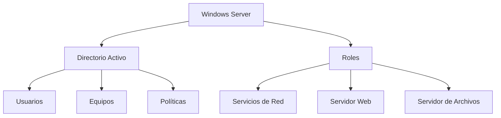
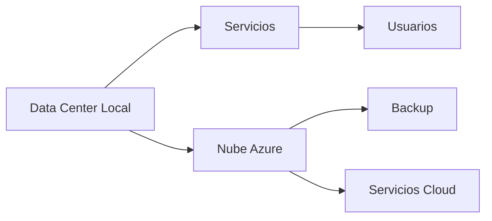

# Notas De Estudio: Introducción a Windows Server

---

## 1. Definición De Windows Server

### 1.1 Concepto

**Windows Server:**  
Sistema operativo orientado a servidores diseñado para gestionar redes de computadoras mediante una administración centralizada basada en dominios.

### 1.2 Características Principales

- Gestión de usuarios y contraseñas
    
- Control de acceso a recursos
    
- Administración centralizada mediante **Directorio Activo**
    
- Implementación de servicios de red
    
- Alta adopción en empresas

---

## 2. Evolución De Windows Server

### 2.1 Versiones Principales

|Versión|Año aproximado|
|---|---|
|Windows Server 2000|2000|
|Windows Server 2003|2003|
|Windows Server 2008|2008|
|Windows Server 2012|2012|
|Windows Server 2016|2016|
|Windows Server 2019|2019|
|Windows Server 2022|2022|
|Windows Server 2025|Próxima|

### 2.2 Importancia

- Sistema dominante en entornos empresariales
    
- Base para la gestión de infraestructura TI

---

## 3. Arquitectura De Administración

---

## 4. Roles En Windows Server

### 4.1 Definición

**Rol:**  
Funcionalidad específica que puede instalarse en un servidor para cumplir una tarea concreta.

### 4.2 Ejemplos De Roles

|Rol|Función|
|---|---|
|Active Directory|Gestión de usuarios y dominio|
|DHCP|Asignación automática de IP|
|DNS|Resolución de nombres|
|File Server|Almacenamiento centralizado|
|Web Server (IIS)|Hosting de aplicaciones web|
|Certificados|Seguridad y autenticación|

---

## 5. Versiones De Instalación

### 5.1 Tipos Principales

|Tipo|Características|
|---|---|
|Standard|Uso general|
|Datacenter|Escalabilidad y virtualización|
|Essentials|Pequeñas empresas|

### 5.2 Modos De Instalación

|Modo|Descripción|
|---|---|
|Core (CLI)|Sin interfaz gráfica, más seguro|
|Desktop Experience|Interfaz gráfica completa|

**Ventaja del modo Core:**  
Menor superficie de ataque (más seguro).

---

## 6. Directorio Activo (Active Directory)

### 6.1 Definición

Sistema que permite administrar:

- Usuarios
    
- Equipos
    
- Recursos
    
- Políticas

### 6.2 Función Principal

Centralizar la gestión de toda la infraestructura de red.

---

## 7. Políticas De Grupo (GPO)

### 7.1 Definición

Configuraciones centralizadas que controlan el comportamiento de usuarios y equipos.

### 7.2 Ejemplos

- Reglas de contraseñas
    
- Permisos de impresión
    
- Acceso a carpetas
    
- Configuración de red
    
- Certificados de seguridad

---

## 8. Servicios Fundamentales

### 8.1 Servidor De Archivos

- Almacenamiento centralizado
    
- Control de acceso
    
- Backup y cumplimiento legal

---

### 8.2 Servidor Web (IIS)

- Hosting de aplicaciones web
    
- Uso común en intranets

---

### 8.3 Servicios De Red

|Servicio|Función|
|---|---|
|DHCP|Asignar direcciones IP|
|DNS|Traducir nombres a IP|
|Direccionamiento IP|Identificación de dispositivos|

---

## 9. Seguridad En Windows Server

### 9.1 Importancia

La seguridad es crítica en entornos empresariales.

### 9.2 Aplicaciones

- Políticas de seguridad
    
- Protección de servidores expuestos
    
- Control de acceso
    
- Seguridad en controladores de dominio

---

## 10. Entornos Híbridos

### 10.1 Definición

Infraestructura que combina:

- Recursos locales (on-premise)
    
- Servicios en la nube

---

### 10.2 Características

|Tipo|Descripción|
|---|---|
|Local|Infraestructura propia|
|Nube|Servicios remotos|
|Híbrido|Combinación de ambos|

---

### 10.3 Ventajas

- Flexibilidad
    
- Escalabilidad
    
- Backup en la nube

---

### 10.4 Integración

---

## 11. Conceptos Clave

|Concepto|Descripción|
|---|---|
|Dominio|Conjunto de equipos gestionados|
|Controlador de Dominio|Servidor que administra el dominio|
|Rol|Funcionalidad del servidor|
|GPO|Configuración centralizada|
|IIS|Servidor web de Microsoft|

---

## 12. Información Adicional Relevante

- Windows Server suele coexistir con Linux en empresas.
    
- La tendencia actual es hacia entornos híbridos o cloud.
    
- La versión Core es preferida en producción por seguridad.
    
- Azure permite integración directa con entornos locales.

---

## 13. Resumen De Puntos Clave

- Windows Server es el sistema principal para gestión empresarial.
    
- Active Directory permite administración centralizada.
    
- Los roles definen las funcionalidades del servidor.
    
- GPO permite control total sobre usuarios y equipos.
    
- Servicios clave: archivos, web, DHCP y DNS.
    
- La seguridad es fundamental en toda la infraestructura.
    
- Las empresas migran hacia entornos híbridos con la nube.
    
- Existen diferentes versiones y modos de instalación según necesidades.

---

## MicroTest