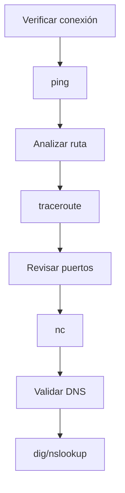

# 02.05 Administración De Redes En Linux

---

## 1. Introducción

La **administración de redes en Linux** implica configurar, monitorear y diagnosticar la conectividad del sistema.

### Relevancia

- Permite verificar comunicación entre sistemas
    
- Detectar fallos de red
    
- Configurar direcciones IP y servicios

---

## 2. Herramientas Básicas De Red

### 2.1 Commando `ping`

```bash
ping google.com
```

#### Definición

Herramienta para verificar conectividad con otro host.

#### Explicación

1. Envía paquetes ICMP
    
2. Espera respuesta del destino
    
3. Mide latencia

---

### 2.2 Commando `traceroute`

```bash
traceroute google.com
```

#### Definición

Muestra la ruta que siguen los paquetes hasta el destino.

#### Explicación

1. Identifica cada salto (router)
    
2. Muestra tiempos de respuesta
    
3. Útil para diagnosticar fallos

---

## 3. Gestión De Rutas

### Commando `route`

```bash
route -n
```

#### Definición

Muestra la tabla de enrutamiento.

#### Función

- Indica por dónde sale el tráfico
    
- Define gateways y rutas

---

## 4. Verificación De Puertos

### 4.1 Commando `netcat (nc)`

```bash
nc -zv localhost 22
```

#### Definición

Herramienta para comprobar puertos abiertos.

#### Explicación

1. `-z`: escaneo sin enviar datos
    
2. `-v`: modo verbose
    
3. Verifica si el puerto está activo

---

### Ejemplo

```bash
nc -zv localhost 80
```

- Resultado:
    
    - Puerto cerrado → sin servicio web
        
    - Puerto abierto → servidor activo

---

## 5. Servidor Web (Nginx)

### Instalación

```bash
sudo apt install nginx -y
```

### Verificación

```bash
curl localhost
```

#### Explicación

1. Instala servidor web
    
2. Abre puerto 80
    
3. Permite acceder vía navegador o terminal

---

## 6. Resolución DNS

### 6.1 Commando `dig`

```bash
dig google.com
```

#### Definición

Consulta registros DNS.

#### Función

- Obtiene direcciones IP asociadas a dominios

---

### 6.2 Commando `nslookup`

```bash
nslookup netflix.com
```

#### Función

- Alternativa a `dig`
    
- Consulta servidores DNS

---

## 7. Configuración De Red

### 7.1 Ver Interfaces De Red

```bash
ifconfig
```

#### Información Mostrada

- Dirección IP
    
- Máscara de red
    
- Interfaces disponibles

---

### Ejemplo

|Interfaz|IP|Tipo|
|---|---|---|
|lo|127.0.0.1|Loopback|
|ensX|IP privada|Red|

---

## 8. Configuración Manual De Red

### Archivo De Configuración

Ruta:

```bash
/etc/netplan/*.yaml
```

### Ejemplo De Configuración

```yaml
network:
  version: 2
  ethernets:
    ensX:
      dhcp4: no
      addresses: [192.168.1.100/24]
      gateway4: 192.168.1.1
      nameservers:
        addresses: [8.8.8.8]
```

---

### Aplicar Cambios

```bash
sudo netplan apply
```

#### Explicación

1. Editar archivo YAML
    
2. Definir IP, gateway y DNS
    
3. Aplicar configuración

---

## 9. Flujo De Diagnóstico De Red



---

## 10. Comparación De Herramientas

|Herramienta|Uso|
|---|---|
|ping|Verificar conectividad|
|traceroute|Analizar ruta|
|route|Ver rutas|
|nc|Verificar puertos|
|dig|Consultar DNS|
|ifconfig|Ver interfaces|

---

## 11. Configuración Gráfica Vs CLI

|Método|Ventajas|
|---|---|
|GUI|Fácil de usar|
|CLI|Más control y automatización|

---

## 12. Información Adicional

- En la nube (AWS), la red suele configurarse automáticamente
    
- IPs privadas son asignadas por el proveedor
    
- Configuración manual es más común en servidores locales

---

## 13. Resumen De Puntos Clave

- Linux ofrece múltiples herramientas para redes
    
- `ping` y `traceroute` son esenciales para diagnóstico
    
- `nc` permite verificar puertos
    
- `dig` y `nslookup` gestionan DNS
    
- `ifconfig` muestra configuración de red
    
- Netplan permite configurar IPs manualmente
    
- La CLI es fundamental en administración de redes

---

## MicroTest 2.4

1. ¿Qué commando listará todas las interfaces de red disponibles en su sistema?
    
    - La respuesta: b. Ip link show.
        
    - Justificación: El commando `ip link show` es el estándar en Linux moderno para listar todas las interfaces de red disponibles, mostrando su estado (UP/DOWN), direcciones MAC y configuración básica. Es parte de la suite `iproute2`, que reemplaza herramientas antiguas como `ifconfig`.
        
2. ¿Qué commando utilizarías para ver la información del dispositivo y de la dirección de red?
    
    - La respuesta: d. Ip addr show ens3.
        
    - Justificación: El commando `ip addr show ens3` permite visualizar información detallada de una interfaz específica (como `ens3`), incluyendo direcciones IP (IPv4/IPv6), estado y configuración. Es el equivalente moderno a `ifconfig` para inspección de direcciones.
        
3. Para rastrear la ruta que toma el tráfico de la red para llegar a un host remoto a través de múltiples enrutadores, usamos…
    
    - La respuesta: c. Traceroute o tracepath.
        
    - Justificación: `traceroute` y `tracepath` son herramientas diseñadas para mostrar la ruta que siguen los paquetes hasta un destino, identificando cada salto (router) en el camino. Son fundamentales para diagnóstico de red y análisis de latencia.

## Saber Mas

**Configuring networks**

Ubuntu. (s. f.). _Configuring networks._ [https://ubuntu.com/server/docs/configuring-networks](https://ubuntu.com/server/docs/configuring-networks)

Para rastrear la ruta que toma el tráfico de la red para llegar a un host remoto a través de múltiples enrutadores, use traceroute o tracepath. Esto puede identificar si hay un problema con uno de sus enrutadores o con uno intermedio. Ambos commandos usan paquetes de UDP para realizar el seguimiento de una ruta de forma predeterminada; sin embargo, muchas redes bloquean el tráfico de UDP e ICMP. El commando traceroute tiene opciones para realizar el seguimiento de la ruta con paquetes UDP (predeterminado), ICMP (-I) o TCP (-T). Sin embargo, en general, el commando traceroute no está instalado de forma predeterminada