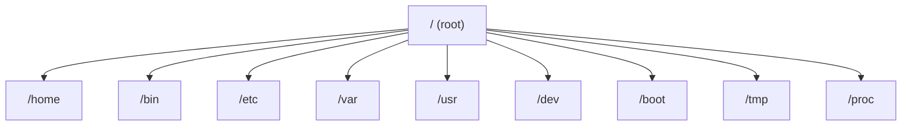

# 02.06 Acceso a Ficheros En Sistemas Linux

## 1. Estructura Del Sistema De Archivos En Linux

### Definición

El sistema de archivos en Linux es una **estructura jerárquica en forma de árbol**, donde todo parte del directorio raíz `/`. Cada carpeta tiene una función específica dentro del sistema.

### Estructura General



### Directorios Principales

|Directorio|Descripción|Relevancia|
|---|---|---|
|`/`|Directorio raíz|Punto inicial de todo el sistema|
|`/home`|Carpetas de usuarios|Donde trabajan los usuarios|
|`/bin`|Binarios esenciales|Commandos básicos del sistema|
|`/boot`|Archivos de arranque|Kernel y configuración de inicio|
|`/dev`|Dispositivos|Representación de hardware|
|`/etc`|Configuración|Archivos críticos del sistema|
|`/lib`|Librerías|Dependencias de programas|
|`/mnt`|Montaje manual|Montaje temporal de discos|
|`/media`|Dispositivos externos|USB, CD, etc.|
|`/opt`|Software adicional|Aplicaciones opcionales|
|`/proc`|Información del sistema|Estado del sistema en tiempo real|
|`/root`|Home del root|Usuario administrador|
|`/sbin`|Binarios del sistema|Administración del sistema|
|`/tmp`|Archivos temporales|Uso temporal|
|`/usr`|Programas y recursos|Aplicaciones accesibles|
|`/var`|Datos variables|Logs, bases de datos|

### Nota Importante

- La estructura puede variar ligeramente según la distribución (Ubuntu, Rocky Linux, etc.).
    
- Es fundamental para administración de sistemas y seguridad.

---

## 2. Gestión De Archivos Y Directorios

### Commandos Básicos

|Commando|Función|
|---|---|
|`ls -la`|Lista archivos con detalles|
|`pwd`|Muestra ruta actual|
|`cd`|Cambia de directorio|
|`mkdir`|Crea directorios|
|`rm`|Elimina archivos|
|`cp`|Copia archivos|
|`mv`|Mueve o renombra archivos|

### Ejemplo Práctico

```bash
mkdir ejemplos
cp archivo.txt ejemplos/
mv archivo.txt archivo2.txt
rm archivo2.txt
```

### Explicación Paso a Paso

1. `mkdir ejemplos` → crea un directorio.
    
2. `cp archivo.txt ejemplos/` → copia archivo al directorio.
    
3. `mv archivo.txt archivo2.txt` → renombra o mueve.
    
4. `rm archivo2.txt` → elimina archivo.

---

## 3. Visualización De Archivos

### Commandos Principales

|Commando|Descripción|
|---|---|
|`cat`|Muestra contenido completo|
|`head`|Muestra primeras líneas|
|`tail`|Muestra últimas líneas|

### Ejemplo

```bash
cat archivo.txt
head archivo.txt
tail archivo.txt
```

### Explicación

- `cat`: útil para archivos pequeños.
    
- `head`: inspección rápida del inicio.
    
- `tail`: útil para logs.

---

## 4. Edición De Archivos

### Editores Principales

|Editor|Características|
|---|---|
|`vim`|Avanzado, potente|
|`nano`|Simple, fácil|

### Ejemplo Con Nano

```bash
nano archivo.txt
```

### Flujo Básico

1. Abrir archivo.
    
2. Editar contenido.
    
3. Guardar (`Ctrl + X` → confirmar).

---

## 5. Permisos Y Ejecución De Archivos

### Concepto

Los permisos controlan quién puede:

- Leer (r)
    
- Escribir (w)
    
- Ejecutar (x)

### Ejemplo

```bash
chmod 777 script.sh
```

### Explicación

- `777` → permisos completos para:
    
    - Usuario
        
    - Grupo
        
    - Otros

### Nota

- Usar `777` no es recomendable en producción (riesgo de seguridad).
    
- Mejores prácticas: usar permisos mínimos necesarios.

---

## 6. Scripts En Linux

### Definición

Un script es un archivo ejecutable con commandos automatizados.

### Ejemplo Básico

```bash
#!/bin/bash
echo "Hola mundo"
```

### Ejecución

```bash
chmod +x script.sh
./script.sh
```

### Explicación Paso a Paso

1. `#!/bin/bash` → indica intérprete.
    
2. `echo` → imprime mensaje.
    
3. `chmod +x` → da permisos de ejecución.
    
4. `./script.sh` → ejecuta el script.

---

## 7. Interfaz Gráfica Vs Línea De Commandos

### Comparación

|Característica|Línea de commandos|Interfaz gráfica|
|---|---|---|
|Control|Alto|Medio|
|Velocidad|Alta|Media|
|Facilidad|Media|Alta|
|Automatización|Sí|Limitada|

### Observación

- Interfaces gráficas (como en Rocky Linux) facilitan tareas básicas.
    
- La línea de commandos es esencial para administración avanzada.

---

## 8. Información Adicional Relevante

- Linux sigue el estándar **FHS (Filesystem Hierarchy Standard)**.
    
- Muchos servicios (como Nginx o Apache) almacenan datos en:
    
    - `/var/www`
        
- `/proc` y `/sys` permiten monitoreo en tiempo real del sistema.
    
- Herramientas como `du` y `df` permiten analizar uso de disco.

---

## 9. Resumen De Puntos Clave

- Linux utilize una estructura jerárquica centrada en `/`.
    
- Cada directorio tiene un propósito específico.
    
- Los commandos básicos permiten gestionar archivos y directorios.
    
- Existen herramientas para visualizar y editar archivos.
    
- Los permisos son fundamentales para la seguridad.
    
- Los scripts permiten automatizar tareas.
    
- La línea de commandos es esencial en administración de sistemas.
    
- La estructura puede variar según la distribución.

---

## MicroTest 2.5

1. Con el siguiente commando se crea una colección de archivos con el nombre archive.tar con el contenido de file1, file2 y file3 en el directorio de inicio del usuario:
    
    - La respuesta: b. tar -cf archive.tar file1 file2 file3.
        
    - Justificación: El commando `tar -cf` se utilize para **crear** (`-c`) un archivo tar y especificar el nombre del archivo (`-f`). Las otras opciones como `-x` son para extraer, y `-jar` o `-unzip` no son opciones válidas de tar.
        
2. Para cargar o descargar archivos de forma interactiva desde un servidor SSH, use el programa de transferencia de archivos:
    
    - La respuesta: d. sftp.
        
    - Justificación: `sftp` (SSH File Transfer Protocol) permite transferir archivos de forma segura e interactiva sobre SSH. Es la herramienta estándar para este tipo de operaciones en sistemas Linux.
        
3. Las particiones son dispositivos de bloque por derecho propio. En el almacenamiento adjunto a SATA la primera partición en el primer disco se denomina frecuentemente:
    
    - La respuesta: c. /dev/sda1.
        
    - Justificación: En Linux, los discos SATA se nombran como `/dev/sdX`, donde `X` es una letra. La primera partición del primer disco (`sda`) se denomina `/dev/sda1`.

## **Saber más**

---

****Discos y almacenamiento****

Ubuntu. (S. f.). _Discos y almacenamiento._ [https://help.ubuntu.com/stable/ubuntu-help/disk.html.es](https://help.ubuntu.com/stable/ubuntu-help/disk.html.es)

Para cargar o descargar archivos de forma interactiva desde un servidor SSH, use el programa de transferencia de archivos, sftp. Una sesión con el commando sftp usa el mecanismo de autenticación segura y la transferencia de datos cifrados desde y hacia el servidor SSH.