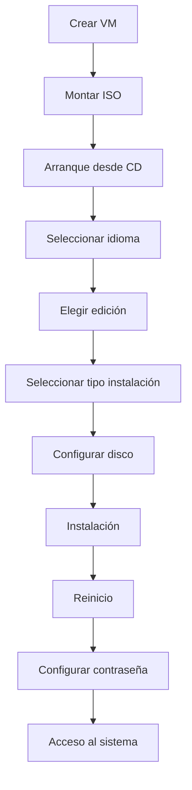

# Notas De Estudio: Ediciones E Instalación De Windows Server

---

## 1. Ediciones De Windows Server

### 1.1 Versiones Principales

Las ediciones más relevantes de Windows Server (especialmente en la versión 2022) son:

|Edición|Descripción|
|---|---|
|Standard|Uso general en empresas|
|Datacenter|Alta escalabilidad y virtualización|
|Essentials|Pequeñas empresas (menos utilizada)|

---

### 1.2 Diferencias Clave

|Característica|Standard|Datacenter|
|---|---|---|
|Virtualización|Hasta 2 máquinas virtuales|Ilimitadas|
|Costo|Menor|Mayor|
|Escalabilidad|Media|Alta|

**Conclusión:**  
La edición **Datacenter** es ideal para entornos altamente virtualizados.

---

## 2. Modos De Instalación

### 2.1 Tipos De Interfaz

|Modo|Descripción|
|---|---|
|Server Core|Sin interfaz gráfica (CLI)|
|Desktop Experience|Interfaz gráfica completa|

### 2.2 Comparación

|Característica|Core|Desktop|
|---|---|---|
|Seguridad|Alta|Media|
|Consumo de recursos|Bajo|Alto|
|Facilidad de uso|Baja|Alta|

**Idea clave:**  
El modo Core reduce la superficie de ataque, ideal para servidores expuestos a internet.

---

## 3. Proceso De Instalación

### 3.1 Preparación

**Requisitos básicos:**

- Archivo ISO de Windows Server
    
- Plataforma de virtualización (ej: Hyper-V, VirtualBox, VMware)

---

### 3.2 Creación De Máquina Virtual

Parámetros utilizados en el ejemplo:

|Parámetro|Valor|
|---|---|
|Nombre|Windows 2022|
|RAM|8 GB|
|Tipo|Generación 2|
|Disco|127 GB|
|Red|Red de laboratorio|

---

### 3.3 Flujo De Instalación

---

### 3.4 Pasos Detallados

1. **Arranque desde ISO**
    
    - Se inicia desde el CD virtual.
        
    - Se presiona una tecla para comenzar.
        
2. **Configuración inicial**
    
    - Idioma
        
    - Formato regional
        
3. **Selección de instalación**
    
    - Actualización (si ya existe sistema)
        
    - Instalación limpia (opción recomendada)
        
4. **Selección de edición**

Opciones disponibles:

|Opción|Descripción|
|---|---|
|Standard Core|Sin interfaz|
|Standard Desktop|Con interfaz|
|Datacenter Core|Sin interfaz|
|Datacenter Desktop|Con interfaz|

---

1. **Configuración de disco**
    
    - Selección de disco
        
    - Creación automática de particiones
        
2. **Instalación automática**
    
    - Copia de archivos
        
    - Instalación de components
        
    - Reinicio automático

---

1. **Configuración inicial**
    
    - Definir contraseña del administrador

---

## 4. Usuario Administrador

### 4.1 Definición

**Administrador:**  
Cuenta con privilegios máximos en el sistema.

### 4.2 Buenas Prácticas

- No usar para tareas diarias
    
- Crear usuarios con permisos específicos
    
- Similar al usuario **root** en Linux

---

## 5. Primer Inicio Del Sistema

### 5.1 Características

- Creación del perfil de usuario
    
- Carga inicial más lenta
    
- Posteriores accesos más rápidos

---

### 5.2 Herramientas Iniciales

|Herramienta|Función|
|---|---|
|Server Manager|Administración central|
|Windows Admin Center|Gestión avanzada (opcional)|

---

## 6. Administración Del Servidor

### 6.1 Server Manager

**Definición:**  
Panel principal para gestionar roles, servicios y configuraciones.

### 6.2 Funcionalidades

- Instalación de roles
    
- Configuración del sistema
    
- Supervisión del servidor

---

## 7. Virtualización En El Contexto

### 7.1 Definición

**Máquina virtual:**  
Entorno simulado que permite ejecutar sistemas operativos sin hardware físico dedicado.

---

### 7.2 Ventajas

- Aislamiento
    
- Flexibilidad
    
- Pruebas seguras
    
- Optimización de recursos

---

## 8. Conceptos Clave

|Concepto|Descripción|
|---|---|
|ISO|Imagen del sistema operativo|
|VM|Máquina virtual|
|Hypervisor|Software de virtualización|
|Partición|División del disco|
|Instalación limpia|Instalación desde cero|

---

## 9. Información Adicional Relevante

- Las versiones de evaluación duran 180 días.
    
- La instalación en modo Core es común en producción.
    
- La elección de edición depende del uso (virtualización, tamaño empresa).
    
- Windows Server se integra con herramientas de nube como Azure.

---

## 10. Resumen De Puntos Clave

- Windows Server tiene tres ediciones principales: Standard, Datacenter y Essentials.
    
- Datacenter permite virtualización ilimitada.
    
- Existen dos modos de instalación: Core y Desktop.
    
- La instalación se realiza desde un ISO en una máquina física o virtual.
    
- El proceso incluye selección de edición, disco y configuración inicial.
    
- El usuario administrador tiene control total, pero no debe usarse diariamente.
    
- Server Manager es la herramienta principal de administración.
    
- La virtualización es clave para pruebas y despliegues.

---

## MicroTest

1. Server Core es una instalación de Windows Server:
    
    - La respuesta: b. Sin la experiencia de escritorio.
        
    - Justifacion: Server Core es una instalación mínima de Windows Server que no incluye interfaz gráfica (GUI), lo que reduce consumo de recursos y superficie de ataque, siendo más segura para entornos de producción.
        
2. ¿Qué orden por línea de commando inicia el administrador de tareas??
    
    - La respuesta: d. Taskmgr.exe.
        
    - Justifacion: El commando `taskmgr.exe` ejecuta directamente el Administrador de tareas en Windows, permitiendo gestionar procesos, rendimiento y aplicaciones activas desde línea de commandos o ejecución directa.
        
3. Aunque algunos roles de servidor no están disponibles, en las implementaciones de Server Core no están disponibles:
    
    - La respuesta: c. Directiva de red.
        
    - Justifacion: En Server Core algunos roles que requieren interfaz gráfica o herramientas específicas no están disponibles o son limitados, como ciertas funciones de directiva de red, mientras que roles como DHCP, DNS y servidor web sí pueden instalarse y ejecutarse.
      
      