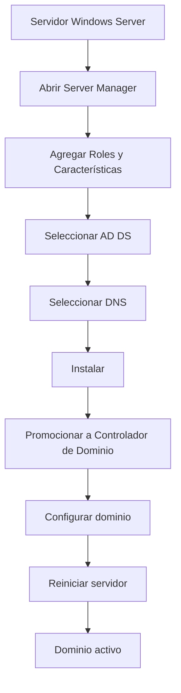
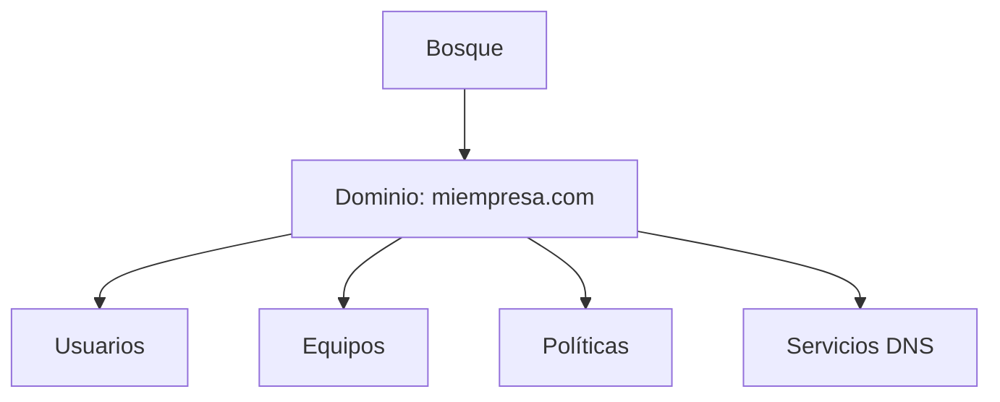

# Notas De Estudio: Servicios De Dominio De Active Directory

## 1. Introducción a Active Directory

### Definición

**Active Directory (AD)** es un servicio de directorio desarrollado por Microsoft que permite la **administración centralizada** de:

- Usuarios
    
- Equipos
    
- Políticas de seguridad
    
- Recursos de red

### Relevancia

- Es el núcleo de la infraestructura de TI en entornos Windows.
    
- Permite controlar toda una empresa desde uno o varios servidores.
    
- Facilita la autenticación, autorización y administración de recursos.

---

## 2. Components Clave De Active Directory

### 2.1 Controlador De Dominio (Domain Controller)

**Definición:**  
Servidor que ejecuta Active Directory y gestiona:

- Autenticación de usuarios
    
- Políticas de seguridad
    
- Recursos de red

**Importancia:**

- Es el “cerebro” de la red.
    
- Se recomienda tener al menos **2 controladores** por redundancia.

---

### 2.2 Dominio

**Definición:**  
Conjunto lógico de recursos (usuarios, equipos, etc.) bajo una misma administración.

Ejemplo:

- miempresa.com

---

### 2.3 Bosque (Forest)

**Definición:**  
Estructura que agrupa uno o varios dominios.

**Relación:**

- Un bosque puede container múltiples dominios.
    
- Comparte esquema y configuración global.

---

### 2.4 DNS (Domain Name System)

**Definición:**  
Sistema que traduce nombres de dominio en direcciones IP.

**Relevancia en AD:**

- Es obligatorio para el funcionamiento de Active Directory.
    
- Permite localizar servicios dentro de la red.

---

## 3. Instalación De Active Directory

### 3.1 Flujo General De Instalación

---

### 3.2 Roles Necesarios

|Rol|Función|
|---|---|
|Active Directory Domain Services (AD DS)|Gestiona usuarios, equipos y políticas|
|DNS Server|Resolución de nombres dentro de la red|

---

## 4. Promoción a Controlador De Dominio

### Definición

Proceso de convertir un servidor en un **controlador de dominio**.

### Opciones Disponibles

|Escenario|Acción|
|---|---|
|Primera instalación en empresa|Crear nuevo bosque y dominio|
|Empresa existente|Agregar controlador a dominio existente|

---

### 4.1 Configuración Típica

- Nombre del dominio: `miempresa.com`
    
- Nivel funcional: Windows Server 2016 (compatible con versiones actuales)
    
- Contraseña de recuperación (DSRM)

---

### 4.2 Proceso De Configuración

1. Crear nuevo bosque
    
2. Definir nombre del dominio
    
3. Configurar DNS
    
4. Establecer contraseña de recuperación
    
5. Confirmar rutas de almacenamiento
    
6. Instalar y reiniciar

---

## 5. Herramientas Administrativas

Después de la instalación aparecen nuevas herramientas:

### 5.1 Usuarios Y Equipos De Active Directory

**Definición:**  
Consola para gestionar:

- Usuarios
    
- Grupos
    
- Equipos

---

### 5.2 DNS Manager

**Definición:**  
Herramienta para administrar zonas DNS.

---

### 5.3 Otras Herramientas

|Herramienta|Función|
|---|---|
|Centros de administración AD|Gestión avanzada|
|Dominios y confianzas|Relación entre dominios|
|Sitios y servicios|Replicación y topología de red|

---

## 6. Estructura De Active Directory

---

## 7. Consideraciones Importantes

- Se recomienda **IP fija** en el servidor.
    
- El DNS es obligatorio para AD.
    
- Se recomienda tener mínimo **2 controladores de dominio**.
    
- El sistema require reinicio tras la instalación.

---

## 8. Información Adicional

- Aunque se use Windows Server 2019 o 2022:
    
    - El nivel funcional sigue siendo basado en **Windows Server 2016**.
        
- Active Directory es clave para:
    
    - Seguridad
        
    - Escalabilidad
        
    - Administración centralizada

---

## 9. Resumen De Puntos Clave

- Active Directory permite gestionar toda una red desde un punto central.
    
- Require instalar los roles:
    
    - AD DS
        
    - DNS
        
- Un controlador de dominio administra usuarios, equipos y políticas.
    
- Se debe crear:
    
    - Un dominio (ej: miempresa.com)
        
    - Un bosque (estructura global)
        
- Herramientas principales:
    
    - Usuarios y Equipos
        
    - DNS Manager
        
- Es recomendable implementar redundancia con múltiples controladores.

---

## MicroTest

1. La base de datos de AD DS es:
    
    - La respuesta: b. Es el almacén central de todos los objetos del dominio.
        
    - Justifacion:  
        La base de datos de Active Directory (NTDS.dit) almacena todos los objetos del dominio como usuarios, grupos, equipos y políticas. No es un motor como MySQL ni un simple archivo de texto, sino una base de datos estructurada diseñada específicamente para gestionar identidades y recursos dentro del dominio.
        
2. ¿Cuál no es un componente lógico de un AD DS?
    
    - La respuesta: d. Kubernetes.
        
    - Justifacion:  
        Los components lógicos de Active Directory incluyen dominio, esquema y particiones, que definen la estructura y organización del directorio. Kubernetes es una plataforma de orquestación de contenedores y no tiene relación con la arquitectura lógica de AD DS.
        
3. ¿Cuál no es un componente físico de un AD DS
    
    - La respuesta: c. GPO.
        
    - Justifacion:  
        Los components físicos de Active Directory incluyen controladores de dominio, almacenes de datos y servidores de catálogo global, que representan la infraestructura real. Las GPO (Group Policy Objects) son components lógicos utilizados para definir configuraciones y políticas, no forman parte de la estructura física.

Microsoft Learn. (2023, marzo 8). _Introducción a Active Directory Domain Services_. [https://learn.microsoft.com/es-es/windows-server/identity/ad-ds/get-started/virtual-dc/active-directory-domain-services-overview](https://learn.microsoft.com/es-es/windows-server/identity/ad-ds/get-started/virtual-dc/active-directory-domain-services-overview)