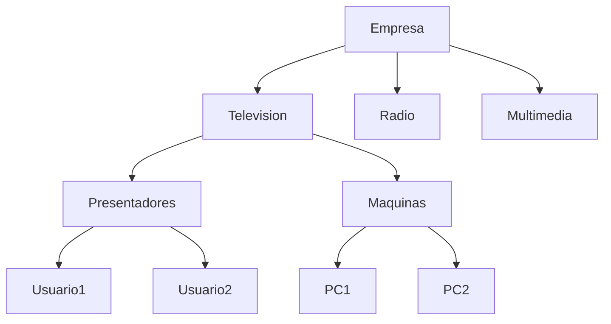
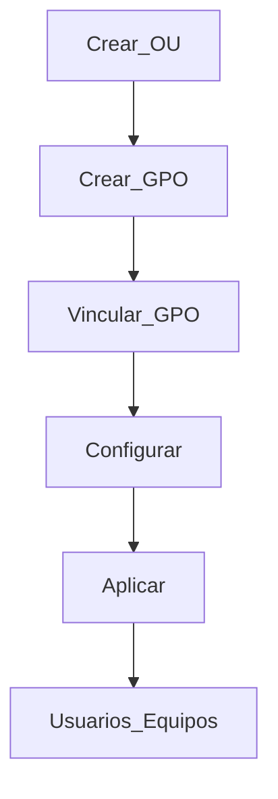

# Implementación De Directivas De Grupo (GPO) En Windows Server

## 1. Introducción a Las Directivas De Grupo (GPO)

### Definición

Las **Directivas de Grupo (Group Policy Objects - GPO)** son configuraciones centralizadas que permiten administrar el comportamiento de usuarios y equipos dentro de un dominio de Windows Server.

### Relevancia

- Permiten aplicar configuraciones de seguridad, software y entorno de usuario.
    
- Facilitan la administración masiva en empresas.
    
- Son fundamentales en entornos corporativos con Active Directory.

---

## 2. Estructura De Active Directory Para GPO

### Components Clave

|Componente|Definición|Función|
|---|---|---|
|Dominio|Unidad principal de organización|Agrupa usuarios, equipos y recursos|
|Unidad Organizativa (OU)|Contenedor lógico|Permite aplicar políticas específicas|
|Contenedor|Objeto sin capacidad de GPO|Solo organiza objetos|
|GPO|Conjunto de configuraciones|Define reglas para usuarios/equipos|

---

## 3. Diferencia Entre Contenedores Y OUs

- **Contenedores**: No permiten aplicar políticas.
    
- **OUs (Unidades Organizativas)**: Sí permiten aplicar GPO.

---

## 4. Estructura Organizativa De Ejemplo



### Explicación

- Se crea una jerarquía organizativa.
    
- Las políticas pueden aplicarse a nivel de OU.
    
- Todo lo que esté dentro hereda la configuración.

---

## 5. Consolas Utilizadas

### 5.1 Usuarios Y Equipos De Active Directory

Permite:

- Crear usuarios
    
- Crear grupos
    
- Crear OUs
    
- Administrar equipos

### 5.2 Group Policy Management

Permite:

- Crear GPO
    
- Editar políticas
    
- Aplicarlas a OUs o dominio

---

## 6. Tipos De Políticas

### 6.1 Políticas a Nivel Dominio

- Se aplican a todos los usuarios y equipos.

### 6.2 Políticas a Nivel OU

- Se aplican solo a una parte específica de la organización.

---

## 7. Creación Y Aplicación De GPO

### Pasos

1. Crear una OU
    
2. Crear usuarios/equipos dentro
    
3. Ir a **Group Policy Management**
    
4. Crear nueva GPO
    
5. Vincularla a la OU
    
6. Editar configuración

---

## 8. Ejemplo Práctico De Políticas

### 8.1 Política De Contraseñas

Ubicación:

```Python
Computer Configuration → Windows Settings → Security Settings → Account Policies → Password Policy
```

Configuraciones posibles:

- Longitud mínima
    
- Complejidad
    
- Historial de contraseñas
    
- Expiración

### Ejemplo De Configuración

|Parámetro|Valor|
|---|---|
|Longitud mínima|7 caracteres|
|Historial|24 contraseñas|
|Expiración|42 días|
|Complejidad|Activada|

---

### 8.2 Restricción Del Panel De Control

Configuración:

- Ocultar opciones específicas
    
- Bloquear acceso completo

Ejemplo:

- Evitar que usuarios instalen programas
    
- Restringir cambios en pantalla

---

### 8.3 Restricción De Acciones Del Sistema

Ejemplo:

- Bloquear cierre de sesión (logoff)
    
- Evitar apagado del sistema

Caso práctico:

- Equipos en museos o kioscos
    
- Sistemas que no deben set manipulados

---

## 9. Flujo De Aplicación De GPO



---

## 10. Alcance Y Herencia

### Conceptos Clave

- Las GPO se heredan hacia abajo.
    
- Se pueden aplicar:
    
    - A dominio
        
    - A OU
        
    - A grupos específicos

---

## 11. Granularidad De Las Políticas

- Existen **cientos de configuraciones disponibles**
    
- Se pueden aplicar a:
    
    - Usuarios
        
    - Equipos

### Tipos Principales

|Tipo|Descripción|
|---|---|
|User Configuration|Afecta usuarios|
|Computer Configuration|Afecta equipos|

---

## 12. Buenas Prácticas

- Organizar correctamente las OUs
    
- No usar políticas excesivamente restrictivas sin control
    
- Probar en entornos de laboratorio
    
- Documentar cada GPO

---

## 13. Información Adicional Relevante

- Las GPO son esenciales para seguridad corporativa.
    
- Permiten automatizar configuraciones.
    
- Se integran con Active Directory.
    
- Son base de administración en empresas medianas y grandes.

---

## 14. Resumen De Puntos Clave

- Las GPO permiten administrar usuarios y equipos de forma centralizada.
    
- Solo las OUs permiten aplicar políticas.
    
- Existen políticas a nivel dominio y a nivel OU.
    
- Se pueden configurar cientos de parámetros.
    
- Se aplican automáticamente a los objetos dentro de su alcance.
    
- Son fundamentales para seguridad y control en entornos empresariales.

---

## MicroTest 1.3

1. Con una directiva de grupo:
    
    - La respuesta: b. Puedo administrar la configuración de un AD DS.
        
    - Justifacion:  
        Las directivas de grupo (GPO) están diseñadas para gestionar y configurar el entorno de Active Directory Domain Services (AD DS), permitiendo aplicar políticas de seguridad, configuraciones de sistema y restricciones tanto a usuarios como a equipos dentro del dominio.
        
2. Las directivas de grupo se aplican:
    
    - La respuesta: d. A usuarios y equipos.
        
    - Justifacion:  
        Las GPO pueden aplicarse tanto a cuentas de usuario como a equipos dentro de Active Directory, lo que permite administrar configuraciones específicas según el contexto (usuario o máquina).
        
3. Los GPO se muestran en un contenedor denominado:
    
    - La respuesta: c. Objetos de directiva de grupo.
        
    - Justifacion:  
        En Active Directory, los GPO se almacenan y administran dentro de un contenedor llamado “Objetos de directiva de grupo” (Group Policy Objects), donde se pueden crear, editar y vincular a dominios, sitios u unidades organizativas.