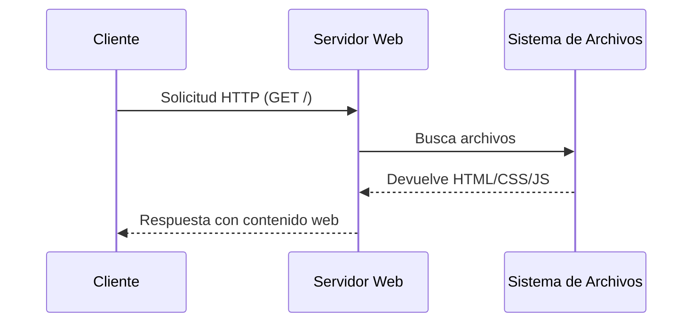
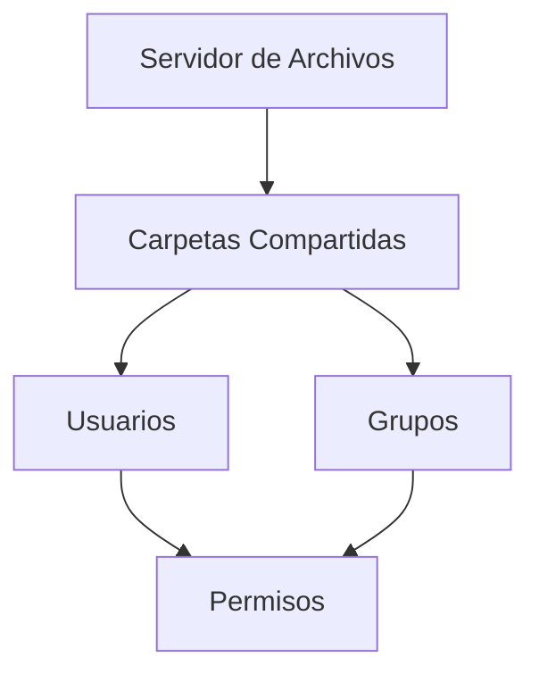
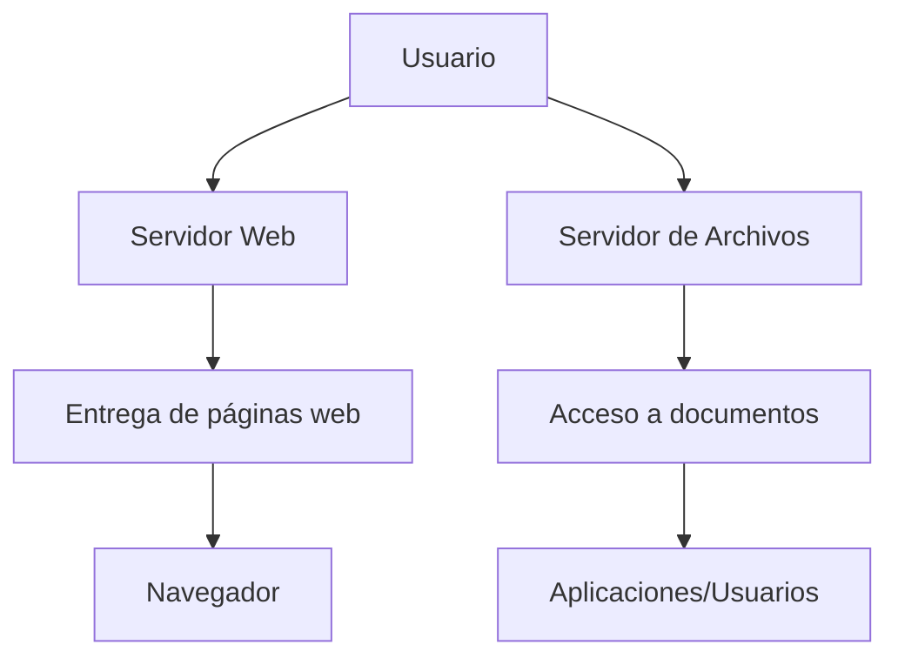

# 01.05 Servidor Web, Servidor De Archivos Y Monitorización

## 1. Introducción a Los Servicios En Windows Server

### Definición

En Windows Server, los servidores pueden desempeñar múltiples roles dentro de una red empresarial, destacando:

- Servidor web
    
- Servidor de archivos
    
- Monitorización del sistema

### Relevancia

- Permiten centralizar recursos.
    
- Facilitan el acceso controlado a información.
    
- Soportan aplicaciones internas y externas.

---

## 2. Servidor Web

### Definición

Un **servidor web** es un sistema que almacena, procesa y entrega páginas web a los clientes mediante protocolos como HTTP/HTTPS.

En Windows Server, esto se logra mediante **IIS (Internet Information Services)**.

---

### Funcionamiento Básico

- El servidor almacena archivos web (HTML, CSS, JS).
    
- Un cliente (navegador) solicita la página.
    
- El servidor responde mostrando el contenido.



---

### Ruta Principal Del Servidor Web (IIS)

|Ruta|Descripción|
|---|---|
| `C:\inetpub\wwwroot` |Carpeta donde se alojan los archivos web|

---

### Ejemplo Práctico

#### Paso 1: Ubicar la Carpeta Web

Ruta:

```Python
C:\inetpub\wwwroot
```

#### Paso 2: Reemplazar Contenido

- Eliminar archivos por defecto (opcional).
    
- Copiar archivos de una página web (HTML, CSS, JS).

#### Paso 3: Visualizar En Navegador

- Acceder desde navegador:

    ```Python
    http://localhost
    ```

- Se mostrará la página cargada.

---

### Ejemplo Conceptual

- Se reemplaza la página por defecto por una simulación tipo Netflix.
    
- Incluye:
    
    - HTML (estructura)
        
    - CSS (estilos)
        
    - JavaScript (funcionalidad)

---

## 3. Servidor De Archivos

### Definición

Un **servidor de archivos** permite almacenar y compartir archivos dentro de una red.

### Características

- Acceso centralizado.
    
- Control de permisos.
    
- Compartición entre usuarios.

### Ejemplo De Uso

- Compartir documentos en una empresa.
    
- Acceso a recursos desde diferentes equipos.

---

### Relación Con Active Directory



---

## 4. Publicación Web

### Tipos De Despliegue

|Tipo|Descripción|
|---|---|
|Intranet|Acceso interno en la empresa|
|Internet|Acceso público global|

### Consideraciones

- Seguridad (HTTPS, firewall).
    
- Acceso externo (puertos abiertos).
    
- Dominio y DNS.

---

## 5. Monitorización

### Definición

La **monitorización** permite supervisar el estado y rendimiento del servidor.

### Objetivos

- Detectar fallos.
    
- Medir uso de recursos.
    
- Optimizar rendimiento.

### Herramientas Comunes

- Monitor de rendimiento
    
- Visor de eventos
    
- Herramientas externas

---

## 6. Flujo General De Servicios



---

## 7. Buenas Prácticas

- Separar roles (web, archivos, seguridad).
    
- Realizar copias de seguridad.
    
- Controlar accesos con permisos.
    
- Mantener actualizado el servidor.
    
- Implementar monitorización constante.

---

## 8. Información Adicional

- IIS soporta múltiples sitios web.
    
- Permite configurar dominios virtuales.
    
- Se puede integrar con bases de datos y aplicaciones backend.
    
- Es compatible con tecnologías como ASP. NET.

---

## 9. Resumen De Puntos Clave

- Windows Server permite implementar múltiples roles como servidor web y de archivos.
    
- IIS permite alojar páginas web mediante archivos en `wwwroot`.
    
- Un servidor de archivos centraliza y controla el acceso a documentos.
    
- La monitorización es clave para garantizar estabilidad y rendimiento.
    
- Los servicios pueden set internos (intranet) o públicos (internet).

---

## MicroTest 1.5

1. El servidor de páginas web en Windows se llama
    
    - La respuesta: b. IIS.
        
    - Justifacion:  
        En Windows Server, el servicio encargado de alojar y servir páginas web es Internet Information Services (IIS), que permite publicar sitios web mediante HTTP/HTTPS.
        
2. La arquitectura de IIS es:
    
    - La respuesta: d. Modular.
        
    - Justifacion:  
        IIS tiene una arquitectura modular que permite habilitar o deshabilitar components según las necesidades, lo que mejora la flexibilidad, seguridad y rendimiento del servidor.
        
3. ¿Cuál no es un tipo de sistema de archivos?
    
    - La respuesta: c. Ext4.
        
    - Justifacion:  
        Ext4 es un sistema de archivos utilizado en sistemas Linux, mientras que exFAT, NTFS y ReFS son sistemas de archivos desarrollados para entornos Windows.