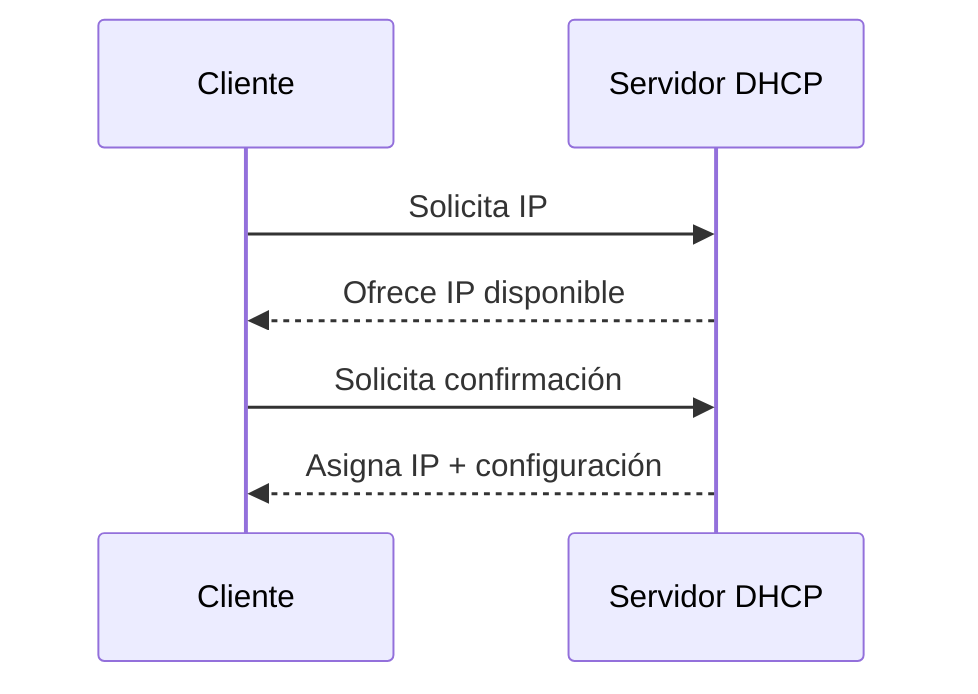
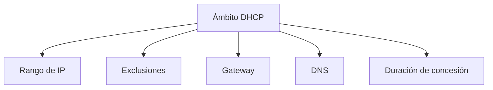
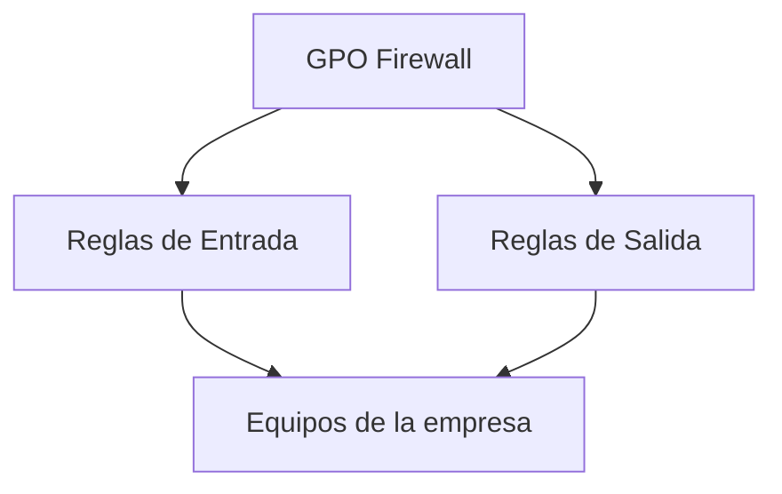
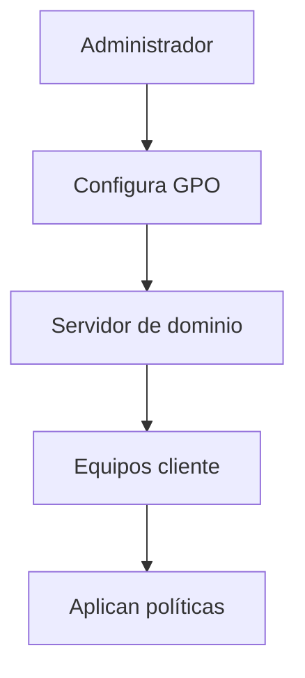

# 01.06 Infraestructura De Red De Windows Server

## 1. Introducción a la Infraestructura De Red Y Seguridad

### Definición

La **infraestructura de red** en Windows Server comprende los servicios y configuraciones que permiten la comunicación entre dispositivos dentro de una red.

La **seguridad** se refiere a los mecanismos que protegen los recursos, datos y accesos dentro de esa red.

### Relación Entre Ambos

- La infraestructura habilita la comunicación.
    
- La seguridad controla y protege dicha comunicación.

---

## 2. Servicios De Infraestructura De Red

### 2.1 DHCP (Dynamic Host Configuration Protocol)

### Definición

El **DHCP** es un servicio que asigna automáticamente direcciones IP a los dispositivos de una red.

### Relevancia

- Automatiza la configuración de red.
    
- Evita errores manuales.
    
- Facilita la administración en redes grandes.

---

### Funcionamiento De DHCP



---

### Configuración De Un Ámbito (Scope)

### Definición

Un **ámbito** es un rango de direcciones IP que el servidor DHCP puede asignar.

### Ejemplo De Configuración

|Parámetro|Ejemplo|
|---|---|
|Rango IP|172.18.0.10 - 172.18.1.10|
|Gateway|Dirección del router|
|DNS|Servidor de dominio|
|Dominio|miempresa.com|
|Duración (lease)|33 días|

---

### Components Del Ámbito



---

### Conceptos Clave

- **Exclusiones**: IPs reservadas que no se asignan automáticamente.
    
- **Reservas**: IPs asignadas permanentemente a dispositivos específicos.
    
- **Lease (concesión)**: Tiempo que una IP permanece asignada.

---

## 3. Otros Servicios De Red

|Servicio|Función|
|---|---|
|Remote Access|Acceso remoto a la red|
|Network Controller|Gestión centralizada de red|
|Network Policy Access Services (NPAS)|Control de acceso a la red|

---

## 4. Seguridad En Windows Server

### 4.1 Políticas De Contraseña (GPO)

### Definición

Configuraciones que controlan cómo deben set las contraseñas en un dominio.

### Ejemplo De Configuraciones

|Parámetro|Descripción|
|---|---|
|Longitud mínima|Número mínimo de caracteres|
|Complejidad|Uso de mayúsculas, minúsculas, números|
|Historial|Evita reutilizar contraseñas|
|Expiración|Tiempo de validez|

### Relevancia

- Protege contra ataques de fuerza bruta.
    
- Mejora la seguridad general del sistema.

---

## 5. Firewall En Windows

### Definición

El **firewall** es un sistema que controla el tráfico de red entrante y saliente.

### Tipos De Configuración

|Tipo|Descripción|
|---|---|
|Reglas de entrada|Controlan acceso hacia el equipo|
|Reglas de salida|Controlan tráfico que sale|

---

### Ejemplo De Regla

- Permitir tráfico TCP en puerto 3345
    
- Aplicado a toda la red

---

### Configuración Manual Vs Centralizada

|Método|Descripción|
|---|---|
|Local|Configurado en cada equipo|
|GPO|Configurado centralmente para toda la empresa|

---

### Firewall Mediante GPO



---

## 6. Aplicación De Políticas (GPO)

### Commando Importante

```bash
gpupdate /force
```

### Explicación Paso a Paso

1. Ejecuta actualización de políticas.
    
2. Fuerza la aplicación inmediata.
    
3. Aplica cambios sin reiniciar (en muchos casos).

---

### Flujo De Aplicación



---

## 7. Buenas Prácticas

- Usar DHCP para automatizar IPs.
    
- Definir rangos adecuados por departamento.
    
- Aplicar políticas de seguridad estrictas.
    
- Centralizar configuración con GPO.
    
- Evitar configuraciones manuales en muchos equipos.

---

## 8. Información Adicional

- DHCP reduce conflictos de IP.
    
- GPO permite escalar configuraciones a miles de equipos.
    
- Firewall centralizado mejora la seguridad empresarial.
    
- La segmentación por departamentos mejora el control de red.

---

## 9. Resumen De Puntos Clave

- DHCP automatiza la asignación de direcciones IP.
    
- Un ámbito define el rango de direcciones disponibles.
    
- Windows Server incluye múltiples servicios de red.
    
- Las políticas de contraseña mejoran la seguridad.
    
- El firewall controla el tráfico de red.
    
- Las GPO permiten aplicar configuraciones a toda la empresa.
    
- El commando `gpupdate /force` actualiza las políticas.

---

## MicroTest 1.6

1. El servicio que reparte direcciones IP en Windows server es:
    
    - La respuesta: b. Role DHCP.
        
    - Justifacion:  
        El servicio DHCP (Dynamic Host Configuration Protocol) es el encargado de asignar automáticamente direcciones IP a los dispositivos en la red, facilitando la administración y evitando configuraciones manuales.
        
2. ¿Qué fichero comprueba un Windows cliente antes de preguntar al DNS?
    
    - La respuesta: d. Hosts.
        
    - Justifacion:  
        El sistema operativo Windows consulta primero el archivo "hosts", que permite resolver nombres de dominio de forma local antes de realizar una consulta a un servidor DNS.
        
3. Las contraseñas débiles…:
    
    - La respuesta: b. Facilitan a los posibles atacantes el acceso a su servidor.
        
    - Justifacion:  
        Las contraseñas débiles son fáciles de descifrar mediante ataques como fuerza bruta o diccionario, lo que incrementa significativamente el riesgo de accesos no autorizados.