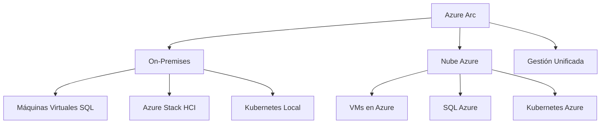
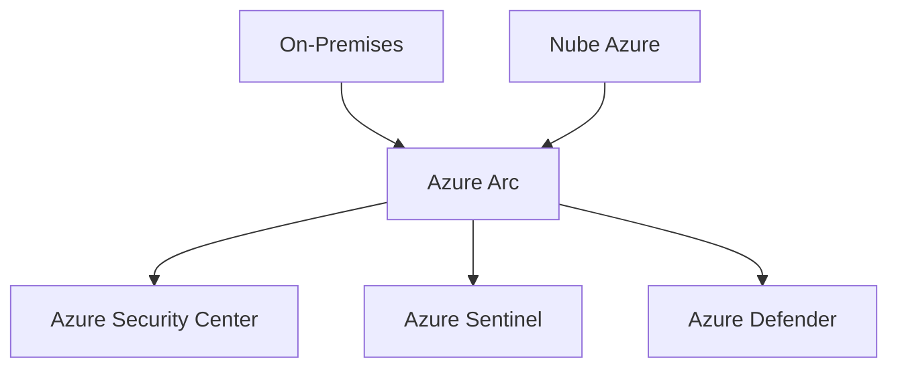
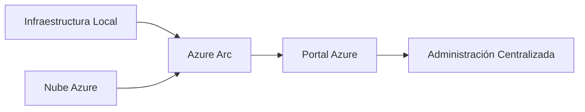

# 01.07 Entornos Híbridos

---

## 1. Concepto De Entornos Híbridos

### Definición

Un **entorno híbrido** es una arquitectura de TI donde la infraestructura se distribuye entre:

- **On-premises (local)**: Data center propio.
    
- **Nube pública**: Servicios en la nube como Microsoft Azure, AWS o Google Cloud.

### Relevancia

- Permite aprovechar lo mejor de ambos mundos:
    
    - Control y seguridad del entorno local.
        
    - Escalabilidad y flexibilidad de la nube.
        
- Es ampliamente utilizado en empresas modernas.

---

## 2. Components De Un Entorno Híbrido

### 2.1 Infraestructura On-Premises

Incluye:

- Máquinas virtuales (ej. SQL Server)
    
- Servidores físicos
    
- Infraestructura hiperconvergente (Azure Stack HCI)

### 2.2 Nube Pública (Azure)

Servicios disponibles:

- Máquinas virtuales
    
- Bases de datos (SQL en la nube)
    
- Contenedores (Kubernetes)
    
- Servicios de seguridad

---

## 3. Azure Arc: Gestión Unificada

### Definición

**Azure Arc** es un servicio que permite **gestionar recursos distribuidos (on-premises y nube)** desde un único punto: el portal de Azure.

### Funcionalidad Principal

- Conectar infraestructura local a Azure.
    
- Administrar recursos híbridos como si estuvieran en la nube.

---

## 4. Arquitectura Del Entorno Híbrido

### Explicación

- Azure Arc actúa como **capa central de control**.
    
- Permite administrar:
    
    - Recursos locales
        
    - Recursos en la nube
        
- Todo desde el portal de Azure.

---

## 5. Portal De Administración

### Acceso

- Portal web: `https://portal.azure.com`

### Funcionalidad

Desde este portal se puede gestionar:

- Kubernetes (local y nube)
    
- Bases de datos SQL
    
- Máquinas virtuales
    
- Seguridad

---

## 6. Contenedores Y Kubernetes

### Definición

**Kubernetes** es un sistema de orquestación de contenedores.

### Uso En Entornos Híbridos

- Puede ejecutarse:
    
    - En Azure
        
    - On-premises (Windows Server 2022)
        
- Administrado mediante Azure Arc

### Ventajas

- Portabilidad
    
- Escalabilidad
    
- Consistencia entre entornos

---

## 7. Seguridad En Entornos Híbridos

### 7.1 Azure Security Center

#### Definición

Servicio para gestionar la **seguridad de recursos**.

#### Función

- Monitoreo de seguridad
    
- Recomendaciones
    
- Protección contra amenazas

---

### 7.2 Azure Sentinel

#### Definición

Sistema **SIEM (Security Information and Event Management)**.

#### Función

- Recolección de eventos
    
- Análisis de seguridad
    
- Detección de amenazas

---

### 7.3 Azure Defender

#### Definición

Conjunto de herramientas de protección avanzada.

#### Función

- Protección de cargas de trabajo
    
- Seguridad en tiempo real

---

## 8. Integración De Seguridad

### Explicación

- Todos los servicios de seguridad se integran mediante Azure Arc.
    
- Se obtiene una **visión unificada de la seguridad**.

---

## 9. Flujo De Gestión

---

## 10. Ventajas De Los Entornos Híbridos

|Ventaja|Descripción|
|---|---|
|Flexibilidad|Uso combinado de nube y local|
|Escalabilidad|Crecimiento bajo demanda|
|Control|Datos sensibles en local|
|Gestión centralizada|Gracias a Azure Arc|
|Seguridad integrada|Servicios unificados|

---

## 11. Información Adicional

- Azure Arc es clave para estrategias modernas de IT.
    
- Permite transición gradual a la nube.
    
- Compatible con múltiples tecnologías (no solo Microsoft).

---

## 12. Resumen De Puntos Clave

- Un entorno híbrido combina infraestructura local y nube.
    
- Azure Arc permite gestionar ambos entornos desde un solo punto.
    
- Kubernetes puede ejecutarse tanto en local como en la nube.
    
- La seguridad se centraliza mediante:
    
    - Azure Security Center
        
    - Azure Sentinel
        
    - Azure Defender
        
- El portal de Azure es la interfaz principal de administración.
    
- Los entornos híbridos ofrecen flexibilidad, escalabilidad y control.

## MicroTest 1.7

1. La herramienta de Microsoft para redes híbridas es:
    
    - La respuesta: b. Azure Arc.
        
    - Justificación: Azure Arc es el servicio diseñado específicamente para gestionar entornos híbridos, permitiendo integrar y administrar recursos tanto en on-premises como en la nube desde una única plataforma.
        
2. ¿Qué herramienta de Windows Server gestiona Azure Arc?
    
    - La respuesta: d. Windows Admin Center.
        
    - Justificación: Windows Admin Center es la herramienta de administración de Windows Server que permite integrar y gestionar recursos mediante Azure Arc, facilitando la conexión entre infraestructura local y Azure.
        
3. Azure Arc es un servicio que proporciona un conjunto de tecnologías para organizaciones que quieren simplificar…:
    
    - La respuesta: c. Sus entornos híbridos.
        
    - Justificación: Azure Arc está diseñado para simplificar la gestión de entornos híbridos, unificando la administración de recursos locales y en la nube bajo un mismo control.