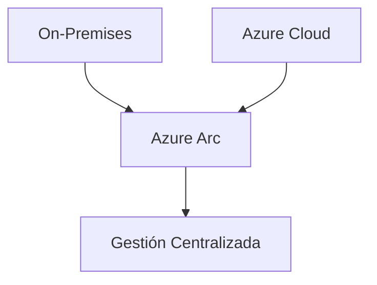

# 01.08 Resumen De Tema 1

---

## 1. Introducción Al Tema

Este tema abarca una visión general de **Windows Server 2022**, incluyendo:

- Instalación del sistema
    
- Configuración de servicios clave
    
- Administración de infraestructura
    
- Seguridad
    
- Integración con la nube (Azure)
    
- Entornos híbridos

---

## 2. Ediciones De Windows Server

### 2.1 Versiones Principales

|Edición|Características|
|---|---|
|Standard|Limitada en virtualización (hasta 2 máquinas virtuales)|
|Datacenter|Virtualización ilimitada, orientada a grandes empresas|

### 2.2 Diferencias Clave

- **Licenciamiento**:
    
    - Standard: más económico, ideal para pequeñas empresas
        
    - Datacenter: licenciamiento por cores, mayor escalabilidad

---

## 3. Instalación Del Sistema

### Opciones De Instalación

|Tipo|Descripción|
|---|---|
|Con interfaz gráfica (GUI)|Más fácil de administrar|
|Server Core (sin GUI)|Más seguro, menor superficie de ataque|

### Relevancia

- Server Core reduce vulnerabilidades al eliminar components innecesarios.
    
- GUI facilita tareas administrativas.

---

## 4. Active Directory (Directorio Activo)

### Definición

Sistema de gestión de identidades y recursos en una red.

### Components Clave

- Dominio
    
- Bosque
    
- Usuarios
    
- Grupos

### Funcionalidad

- Autenticación centralizada
    
- Administración de permisos
    
- Organización de recursos

---

## 5. Directivas De Grupo (GPO)

### Definición

Herramienta para aplicar configuraciones a usuarios y equipos.

### Aplicación

- A nivel de usuario
    
- A nivel de máquina
    
- A través de Unidades Organizativas (OU)

### Ejemplos De Uso

- Políticas de contraseñas
    
- Configuración de firewall
    
- Restricciones del sistema

---

## 6. Seguridad En Windows Server

### Elementos Clave

- Políticas de contraseñas seguras
    
- Antivirus
    
- Configuración de puertos
    
- Firewall avanzado

### Herramientas

- Surface Analyzer (monitoreo y análisis)

---

## 7. Roles De Windows Server

### Definición

Los **roles** son funcionalidades que se agregan al servidor para cumplir tareas específicas.

### Tipos Principales

|Rol|Función|
|---|---|
|Active Directory|Gestión de usuarios y autenticación|
|DHCP|Asignación automática de direcciones IP|
|IIS|Servidor web|
|File Server|Gestión de archivos|

---

## 8. Servidor Web (IIS)

### Definición

Internet Information Services (IIS) es el servidor web de Microsoft.

### Funcionalidad

- Publicar sitios web
    
- Gestión de aplicaciones web

### Ejemplo

- Implementación de una página web simulando Netflix

---

## 9. Sistema De Archivos

### Tipos

- NTFS (tradicional)
    
- ReFS (Resilient File System)

### ReFS

- Mayor resiliencia
    
- Mejor manejo de grandes volúmenes de datos

---

## 10. DHCP (Dynamic Host Configuration Protocol)

### Definición

Servicio que asigna automáticamente direcciones IP.

### Configuración

- Ámbito (range de IPs)
    
- Gateway
    
- DNS

### Funcionamiento

---

## 11. Entornos Híbridos

### Definición

Infraestructura que combina:

- Data center local
    
- Nube (Azure)

### Herramienta Clave

- **Azure Arc**: gestión centralizada de recursos híbridos

---

## 12. Integración Con Azure

### Características

- Conexión con servicios cloud
    
- Gestión unificada
    
- Escalabilidad

### Ejemplo De Arquitectura

---

## 13. Información Adicional

- Azure ofrece más de 300 servicios.
    
- Azure Arc permite administrar:
    
    - Máquinas virtuales
        
    - Kubernetes
        
    - Bases de datos
        
- Importante en estrategias de transformación digital.

---

## 14. Resumen De Puntos Clave

- Windows Server 2022 tiene dos ediciones principales: Standard y Datacenter.
    
- Active Directory es esencial para la gestión de usuarios y recursos.
    
- Las GPO permiten control centralizado de configuraciones.
    
- Los roles amplían las funcionalidades del servidor.
    
- DHCP automatiza la asignación de IPs.
    
- IIS permite alojar aplicaciones web.
    
- ReFS es un sistema de archivos moderno y resiliente.
    
- Los entornos híbridos combinan infraestructura local y nube.
    
- Azure Arc permite gestionar todo desde un único punto.

