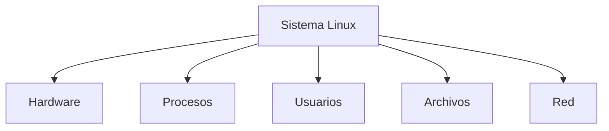
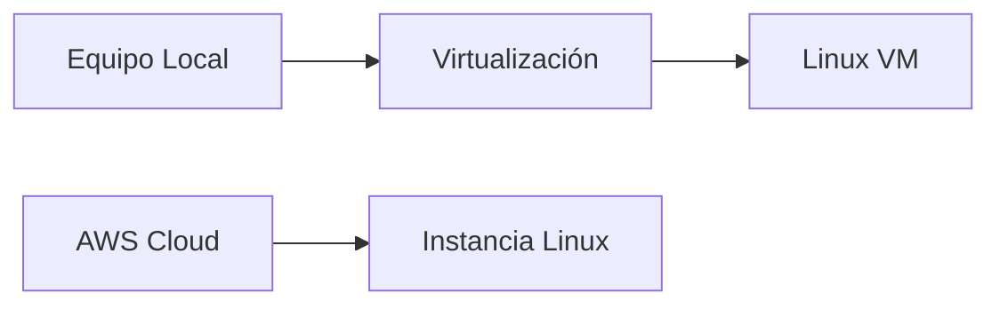

# 02.01 Introducción

---

## 1. Contexto Del Tema

Este capítulo introduce la administración de sistemas basados en **Linux**, enfocándose en:

- Conceptos fundamentales del sistema operativo
    
- Herramientas de administración
    
- Uso práctico en entornos profesionales

---

## 2. Linux Vs GNU/Linux

### 2.1 Definición

|Concepto|Descripción|
|---|---|
|Linux|Núcleo (kernel) del sistema operativo|
|GNU|Conjunto de herramientas y utilidades libres|
|GNU/Linux|Sistema operativo completo (kernel + herramientas)|

### 2.2 Origen

- **Richard Stallman**:
    
    - Fundador del proyecto GNU
        
    - Promotor del software libre
        
- **Linus Torvalds**:
    
    - Creador del kernel Linux en los años 90

### 2.3 Diferencia Clave

- **Libre ≠ Gratuito**
    
    - Libre: permite modificar y distribuir el código
        
    - Gratuito: no tiene costo

---

## 3. Distribuciones De Linux

### Definición

Una **distribución (distro)** es una versión de Linux que incluye:

- Kernel Linux
    
- Herramientas GNU
    
- Software adicional

### Distribuciones Mencionadas

|Distribución|Características|
|---|---|
|Rocky Linux|Similar a Red Hat, orientada a servidores|
|Ubuntu|Popular, fácil de usar|
|Debian|Estable y robusta|
|Fedora|Innovadora, base de Red Hat|
|SUSE Enterprise|Empresarial|

### Relevancia

- Permiten adaptar Linux a distintos entornos:
    
    - Servidores
        
    - Escritorios
        
    - Nube

---

## 4. Objetivos Del Curso

### Objetivos Principales

1. Desarrollar habilidades de administración en Linux
    
2. Manejar tareas esenciales de un administrador de sistemas

### Áreas De Aprendizaje

- Gestión de hardware
    
- Monitorización de rendimiento
    
- Administración de usuarios y grupos
    
- Manejo del sistema de archivos
    
- Redes y seguridad
    
- Uso de commandos en terminal (Shell)

---

## 5. Administración Del Sistema

### 5.1 Components Clave

|Área|Función|
|---|---|
|Hardware|Monitoreo y control de recursos|
|Procesos|Gestión de ejecución de programas|
|Usuarios|Control de acceso|
|Archivos|Organización y permisos|
|Red|Configuración de conectividad|

---

### 5.2 Relación Entre Components

---

## 6. Commandos Y Administración

### Tipos De Commandos a Estudiar

- Commandos de sistema
    
- Commandos de red
    
- Commandos de archivos
    
- Commandos de usuarios
    
- Commandos de procesos

### Importancia

- Base para la administración eficiente
    
- Permiten automatización y control avanzado

---

## 7. Instalación De Software

### Ejemplos

- Instalación de bases de datos (MySQL)
    
- Instalación de aplicaciones básicas

### Relevancia

- Permite ampliar funcionalidades del sistema
    
- Fundamental en entornos productivos

---

## 8. Virtualización Y Entornos De Práctica

### Opciones De Virtualización

|Herramienta|Descripción|
|---|---|
|Hyper-V|Virtualización en Windows|
|VirtualBox|Multiplataforma|
|VMware|Solución professional|

### Alternativa En la Nube

- **AWS Academy**
    
    - Acceso a servicios de Amazon Web Services
        
    - Creación de máquinas virtuales en la nube

---

### Arquitectura De Práctica

---

## 9. Documentación Official

### Fuentes

- Documentación official de Linux
    
- Recursos en línea (múltiples fuentes)

### Relevancia

- Linux tiene una comunidad extensa
    
- Gran disponibilidad de documentación

---

## 10. Información Adicional

- Linux domina en:
    
    - Servidores
        
    - Cloud computing
        
    - DevOps
        
- Es altamente personalizable
    
- Amplio uso en empresas tecnológicas

---

## 11. Resumen De Puntos Clave

- Linux es el kernel; GNU/Linux es el sistema completo.
    
- El software libre permite modificar y distribuir el código.
    
- Existen múltiples distribuciones adaptadas a diferentes necesidades.
    
- La administración de Linux incluye usuarios, procesos, archivos y red.
    
- Los commandos de terminal son fundamentales.
    
- La virtualización permite practicar sin afectar sistemas reales.
    
- AWS ofrece entornos en la nube para pruebas.
    
- Linux es clave en entornos profesionales y cloud.

---

