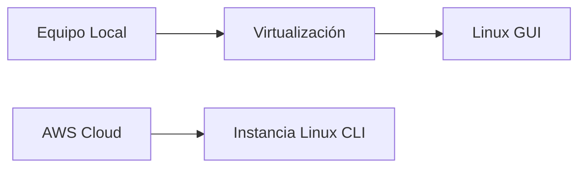
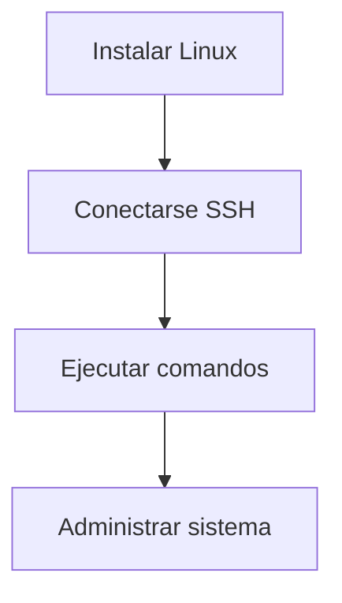

# 02.02 Introducción Y Gestión De Entornos Linux Por Línea De Commando

---

## 1. Introducción a la Gestión En Linux

### Concepto General

La administración de sistemas Linux puede realizarse mediante:

- **Interfaz gráfica (GUI)**
    
- **Línea de commandos (CLI - Command Line Interface)**

### Relevancia

- La **línea de commandos** es fundamental en entornos profesionales.
    
- En servidores (especialmente en la nube), normalmente **no se usa GUI** por:
    
    - Seguridad
        
    - Rendimiento
        
    - Menor consumo de recursos

---

## 2. Entornos De Trabajo

### 2.1 Entorno En la Nube (AWS Academy)

#### Definición

Plataforma que permite crear máquinas virtuales en la nube.

#### Características

- Creación rápida de instancias Linux
    
- Uso de servicios como EC2
    
- Recursos típicos:
    
    - CPU
        
    - RAM
        
    - Disco (ej. 8GB)
        
- Acceso remoto mediante SSH

---

### 2.2 Entorno Virtualizado Local

#### Herramientas

|Herramienta|Descripción|
|---|---|
|Hyper-V|Virtualización en Windows|
|VirtualBox|Alternativa multiplataforma|
|VMware|Solución professional|

#### Proceso General

1. Crear máquina virtual
    
2. Cargar imagen ISO (ej. Rocky Linux)
    
3. Configurar recursos (CPU, RAM, disco)
    
4. Instalar sistema operativo

---

### Arquitectura De Entornos



---

## 3. Distribuciones Utilizadas

### Ejemplos

|Distribución|Uso|
|---|---|
|Ubuntu|Muy usada en nube|
|Rocky Linux|Alternativa empresarial basada en Red Hat|
|Fedora|Innovación|
|Debian|Estabilidad|

---

## 4. Interfaces En Linux

### 4.1 Interfaz Gráfica (GUI)

- Similar a Windows
    
- Permite:
    
    - Navegación de archivos
        
    - Configuración del sistema
        
    - Uso de aplicaciones (ej. Firefox)

### 4.2 Línea De Commandos (CLI)

- Interacción mediante terminal
    
- Uso de commandos para:
    
    - Navegación
        
    - Configuración
        
    - Administración

---

## 5. Conexión a Sistemas Linux

### Métodos

|Método|Descripción|
|---|---|
|SSH|Conexión remota segura|
|Consola web (AWS)|Acceso directo desde navegador|

### Relevancia

- SSH es el estándar en administración remota
    
- Permite control total del sistema

---

## 6. Commandos Básicos En Linux

### 6.1 Navegación Y Sistema

```bash
ls
pwd
```

#### Explicación Paso a Paso

- `ls`: lista archivos y directorios
    
- `pwd`: muestra la ruta actual (directorio de trabajo)

---

### 6.2 Conectividad

```bash
ping google.com
```

#### Explicación

1. Envía paquetes a un servidor
    
2. Verifica conectividad de red
    
3. Muestra latencia y respuesta

---

### 6.3 Navegación Web En Terminal

```bash
curl google.com
```

#### Explicación

1. Realiza una solicitud HTTP
    
2. Devuelve el contenido HTML de la página
    
3. Útil para pruebas y automatización

---

### 6.4 Identificación Del Sistema

```bash
cat /etc/os-release
```

#### Explicación

1. Accede a archivo del sistema
    
2. Muestra información del sistema operativo
    
3. Permite identificar la distribución (ej. Ubuntu)

---

## 7. Gestión De Paquetes

### 7.1 APT (Ubuntu/Debian)

```bash
apt install tree
```

### 7.2 SNAP

```bash
snap install tree
```

### Explicación

1. Se utilize un gestor de paquetes
    
2. Descarga software desde repositorios
    
3. Instala automáticamente dependencias

---

### Comparación

|Gestor|Características|
|---|---|
|APT|Tradicional en Debian/Ubuntu|
|SNAP|Paquetes universales|

---

## 8. Seguridad En Linux

### Prácticas Comunes

- Uso de CLI en servidores
    
- Eliminación de GUI
    
- Conexión segura (SSH)

### Relevancia

- Reduce superficie de ataque
    
- Mejora rendimiento

---

## 9. Flujo De Uso En Linux



---

## 10. Información Adicional

- Linux en la nube suele ejecutarse sin entorno gráfico.
    
- La CLI permite automatización mediante scripts.
    
- Conocer commandos es esencial para DevOps y administración.

---

## 11. Resumen De Puntos Clave

- Linux puede administrarse mediante GUI o CLI.
    
- En entornos profesionales se prioriza la línea de commandos.
    
- AWS permite crear instancias Linux rápidamente.
    
- La virtualización local facilita el aprendizaje.
    
- SSH es el método principal de conexión remota.
    
- Commandos básicos permiten navegar, verificar red y administrar el sistema.
    
- Los gestores de paquetes facilitan la instalación de software.
    
- La seguridad mejora al evitar interfaces gráficas en servidores.

---

## MicroTest 2.1

1. Linux es software de…:
    
    - La respuesta: b. Código abierto.
        
    - Justificación: Linux es un sistema operativo de código abierto, lo que significa que su código fuente puede set estudiado, modificado y distribuido libremente por cualquier usuario, siguiendo los principios del software libre.
        
2. Cuando una shell se usa de manera interactiva muestra una cadena cuando espera un commando del usuario. Esto recibe el nombre de…:
    
    - La respuesta: d. Prompt de shell.
        
    - Justificación: El prompt de shell es el indicador que aparece en la terminal cuando el sistema está listo para recibir commandos del usuario, señalando que la shell está en modo interactivo.
        
3. El directorio / en Linux es el…:
    
    - La respuesta: c. Directorio raíz.
        
    - Justificación: En Linux, el directorio "/" representa la raíz del sistema de archivos, desde donde se organizan y cuelgan todos los demás directorios y archivos del sistema.