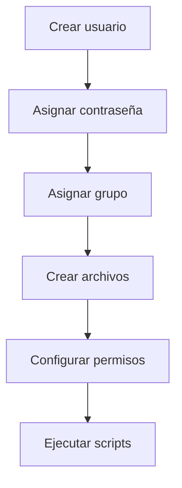

# 02.03 Gestión De Usuarios Linux

---

## 1. Introducción a la Gestión De Usuarios

### Definición

La **gestión de usuarios en Linux** consiste en crear, modificar y eliminar cuentas, así como asignar permisos y grupos.

### Relevancia

- Control de acceso al sistema
    
- Seguridad
    
- Administración multiusuario

---

## 2. Identificación De Usuarios

### 2.1 UID (User ID)

- Identificador único de cada usuario
    
- Ejemplo: UID 1000 (primer usuario creado)

### 2.2 Grupos

- Conjunto de usuarios con permisos compartidos
    
- Ejemplo: grupo `sudo` → privilegios administrativos

---

### Consulta De Usuario Actual

```bash
id
```

#### Explicación

1. Muestra UID del usuario
    
2. Lista los grupos a los que pertenece
    
3. Permite verificar privilegios

---

## 3. Monitoreo De Usuarios

### Commandos

```bash
who
last
```

### Funcionalidad

|Commando|Descripción|
|---|---|
|who|Usuarios conectados actualmente|
|last|Historial de inicios de sesión|

---

## 4. Creación Y Gestión De Usuarios

### 4.1 Crear Usuario

```bash
sudo useradd santos
```

#### Explicación

1. `sudo`: eleva privilegios
    
2. `useradd`: crea nuevo usuario
    
3. `santos`: nombre del usuario
    
4. Se crea automáticamente su directorio en `/home`

---

### 4.2 Asignar Contraseña

```bash
sudo passwd santos
```

#### Explicación

- Permite definir contraseña para autenticación

---

### 4.3 Cambiar De Usuario

```bash
su santos
```

#### Explicación

- Cambia al usuario especificado
    
- Require contraseña

---

### 4.4 Eliminar Usuario

```bash
sudo userdel santos
```

#### Explicación

- Elimina la cuenta del sistema

---

## 5. Gestión De Grupos

### 5.1 Crear Grupo

```bash
sudo groupadd test
```

### 5.2 Agregar Usuario a Grupo

```bash
sudo usermod -aG test santos
```

#### Explicación

1. `usermod`: modifica usuario
    
2. `-aG`: añade a grupo sin eliminar otros
    
3. Permite gestionar permisos colectivos

---

## 6. Sistema De Permisos En Linux

### 6.1 Visualización De Permisos

```bash
ls -la
```

#### Explicación

- Muestra archivos ocultos
    
- Visualiza permisos, propietario y grupo

---

### 6.2 Estructura De Permisos

|Tipo|Descripción|
|---|---|
|r|Lectura|
|w|Escritura|
|x|Ejecución|

---

### Representación

```text
-rwxrwxrwx
```

- Usuario | Grupo | Otros

---

## 7. Modificación De Permisos

### 7.1 Commando Chmod

```bash
sudo chmod 777 demo.txt
```

#### Explicación

1. 7 = lectura (4) + escritura (2) + ejecución (1)
    
2. Aplica a:
    
    - Usuario
        
    - Grupo
        
    - Otros
        
3. Permisos máximos (poco seguros en producción)

---

### Ejemplo Seguro

```bash
sudo chmod 700 script.sh
```

- Solo el propietario tiene permisos completos

---

## 8. Creación De Archivos

```bash
touch demo.txt
```

### Explicación

- Crea un archivo vacío
    
- Útil para pruebas

---

## 9. Creación Y Ejecución De Scripts

### 9.1 Crear Script

```bash
nano mi_script.sh
```

### Contenido Del Script

```bash
#!/bin/bash
VARIABLE="Hola mundo"
echo $VARIABLE
```

---

### Explicación Paso a Paso

1. `#!/bin/bash`:
    
    - Define el intérprete del script
        
2. `VARIABLE="Hola mundo"`:
    
    - Declara variable
        
3. `echo $VARIABLE`:
    
    - Imprime el valor

---

### 9.2 Asignar Permisos De Ejecución

```bash
chmod 700 mi_script.sh
```

---

### 9.3 Ejecutar Script

```bash
./mi_script.sh
```

---

## 10. Flujo De Gestión De Usuarios Y Permisos



---

## 11. Buenas Prácticas

- Evitar permisos 777 en producción
    
- Usar grupos para gestión de acceso
    
- Asignar privilegios mínimos necesarios
    
- Usar `sudo` solo cuando sea necesario

---

## 12. Información Adicional

- Linux es multiusuario por diseño
    
- Los permisos son base de la seguridad
    
- Scripts permiten automatización

---

## 13. Resumen De Puntos Clave

- Los usuarios tienen identificadores únicos (UID)
    
- Los grupos permiten gestionar permisos de forma colectiva
    
- `sudo` permite ejecutar commandos como administrador
    
- `chmod` controla permisos de archivos
    
- `useradd`, `usermod`, `userdel` gestionan usuarios
    
- Los scripts permiten automatizar tareas
    
- La seguridad depende de una correcta gestión de permisos

---

## MicroTest 2.2

1. Las cuentas de usuario son fundamentales para la…:
    
    - La respuesta: b. Seguridad del sistema.
        
    - Justificación: Las cuentas de usuario permiten controlar el acceso al sistema, definir permisos y restringir acciones, lo cual es esencial para mantener la seguridad y evitar accesos no autorizados.
        
2. Cada línea del archivo /etc/passwd:
    
    - La respuesta: d. Contiene información sobre un usuario.
        
    - Justificación: El archivo `/etc/passwd` almacena información básica de cada usuario (nombre, UID, directorio home, shell, etc.), pero no contiene las contraseñas, ya que estas se guardan de forma segura en `/etc/shadow`.
        
3. La opción -l del commando ls muestra información:
    
    - La respuesta: c. Detallada sobre permisos y propiedad.
        
    - Justificación: La opción `-l` (long listing) del commando `ls` muestra información detallada de archivos y directorios, incluyendo permisos, propietario, grupo, tamaño y fecha de modificación.