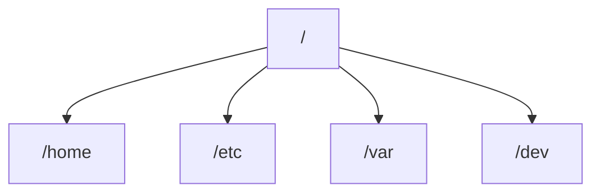
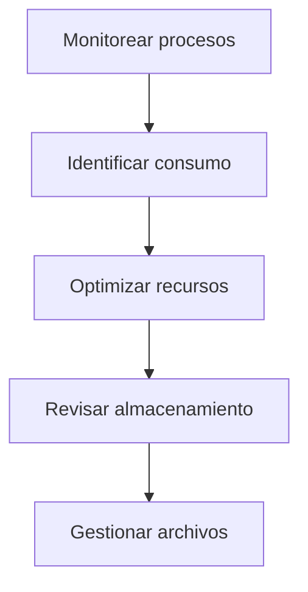

# 02.04 Procesos Y Almacenamiento En Linux

---

## 1. Introducción

Este tema aborda dos components fundamentales en Linux:

- **Procesos**: ejecución de programas en el sistema
    
- **Almacenamiento**: gestión de discos y uso del espacio

### Relevancia

- Permiten monitorear el rendimiento del sistema
    
- Son clave en administración y diagnóstico

---

## 2. Gestión De Procesos

### 2.1 Definición

Un **proceso** es un programa en ejecución que consume recursos como:

- CPU
    
- Memoria
    
- Entrada/Salida

---

### 2.2 Commando `top`

```bash
top
```

#### Explicación Paso a Paso

1. Muestra procesos activos en tiempo real
    
2. Indica uso de CPU y memoria
    
3. Permite identificar procesos que consumen recursos

---

### 2.3 Commando `htop`

```bash
htop
```

#### Características

- Interfaz más visual que `top`
    
- Permite:
    
    - Navegar con teclado
        
    - Matar procesos (kill)
        
    - Ver uso de recursos gráficamente

---

### Comparación

|Commando|Característica|
|---|---|
|top|Básico, preinstalado|
|htop|Visual, más interactivo|

---

### 2.4 Generación De Carga (estrés)

```bash
sudo apt update
sudo apt upgrade -y
sudo apt install stress
```

#### Explicación

1. `update`: actualiza repositorios
    
2. `upgrade`: actualiza paquetes
    
3. `install stress`: instala herramienta para generar carga

---

## 3. Monitoreo Del Sistema

### 3.1 Memoria

```bash
free -h
```

- Muestra memoria:
    
    - Total
        
    - Usada
        
    - Libre

---

### 3.2 Logs Del Sistema

```bash
dmesg
```

- Muestra mensajes del sistema
    
- Útil para detectar errores

---

### 3.3 Archivos Abiertos

```bash
lsof
```

- Lista archivos abiertos por procesos

---

### 3.4 Tráfico De Red

```bash
tcpdump
```

- Analiza paquetes de red
    
- Permite detectar actividad sospechosa

---

## 4. Almacenamiento En Linux

### 4.1 Uso Del Disco

```bash
df -h
```

#### Explicación

1. Muestra espacio total y disponible
    
2. `-h`: formato legible (GB/MB)

---

### 4.2 Uso Por Directorio

```bash
du -h
```

#### Explicación

- Muestra espacio utilizado por archivos y carpetas

---

### Comparación

|Commando|Uso|
|---|---|
|df|Espacio total del sistema|
|du|Uso por archivo/directorio|

---

## 5. Dispositivos De Almacenamiento

### 5.1 Listado De Discos

```bash
lsblk
```

#### Explicación

- Lista dispositivos de bloques (discos, particiones)

---

### Ejemplo De Salida

|Dispositivo|Tamaño|Tipo|
|---|---|---|
|xvda|8GB|Disco principal|
|loop|Virtual|Sistema|

---

### 5.2 Particiones

```bash
fdisk -l
```

- Muestra particiones del sistema

---

## 6. Sistema De Archivos

### Estructura Básica



---

## 7. Gestión De Archivos

### Crear Directorio

```bash
mkdir ejemplos
```

---

### Copiar Archivo

```bash
cp archivo.txt ejemplos/
```

---

### Eliminar Archivo

```bash
rm archivo.txt
```

---

## 8. Flujo De Administración



---

## 9. Buenas Prácticas

- Ejecutar siempre:
    
    - `apt update`
        
    - `apt upgrade`
        
- Monitorear procesos regularmente
    
- Evitar saturación de disco
    
- Revisar logs del sistema

---

## 10. Información Adicional

- Linux usa dispositivos de bloque para discos
    
- Los sistemas en nube suelen tener discos virtuales
    
- Herramientas como `htop` facilitan la administración

---

## 11. Resumen De Puntos Clave

- Los procesos representan programas en ejecución
    
- `top` y `htop` permiten monitorear recursos
    
- `df` y `du` gestionan el almacenamiento
    
- `lsblk` muestra discos y particiones
    
- Es importante actualizar el sistema antes de instalar paquetes
    
- El monitoreo constante mejora el rendimiento y seguridad

---

## MicroTest 2.3

1. El entorno de un proceso incluye lo siguiente:
    
    - La respuesta: b. Variables locales y globales.
        
    - Justificación: El entorno de un proceso está compuesto por variables de entorno (locales y globales) que influyen en su ejecución, como rutas, configuraciones y parámetros definidos para ese proceso.
        
2. El commando ps se usa para elaborar:
    
    - La respuesta: d. Una lista de los procesos actuales.
        
    - Justificación: El commando `ps` muestra información sobre los procesos en ejecución en el sistema, permitiendo ver su estado, identificador (PID) y recursos utilizados.
        
3. El programa top es una vista dinámica:
    
    - La respuesta: c. De los procesos del sistema.
        
    - Justificación: `top` proporciona una visualización en tiempo real de los procesos del sistema, mostrando el uso de CPU, memoria y otros recursos de manera dinámica.

## **Saber más**

---

****Procesos****

Guía Ubuntu. (2007, noviembre 24). _Procesos._ [https://www.guia-ubuntu.com/index.php/Procesos](https://www.guia-ubuntu.com/index.php/Procesos)

El programa top es una vista dinámica de los procesos del sistema que muestra un encabezado del resumen seguido de un proceso o lista de subprocesos similares a la información de ps. A diferencia de la salida de ps estática, top continuamente se actualiza a un intervalo configurable y ofrece capacidades de reorganización, ordenado y resaltado de columnas. Las configuraciones del usuario se pueden guardar y hacer persistentes.