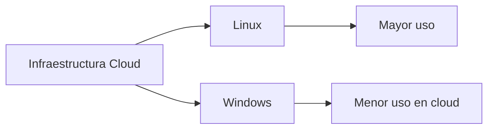
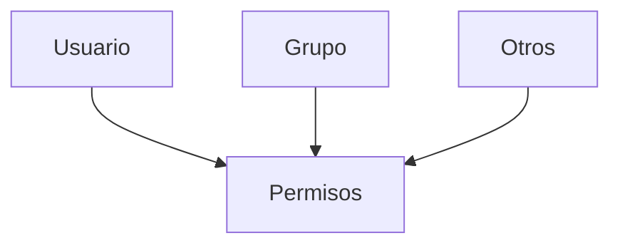

# 02.07 Resumen De Tema 2

## 1. Introducción a Linux (GNU/Linux)

### Definición

Linux (más correctamente GNU/Linux) es un sistema operativo **de código abierto**, ampliamente utilizado en servidores, especialmente en entornos empresariales y en la nube.

### Conceptos Clave

|Concepto|Definición|Importancia|
|---|---|---|
|Código abierto|Permite modificar y distribuir el software|Flexibilidad y transparencia|
|Código libre|Libertad de uso, estudio y modificación|Filosofía del software|
|Distribución|Variante de Linux (Ubuntu, Fedora, Rocky)|Adaptación a diferentes necesidades|

### Distribuciones Mencionadas

- Ubuntu
    
- Fedora
    
- Rocky Linux

---

## 2. Uso De Linux En Entornos Empresariales

### Contexto

- Linux y Windows dominan los sistemas en **datacenters**.
    
- Linux es preferido en la nube por:
    
    - Mayor eficiencia
        
    - Menor consumo de recursos
        
    - Rapidez de despliegue

### Relación Con la Nube

---

## 3. Línea De Commandos (CLI)

### Definición

La CLI (Command Line Interface) permite interactuar con el sistema mediante commandos.

### Elementos Clave

- Shell (bash)
    
- Prompt
    
- Commandos del sistema

### Importancia

- Control total del sistema
    
- Automatización de tareas
    
- Uso intensivo en servidores

---

## 4. Administración De Archivos Y Directorios

### Conceptos

- Rutas absolutas: comienzan desde `/`
    
- Rutas relativas: dependen del directorio actual

### Herramientas

|Commando|Función|
|---|---|
|`ls`|Listar archivos|
|`cd`|Cambiar directorio|
|`cp`|Copiar|
|`mv`|Mover|
|`rm`|Eliminar|

### Editores

- `vim`: avanzado
    
- `nano`: básico

---

## 5. Usuarios, Grupos Y Permisos

### Definición

Sistema de control de acceso que regula quién puede:

- Leer
    
- Escribir
    
- Ejecutar

### Ejemplo Conceptual

### Importancia

- Seguridad del sistema
    
- Control de acceso a recursos

---

## 6. Procesos Y Monitorización

### Conceptos

Un proceso es un programa en ejecución.

### Herramientas Principales

|Commando|Función|
|---|---|
|`top`|Monitorización en tiempo real|
|`htop`|Versión visual mejorada|
|`ps`|Lista de procesos|

### Acciones

- Ver procesos
    
- Matar procesos
    
- Analizar rendimiento

---

## 7. Logs Y Monitorización Del Sistema

### Definición

Los logs registran eventos del sistema.

### Uso

- Diagnóstico de errores
    
- Auditoría
    
- Seguridad

### Ubicación Típica

- `/var/log`

---

## 8. Administración De Redes

### Funcionalidades

|Acción|Herramienta|
|---|---|
|Ver conectividad|`ping`|
|Rutas|`traceroute`|
|DNS|`dig`, `nslookup`|
|Interfaces|`ifconfig`, `ip`|

### Objetivo

- Diagnóstico de red
    
- Configuración de interfaces
    
- Resolución de problemas

---

## 9. Almacenamiento Y Sistema De Archivos

### Conceptos Clave

|Elemento|Descripción|
|---|---|
|Particiones|División lógica del disco|
|Montaje|Asociación de disco a sistema|
|Volúmenes|Gestión avanzada de almacenamiento|

### Commandos Relevantes

|Commando|Función|
|---|---|
|`df`|Espacio en disco|
|`du`|Uso de directorios|
|`lsblk`|Dispositivos de bloque|

---

## 10. Transferencia Y Compresión De Archivos

### Funcionalidades

- Copiar archivos
    
- Transferir entre sistemas
    
- Comprimir datos

### Herramientas

|Commando|Uso|
|---|---|
|`tar`|Empaquetar archivos|
|`scp`|Copia remota|
|`sftp`|Transferencia segura|

---

## 11. Relación Con Futuros Temas

- Linux será usado en:
    
    - Despliegues en la nube
        
    - Arquitecturas distribuidas
        
    - Automatización de sistemas
        
- Se aplicarán commandos en:
    
    - AWS
        
    - Infraestructura cloud

---

## 12. Información Adicional

- Linux domina entornos cloud (AWS, Azure, GCP)
    
- La documentación official (linux.org) es clave
    
- La práctica constante es esencial para dominar commandos

---

## 13. Resumen De Puntos Clave

- Linux es fundamental en entornos empresariales y cloud.
    
- Existen múltiples distribuciones adaptadas a distintos usos.
    
- La línea de commandos es esencial para administración.
    
- Los permisos garantizan la seguridad del sistema.
    
- Los procesos permiten gestionar el rendimiento.
    
- Las redes y almacenamiento son pilares de la administración.
    
- Se require práctica constante para dominar el sistema.
    
- Linux será clave en temas avanzados de nube.

