# AWS Security Best Practices and Shared Responsibility Model

## 1. AWS Shared Responsibility Model

### Definition

The AWS Shared Responsibility Model defines which security responsibilities belong to AWS and which belong to the customer.

|AWS Responsibility (Security OF the Cloud)|Customer Responsibility (Security IN the Cloud)|
|---|---|
|Global AWS infrastructure|User accounts and credentials|
|Physical data centers|Guest operating system configuration|
|Physical networking|Application security|
|Hypervisor layer|Security group configuration|
|Physical servers and storage|Data protection and encryption settings|
|Availability of AWS services|Access management and permissions|

### Example Architecture

A company uses:

- Amazon S3 for file storage
    
- Amazon EC2 for web servers
    
- Amazon RDS (MySQL) for database storage
    
- Amazon VPC for network isolation

#### AWS Responsibilities

AWS secures:

- Physical servers
    
- Storage hardware
    
- Data centers
    
- Network infrastructure
    
- Hypervisor layer

#### Customer Responsibilities

The customer secures:

- Linux/Windows updates and patches
    
- Installed applications
    
- Security groups
    
- RDS access rules
    
- S3 bucket permissions
    
- Encryption configurations

### Shared Responsibility Diagram

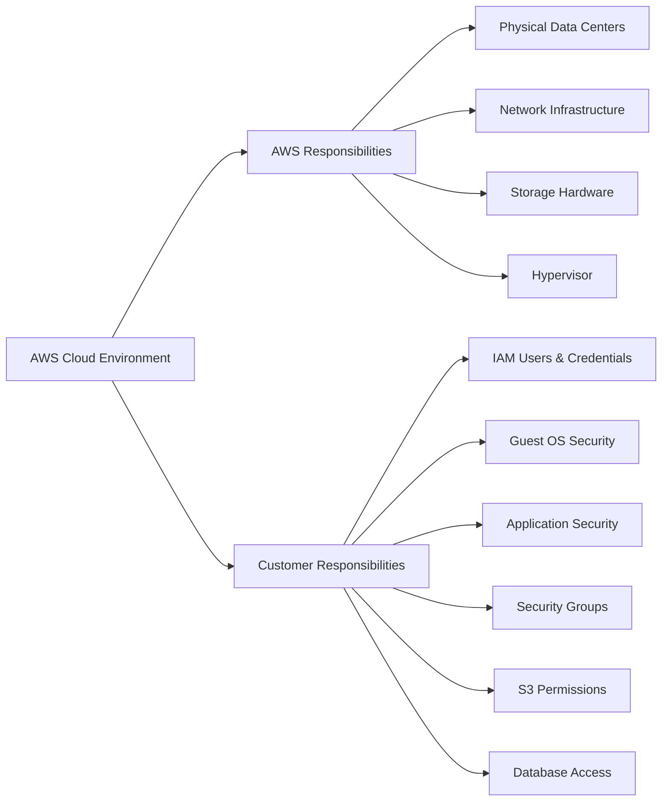

### Key Concept: Hypervisor

**Definition:**  
A hypervisor is the host operating system layer that manages virtual machines.

**Importance:**  
AWS secures the hypervisor, while customers secure the operating systems running inside their EC2 instances.

---

# 2. Using Amazon VPC to Protect Resources

## What is a VPC?

### Definition

A **Virtual Private Cloud (VPC)** is a logically isolated virtual network inside AWS where resources can be deployed securely.

### Purpose

A VPC allows organizations to:

- Isolate workloads
    
- Control network traffic
    
- Segment applications
    
- Implement layered security

---

## Core VPC Security Components

|Component|Purpose|
|---|---|
|Security Groups|Instance-level firewall|
|Network ACLs|Subnet-level firewall|
|Subnets|Network segmentation|
|Route Tables|Traffic routing rules|
|VPC Flow Logs|Traffic monitoring and logging|

---

## VPC Security Layers

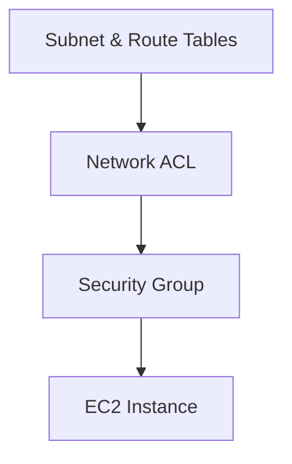

Security is implemented in layers:

1. Route Tables determine traffic paths.
    
2. Network ACLs filter subnet traffic.
    
3. Security Groups filter instance traffic.
    
4. Resources receive only allowed traffic.

---

# 3. Security Groups

## Definition

A **Security Group** acts as a virtual firewall attached directly to AWS resources such as EC2 instances or RDS databases.

---

## Characteristics

|Feature|Description|
|---|---|
|Stateful|Return traffic is automatically allowed|
|Resource Level|Applied directly to instances|
|Allow Rules Only|No explicit deny rules|
|Evaluates All Rules|Checks all configured rules|

---

## Example

### Architecture

```text
Internet
    |
    v
Security Group #1
    |
  EC2 Web Server
    |
Security Group #2
    |
Amazon RDS Database
```

### Traffic Flow

1. Internet traffic reaches the web server.
    
2. Security Group #1 permits HTTP/HTTPS traffic.
    
3. EC2 communicates with the database.
    
4. Security Group #2 allows database traffic only from Security Group #1.
    
5. Database remains inaccessible from the public internet.

---

## Stateful Behavior Example

### Incoming Request

```text
Client --> EC2 (Allowed)
```

### Response

```text
EC2 --> Client (Automatically Allowed)
```

No additional outbound rule is required for the response.

---

# 4. Network Access Control Lists (Network ACLs)

## Definition

A **Network ACL (Access Control List)** is an optional security layer that acts as a firewall at the subnet level.

---

## Characteristics

|Feature|Description|
|---|---|
|Stateless|Return traffic must be explicitly allowed|
|Subnet Level|Protects entire subnet|
|Allow and Deny Rules|Supports both|
|Ordered Evaluation|Rules processed numerically|

---

## Example

### Public Subnet ACL

|Rule Number|Action|
|---|---|
|100|Allow HTTP|
|110|Allow HTTPS|
|120|Deny Everything Else|

Traffic is evaluated from the lowest rule number to the highest.

---

## Stateless Behavior Example

### Incoming Request

```text
Client --> Web Server
```

Allowed by inbound rule.

### Response

```text
Web Server --> Client
```

Must also be allowed by outbound rule.

---

# 5. Security Groups Vs Network ACLs

|Feature|Security Group|Network ACL|
|---|---|---|
|Scope|Instance|Subnet|
|Stateful|Yes|No|
|Supports Deny Rules|No|Yes|
|Rule Evaluation|All Rules|Numerical Order|
|Typical Use|Resource Protection|Network Segmentation|

## Comparison Diagram

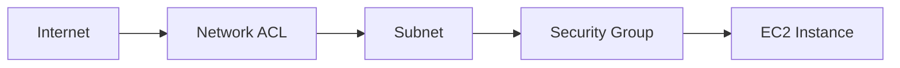

---

# 6. Subnets

## Definition

A subnet is a subdivision of a VPC that separates resources into logical network segments.

---

## Public Subnet

### Purpose

Used when resources must be reachable from the internet.

### Examples

- Web servers
    
- Load balancers
    
- Bastion hosts

---

## Private Subnet

### Purpose

Used for internal resources that should not be exposed publicly.

### Examples

- Databases
    
- Internal APIs
    
- Backend services

---

## Example Architecture

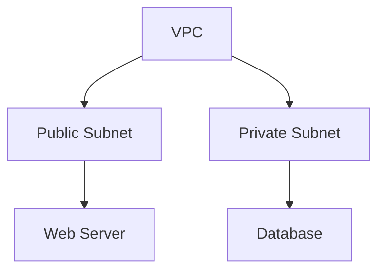

---

# 7. Route Tables

## Definition

A Route Table contains rules that determine where network traffic is directed.

---

## Purpose

Route tables decide:

- Which destinations are reachable
    
- Whether traffic goes to the internet
    
- Whether traffic remains internal

---

## Example

|Destination|Target|
|---|---|
|10.0.0.0/16|Local|
|0.0.0.0/0|Internet Gateway|

---

# 8. VPC Flow Logs

## Definition

VPC Flow Logs capture information about IP traffic entering and leaving network interfaces.

---

## Benefits

- Network troubleshooting
    
- Security investigations
    
- Compliance auditing
    
- Traffic analysis

---

## Storage Options

|Destination|
|---|
|Amazon CloudWatch Logs|
|Amazon S3|

---

## Monitoring Levels

VPC Flow Logs can monitor:

- Entire VPC
    
- Individual subnet
    
- Individual network interface

---

## Traffic Monitoring Flow

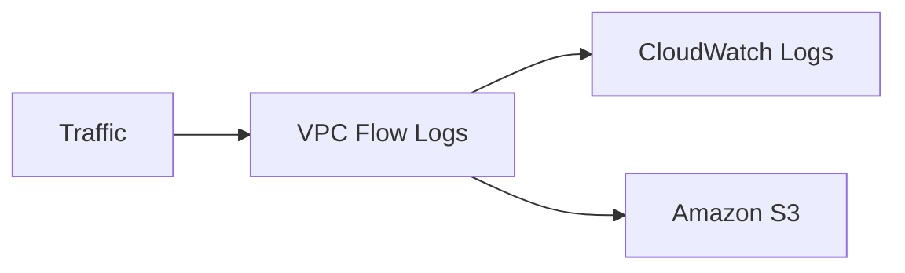

---

# 9. AWS Network Security Best Practices

## Principle of Least Privilege

### Definition

Grant only the minimum access required to perform a task.

### Example

Instead of:

```text
Allow All Traffic
```

Use:

```text
Allow HTTPS (443)
Allow SSH (22) from Admin IP
```

---

## Best Practices Checklist

### Network Controls

- Apply inbound controls.
    
- Apply outbound controls.
    
- Use Security Groups.
    
- Use Network ACLs.

### Architecture

- Separate application layers using subnets.
    
- Deploy across multiple Availability Zones.
    
- Place databases in private subnets.

### Traffic Protection

- Allow only necessary traffic.
    
- Filter application traffic.
    
- Monitor network activity.
    
- Detect anomalies.

### Automation

- Automate threat detection.
    
- Use monitoring tools.
    
- Implement self-defending mechanisms.

### Exposure Reduction

- Minimize internet-facing resources.
    
- Restrict internal network access.
    
- Follow least-privilege principles.

---

# Quick Review Summary

## Shared Responsibility Model

- AWS secures the cloud infrastructure.
    
- Customers secure their resources, applications, and data.

## VPC Security Components

- Security Groups
    
- Network ACLs
    
- Subnets
    
- Route Tables
    
- VPC Flow Logs

## Security Groups

- Instance-level firewall
    
- Stateful
    
- Allow rules only

## Network ACLs

- Subnet-level firewall
    
- Stateless
    
- Allow and deny rules

## Subnets

- Public: Internet-accessible resources
    
- Private: Internal resources such as databases

## Route Tables

- Control traffic destinations

## VPC Flow Logs

- Capture and store IP traffic data

## Security Best Practices

- Apply least privilege
    
- Restrict traffic
    
- Segment networks
    
- Monitor continuously
    
- Automate protection mechanisms
    
- Limit exposure to public networks

## Section 4: Elastic Load Balancing (ELB), Learning Lab Best Practices, and Security Resources

---

# 1. Data Protection in Elastic Load Balancing (ELB)

## What is Elastic Load Balancing (ELB)?

### Definition

Elastic Load Balancing (ELB) is an AWS service that automatically distributes incoming application traffic across multiple targets such as EC2 instances.

### Purpose

- Improve application availability
    
- Increase fault tolerance
    
- Simplify TLS/SSL certificate management
    
- Centralize traffic handling

---

## ELB as a Single Point of Contact

### Definition

ELB serves as the single entry point for clients accessing an application.

### How It Works

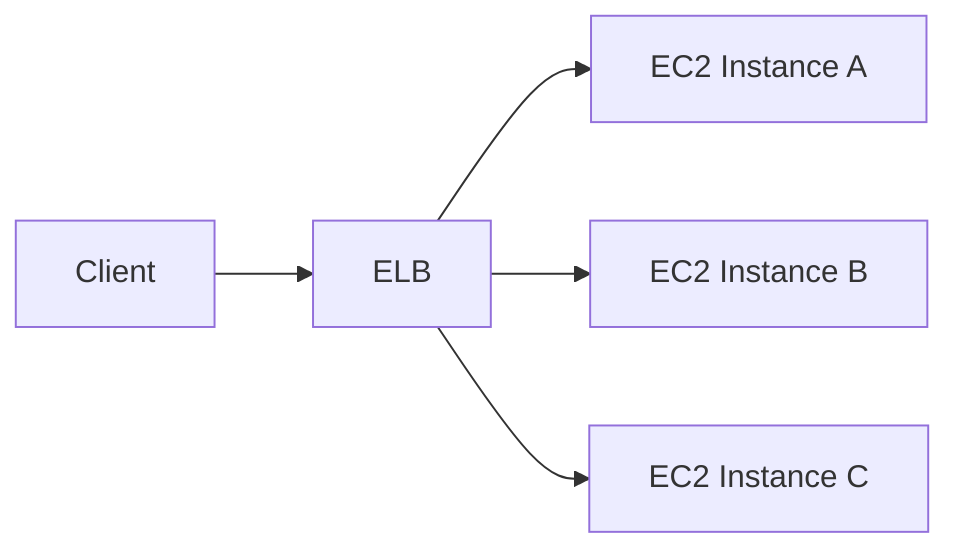

### Benefits

|Benefit|Explanation|
|---|---|
|High Availability|Traffic is distributed across multiple instances|
|Scalability|Additional targets can be added easily|
|Fault Tolerance|Requests continue flowing even if an instance fails|
|Simplified Security|SSL/TLS certificates can be managed centrally|

---

## Encryption at Rest

### Definition

Encryption at Rest protects stored data from unauthorized access.

### ELB Implementation

When ELB access logs are stored in Amazon S3:

1. Server-Side Encryption (SSE-S3) can be enabled.
    
2. ELB encrypts each log file before storage.
    
3. AWS automatically decrypts files when accessed.
    
4. Each log file uses a unique encryption key.
    
5. Encryption keys are periodically rotated.

### Encryption Process

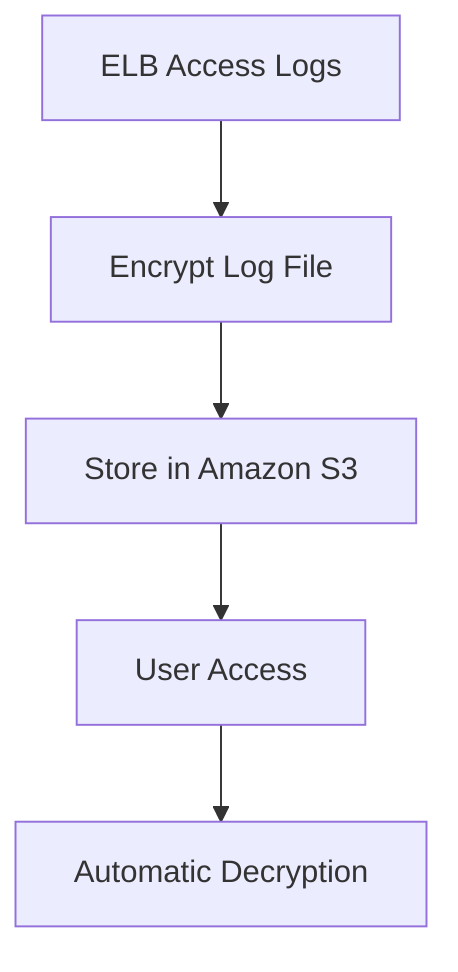

### Why It Matters

Encryption at rest helps:

- Protect sensitive log data
    
- Meet compliance requirements
    
- Reduce risk if storage is compromised

---

## Encryption in Transit

### Definition

Encryption in Transit protects data while it travels across a network.

### ELB TLS/HTTPS Termination

ELB can terminate TLS/SSL connections before forwarding traffic to backend resources.

### Traffic Flow

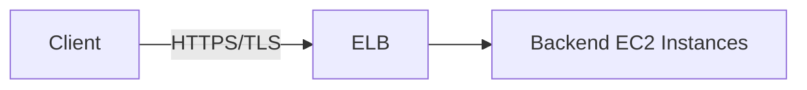

### Advantages

|Advantage|Explanation|
|---|---|
|Centralized Certificate Management|Certificates managed at ELB|
|Reduced Server Load|EC2 instances do not perform encryption/decryption|
|Easier Security Management|TLS configuration exists in one place|

---

## Example Scenario

### Without ELB

```text
Client --> EC2 #1 (TLS Processing)
Client --> EC2 #2 (TLS Processing)
Client --> EC2 #3 (TLS Processing)
```

Every EC2 instance must:

- Store certificates
    
- Handle TLS encryption
    
- Perform decryption

### With ELB

```text
Client --> ELB (TLS Processing)
ELB --> EC2 #1
ELB --> EC2 #2
ELB --> EC2 #3
```

Only ELB manages TLS certificates.

---

# 2. AWS Academy Learning Lab Best Practices

---

## Approved AWS Regions

### Rule

Students should deploy resources only in:

|Region|
|---|
|us-east-1|
|us-west-2|

### Reason

Learning Lab permissions are restricted to these regions unless stated otherwise.

---

## LabRole

### Definition

LabRole is a preconfigured IAM role provided in the AWS Academy Learning Lab.

### Purpose

- Grants access to many AWS services.
    
- Simplifies permission management.
    
- Reduces authorization errors.

### Best Practice

Whenever AWS asks for a role:

```text
Select LabRole
```

### Why?

LabRole has permissions similar to those granted to the Learning Lab user account.

---

## LabRole Workflow

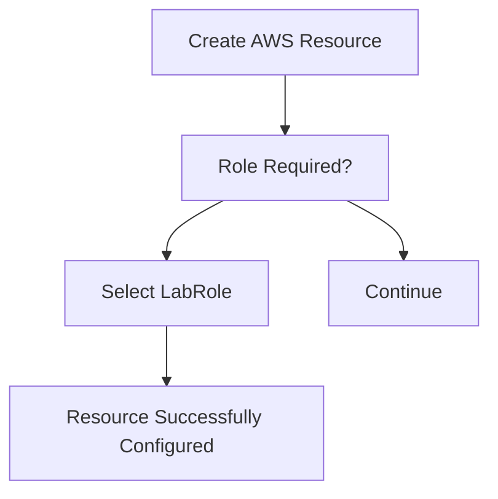

---

# 3. Cost Management Best Practices

## Why Cost Management Matters

AWS resources consume budget while running.

Exceeding the Learning Lab budget may result in:

- Account suspension
    
- Resource deletion
    
- Loss of project progress

---

## Recommended Practices

### 1. Launch Only Necessary Resources

Avoid overprovisioning.

#### Example

Instead of:

```text
10 EC2 Instances
```

Use:

```text
2 EC2 Instances
```

if only two are required.

---

### 2. Stop or Delete Unused Resources

Resources continue generating costs while active.

Examples:

- EC2 Instances
    
- Databases
    
- Load Balancers
    
- Elastic IPs

---

### 3. Use AWS Pricing Calculator

### Definition

AWS Pricing Calculator estimates the cost of planned infrastructure.

### Benefits

- Budget planning
    
- Cost forecasting
    
- Architecture comparison

---

### 4. Review AWS Trusted Advisor

### Definition

AWS Trusted Advisor analyzes AWS environments and provides recommendations.

### Cost Optimization Recommendations

Examples include:

- Underutilized EC2 instances
    
- Idle resources
    
- Unused storage

---

## Cost Optimization Process

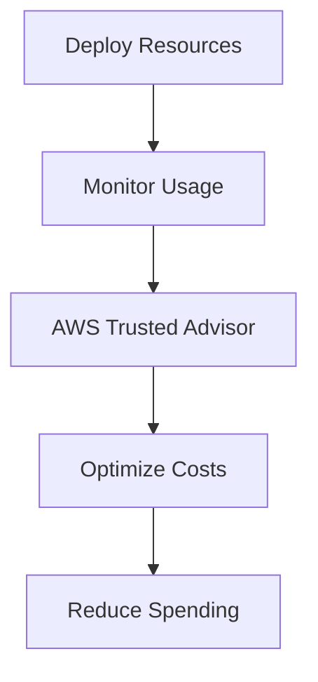

---

# 4. AWS Documentation Resources

## AWS Documentation

### Definition

The official AWS documentation provides technical guidance for AWS services.

### Available Resources

|Resource Type|Purpose|
|---|---|
|User Guides|Learn service operation|
|Developer Guides|Implementation guidance|
|API References|Service APIs and parameters|
|Tutorials|Step-by-step learning|
|SDK Documentation|Programming integration|
|Projects|Practical examples|

---

## Learning Strategy

When learning a new AWS service:

1. Read the introduction section.
    
2. Complete tutorials.
    
3. Review examples.
    
4. Study API documentation.
    
5. Build a small proof-of-concept.

---

# 5. AWS Well-Architected Framework Security Pillar

## Definition

The Security Pillar is one of the six pillars of the AWS Well-Architected Framework.

### Purpose

Provide guidance for:

- Designing secure systems
    
- Operating workloads securely
    
- Maintaining security over time

---

## Security Pillar Goals

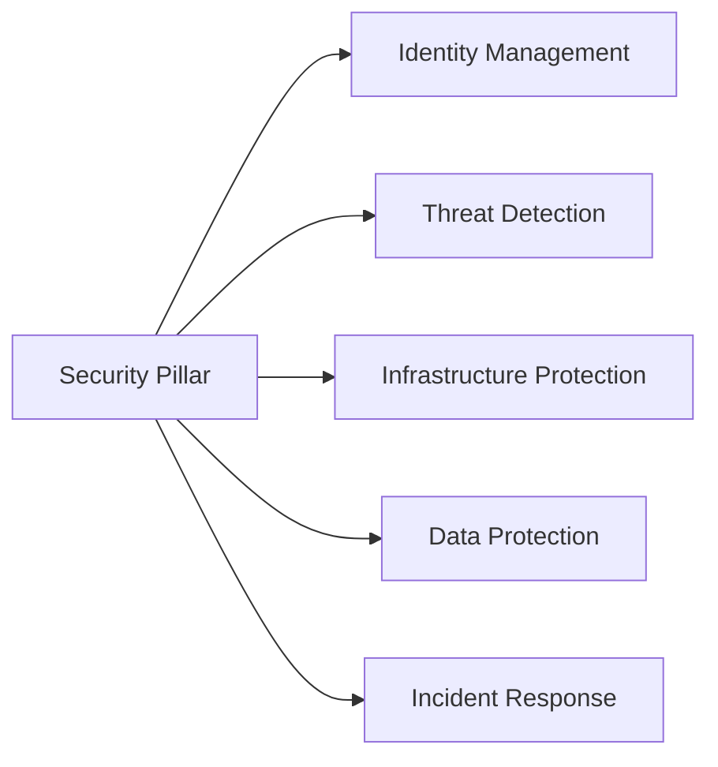

---

## Why It Matters

Organizations use the Security Pillar to:

- Apply AWS best practices
    
- Build secure cloud architectures
    
- Reduce security risks
    
- Improve compliance posture

---

# 6. Recommended AWS Security Training

## Foundational Courses

|Course|Focus Area|
|---|---|
|AWS Academy Cloud Security Foundations|Core cloud security concepts|
|AWS Security Fundamentals|Security basics|
|AWS Security, Identity and Compliance|Security services overview|
|Introduction to IAM|Identity and access management|
|Introduction to Amazon VPC|Network security|
|Securing Data in Amazon S3|Storage security|
|AWS Security Governance at Scale|Enterprise governance|
|AWS Security Best Practices: Monitoring and Alerting|Detection and monitoring|

---

## Recommended Learning Path

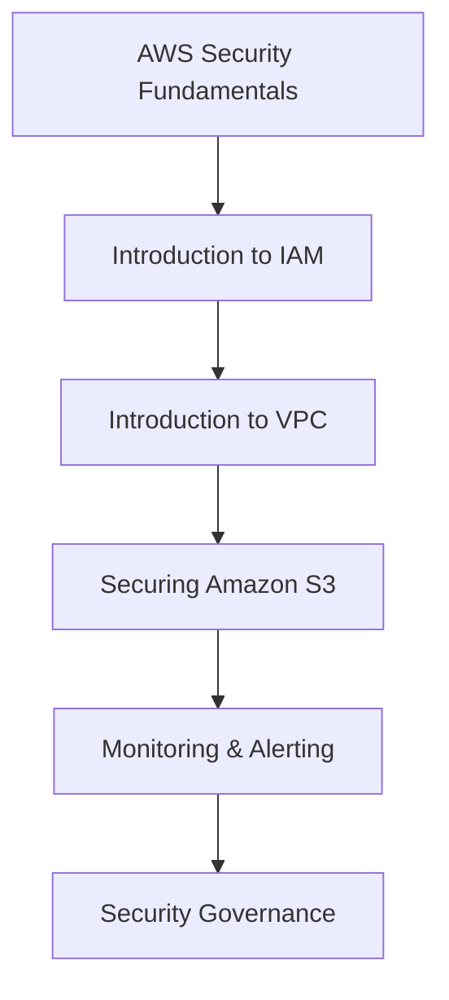

---

# 7. Additional Security Resources

## Key Study Resources

|Resource|Focus|
|---|---|
|AWS Security Processes Overview|AWS security model|
|Security, Identity & Compliance Best Practices|Enterprise security practices|
|Well-Architected Security Pillar – Detection|Monitoring and detection|
|AWS KMS Best Practices|Encryption key management|
|AWS Cloud Adoption Framework|Cloud adoption strategy|
|DDoS Resiliency Best Practices|Protection against DDoS attacks|
|Multi-VPC Secure Network Architecture|Network design|
|AWS Compliance Quick Reference|Compliance programs|

---

## AWS Key Management Service (KMS)

### Definition

AWS KMS is a managed service for creating and controlling encryption keys.

### Importance

Used to:

- Protect sensitive data
    
- Manage encryption keys centrally
    
- Support compliance requirements

---

## DDoS Resilience

### Definition

A Distributed Denial of Service (DDoS) attack attempts to overwhelm systems with traffic.

### AWS Best Practices

- Use ELB
    
- Use AWS Shield
    
- Design scalable architectures
    
- Monitor traffic anomalies

---

# Key Takeaways

- ELB improves availability by distributing traffic across multiple targets.
    
- ELB supports encryption both at rest and in transit.
    
- TLS termination at ELB simplifies certificate management.
    
- AWS Academy Learning Labs should use only approved regions and the LabRole IAM role.
    
- Cost management requires removing unused resources and using tools such as AWS Pricing Calculator and Trusted Advisor.
    
- AWS Documentation is the primary source for technical learning.
    
- The AWS Well-Architected Security Pillar provides guidance for designing and operating secure cloud workloads.
    
- Security education should include IAM, VPC, S3, monitoring, governance, and compliance.
    
- AWS provides extensive security resources covering encryption, detection, compliance, DDoS protection, and secure architecture design.

  ---

# AWS Academy Cloud Security Foundations – Preguntas De Repaso

---

# 1. ¿Cuál Opción Describe Correctamente Las Funciones Del Laboratorio De Aprendizaje De AWS Academy?

## Respuesta Correcta

✅ **Entorno de pruebas prolongado para explorar un conjunto restringido de servicios de AWS, límite de presupuesto de 100 USD por alumno y temporizador de sesión de 4 horas de forma predeterminada.**

## Justificación

El AWS Academy Learning Lab proporciona:

- Acceso a un conjunto limitado de servicios de AWS.
    
- Un presupuesto controlado por estudiante.
    
- Un temporizador de sesión predeterminado de 4 horas.
    
- Un entorno seguro para prácticas y laboratorios.

---

# 2. La Seguridad Y El Cumplimiento Son Responsabilidades Compartidas Entre AWS Y El Cliente. ¿Qué Es Responsabilidad De AWS?

## Respuesta Correcta

✅ **Aplicación de parches a la infraestructura de red**

## Justificación

Según el Modelo de Responsabilidad Compartida de AWS:

|AWS es responsible de|Cliente es responsible de|
|---|---|
|Infraestructura física|Datos del cliente|
|Centros de datos|Aplicaciones|
|Hardware|Configuración de seguridad|
|Red física|Usuarios y permisos|
|Hipervisor|Sistemas operativos invitados|
|Aplicación de parches de infraestructura|Datos y configuraciones|

AWS protege la infraestructura que ejecuta todos los servicios de AWS.

---

# 3. ¿Cuáles Son Las Responsabilidades De Seguridad Del Cliente Según El Modelo De Responsabilidad Compartida De AWS? (Seleccione DOS opciones)

## Respuestas Correctas

✅ **Administración de credenciales y políticas de cuentas**  
✅ **Administración de los datos del cliente**

## Justificación

El cliente es responsible de la seguridad **en la nube**.

## Incluye

- Usuarios IAM
    
- Roles IAM
    
- Contraseñas
    
- Políticas de acceso
    
- Cifrado de datos
    
- Aplicaciones
    
- Sistemas operativos invitados

## No Incluye

- Hardware físico
    
- Infraestructura de red
    
- Hipervisores
    
- Centros de datos

---

# 4. ¿Cuáles Son Prácticas Recomendadas Para Proteger Su Red? (Seleccione DOS opciones)

## Respuestas Correctas

✅ **Colocar instancias de cómputo en subredes privadas cuando no requieran acceso directo a Internet con regularidad.**  
✅ **Utilizar los grupos de seguridad para controlar el acceso a los recursos.**

## Justificación

## Subredes Privadas

Permiten:

- Reducir exposición a Internet.
    
- Limitar vectors de ataque.
    
- Aumentar la seguridad de bases de datos y servicios internos.

## Grupos De Seguridad

Funcionan como firewalls virtuales que:

- Controlan tráfico entrante.
    
- Controlan tráfico saliente.
    
- Aplican el principio de mínimo privilegio.

### Ejemplo

```text
Internet
   |
Public Subnet
   |
Web Server
   |
Private Subnet
   |
Database
```

La base de datos permanece aislada de Internet.

---

# 5. ¿Cuáles Son Prácticas Recomendadas Para Proteger Sus Recursos De Cómputo? (Seleccione DOS opciones)

## Respuestas Correctas

✅ **Almacenar las claves privadas, que usa para conectarse a sus instancias, en un lugar seguro.**  
✅ **Crear AMI con los sistemas operativos, paquetes y software más actualizados.**

## Justificación

Según las recomendaciones del curso, para proteger recursos de cómputo se debe:

## Proteger Las Claves Privadas

Las claves privadas utilizadas para conectarse a instancias EC2 deben:

- Guardarse en ubicaciones seguras.
    
- No compartirse.
    
- No almacenarse en repositorios públicos.
    
- Tener acceso restringido.

### Ejemplo

```text
Correcto:
Vault / Password Manager / Ubicación Segura

Incorrecto:
GitHub público
Correo electrónico
Carpeta compartida sin protección
```

## Utilizar AMI Actualizadas

Las Amazon Machine Images (AMI) deben container:

- Sistema operativo actualizado.
    
- Últimos parches de seguridad.
    
- Software actualizado.
    
- Configuraciones seguras.

### Beneficios

- Menos vulnerabilidades conocidas.
    
- Implementaciones consistentes.
    
- Menor riesgo de exposición.

## Por Qué Las Demás Opciones Son Incorrectas

|Opción|Motivo|
|---|---|
|Analizar vulnerabilidades y aplicar parches|Es una buena práctica general, pero no fue una de las respuestas esperadas en esta pregunta específica del curso.|
|Usar 0.0.0.0/0 para permitir acceso desde cualquier dirección IPv4|Incrementa significativamente el riesgo de ataque.|
|No configurar grupos de seguridad|Contradice las prácticas recomendadas de AWS.|

---

# AWS Academy Cloud Security Foundations – Preguntas De Repaso

---

# 1. ¿Cuál Opción Describe Correctamente Las Funciones Del Laboratorio De Aprendizaje De AWS Academy?

## Respuesta Correcta

✅ **Entorno de pruebas prolongado para explorar un conjunto restringido de servicios de AWS, límite de presupuesto de 100 USD por alumno y temporizador de sesión de 4 horas de forma predeterminada.**

## Justificación

El AWS Academy Learning Lab proporciona:

- Acceso a un conjunto limitado de servicios de AWS.
    
- Un presupuesto controlado por estudiante.
    
- Un temporizador de sesión predeterminado de 4 horas.
    
- Un entorno seguro para prácticas y laboratorios.

---

# 2. La Seguridad Y El Cumplimiento Son Responsabilidades Compartidas Entre AWS Y El Cliente. ¿Qué Es Responsabilidad De AWS?

## Respuesta Correcta

✅ **Aplicación de parches a la infraestructura de red**

## Justificación

Según el Modelo de Responsabilidad Compartida de AWS:

|AWS es responsible de|Cliente es responsible de|
|---|---|
|Infraestructura física|Datos del cliente|
|Centros de datos|Aplicaciones|
|Hardware|Configuración de seguridad|
|Red física|Usuarios y permisos|
|Hipervisor|Sistemas operativos invitados|
|Aplicación de parches de infraestructura|Datos y configuraciones|

AWS protege la infraestructura que ejecuta todos los servicios de AWS.

---

# 3. ¿Cuáles Son Las Responsabilidades De Seguridad Del Cliente Según El Modelo De Responsabilidad Compartida De AWS? (Seleccione DOS opciones)

## Respuestas Correctas

✅ **Administración de credenciales y políticas de cuentas**  
✅ **Administración de los datos del cliente**

## Justificación

El cliente es responsible de la seguridad **en la nube**.

## Incluye

- Usuarios IAM
    
- Roles IAM
    
- Contraseñas
    
- Políticas de acceso
    
- Cifrado de datos
    
- Aplicaciones
    
- Sistemas operativos invitados

## No Incluye

- Hardware físico
    
- Infraestructura de red
    
- Hipervisores
    
- Centros de datos

---

# 4. ¿Cuáles Son Prácticas Recomendadas Para Proteger Su Red? (Seleccione DOS opciones)

## Respuestas Correctas

✅ **Colocar instancias de cómputo en subredes privadas cuando no requieran acceso directo a Internet con regularidad.**  
✅ **Utilizar los grupos de seguridad para controlar el acceso a los recursos.**

## Justificación

## Subredes Privadas

Permiten:

- Reducir exposición a Internet.
    
- Limitar vectors de ataque.
    
- Aumentar la seguridad de bases de datos y servicios internos.

## Grupos De Seguridad

Funcionan como firewalls virtuales que:

- Controlan tráfico entrante.
    
- Controlan tráfico saliente.
    
- Aplican el principio de mínimo privilegio.

### Ejemplo

```text
Internet
   |
Public Subnet
   |
Web Server
   |
Private Subnet
   |
Database
```

La base de datos permanece aislada de Internet.

---

# 5. ¿Cuáles Son Prácticas Recomendadas Para Proteger Sus Recursos De Cómputo? (Seleccione DOS opciones)

## Respuestas Correctas

✅ **Crear AMI con los sistemas operativos, paquetes y software más actualizados.**  
✅ **Almacenar las claves privadas, que usa para conectarse a sus instancias, en un lugar seguro.**

## Justificación

AWS recomienda controlar quién tiene acceso a las instancias y proteger las credenciales utilizadas para administrarlas.

## 1. Proteger Las Claves Privadas

Las claves privadas de EC2 permiten el acceso administrativo a las instancias.

Buenas prácticas:

- Almacenarlas en ubicaciones seguras.
    
- No compartirlas.
    
- No subirlas a repositorios públicos.
    
- Limitar quién puede acceder a ellas.

## 2. Utilizar AMI Actualizadas

Las AMI deben container:

- Sistemas operativos actualizados.
    
- Últimos parches de seguridad.
    
- Software actualizado.
    
- Configuraciones seguras.

Esto reduce vulnerabilidades y mejora la postura de seguridad de las instancias.

## Por Qué Las Otras Opciones Son Incorrectas

|Opción|Motivo|
|---|---|
|Usar 0.0.0.0/0 para permitir acceso desde cualquier dirección IPv4|Expone la instancia a Internet y aumenta la superficie de ataque.|
|No configurar un grupo de seguridad para una instancia|AWS recomienda asignar grupos de seguridad a todas las instancias.|
|Analizar periódicamente vulnerabilidades y aplicar parches|Es una buena práctica general de seguridad, pero no fue una de las respuestas esperadas en esta pregunta específica del curso.|

---

# 6. ¿Qué Se Puede Utilizar Para Controlar El Acceso a Un Bucket De Amazon S3? (Seleccione TRES opciones)

## Respuestas Correctas

✅ **Políticas de AWS Identity and Access Management (IAM)**  
✅ **Políticas de bucket de S3**  
✅ **Políticas de punto de enlace de nube virtual privada (VPC Endpoint Policies)**

---

# Justificación

Amazon S3 permite controlar el acceso mediante múltiples capas de autorización.

## 1. Políticas IAM

Controlan qué usuarios, grupos o roles pueden acceder a los recursos de S3.

### Ejemplo

```json
{
  "Effect": "Allow",
  "Action": "s3:GetObject",
  "Resource": "arn:aws:s3:::mi-bucket/*"
}
```

---

## 2. Políticas De Bucket De S3

Se aplican directamente al bucket y permiten controlar quién puede acceder y qué acciones puede realizar.

### Ejemplo

```json
{
  "Effect": "Allow",
  "Principal": {
    "AWS": "arn:aws:iam::123456789012:user/Ana"
  },
  "Action": "s3:GetObject",
  "Resource": "arn:aws:s3:::mi-bucket/*"
}
```

---

## 3. Políticas De Punto De Enlace De VPC

Permiten controlar qué recursos de S3 pueden set accedidos desde una VPC específica mediante un VPC Endpoint.

### Beneficios

- Mantienen el tráfico dentro de la red de AWS.
    
- Evitan el acceso a través de Internet.
    
- Agregan una capa adicional de control.

## Flujo De Acceso

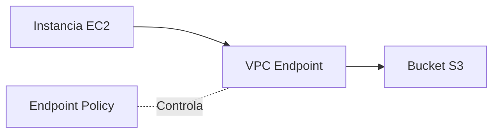

---

# ¿Por Qué Las Otras Opciones Son Incorrectas?

|Opción|Motivo|
|---|---|
|Control de acceso basado en atributos (ABAC)|ABAC es una estrategia de autorización basada en etiquetas, pero la pregunta pide mecanismos específicos de control de acceso para S3.|
|Acceso basado en host|No es un mecanismo de control de acceso de Amazon S3.|
|Etiquetas de AWS IAM|Las etiquetas por sí solas no otorgan permisos; requieren políticas que las utilicen.|

---

# Respuesta Final

✅ **Políticas de AWS IAM**  
✅ **Políticas de bucket de S3**  
✅ **Políticas de punto de enlace de VPC (VPC Endpoint Policies)**

## Correcciones Identificadas Hasta Ahora

|Pregunta|Respuesta corregida|
|---|---|
|5|Almacenar claves privadas de forma segura + Crear AMI actualizadas|
|6|IAM Policies + S3 Bucket Policies + VPC Endpoint Policies|

Las preguntas **1, 2, 3, 4 y 7** permanecen correctas.

---

# 7. ¿Cuáles Son Prácticas Recomendadas Para Administrar Su Entorno Del Laboratorio De Aprendizaje De AWS Academy? (Seleccione DOS opciones)

## Respuestas Correctas

✅ **Desactivar o eliminar los recursos de cómputo cuando ya no los necesite.**  
✅ **Cuando se le pida especificar un rol de AWS IAM, elegir el rol LabRole.**

## Justificación

## Eliminar Recursos Innecesarios

Ayuda a:

- Evitar exceder el presupuesto.
    
- Reducir costos.
    
- Mantener el laboratorio limpio.

## Utilizar LabRole

LabRole:

- Está preconfigurado para AWS Academy.
    
- Contiene los permisos necesarios para los laboratorios.
    
- Reduce errores de autorización.

### Flujo Recomendado

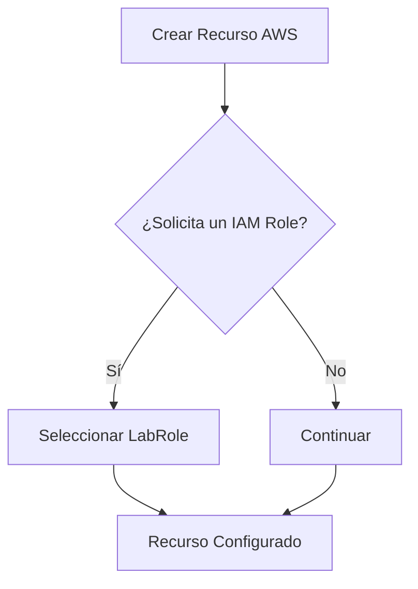

---

# Resumen Rápido Para El Examen

|#|Respuesta Correcta|
|---|---|
|1|Learning Lab: servicios restringidos, presupuesto de 100 USD y sesiones de 4 horas|
|2|AWS aplica parches a la infraestructura de red|
|3|Administración de credenciales IAM y datos del cliente|
|4|Subredes privadas y grupos de seguridad|
|5|Almacenar claves privadas de forma segura y usar AMI actualizadas|
|6|ABAC, IAM Policies y S3 Bucket Policies|
|7|Eliminar recursos no utilizados y utilizar LabRole|

## Regla De Oro Del Examen

**AWS protege la nube (Security of the Cloud).**  
**El cliente protege lo que coloca dentro de la nube (Security in the Cloud).**

### AWS

- Centros de datos
    
- Hardware
    
- Redes
    
- Hipervisor
    
- Infraestructura

### Cliente

- Datos
    
- Usuarios
    
- Credenciales
    
- Aplicaciones
    
- Configuraciones
    
- Recursos desplegados
    
- Claves privadas de acceso a instancias EC2
---

# 7. ¿Cuáles Son Prácticas Recomendadas Para Administrar Su Entorno Del Laboratorio De Aprendizaje De AWS Academy? (Seleccione DOS opciones)

## Respuestas Correctas

✅ **Desactivar o eliminar los recursos de cómputo cuando ya no los necesite.**  
✅ **Cuando se le pida especificar un rol de AWS IAM, elegir el rol LabRole.**

## Justificación

## Eliminar Recursos Innecesarios

Ayuda a:

- Evitar exceder el presupuesto.
    
- Reducir costos.
    
- Mantener el laboratorio limpio.

## Utilizar LabRole

LabRole:

- Está preconfigurado para AWS Academy.
    
- Contiene los permisos necesarios para los laboratorios.
    
- Reduce errores de autorización.

### Flujo Recomendado


---

# Resumen Rápido Para El Examen

|#|Respuesta Correcta|
|---|---|
|1|Learning Lab: servicios restringidos, presupuesto de 100 USD y sesiones de 4 horas|
|2|AWS aplica parches a la infraestructura de red|
|3|Administración de credenciales IAM y datos del cliente|
|4|Subredes privadas y grupos de seguridad|
|5|Almacenar claves privadas de forma segura y usar AMI actualizadas|
|6|ABAC, IAM Policies y S3 Bucket Policies|
|7|Eliminar recursos no utilizados y utilizar LabRole|

## Regla De Oro Del Examen

**AWS protege la nube (Security of the Cloud).**  
**El cliente protege lo que coloca dentro de la nube (Security in the Cloud).**

### AWS

- Centros de datos
    
- Hardware
    
- Redes
    
- Hipervisor
    
- Infraestructura

### Cliente

- Datos
    
- Usuarios
    
- Credenciales
    
- Aplicaciones
    
- Configuraciones
    
- Recursos desplegados
    
- Claves privadas de acceso a instancias EC2