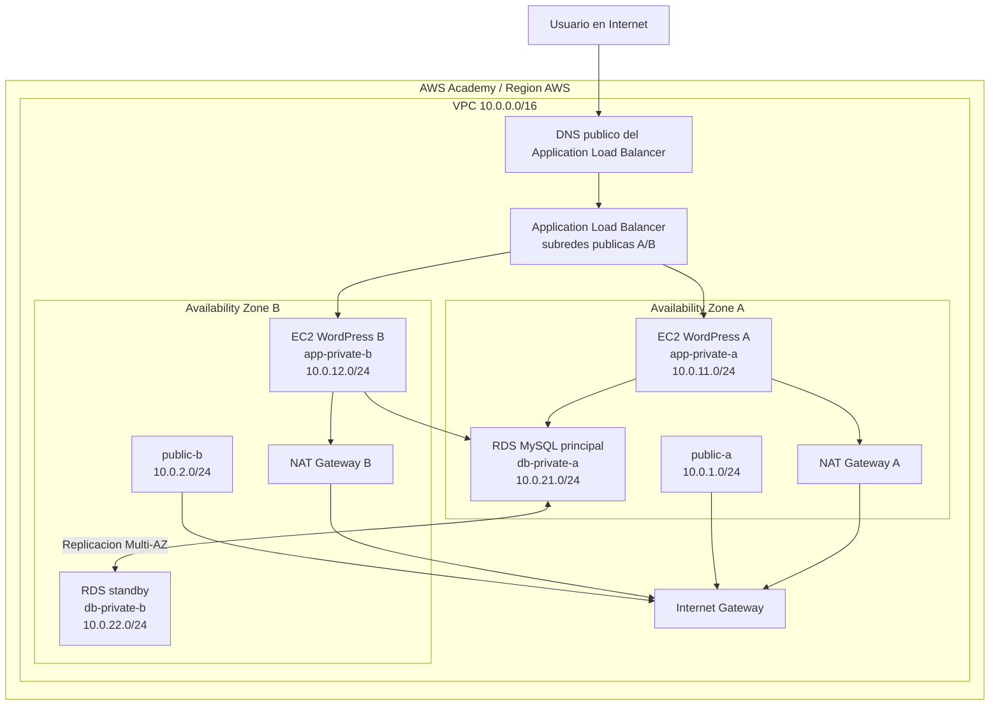

# Despliegue De Un Aplicativo En Alta Disponibilidad En AWS Academy

## 1. Para Qué Sirve Esta Guía

Esta guía explica cómo desplegar una aplicación web en alta disponibilidad dentro de AWS Academy. La propuesta usa WordPress, EC2, un Application Load Balancer, un Auto Scaling Group y una base de datos RDS MySQL en subredes privadas.

La idea no es solo "seguir clics" en la consola. También se explica por qué se crea cada recurso, qué problema resuelve y qué evidencia conviene guardar para el PDF final de la actividad.

La arquitectura cubre los puntos principales del enunciado `mexissi06_act2_grupal.md`:

- Una VPC con direccionamiento privado.
- Seis subredes distribuidas en dos zonas de disponibilidad.
- Subredes públicas con salida a Internet por Internet Gateway.
- Subredes privadas con salida a Internet por NAT Gateway.
- Frontend en EC2 privadas, sin IP pública.
- Publicación del frontend por medio de un Application Load Balancer.
- Auto Scaling Group para mantener dos instancias del frontend.
- Base de datos RDS en subredes privadas separadas de las subredes del frontend.
- Alta disponibilidad en la base de datos mediante Multi-AZ, si AWS Academy lo permite.

## 2. Decisión De Aplicación

Para esta práctica recomiendo usar WordPress sobre EC2 y RDS MySQL.

Se podría usar Moodle, MediaWiki, Laravel o Django, pero WordPress reduce el riesgo. Se instala rápido, usa base de datos relacional y permite comprobar desde el navegador que el balanceador, las EC2 y RDS están funcionando.

| Opción | Aplicación | Base de datos | Riesgo para terminar en 4 horas | Comentario |
|---|---|---|---|---|
| 1 | WordPress | MySQL o MariaDB | Bajo | Es la opción recomendada para esta actividad. |
| 2 | MediaWiki | MySQL o MariaDB | Medio | Sirve para una demo de wiki, pero tarda más en dejarse lista. |
| 3 | Moodle | MySQL o PostgreSQL | Medio | Encaja con un contexto educativo, pero la instalación puede consumir mucho tiempo. |
| 4 | Laravel demo app | MySQL o PostgreSQL | Medio | Buena opción si el equipo ya tiene una app preparada. |
| 5 | Django demo app | PostgreSQL o MySQL | Medio | Require preparar proyecto, dependencias y variables de entorno. |

Para el informe, lo importante no es que WordPress sea una aplicación compleja. Lo importante es que permite demostrar la arquitectura: entrada por ALB, procesamiento en EC2 privadas, persistencia en RDS y recuperación ante fallo de una instancia.

## 3. Arquitectura Propuesta

### 3.1 Resumen De la Arquitectura

La arquitectura tiene tres zonas lógicas.

La primera zona es pública. Ahí estarán el Application Load Balancer, el Internet Gateway y los NAT Gateway. "Pública" no significa que todo reciba tráfico libremente; significa que esas subredes tienen ruta directa hacia Internet.

La segunda zona es privada de aplicación. Ahí estarán las instancias EC2 con WordPress. Estas instancias no tendrán IP pública. El usuario nunca entra directamente a ellas. Todo el tráfico web llega primero al ALB.

La tercera zona es privada de base de datos. Ahí estará RDS MySQL. La base de datos no debe set pública y solo debe aceptar conexiones desde el Security Group de las EC2.

### 3.2 Direccionamiento

Se usará una VPC con CIDR `10.0.0.0/16`. Dentro de ella se crean seis subredes, tres por cada zona de disponibilidad.

| Capa | Subred | CIDR | Zona de disponibilidad | Uso |
|---|---|---:|---|---|
| Pública | `public-a` | `10.0.1.0/24` | AZ A | ALB y NAT Gateway A |
| Pública | `public-b` | `10.0.2.0/24` | AZ B | ALB y NAT Gateway B |
| Privada app | `app-private-a` | `10.0.11.0/24` | AZ A | EC2 WordPress A |
| Privada app | `app-private-b` | `10.0.12.0/24` | AZ B | EC2 WordPress B |
| Privada DB | `db-private-a` | `10.0.21.0/24` | AZ A | RDS principal o standby |
| Privada DB | `db-private-b` | `10.0.22.0/24` | AZ B | RDS principal o standby |

La separación entre subredes de aplicación y base de datos ayuda a explicar mejor la arquitectura en el informe. También permite aplicar reglas de seguridad más limpias: el ALB habla con EC2, y EC2 habla con RDS.

### 3.3 Diagrama Mermaid

Este diagrama vuelve a usar `flowchart`, porque es la sintaxis más compatible en editores Markdown y visores de Mermaid.



### 3.4 Cómo Se Mueve El Tráfico

La idea es que Cuando un usuario abre el sitio, usa el DNS público del AWS Application Load Balancer o ALB. El ALB está en las subredes públicas y recibe tráfico HTTP por el puerto 80. Después envía la petición a una de las instancias EC2 del Target Group.

Las EC2 están en subredes privadas. No tienen IP pública y no se abren al mundo. Esto reduce la superficie de exposición: si alguien intenta entrar por SSH o por una IP directa, no debería poder hacerlo.

WordPress se conecta a RDS por el puerto 3306. La regla importante aquí es que RDS no acepta tráfico desde Internet, ni desde cualquier IP de la VPC. Solo acepta conexiones donde su origen sea el Security Group de la aplicación.

El Auto Scaling Group mantiene dos instancias. Si una falla, el grupo crea otra. No hay que prometer una recuperación perfecta en segundos, pero sí se puede demostrar que AWS detecta la instancia dañada y la reemplaza.

RDS Multi-AZ mantiene una copia standby en otra zona de disponibilidad. Si AWS Academy no permite activar Multi-AZ por permisos o costo, tendríamos que ajustar esto pero Se documenta la restricción y se muestra que el DB Subnet Group sí está preparado con dos subredes privadas en AZ distintas.

![[Cloud_Archecture_Act_2.drawio.svg]]

Necesito validar en RDS si tenemos Réplicas Y tenemos las replicas ya va a funcionar la entrega sino otra opción que tenemos Es hacer un espejo de las bases de datos

### 3.5 Trazabilidad Con El Enunciado

| Requisito del enunciado | Cómo lo cubre esta guía | Evidencia recomendada |
|---|---|---|
| Crear una VPC con seis subredes públicas y privadas | VPC `10.0.0.0/16`, dos subredes públicas, dos privadas de aplicación y dos privadas de base de datos | Captura de VPC y lista de subredes con CIDR y AZ |
| Dar salida a Internet a redes públicas y privadas | Rutas públicas hacia Internet Gateway y rutas privadas hacia NAT Gateway | Capturas de tablas de rutas, IGW y NAT Gateway |
| Crear frontend privado expuesto por balanceador | EC2 WordPress en `app-private-a` y `app-private-b`, publicadas por ALB | Capturas de ALB, Target Group y EC2 sin IP pública |
| Crear grupo de autoescalado para el frontend | Auto Scaling Group con capacidad deseada 2, mínima 2 y máxima 4 | Captura del ASG con dos instancias `InService` |
| Crear base de datos en alta disponibilidad en subredes privadas | RDS MySQL privado con DB Subnet Group en dos AZ y Multi-AZ si está disponible | Captura de RDS privado, DB Subnet Group y configuración Multi-AZ |

## 4. Plan De Trabajo Para 4 Horas

El tiempo de AWS Academy se va rápido. Este orden evita perder tiempo creando recursos que después no pueden conectarse.

|      Tiempo | Trabajo                                                 | Resultado esperado                                       |
| ----------: | ------------------------------------------------------- | -------------------------------------------------------- |
| 0:00 - 0:15 | Iniciar el laboratorio, elegir región y definir nombres | Todos trabajan en la misma región y con el mismo prefijo |
| 0:15 - 0:55 | Crear VPC, subredes, IGW, NAT Gateway y rutas           | La red queda lista antes de crear servidores             |
| 0:55 - 1:20 | Crear Security Groups y DB Subnet Group                 | La seguridad queda definida antes de RDS y EC2           |
| 1:20 - 2:00 | Crear RDS MySQL                                         | La base queda lista y se copia el endpoint               |
| 2:00 - 2:35 | Crear Launch Template                                   | WordPress queda automatizado con `user data`             |
| 2:35 - 3:10 | Crear Target Group, ALB y ASG                           | El frontend queda publicado por el balanceador           |
| 3:10 - 3:35 | Validar funcionamiento                                  | Se revisan targets, WordPress, RDS y recuperación        |
| 3:35 - 4:00 | Tomar evidencias y limpiar                              | El equipo tiene material para el PDF                     |

## 5. Antes De Empezar

### 5.1 Acuerdos Del Equipo

Antes de abrir AWS, el equipo debe acordar estos datos:

- Región: por ejemplo `us-east-1`, salvo que el laboratorio indique otra.
- Prefijo de recursos: `act2-F1011`.
- Nombre de la base inicial: `wordpress`.
- Usuario RDS: `wpadmin`.
- Contraseña temporal de RDS: alfanumérica, sin caracteres raros, para evitar errores en el script de arranque.
- Responsible de guardar el endpoint de RDS.
- Responsible de tomar capturas de red, frontend, backend y pruebas.

Esto parece básico, pero evita un problema común: cada integrante crea recursos con nombres distintos y después nadie sabe qué pertenece a la entrega final.

### 5.2 Nombres Sugeridos

| Recurso            | Nombre sugerido              |
| ------------------ | ---------------------------- |
| VPC                | `act2-F1011-vpc`             |
| Internet Gateway   | `act2-F1011-igw`             |
| NAT A              | `act2-F1011-nat-a`           |
| NAT B              | `act2-F1011-nat-b`           |
| Security Group ALB | `act2-F1011-sg-alb`          |
| Security Group app | `act2-F1011-sg-app`          |
| Security Group DB  | `act2-F1011-sg-db`           |
| DB Subnet Group    | `act2-F1011-db-subnet-group` |
| RDS                | `act2-F1011-mysql`           |
| Launch Template    | `act2-F1011-lt-wordpress`    |
| Target Group       | `act2-F1011-tg-wordpress`    |
| ALB                | `act2-F1011-alb`             |
| Auto Scaling Group | `act2-F1011-asg-wordpress`   |

## 6. Paso a Paso En AWS Academy

### Paso 1. Iniciar El Laboratorio

Qué hacer:

1. Entrar a AWS Academy.
2. Abrir el módulo donde esté habilitado el Learner Lab.
3. Seleccionar `Start Lab`.
4. Esperar a que el indicador del laboratorio esté en verde.
5. Entrar a la consola con el botón `AWS`.
6. Confirmar la región que usará todo el equipo.

Por qué se hace:

AWS Academy crea credenciales temporales. Si el laboratorio no está activo, algunos servicios fallarán aunque la consola permita navegar. La región también importa: una VPC creada en una región no aparece en otra.

Qué revisar:

- El laboratorio está en estado activo.
- La consola muestra la región correcta.
- Todos los integrantes usan la misma región para evitar capturas inconsistentes.

Evidencia:

- Captura del laboratorio activo.
- Captura de la región seleccionada.

### Paso 2. Crear la VPC

Qué hacer:

1. Ir a `VPC > Your VPCs > Create VPC`.
2. Seleccionar `VPC only`.
3. Nombre: `act2-F1011-vpc`.
4. CIDR IPv4: `10.0.0.0/16`.
5. Crear la VPC.

Por qué se hace:

La VPC es la red privada donde se colocan todos los components. Usar `10.0.0.0/16` deja espacio suficiente para crear subredes separadas sin quedarse corto.

Qué revisar:

- La VPC aparece en la lista.
- El CIDR es `10.0.0.0/16`.
- No se está usando la VPC por defecto para la entrega.

Evidencia:

- Captura de la VPC con su CIDR.
![[Pasted image 20260630204742.png]]

### Paso 3. Crear Las Seis Subredes

Qué hacer:

1. Ir a `VPC > Subnets > Create subnet`.
2. Seleccionar la VPC `act2-F1011-vpc`.
3. Crear las seis subredes de la tabla de direccionamiento.
4. Usar dos zonas de disponibilidad. Por ejemplo, `us-east-1a` y `us-east-1b`.
5. Activar `Auto-assign public IPv4 address` solo en `public-a` y `public-b`.

Por qué se hace:

Las subredes separan responsabilidades. Las públicas reciben components que necesitan entrada o salida directa a Internet. Las privadas alojan la aplicación y la base de datos. Usar dos AZ permite mostrar alta disponibilidad.

|   # | Nombre de la subred        | Tipo                     | Availability Zone | IPv 4 VPC CIDR | IPv 4 Subnet CIDR | Recursos que alojará                      | Auto-assign Public IPv 4 |
| --: | -------------------------- | ------------------------ | ----------------- | -------------- | ----------------- | ----------------------------------------- | ------------------------ |
|   1 | `act2-F1011-public-a`      | Pública                  | `us-east-1a`      | `10.0.0.0/16`  | `10.0.1.0/24`     | Application Load Balancer y NAT Gateway A | Sí                       |
|   2 | `act2-F1011-public-b`      | Pública                  | `us-east-1b`      | `10.0.0.0/16`  | `10.0.2.0/24`     | Application Load Balancer y NAT Gateway B | Sí                       |
|   3 | `act2-F1011-app-private-a` | Privada de aplicación    | `us-east-1a`      | `10.0.0.0/16`  | `10.0.11.0/24`    | Instancia EC 2 de WordPress (AZ A)        | No                       |
|   4 | `act2-F1011-app-private-b` | Privada de aplicación    | `us-east-1b`      | `10.0.0.0/16`  | `10.0.12.0/24`    | Instancia EC 2 de WordPress (AZ B)        | No                       |
|   5 | `act2-F1011-db-private-a`  | Privada de base de datos | `us-east-1a`      | `10.0.0.0/16`  | `10.0.21.0/24`    | Amazon RDS MySQL (Principal o Standby)    | No                       |
|   6 | `act2-F1011-db-private-b`  | Privada de base de datos | `us-east-1b`      | `10.0.0.0/16`  | `10.0.22.0/24`    | Amazon RDS MySQL (Standby o Principal)    | No                       |

Una vez creada La subred lo que debemos hacer es ir y donde dice subnet

![[Pasted image 20260630210430.png]]

Selecionar las publicas e ir a edit subnet settings

![[Pasted image 20260630210457.png]]

Activar el boton de auto assign ip public access

![[Pasted image 20260630210539.png]]

![[Pasted image 20260630210641.png]]

Qué revisar:

- Hay exactamente seis subredes de la práctica.
- Cada subred tiene el CIDR correcto.
- Las subredes públicas están en AZ distintas.
- Las subredes privadas de aplicación están en AZ distintas.
- Las subredes privadas de base de datos están en AZ distintas.
- Solo las públicas tienen autoasignación de IP pública.

Evidencia:

- Captura de la lista de subredes con nombre, CIDR y AZ.
![[Pasted image 20260630210803.png]]

Si funciono todo bien debemos de tener una db-private, app-private, public red tanto para east 1 a y east 1 b

![[Pasted image 20260630211014.png]]

### Paso 4. Crear El Internet Gateway

Qué hacer:

1. Ir a `VPC > Internet gateways > Create internet gateway`.
2. Nombre: `act2-F1011-igw`.
3. Crear el Internet Gateway.
4. Seleccionarlo.
5. Usar `Actions > Attach to VPC`.
6. Asociarlo a `act2-F1011-vpc`.

![[Pasted image 20260630211200.png]]

![[Pasted image 20260630211215.png]]

![[Pasted image 20260630211226.png]]

Por qué se hace:

El Internet Gateway permite que las subredes públicas tengan salida y entrada desde Internet, siempre que las rutas y los Security Groups lo permitan. Sin IGW, el ALB no podría set público.

Qué revisar:

- El IGW aparece como `Attached`.
- Está asociado a la VPC correcta.

Evidencia:

- Captura del IGW asociado a la VPC.
![[Pasted image 20260630211226.png]]

### Paso 5. Crear Los NAT Gateway

Qué hacer:

1. Ir a `VPC > NAT gateways > Create NAT gateway`.
2. Crear `act2-F1011-nat-a` en `public-a`.
3. Asignar una Elastic IP nueva.
4. Crear `act2-F1011-nat-b` en `public-b`.
5. Asignar otra Elastic IP.
6. Esperar a que ambos queden en estado `Available`.

| Setting               | Value                                 |
| --------------------- | ------------------------------------- |
| Name                  | `act2-F1011-nat-a`                    |
| Availability mode     | **Zonal**                             |
| Connectivity type     | **Public**                            |
| Public subnet         | `act2-F1011-public-a` (`10.0.1.0/24`) |
| Elastic IP allocation | **Automatic**                         |
| Tags                  | `Name = act2-F1011-nat-a`             |

![[Pasted image 20260630212116.png]]

| Setting               | Value                                 |
| --------------------- | ------------------------------------- |
| Name                  | `act2-F1011-nat-b`                    |
| Availability mode     | **Zonal**                             |
| Connectivity type     | **Public**                            |
| Public subnet         | `act2-F1011-public-b` (`10.0.2.0/24`) |
| Elastic IP allocation | **Automatic**                         |
| Tags                  | `Name = act2-F1011-nat-b`             |

![[Pasted image 20260630212258.png]]

Por qué se hace:

Las EC2 privadas necesitan descargar paquetes durante el arranque, por ejemplo Apache, PHP y WordPress. Como no tienen IP pública, usan NAT Gateway para salir a Internet sin aceptar conexiones entrantes directas.

Se crea un NAT por AZ para evitar que toda la salida dependa de una sola zona. Si AWS Academy limita el presupuesto o los permisos, se puede usar un NAT temporal, pero hay que explicarlo en el informe.

Qué revisar:

- Cada NAT está en una subred pública.
- Cada NAT tiene Elastic IP.
- Ambos están en `Available`.

Evidencia:

![[Pasted image 20260630212507.png]]

- Captura de los NAT Gateway.
- Captura de las Elastic IP asociadas, si se ve en la consola.

### Paso 6. Crear Tablas De Rutas

### Paso 6. Crear Las Tablas De Rutas

Qué hacer:

#### Parte A. Crear la Tabla De Rutas Pública

1. Ir a `VPC > Route tables`.
2. Seleccionar `Create route table`.
3. Configurar los siguientes valores:

| Campo | Valor                    |
| ----- | ------------------------ |
| Name  | `act 2-F 1011-rt-public` |
| VPC   | `act 2-F 1011-vpc`       |

1. Hacer clic en **Create route table**.

---

#### Parte B. Crear la Tabla De Rutas Privada Para la AZ A

1. Seleccionar `Create route table`.
2. Configurar:

| Campo | Valor                       |
| ----- | --------------------------- |
| Name  | `act 2-F 1011-rt-private-a` |
| VPC   | `act 2-F 1011-vpc`          |

1. Hacer clic en **Create route table**.

---

#### Parte C. Crear la Tabla De Rutas Privada Para la AZ B

1. Seleccionar `Create route table`.
2. Configurar:

| Campo | Valor |
|--------|-------|
| Name | `act 2-F 1011-rt-private-b` |
| VPC | `act 2-F 1011-vpc` |

![[Pasted image 20260630212959.png]]

1. Hacer clic en **Create route table**.

---

## Configurar la Tabla Pública

1. Ir a `VPC > Route tables`.
2. Abrir `act 2-F 1011-rt-public`.
3. Seleccionar la pestaña **Routes**.
4. Hacer clic en **Edit routes**.
5. Seleccionar **Add route**.

Agregar la siguiente ruta:

| Destination | Target                                |
| ----------- | ------------------------------------- |
| `0.0.0.0/0` | `act 2-F 1011-igw` (Internet Gateway) |

![[Pasted image 20260630213303.png]]

1. Guardar los cambios.

---

## Asociar Las Subredes Públicas

1. Permanecer dentro de `act 2-F 1011-rt-public`.
2. Abrir la pestaña **Subnet associations**.
3. Seleccionar **Edit subnet associations**.

   ![[Pasted image 20260630213358.png]]

4. Marcar:

- `act 2-F 1011-public-a`
- `act 2-F 1011-public-b`

1. Guardar los cambios.
![[Pasted image 20260630213334.png]]
---

## Configurar la Tabla Privada De la AZ A

1. Abrir `act 2-F 1011-rt-private-a`.
2. Ir a **Routes**.
3. Seleccionar **Edit routes**.
4. Agregar:
![[Pasted image 20260630213531.png]]

| Destination | Target               |
| ----------- | -------------------- |
| `0.0.0.0/0` | `act 2-F 1011-nat-a` |

![[Pasted image 20260630213512.png]]

1. Guardar los cambios.

---

## Asociar Las Subredes Privadas De la AZ A

1. Ir a **Subnet associations**.
2. Seleccionar **Edit subnet associations**.
3. Marcar:

- `act 2-F 1011-app-private-a`
- `act 2-F 1011-db-private-a`

1. Guardar.
![[Pasted image 20260630213644.png]]

![[Pasted image 20260630213659.png]]

---

## Configurar la Tabla Privada De la AZ B

1. Abrir `act 2-F 1011-rt-private-b`.
2. Ir a **Routes**.
3. Seleccionar **Edit routes**.
4. Agregar:

| Destination | Target |
|-------------|--------|
| `0.0.0.0/0` | `act 2-F 1011-nat-b` |

![[Pasted image 20260630213723.png]]

1. Guardar.

---

## Asociar Las Subredes Privadas De la AZ B

1. Ir a **Subnet associations**.
2. Seleccionar **Edit subnet associations**.
3. Marcar:

- `act 2-F 1011-app-private-b`
- `act 2-F 1011-db-private-b`

1. Guardar.

![[Pasted image 20260630213751.png]]

![[Pasted image 20260630213804.png]]
---

### Por Qué Se Hace

Las tablas de rutas determinan cómo sale el tráfico de cada subred.

- La tabla pública envía el tráfico de Internet al Internet Gateway.
- La tabla privada de la AZ A envía el tráfico saliente al NAT Gateway A.
- La tabla privada de la AZ B envía el tráfico saliente al NAT Gateway B.

De esta manera, las instancias EC 2 de las subredes privadas pueden descargar actualizaciones y paquetes sin estar expuestas directamente a Internet, mientras que el Application Load Balancer permanece como el único punto de entrada público.

### Qué Revisar

- Existen tres tablas de rutas.
- `act 2-F 1011-rt-public` tiene la ruta `0.0.0.0/0` hacia el Internet Gateway.
- `act 2-F 1011-rt-private-a` tiene la ruta `0.0.0.0/0` hacia `act 2-F 1011-nat-a`.
- `act 2-F 1011-rt-private-b` tiene la ruta `0.0.0.0/0` hacia `act 2-F 1011-nat-b`.
- Las subredes públicas están asociadas únicamente a la tabla pública.
- Las subredes privadas de la AZ A están asociadas únicamente a `act 2-F 1011-rt-private-a`.
- Las subredes privadas de la AZ B están asociadas únicamente a `act 2-F 1011-rt-private-b`.

### Evidencia

Tomar las siguientes capturas:

- Lista de las tres Route Tables.
- Rutas de `act 2-F 1011-rt-public`.
- Rutas de `act 2-F 1011-rt-private-a`.
- Rutas de `act 2-F 1011-rt-private-b`.
- Asociaciones de subredes de cada Route Table.

![[Pasted image 20260630213858.png]]

### Paso 7. Crear Los Security Groups

Qué hacer:

Los Security Groups actúan como un firewall virtual para los recursos dentro de la VPC. En esta práctica se crearán tres grupos de seguridad: uno para el Application Load Balancer, otro para las instancias EC 2 de WordPress y otro para la base de datos RDS.

Todos los Security Groups deberán crearse dentro de la VPC `act 2-F 1011-vpc`.

---

## Parte A. Crear El Security Group Del Application Load Balancer

1. Ir a `VPC > Security groups`.
2. Seleccionar **Create security group**.
3. Completar la información con los siguientes valores:

| Campo               | Valor                                            |
| ------------------- | ------------------------------------------------ |
| Security group name | `act 2-F 1011-sg-alb`                            |
| Description         | Security Group para el Application Load Balancer |
| VPC                 | `act 2-F 1011-vpc`                               |

En **Inbound rules**, seleccionar **Add rule** y configurar:

| Tipo | Protocolo | Puerto | Origen |
|------|-----------|--------:|--------|
| HTTP | TCP | 80 | `0.0.0.0/0` |

No es necesario agregar reglas adicionales.

En **Outbound rules**, dejar la configuración predeterminada que permite todo el tráfico saliente.

Finalmente, seleccionar **Create security group**.

![[Pasted image 20260630215451.png]]

---

## Parte B. Crear El Security Group De la Aplicación

1. Permanecer en `VPC > Security groups`.
2. Seleccionar **Create security group**.
3. Configurar los siguientes valores:

| Campo               | Valor                                                |
| ------------------- | ---------------------------------------------------- |
| Security group name | `act 2-F 1011-sg-app`                                |
| Description         | Security Group para las instancias EC 2 de WordPress |
| VPC                 | `act 2-F 1011-vpc`                                   |

![[Pasted image 20260630214753.png]]

En **Inbound rules**, agregar una regla con la siguiente configuración:

| Tipo | Protocolo | Puerto | Origen |
|------|-----------|--------:|--------|
| HTTP | TCP | 80 | `act 2-F 1011-sg-alb` |

En lugar de escribir una dirección IP, seleccionar como origen el Security Group `act 2-F 1011-sg-alb`.

Esto permitirá que únicamente el Application Load Balancer pueda enviar tráfico HTTP a las instancias EC 2.

En **Outbound rules**, mantener la configuración predeterminada.

Seleccionar **Create security group**.

---

## Parte C. Crear El Security Group De la Base De Datos

1. Ir nuevamente a **Create security group**.
2. Completar la información siguiente:

| Campo               | Valor                                |
| ------------------- | ------------------------------------ |
| Security group name | `act 2-F 1011-sg-db`                 |
| Description         | Security Group para Amazon RDS MySQL |
| VPC                 | `act 2-F 1011-vpc`                   |

En **Inbound rules**, agregar la siguiente regla:

| Tipo | Protocolo | Puerto | Origen |
|------|-----------|--------:|--------|
| MySQL/Aurora | TCP | 3306 | `act 2-F 1011-sg-app` |

Seleccionar como origen el Security Group `act 2-F 1011-sg-app`.

Con esta configuración únicamente las instancias EC 2 podrán conectarse a la base de datos.

![[Pasted image 20260630215000.png]]

En **Outbound rules**, conservar la configuración predeterminada.

Seleccionar **Create security group**.

---

### Resumen De Los Tres Security Groups

| Security Group        | Recurso protegido            | Permite tráfico desde                  |
| --------------------- | ---------------------------- | -------------------------------------- |
| `act 2-F 1011-sg-alb` | Application Load Balancer    | Internet (`0.0.0.0/0`) por HTTP        |
| `act 2-F 1011-sg-app` | Instancias EC 2 de WordPress | `act 2-F 1011-sg-alb` por HTTP         |
| `act 2-F 1011-sg-db`  | Amazon RDS MySQL             | `act 2-F 1011-sg-app` por MySQL (3306) |

![[Pasted image 20260630215717.png]]

---

### Por Qué Se Hace

Los Security Groups permiten controlar qué recursos pueden comunicarse entre sí dentro de la arquitectura.

La comunicación queda organizada de la siguiente manera:

- El usuario accede al sitio web mediante Internet.
- El Application Load Balancer recibe las solicitudes HTTP.
- El ALB reenvía el tráfico únicamente a las instancias EC 2.
- Las instancias EC 2 son las únicas autorizadas para conectarse a la base de datos.
- La base de datos nunca acepta conexiones directas desde Internet.

Esta separación reduce la superficie de ataque y sigue el principio de mínimo privilegio, permitiendo únicamente las comunicaciones necesarias para el funcionamiento de la aplicación.

No es necesario habilitar SSH (`22`) hacia Internet. Durante esta práctica la instalación de WordPress se realizará mediante el script de `user data`, por lo que no será necesario conectarse manualmente a las instancias EC 2.

---

### Qué Revisar

Antes de continuar, verificar que:

- Existen exactamente tres Security Groups personalizados.
- Todos pertenecen a la VPC `act 2-F 1011-vpc`.
- `act 2-F 1011-sg-alb` permite HTTP (`80`) desde `0.0.0.0/0`.
- `act 2-F 1011-sg-app` solo permite HTTP (`80`) desde `act 2-F 1011-sg-alb`.
- `act 2-F 1011-sg-db` solo permite MySQL (`3306`) desde `act 2-F 1011-sg-app`.
- Ningún Security Group tiene reglas SSH (`22`) abiertas a `0.0.0.0/0`.
- Las reglas de salida permanecen con la configuración predeterminada.

---

### Evidencia

Tomar las siguientes capturas:

- Lista de los tres Security Groups.
- Reglas **Inbound** de `act 2-F 1011-sg-alb`.
- Reglas **Inbound** de `act 2-F 1011-sg-app`.
- Reglas **Inbound** de `act 2-F 1011-sg-db`.

Estas capturas permitirán demostrar que la comunicación entre el balanceador, las instancias EC 2 y la base de datos está correctamente restringida antes de crear el resto de los recursos.

### Paso 8. Crear El DB Subnet Group

Qué hacer:

1. Ir a `RDS > Subnet groups > Create DB subnet group`.
   ![[Pasted image 20260630215813.png]]
2. Nombre: `act 2-F 1011-db-subnet-group`.
3. Seleccionar la VPC `act 2-F 1011-vpc`.
4. Seleccionar las dos zonas de disponibilidad usadas.
5. Seleccionar `db-private-a` y `db-private-b`.
6. Crear el grupo.

Por qué se hace:

RDS necesita saber en qué subredes puede desplegar la base de datos. Si se configura Multi-AZ, AWS usará subredes de más de una zona. Por eso no se debe meter RDS en las subredes de aplicación ni en las públicas.

Qué revisar:

- El grupo tiene dos subredes.
- Las dos subredes son privadas de base de datos.
- Las subredes pertenecen a zonas distintas.

Evidencia:

- Captura del DB Subnet Group con subredes y AZ.
![[Pasted image 20260630220016.png]]

![[Pasted image 20260630220220.png]]

### Paso 9. Crear RDS MySQL

Qué hacer:

1. Ir a `RDS > Databases > Create database`.
2. Método: `Standard create`.
3. Motor: `MySQL`.
4. Template: `Free tier` si está disponible. Si no permite Multi-AZ, usar `Dev/Test`.
5. engine version: default
6. DB instance identifier: `act2-F1011-mysql`.
7. Master username: `wpadmin`. ``
8. Credentials management: Self Managers
9. Password: `hVcsDqgUAj4QQ7`
10. En additional credential settings: Password authentication *Authenticates using database passwords..*
11. Clase: `db.t3.micro`, `db.t4g.micro` o la menor permitida por AWS Academy.
	1. ![[Pasted image 20260630220930.png]]
12. Storage: tamaño mínimo permitido. - 20 gb
13. Compute resource: dont connect to ec2
14. VPC: `act2-F1011-vpc`.
15. DB Subnet Group: `act2-F1011-db-subnet-group`.
16. Public access: `No`.
17. Security Group: `act2-F1011-sg-db`.
18. Casi todo lo demas en default
19. En Additional configuration- database name: `wordpress`.
20. Crear la base de datos.
> [!warning] 
> Your request to create DB instance act 2-F 1011-mysql didn't work. User: arn:aws:sts::374510835749:assumed-role/voclabs/user 5144319=Chavez_Barragan is not authorized to perform: rds:CreateDBInstance on resource:
1. Esperar a que quede en `Available`.
2. Copiar el endpoint de RDS sin el puerto.
![[Pasted image 20260630221939.png]]

> [!warning]
> AWS Academy no otorga el permiso `rds:CreateDBInstance`, por lo que no es possible crear una instancia de Amazon RDS. Para continuar con el laboratorio sin modificar la arquitectura general, se implementará un servidor MySQL sobre una instancia EC 2 ubicada en la subred privada de base de datos. De esta manera, ambas instancias de WordPress continuarán compartiendo la misma base de datos.

### Paso 9. Crear Una Base De Datos Amazon RDS MySQL

> [!note]
> Debido a las restricciones de AWS Academy, se utilizará la configuración **Easy Create**, ya que reduce la cantidad de parámetros y utilize valores compatibles con el entorno del laboratorio. Si durante la creación aparece un error de permisos (`rds:CreateDBInstance`), documentar la limitación en el informe y continuar con el resto de la práctica.

### Qué Hacer

#### Parte A. Iniciar la Creación De la Base De Datos

1. Ir a `RDS > Databases`.
2. Seleccionar **Create database**.
3. Elegir el método Full configuration.

---

#### Parte B. Configurar la Instancia

Si hicieron todo lo anteirior te deja crear la micro con los datos de la dev-test

Completar los siguientes valores:

| Campo                  | Valor              |
| ---------------------- | ------------------ |
| Engine type            | MySQL              |
| DB Instance Identifier | `act2-F1011-mysql` |
| Master Username        | `wpadmin`          |
| Master Password        | `hVcsDqgUAj4QQ7`   |

La consola utilizará automáticamente una configuración compatible con el entorno de AWS Academy.

---

#### Parte C. Configurar la Conectividad

En la sección **Connectivity**, verificar que los valores sean los siguientes:

| Campo | Valor |
|--------|-------|
| Compute resource | Don't connect to an EC 2 compute resource |
| VPC | `act 2-F 1011-vpc` |
| DB Subnet Group | `act 2-F 1011-db-subnet-group` |
| Public Access | **No** |
| VPC Security Group | Existing |
| Existing Security Group | `act 2-F 1011-sg-db` |

Si la consola crea un Security Group automáticamente, reemplazarlo por `act 2-F 1011-sg-db`.

---

#### Parte D. Configuración Adicional

Expandir **Additional configuration** y completar:

| Campo | Valor |
|--------|-------|
| Initial database name | `wordpress` |

Dejar el resto de las opciones con la configuración predeterminada.

---

#### Parte E. Crear la Base De Datos

1. Revisar la configuración.
2. Seleccionar **Create database**.
3. Esperar a que el estado cambie de **Creating** a **Available**.

![[Pasted image 20260630222625.png]]

![[Pasted image 20260630223226.png]]

---

#### Parte F. Obtener El Endpoint

Una vez que la instancia se encuentre disponible:

1. Abrir la base de datos.
2. Ir a la pestaña **Connectivity & security**.
3. Copiar el valor de **Endpoint**.

Ejemplo:

```text
act2-f1011-mysql.cfourkusdjyw.us-east-1.rds.amazonaws.com
```

No copiar el puerto (`3306`), únicamente el nombre del host.

![[Pasted image 20260630223308.png]]

---

### Configuración Esperada

| Parámetro | Valor |
|-----------|-------|
| Engine | MySQL |
| Creation method | Easy Create |
| Deployment | Single-AZ |
| DB Identifier | `act 2-F 1011-mysql` |
| Master Username | `wpadmin` |
| Database Name | `wordpress` |
| VPC | `act 2-F 1011-vpc` |
| DB Subnet Group | `act 2-F 1011-db-subnet-group` |
| Public Access | No |
| Security Group | `act 2-F 1011-sg-db` |

---

### Por Qué Se Hace

Amazon RDS proporciona un servicio administrado para MySQL, eliminando la necesidad de instalar y administrar el motor de base de datos en una instancia EC 2.

La base de datos se implementa dentro de las subredes privadas definidas previamente, evitando el acceso directo desde Internet. Las únicas instancias autorizadas para conectarse son aquellas que utilizan el Security Group `act 2-F 1011-sg-app`, mientras que el acceso a la base de datos está restringido mediante `act 2-F 1011-sg-db`.

Esta arquitectura permite que las dos instancias de WordPress creadas por el Auto Scaling Group compartan la misma base de datos, manteniendo la información sincronizada independientemente de cuál instancia atienda la solicitud del usuario.

---

### Qué Revisar

Antes de continuar, verificar que:

- La instancia RDS se encuentra en estado **Available**.
- El motor corresponde a **MySQL**.
- El identificador es `act 2-F 1011-mysql`.
- La base de datos pertenece a la VPC `act 2-F 1011-vpc`.
- El DB Subnet Group es `act 2-F 1011-db-subnet-group`.
- La opción **Public access** está configurada en **No**.
- El Security Group asociado es `act 2-F 1011-sg-db`.
- Se copió correctamente el Endpoint para utilizarlo durante la instalación de WordPress.
![[Pasted image 20260630223821.png]]

---

### Evidencia

Tomar las siguientes capturas:

- Lista de bases de datos RDS.
- Pantalla de detalles de la instancia mostrando el estado **Available**.
- Sección **Connectivity & security**, donde se observe:
  - Endpoint
  - VPC
  - DB Subnet Group
  - Public Access = No
  - Security Group asociado

### Paso 10. Crear El Launch Template

Qué hacer:

1. Ir a `EC2 > Launch Templates > Create launch template`.
2. Nombre: `act2-F1011-lt-wordpress`.
3. Application and OS Images (Amazon Machine Image): Amazon Linux 2023.
4. Tipo de instancia: `t3.micro` o `t2.micro`, según disponibilidad.
5. Key pair: `Proceed without a key pair`.
6. No seleccionar subred en el template.
7. Security Group: `act2-F1011-sg-app`.
	1. ![[Pasted image 20260630224101.png]]
8. En `Advanced details > User data`, pegar el script siguiente y reemplazar los valores de RDS.

Si seguiste la guía, entonces:

**Database name**

```Python
wordpress
```

**Username**

```Python
wpadmin
```

**Password**

```Python
hVcsDqgUAj4QQ7
```

**Endpoint**

Será algo parecido a:

```Python
act2-f1011-mysql.abc123xyz.us-east-1.rds.amazonaws.com
```

*(El tuyo será diferente.)*

```bash
#!/bin/bash

# Actualizar el sistema
dnf update -y

# Instalar Apache, PHP y dependencias necesarias para WordPress
dnf install -y httpd php php-mysqli php-json php-gd php-mbstring wget tar

# Habilitar e iniciar Apache
systemctl enable --now httpd

# Descargar WordPress
cd /tmp
wget https://wordpress.org/latest.tar.gz
tar -xzf latest.tar.gz

# Copiar WordPress al directorio web
cp -r wordpress/* /var/www/html/

# Configurar permisos
chown -R apache:apache /var/www/html
chmod -R 755 /var/www/html

# Crear el archivo de configuración
cp /var/www/html/wp-config-sample.php /var/www/html/wp-config.php

# Configurar la conexión a la base de datos
sed -i "s/database_name_here/wordpress/" /var/www/html/wp-config.php
sed -i "s/username_here/wpadmin/" /var/www/html/wp-config.php
sed -i "s/password_here/hVcsDqgUAj4QQ7/" /var/www/html/wp-config.php
sed -i "s/localhost/REEMPLAZAR_ENDPOINT_RDS/" /var/www/html/wp-config.php

# Crear archivo para el Health Check del Load Balancer
cat > /var/www/html/health.html <<EOF
ok
EOF

# Reiniciar Apache
systemctl restart httpd
```

Por qué se hace:

El Launch Template define cómo serán las EC2 que crea el Auto Scaling Group. El `user data` instala Apache, PHP y WordPress sin entrar por SSH. Esto ahorra tiempo y deja una configuración repetible.

El archivo `/health.html` es una página simple para el health check del Target Group. Es mejor que usar `/`, porque WordPress puede redirigir o mostrar instalación incompleta durante los primeros minutos.

Qué revisar:

- El endpoint de RDS no incluye `:3306`.
- La contraseña coincide con la configurada en RDS.
- El Security Group es `sg-app`.
- No se fija una subred en el Launch Template; las subredes se eligen en el ASG.

Evidencia:

- Captura del Launch Template.
- Captura parcial del `user data`, ocultando la contraseña si aparece.

![[Pasted image 20260630224945.png]]

![[Pasted image 20260630224905.png]]

### Paso 11. Crear El Target Group

Qué hacer:

![[Pasted image 20260630225020.png]]

1. Ir a `EC2 > Target Groups > Create target group`.
2. Tipo: `Instances`.
3. Nombre: `act2-F1011-tg-wordpress`.
4. Protocolo: HTTP.
5. Puerto: 80.
6. VPC: `act2-F1011-vpc`.
7. Health check path: `/health.html`.
8. Crear el Target Group sin registrar instancias manualmente.
![[Pasted image 20260630225140.png]]
![[Pasted image 20260630225202.png]]

![[Pasted image 20260630225302.png]]

Por qué se hace:

El Target Group es la lista de instancias a las que el ALB puede enviar tráfico. No se registran instancias manualmente porque el Auto Scaling Group lo hará automáticamente.

Qué revisar:

- El Target Group usa la VPC correcta.
- El health check apunta a `/health.html`.
- Todavía puede aparecer vacío hasta crear el ASG.

Evidencia:

- Captura del Target Group y su health check.
![[Pasted image 20260630225325.png]]

### Paso 12. Crear El Application Load Balancer

Qué hacer:

![[Pasted image 20260630225411.png]]

1. Ir a `EC2 > Load Balancers > Create load balancer`.
2. Seleccionar `Application Load Balancer`.
3. Nombre: `act2-F1011-alb`.
4. Scheme: `Internet-facing`.
5. IP address type: IPv4.
	1. ![[Pasted image 20260630225551.png]]
6. VPC: `act2-F1011-vpc`.
7. Seleccionar `public-a` y `public-b`.
	1. ![[Pasted image 20260630225537.png]]
8. Security Group: `act2-F1011-sg-alb`.
9. Listener HTTP 80: reenviar a `act2-F1011-tg-wordpress`.
	1. ![[Pasted image 20260630225621.png]]
10. Crear el ALB.

Por qué se hace:

El ALB es el único punto de entrada público de la aplicación. Reparte las peticiones entre las EC2 privadas y permite que el usuario use un DNS público sin conocer las instancias.

Qué revisar:

- El ALB es `Internet-facing`.
- Está en las dos subredes públicas.
- Tiene el Security Group del ALB.
- El listener HTTP 80 apunta al Target Group correcto.

Evidencia:

- Captura del ALB.
- Captura del listener.
- Captura del DNS del ALB.
![[Pasted image 20260630225647.png]]

![[Pasted image 20260630225706.png]]

### Paso 13. Crear El Auto Scaling Group

Qué hacer:

1. Ir a `EC2 > Auto Scaling Groups > Create Auto Scaling group`.
2. Nombre: `act2-F1011-asg-wordpress`.
	1. ![[Pasted image 20260630225850.png]]
3. Launch Template: `act2-F1011-lt-wordpress`.
	1. ![[Pasted image 20260630225905.png]]
4. VPC: `act2-F1011-vpc`.
5. Subredes: `app-private-a` y `app-private-b`.
	1. ![[Pasted image 20260630225950.png]]
6. Asociar al Load Balancer existente.
7. Target Group: `act2-F1011-tg-wordpress`.
	1. ![[Pasted image 20260630230035.png]]
8. Health checks: habilitar ELB health checks.
	1. ![[Pasted image 20260630230100.png]]
9. Desired capacity: 2.
10. Minimum capacity: 2.
11. Maximum capacity: 4.
12. Política de escalado: CPU promedio de 60 %, si el laboratorio lo permite.
	1. ![[Pasted image 20260630230155.png]]
13. Skip to review 
	1. ![[Pasted image 20260630230236.png]]
14. Crear el Auto Scaling Group.

Por qué se hace:

El ASG mantiene la cantidad de EC2 esperada. Si una instancia se detiene o queda no saludable, AWS crea otra usando el Launch Template. También permite demostrar que el frontend no depende de una sola máquina.

Qué revisar:

- Las subredes del ASG son privadas de aplicación, no públicas.
- La capacidad deseada es 2.
- El ASG está conectado al Target Group.
- Las instancias aparecen como `InService`.

Evidencia:

- Captura del ASG.
- Captura de instancias creadas.
- Captura del Target Group con targets `Healthy`.
![[Pasted image 20260630230443.png]]
 ![[Pasted image 20260630230422.png]]

![[Pasted image 20260630230306.png]]

![[Pasted image 20260630230405.png]]

![[Pasted image 20260630230723.png]]

### Paso 14. Validar WordPress

### Qué Hacer

#### Parte A. Obtener El DNS Del Application Load Balancer

1. Ir a `EC2 > Load Balancers`.
2. Seleccionar el Application Load Balancer `act2-F1011-alb`.
3. En la pestaña **Description**, localizar el campo **DNS name**.

Se verá similar a:

```text
act2-f1011-alb-123456789.us-east-1.elb.amazonaws.com
```

1. Copiar el valor completo del **DNS name**.
2. Abrir una nueva pestaña del navegador y pegar el DNS utilizando `http://`.

Ejemplo:

```text
http://act2-f1011-alb-123456789.us-east-1.elb.amazonaws.com
```

> No utilizar `https://`, ya que durante esta práctica el Load Balancer únicamente tiene configurado el listener HTTP en el puerto 80.

![[Pasted image 20260630231215.png]]
---

#### Parte B. Verificar El Estado Del Load Balancer

Antes de abrir el sitio, confirmar que el balanceador ya puede enviar tráfico a las instancias.

1. Ir a `EC2 > Target Groups`.
2. Seleccionar `act2-F1011-tg-wordpress`.
3. Abrir la pestaña **Targets**.
4. Verificar que las dos instancias aparezcan con el estado **Healthy**.

Si todavía aparecen como **Initial** o **Unhealthy**, esperar algunos minutos mientras termina de ejecutarse el `user data` de las instancias.

Si el navegador muestra un error **503 Service Unavailable**, normalmente significa que el Target Group todavía no tiene instancias saludables.

![[Pasted image 20260630231302.png]]

![[Pasted image 20260630231331.png]]

---

#### Parte C. Completar la Instalación De WordPress

Una vez que el sitio cargue correctamente:

1. Seleccionar el idioma.
2. Completar la información solicitada por WordPress.
3. Crear el usuario administrador.
4. Finalizar la instalación.
5. Iniciar sesión en el panel de administración.

Site Title: `Act-2-f1011 Load Balancer`

Username: `admin`

Password: `Vu5WFwN58wwNeO1SUi`

Your Email: `Email@.amigl`

---

#### Parte D. Validar Que WordPress Funciona

1. Crear una publicación llamada **Prueba alta disponibilidad**.
2. Escribir un pequeño texto.
3. Publicar la entrada.
4. Abrir el sitio público.
5. Recargar la página varias veces para comprobar que continúa funcionando correctamente.
![[Pasted image 20260630232736.png]]
---

### Por Qué Se Hace

Esta prueba demuestra que toda la arquitectura funciona correctamente.

El recorrido completo de la solicitud es:

```Python
Usuario
      ↓
Application Load Balancer
      ↓
Instancia EC2
      ↓
Amazon RDS MySQL
```

Si WordPress permite instalarse y guardar una publicación, significa que:

- El ALB está recibiendo tráfico desde Internet.
- El Target Group está enviando tráfico a las EC2.
- Las instancias EC2 ejecutaron correctamente el script de instalación.
- WordPress puede conectarse a Amazon RDS.
- La base de datos está almacenando la información correctamente.

---

### Evidencia

Tomar las siguientes capturas:

- Pantalla de detalles del Application Load Balancer mostrando el campo **DNS name**.
- Navegador abierto utilizando el DNS del ALB.
- WordPress funcionando correctamente.
- Publicación **Prueba alta disponibilidad** creada.
- Target Group mostrando las dos instancias con estado **Healthy**.

### Paso 15. Crear Una Página En WordPress

Qué hacer:

1. Abrir el DNS del ALB en el navegador.
2. Si no estás dentro del panel, entrar a `http://DNS-DEL-ALB/wp-admin`.
3. Iniciar sesión con el usuario administrador creado durante la instalación inicial de WordPress.
4. En el menú lateral, ir a `Páginas > Añadir nueva`.
5. Título sugerido: `Alta disponibilidad en AWS - F1011`.
6. En el contenido de la página, escribir un texto breve como este:

```text
Esta página fue creada por el equipo F1011 para validar el despliegue de WordPress en alta disponibilidad sobre AWS Academy.

La aplicación se publica mediante un Application Load Balancer, se ejecuta en instancias EC2 privadas dentro de un Auto Scaling Group y guarda su información en una base de datos RDS MySQL privada.
```

1. Seleccionar `Publicar`.
2. Abrir la página publicada con el botón `Ver página`.
3. Copiar la URL generada por WordPress.
4. Abrir esa URL en una ventana privada o en otro navegador para confirmar que se ve sin estar dentro del administrador.

Por qué se hace:

Esta página sirve como evidencia funcional. No demuestra solo que Apache responde; demuestra que WordPress pudo guardar contenido en RDS y después leerlo desde el sitio público. Eso conecta directamente con el requisito de frontend funcionando y backend operativo.

Qué revisar:

- La página aparece publicada.
- La URL usa el DNS del ALB, no una IP de EC2.
- La página se puede abrir sin iniciar sesión.
- El contenido menciona al equipo `F1011` y la arquitectura usada.

Evidencia:

- Captura del editor de WordPress con la página publicada.
- Captura de la página abierta desde el DNS del ALB.
- Captura de la URL visible en el navegador.
![[Pasted image 20260630233025.png]]
![[Pasted image 20260630232958.png]]
Nota:

No es necesario cambiar los enlaces permanentes de WordPress. Si WordPress muestra una URL con `?page_id=123`, usar esa URL. Es suficiente para la práctica y evita errores de Apache con permalinks personalizados.

### Paso 16. Probar Recuperación Ante Fallo

Qué hacer:

1. Ir a `EC2 > Instances`.
2. Identificar una instancia creada por el ASG.
   ![[Pasted image 20260630233143.png]]
3. Detener una instancia.
   ![[Pasted image 20260630233204.png]]
4. Revisar el Target Group.
   ![[Pasted image 20260630233240.png]]
   
5. Revisar el Auto Scaling Group.
6. Confirmar que AWS crea una instancia nueva.
   ![[Pasted image 20260630233503.png]]
   ![[Pasted image 20260630233517.png]]
   ![[Pasted image 20260630233740.png]]
   ![[Pasted image 20260630233830.png]]
7. Confirmar que el sitio sigue respondiendo desde el DNS del ALB.
   ![[Pasted image 20260630233316.png]]

Por qué se hace:

La alta disponibilidad no se demuestra solo diciendo que hay dos instancias. Hay que mostrar qué pasa cuando una falla. Esta prueba permite evidenciar que el ASG detecta la pérdida y vuelve a la capacidad deseada.

Qué revisar:

- Una instancia pasa a estado detenido o terminado.
- El ASG lanza una instancia nueva.
- El Target Group vuelve a mostrar targets saludables.
- El sitio sigue accessible.

Evidencia:

- Captura antes de detener la instancia.
- Captura durante el reemplazo.
- Captura después, con dos instancias activas.
- Captura del sitio funcionando.

## 7. Notas Importantes Para no Confundirse

### 7.1 WordPress Y Archivos Locales

WordPress guarda archivos subidos en `wp-content/uploads`. En esta práctica, cada EC2 tendría su propio disco local. Eso significa que una imagen subida desde una instancia podría no verse igual si otra instancia atiende la siguiente petición.

Para esta actividad, validar con una publicación de texto. Para una arquitectura productiva, se agregaría EFS o S3 para compartir archivos entre instancias.

### 7.2 RDS Y Salida a Internet

RDS no necesita salir a Internet para que WordPress funcione. Aun así, el enunciado pide salida a Internet para redes privadas. Por eso la guía propone asociar también las subredes privadas de base de datos a tablas privadas con NAT, si el equipo quiere cumplir literalmente esa parte.

Esto no vuelve pública la base de datos. Lo que vuelve público o privado a RDS depende de `Publicly accessible` y del Security Group.

### 7.3 Si Multi-AZ no Aparece

AWS Academy puede limitar opciones de RDS por permisos, región o costo. Si no se puede activar Multi-AZ, no conviene forzarlo ni mentir en el informe.

La forma correcta de documentarlo es:

- Mostrar que RDS está en subred privada.
- Mostrar que el DB Subnet Group tiene dos AZ.
- Mostrar que WordPress funciona con RDS.
- Explicar que Multi-AZ no estuvo disponible en la cuenta de laboratorio.
- Indicar que, en una cuenta sin esa restricción, se activaría `Multi-AZ DB instance deployment`.

## 8. Guía Rápida De Replicación

Esta lista sirve para que cada integrante repita la práctica en su propia sesión.

1. Iniciar AWS Academy Learner Lab.
2. Confirmar región.
3. Crear VPC `10.0.0.0/16`.
4. Crear seis subredes.
5. Activar IP pública automática solo en `public-a` y `public-b`.
6. Crear y asociar Internet Gateway.
7. Crear NAT Gateway A y NAT Gateway B.
8. Crear tabla pública hacia IGW.
9. Crear tablas privadas hacia NAT Gateway.
10. Crear Security Groups para ALB, app y DB.
11. Crear DB Subnet Group con `db-private-a` y `db-private-b`.
12. Crear RDS MySQL privado.
13. Copiar endpoint de RDS.
14. Crear Launch Template con `user data`.
15. Crear Target Group HTTP 80 con `/health.html`.
16. Crear ALB en subredes públicas.
17. Crear ASG en subredes privadas de aplicación.
18. Esperar targets `Healthy`.
19. Abrir DNS del ALB.
20. Completar instalación de WordPress.
21. Crear publicación de prueba.
22. Crear la página `Alta disponibilidad en AWS - F1011`.
23. Abrir la página publicada desde el DNS del ALB.
24. Detener una instancia y revisar reemplazo.
25. Tomar capturas.
26. Limpiar recursos si el laboratorio queda activo.

## 9. Evidencias Mínimas Para El PDF

Cada captura debe tener una breve explicación. No basta con pegar imágenes sin contexto.

| Evidencia | Qué demuestra |
|---|---|
| AWS Academy activo | Que se usó la cuenta del laboratorio |
| VPC | Que existe una red propia con CIDR privado |
| Seis subredes | Que se separaron capas públicas, app y DB |
| Internet Gateway | Que las subredes públicas pueden salir a Internet |
| NAT Gateway | Que las subredes privadas tienen salida controlada |
| Tablas de rutas | Que el tráfico sale por el componente correcto |
| Security Groups | Que ALB, EC2 y RDS tienen reglas separadas |
| DB Subnet Group | Que RDS usa subredes privadas en dos AZ |
| RDS | Que la base es privada y está disponible |
| Launch Template | Que el despliegue de WordPress está automatizado |
| Target Group | Que las instancias están saludables |
| ALB | Que el sitio se publica por un balanceador |
| ASG | Que hay dos instancias y capacidad deseada 2 |
| WordPress funcionando | Que la aplicación carga desde Internet |
| Publicación de prueba | Que WordPress escribe en RDS |
| Página de WordPress `Alta disponibilidad en AWS - F1011` | Que el contenido publicado se puede leer desde el DNS del ALB |
| Reemplazo de instancia | Que el ASG recupera capacidad |

## 10. Criterios De Aceptación

El despliegue se puede considerar terminado cuando se cumple lo siguiente:

- La VPC propia existe y usa `10.0.0.0/16`.
- Hay seis subredes con los CIDR definidos en esta guía.
- Las subredes públicas tienen ruta `0.0.0.0/0` hacia el Internet Gateway.
- Las subredes privadas de aplicación tienen ruta `0.0.0.0/0` hacia NAT Gateway.
- Las subredes privadas de base de datos tienen ruta privada hacia NAT si el equipo decidió cubrir literalmente la salida a Internet de todas las redes privadas.
- El ALB es público y está en `public-a` y `public-b`.
- Las EC2 están en `app-private-a` y `app-private-b`.
- Las EC2 no tienen IP pública.
- El Target Group muestra dos targets saludables.
- El ASG mantiene capacidad deseada 2.
- RDS está en subredes privadas.
- RDS tiene `Publicly accessible: No`.
- RDS solo acepta MySQL desde el Security Group de la aplicación.
- WordPress carga desde el DNS del ALB.
- WordPress puede crear contenido, lo que prueba conexión con RDS.
- Existe una página publicada en WordPress con el nombre del equipo `F1011`.
- La página publicada se puede abrir desde el DNS del ALB sin entrar al panel de administración.
- Se documentó Multi-AZ o la restricción de AWS Academy.

## 11. Problemas Frecuentes Y Solución

| Problema | Causa probable | Qué revisar |
|---|---|---|
| El ALB muestra 503 | No hay targets saludables | Revisar Target Group, health check `/health.html` y Security Group de EC2 |
| Las EC2 no instalan WordPress | No tienen salida a Internet | Revisar ruta privada hacia NAT Gateway |
| WordPress no conecta con RDS | Endpoint, usuario, contraseña o SG incorrectos | Revisar `wp-config.php`, endpoint sin puerto y regla 3306 |
| RDS no aparece como privado | Se marcó acceso público | Revisar `Publicly accessible: No` |
| No aparece Multi-AZ | Restricción de AWS Academy | Documentar la limitación y mostrar DB Subnet Group en dos AZ |
| La página publicada muestra 404 | Se cambiaron los enlaces permanentes o Apache no permite reescritura | Usar la URL simple de WordPress con `?page_id=123` o guardar de nuevo los enlaces permanentes en modo básico |
| El sitio cambia al recargar | Las dos EC2 no comparten archivos locales | Validar con texto; para producción usar EFS o S3 |
| No se puede borrar la VPC | Aún quedan recursos asociados | Eliminar primero ASG, ALB, RDS, NAT, EIP y subredes |

## 12. Limpieza De Recursos

Si el laboratorio queda activo, limpiar recursos en este orden:

1. Auto Scaling Group, marcando que determine instancias.
2. Application Load Balancer.
3. Target Group.
4. RDS.
5. NAT Gateway.
6. Elastic IP liberadas.
7. Launch Template.
8. Security Groups personalizados.
9. Route Tables personalizadas.
10. Subredes.
11. Internet Gateway.
12. VPC.

Este orden evita errores por dependencias. Por ejemplo, no se puede borrar una VPC si todavía tiene subredes, interfaces de red, NAT Gateway o un RDS asociado.

## 13. Referencias

Amazon Web Services. (s. f.). *Example: VPC with servers in private subnets and NAT*. AWS Documentation. https://docs.aws.amazon.com/vpc/latest/userguide/vpc-example-private-subnets-nat.html

Amazon Web Services. (s. f.). *Use Elastic Load Balancing to distribute incoming application traffic in your Auto Scaling group*. AWS Documentation. https://docs.aws.amazon.com/autoscaling/ec2/userguide/autoscaling-load-balancer.html

Amazon Web Services. (s. f.). *Multi-AZ DB instance deployments for Amazon RDS*. AWS Documentation. https://docs.aws.amazon.com/AmazonRDS/latest/UserGuide/Concepts.MultiAZSingleStandby.html

Amazon Web Services. (s. f.). *Working with a DB instance in a VPC*. AWS Documentation. https://docs.aws.amazon.com/AmazonRDS/latest/UserGuide/USER_VPC.WorkingWithRDSInstanceinaVPC.html
