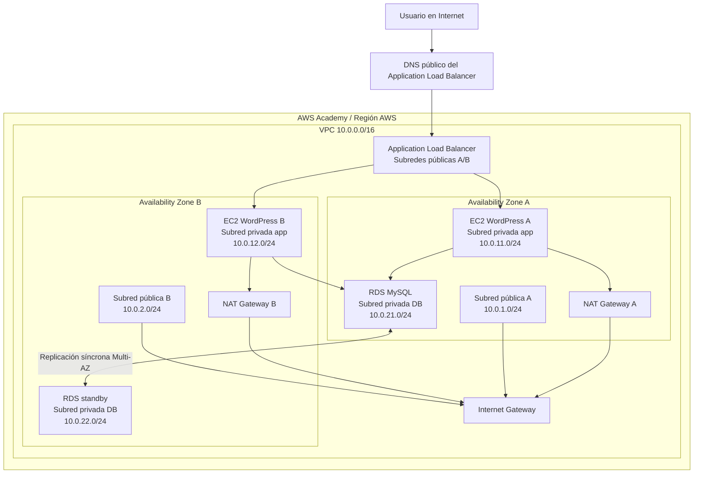

# Despliegue de un aplicativo en alta disponibilidad en AWS Academy

## 1. Objetivo de la guía

Esta guía describe cómo desplegar, dentro de una sesión de AWS Academy de aproximadamente 4 horas, una aplicación web en alta disponibilidad usando una VPC con subredes públicas y privadas, balanceador de carga, grupo de autoescalado y base de datos RDS en subredes privadas.

La arquitectura propuesta cumple los requisitos de la actividad:

- Una VPC con direccionamiento privado y seis subredes.
- Dos subredes públicas para el Application Load Balancer y los NAT Gateway.
- Dos subredes privadas para las instancias EC2 del frontend/aplicación.
- Dos subredes privadas separadas para la base de datos RDS.
- Salida a Internet para subredes públicas mediante Internet Gateway.
- Salida a Internet para subredes privadas mediante NAT Gateway.
- Frontend desplegado en EC2 privadas y publicado por un balanceador.
- Auto Scaling Group para mantener al menos dos instancias del frontend.
- Base de datos RDS MySQL Multi-AZ en subredes privadas.

## 2. Aplicaciones recomendadas para desplegar

Para la actividad se recomienda elegir una aplicación que pueda instalarse rápido, que use una base de datos relacional y que permita demostrar la conexión entre ALB, EC2 privadas y RDS. Las siguientes cinco opciones son viables:

| Opción | Aplicación | Base de datos | Dificultad | Comentario |
|---|---|---:|---:|---|
| 1 | WordPress | MySQL/MariaDB | Baja | Recomendado. Tiene instalación rápida y evidencia visual clara. |
| 2 | MediaWiki | MySQL/MariaDB | Media | Útil para demostrar una wiki colaborativa. |
| 3 | Moodle | MySQL/PostgreSQL | Media | Adecuado para contexto educativo, pero tarda más en configurar. |
| 4 | Laravel demo app | MySQL/PostgreSQL | Media | Buena opción si el equipo conoce PHP y migraciones. |
| 5 | Django demo app | PostgreSQL/MySQL | Media | Buena opción académica, pero requiere preparar proyecto y variables. |

Para terminar en menos de 4 horas, se recomienda implementar WordPress sobre EC2 + RDS MySQL. Es la opción con menor riesgo operativo porque se puede instalar con `user data`, se valida desde navegador y usa los servicios solicitados por la rúbrica.

## 3. Arquitectura propuesta

### 3.1 Direccionamiento

Se usará una VPC con CIDR `10.0.0.0/16` distribuida en dos zonas de disponibilidad.

| Capa | Subred | CIDR | AZ | Uso |
|---|---|---:|---|---|
| Pública | `public-a` | `10.0.1.0/24` | AZ A | ALB y NAT Gateway A |
| Pública | `public-b` | `10.0.2.0/24` | AZ B | ALB y NAT Gateway B |
| Privada app | `app-private-a` | `10.0.11.0/24` | AZ A | EC2 frontend/app |
| Privada app | `app-private-b` | `10.0.12.0/24` | AZ B | EC2 frontend/app |
| Privada DB | `db-private-a` | `10.0.21.0/24` | AZ A | RDS primary o standby |
| Privada DB | `db-private-b` | `10.0.22.0/24` | AZ B | RDS primary o standby |

### 3.2 Diagrama Mermaid



## 4. Cómo funciona la arquitectura

El usuario no accede directamente a las instancias EC2 porque estas se ubican en subredes privadas. El único componente expuesto a Internet es el Application Load Balancer, desplegado en las dos subredes públicas. El balanceador recibe tráfico HTTP por el puerto 80 y lo distribuye hacia las instancias EC2 registradas en el Target Group.

Las instancias EC2 forman parte de un Auto Scaling Group. Esto permite mantener una capacidad mínima de dos instancias, una en cada zona de disponibilidad. Si una instancia falla, el grupo crea otra automáticamente. Si se configura una política de escalado, el grupo también puede aumentar o reducir la cantidad de instancias según métricas como CPU o número de solicitudes.

La base de datos se despliega con Amazon RDS MySQL en subredes privadas separadas de la capa de aplicación. El Security Group de RDS solo permite conexiones MySQL desde el Security Group de las EC2, no desde Internet. En modo Multi-AZ, RDS mantiene una réplica standby en otra zona de disponibilidad para mejorar disponibilidad y recuperación ante fallos.

Las subredes públicas salen a Internet mediante el Internet Gateway. Las subredes privadas salen a Internet mediante NAT Gateway. Esto es necesario para que las EC2 privadas puedan descargar paquetes durante el arranque, aplicar actualizaciones o instalar WordPress sin recibir conexiones entrantes directas desde Internet.

## 5. Plan de trabajo para una sesión de 4 horas

| Tiempo estimado | Actividad |
|---:|---|
| 0:00 - 0:15 | Iniciar AWS Academy Learner Lab, elegir región y definir nombres. |
| 0:15 - 0:55 | Crear VPC, seis subredes, Internet Gateway, NAT Gateway y rutas. |
| 0:55 - 1:20 | Crear Security Groups y DB Subnet Group. |
| 1:20 - 2:00 | Crear RDS MySQL Multi-AZ. |
| 2:00 - 2:35 | Crear Launch Template con script de instalación de WordPress. |
| 2:35 - 3:10 | Crear Target Group, ALB y Auto Scaling Group. |
| 3:10 - 3:35 | Validar aplicación, balanceador, instancias y RDS. |
| 3:35 - 4:00 | Tomar evidencias, completar informe y limpiar recursos si aplica. |

## 6. Pasos detallados en AWS Academy

### Paso 1. Iniciar el laboratorio

1. Entrar a AWS Academy.
2. Abrir el curso o módulo donde esté habilitado el Learner Lab.
3. Seleccionar `Start Lab`.
4. Esperar a que el indicador del laboratorio esté en verde.
5. Entrar a la consola con `AWS`.
6. Elegir una región única para todo el equipo, por ejemplo `us-east-1` o la región permitida por el laboratorio.
7. Definir un prefijo común para todos los recursos: `act2-equipoX`.

Evidencia recomendada: captura del panel de AWS Academy con el laboratorio activo y captura de la región seleccionada.

### Paso 2. Crear la VPC y las seis subredes

1. Ir a `VPC > Your VPCs > Create VPC`.
2. Seleccionar `VPC only`.
3. Nombre: `act2-equipoX-vpc`.
4. CIDR IPv4: `10.0.0.0/16`.
5. Crear la VPC.
6. Ir a `Subnets > Create subnet`.
7. Crear las seis subredes de la tabla de direccionamiento.
8. Activar `Auto-assign public IPv4 address` únicamente en `public-a` y `public-b`.

Evidencia recomendada: captura de la lista de subredes mostrando nombres, CIDR y Availability Zone.

### Paso 3. Crear Internet Gateway

1. Ir a `VPC > Internet gateways > Create internet gateway`.
2. Nombre: `act2-equipoX-igw`.
3. Crear el Internet Gateway.
4. Seleccionarlo y usar `Actions > Attach to VPC`.
5. Asociarlo a `act2-equipoX-vpc`.

### Paso 4. Crear NAT Gateway

Para alta disponibilidad se recomienda crear un NAT Gateway por zona de disponibilidad.

1. Ir a `VPC > NAT gateways > Create NAT gateway`.
2. Crear `act2-equipoX-nat-a` en `public-a`.
3. Asignar una Elastic IP nueva.
4. Repetir el proceso para `act2-equipoX-nat-b` en `public-b`.
5. Esperar a que ambos NAT Gateway estén en estado `Available`.

Si el laboratorio tiene restricciones de crédito o permisos, usar un solo NAT Gateway como alternativa temporal y documentar la limitación. La arquitectura ideal para la rúbrica es un NAT por AZ.

### Paso 5. Crear tablas de rutas

Crear tres tablas de rutas.

Tabla pública:

1. Nombre: `act2-equipoX-rt-public`.
2. Asociar `public-a` y `public-b`.
3. Agregar ruta `0.0.0.0/0` hacia `act2-equipoX-igw`.

Tabla privada app A:

1. Nombre: `act2-equipoX-rt-private-a`.
2. Asociar `app-private-a`.
3. Agregar ruta `0.0.0.0/0` hacia `act2-equipoX-nat-a`.

Tabla privada app B:

1. Nombre: `act2-equipoX-rt-private-b`.
2. Asociar `app-private-b`.
3. Agregar ruta `0.0.0.0/0` hacia `act2-equipoX-nat-b`.

Para cumplir literalmente el requisito de salida a Internet desde redes privadas, asociar también `db-private-a` a `rt-private-a` y `db-private-b` a `rt-private-b`. RDS seguirá sin estar expuesto a Internet porque `Public access` estará en `No` y su Security Group solo aceptará tráfico MySQL desde `act2-equipoX-sg-app`. En un entorno productivo más restrictivo, la capa de base de datos normalmente tendría una tabla de rutas solo local, porque RDS no necesita recibir tráfico desde Internet.

### Paso 6. Crear Security Groups

Crear tres Security Groups.

`act2-equipoX-sg-alb`:

| Tipo | Protocolo | Puerto | Origen |
|---|---|---:|---|
| HTTP | TCP | 80 | `0.0.0.0/0` |

Salida: permitir todo.

`act2-equipoX-sg-app`:

| Tipo | Protocolo | Puerto | Origen |
|---|---|---:|---|
| HTTP | TCP | 80 | `act2-equipoX-sg-alb` |

Salida: permitir todo.

`act2-equipoX-sg-db`:

| Tipo | Protocolo | Puerto | Origen |
|---|---|---:|---|
| MySQL/Aurora | TCP | 3306 | `act2-equipoX-sg-app` |

Salida: permitir todo.

No abrir SSH a Internet. Para esta práctica no es necesario conectarse por SSH si el despliegue se automatiza con `user data`.

### Paso 7. Crear DB Subnet Group

1. Ir a `RDS > Subnet groups > Create DB subnet group`.
2. Nombre: `act2-equipoX-db-subnet-group`.
3. VPC: `act2-equipoX-vpc`.
4. Seleccionar las AZ usadas por `db-private-a` y `db-private-b`.
5. Seleccionar las subredes `db-private-a` y `db-private-b`.
6. Crear el grupo.

### Paso 8. Crear RDS MySQL en alta disponibilidad

1. Ir a `RDS > Databases > Create database`.
2. Método: `Standard create`.
3. Motor: `MySQL`.
4. Template: `Free tier` si está disponible; si no permite Multi-AZ, usar `Dev/Test`.
5. DB instance identifier: `act2-equipoX-mysql`.
6. Usuario maestro: `wpadmin`.
7. Contraseña: definir una contraseña temporal segura y guardarla para el equipo. Para evitar errores en el script de `user data`, usar una contraseña alfanumérica durante la práctica.
8. Clase: `db.t3.micro` o la menor permitida por AWS Academy.
9. Storage: `gp3` o `gp2`, tamaño mínimo permitido.
10. Multi-AZ: habilitar `Create a standby instance` si está disponible.
11. VPC: `act2-equipoX-vpc`.
12. DB subnet group: `act2-equipoX-db-subnet-group`.
13. Public access: `No`.
14. Security Group: `act2-equipoX-sg-db`.
15. Database authentication: contraseña.
16. Initial database name: `wordpress`.
17. Crear la base de datos.
18. Esperar estado `Available`.
19. Copiar el endpoint de RDS.

Evidencia recomendada: captura de RDS mostrando `Available`, subred privada, Security Group y, si está disponible, Multi-AZ.

### Paso 9. Crear Launch Template para WordPress

1. Ir a `EC2 > Launch Templates > Create launch template`.
2. Nombre: `act2-equipoX-lt-wordpress`.
3. AMI: Amazon Linux 2023.
4. Tipo de instancia: `t3.micro` o `t2.micro`, según disponibilidad.
5. Key pair: `Proceed without a key pair`.
6. Network settings: no seleccionar subred aquí.
7. Security Group: `act2-equipoX-sg-app`.
8. Advanced details > User data: pegar el siguiente script, sustituyendo los valores de RDS.

```bash
#!/bin/bash
dnf update -y
dnf install -y httpd php php-mysqli php-json php-gd php-mbstring wget tar
systemctl enable --now httpd

cd /tmp
wget https://wordpress.org/latest.tar.gz
tar -xzf latest.tar.gz
cp -r wordpress/* /var/www/html/
chown -R apache:apache /var/www/html
chmod -R 755 /var/www/html

cp /var/www/html/wp-config-sample.php /var/www/html/wp-config.php
sed -i "s/database_name_here/wordpress/" /var/www/html/wp-config.php
sed -i "s/username_here/wpadmin/" /var/www/html/wp-config.php
sed -i "s/password_here/REEMPLAZAR_PASSWORD_RDS/" /var/www/html/wp-config.php
sed -i "s/localhost/REEMPLAZAR_ENDPOINT_RDS/" /var/www/html/wp-config.php

cat > /var/www/html/health.html <<'EOF'
ok
EOF

systemctl restart httpd
```

Notas:

- `REEMPLAZAR_PASSWORD_RDS` debe ser la contraseña configurada en RDS.
- `REEMPLAZAR_ENDPOINT_RDS` debe ser el endpoint de RDS sin el puerto.
- El archivo `health.html` permite que el Target Group valide la salud de cada instancia.

### Paso 10. Crear Target Group

1. Ir a `EC2 > Target Groups > Create target group`.
2. Tipo: `Instances`.
3. Nombre: `act2-equipoX-tg-wordpress`.
4. Protocolo: HTTP.
5. Puerto: 80.
6. VPC: `act2-equipoX-vpc`.
7. Health check path: `/health.html`.
8. Crear el Target Group sin registrar instancias manualmente.

### Paso 11. Crear Application Load Balancer

1. Ir a `EC2 > Load Balancers > Create load balancer`.
2. Seleccionar `Application Load Balancer`.
3. Nombre: `act2-equipoX-alb`.
4. Scheme: `Internet-facing`.
5. IP address type: IPv4.
6. VPC: `act2-equipoX-vpc`.
7. Seleccionar `public-a` y `public-b`.
8. Security Group: `act2-equipoX-sg-alb`.
9. Listener HTTP 80: reenviar a `act2-equipoX-tg-wordpress`.
10. Crear el ALB.

### Paso 12. Crear Auto Scaling Group

1. Ir a `EC2 > Auto Scaling Groups > Create Auto Scaling group`.
2. Nombre: `act2-equipoX-asg-wordpress`.
3. Launch template: `act2-equipoX-lt-wordpress`.
4. VPC: `act2-equipoX-vpc`.
5. Subredes: `app-private-a` y `app-private-b`.
6. Asociar al Load Balancer existente.
7. Target Group: `act2-equipoX-tg-wordpress`.
8. Health checks: habilitar ELB health checks.
9. Desired capacity: 2.
10. Minimum capacity: 2.
11. Maximum capacity: 4.
12. Política de escalado: target tracking con CPU promedio de 60 %, si el laboratorio lo permite.
13. Crear el Auto Scaling Group.

### Paso 13. Validar el despliegue

1. Ir al Target Group y verificar que existan dos targets `Healthy`.
2. Ir al Auto Scaling Group y confirmar que hay dos instancias `InService`.
3. Abrir el DNS del ALB en el navegador.
4. Completar la instalación inicial de WordPress.
5. Crear una publicación de prueba: `Prueba alta disponibilidad`.
6. Recargar varias veces el sitio.
7. Detener manualmente una instancia desde EC2 para probar autorrecuperación.
8. Confirmar que Auto Scaling crea una instancia nueva.
9. Confirmar que el sitio sigue respondiendo desde el DNS del ALB.

Evidencias recomendadas:

- VPC con seis subredes.
- Tablas de rutas con Internet Gateway y NAT Gateway.
- Security Groups.
- RDS privado y Multi-AZ.
- Target Group con targets `Healthy`.
- Auto Scaling Group con dos instancias.
- Sitio WordPress funcionando por DNS del ALB.
- Prueba de reemplazo de instancia.

## 7. Guía rápida para replicar en otra instancia de AWS Academy

Cada integrante del equipo puede replicar la práctica siguiendo esta lista.

1. Iniciar AWS Academy Learner Lab y abrir consola AWS.
2. Usar la misma región acordada por el equipo.
3. Crear VPC `10.0.0.0/16`.
4. Crear seis subredes:
   - `public-a`: `10.0.1.0/24`
   - `public-b`: `10.0.2.0/24`
   - `app-private-a`: `10.0.11.0/24`
   - `app-private-b`: `10.0.12.0/24`
   - `db-private-a`: `10.0.21.0/24`
   - `db-private-b`: `10.0.22.0/24`
5. Crear Internet Gateway y asociarlo a la VPC.
6. Crear NAT Gateway en cada subred pública.
7. Crear tabla pública con ruta `0.0.0.0/0` al Internet Gateway.
8. Crear tablas privadas con ruta `0.0.0.0/0` al NAT Gateway de su AZ.
9. Crear Security Groups para ALB, aplicación y RDS.
10. Crear DB Subnet Group con las dos subredes DB.
11. Crear RDS MySQL privado, con base inicial `wordpress`.
12. Copiar endpoint, usuario y contraseña de RDS.
13. Crear Launch Template de EC2 con Amazon Linux 2023 y el `user data` de WordPress.
14. Crear Target Group HTTP 80 con health check `/health.html`.
15. Crear ALB público en las dos subredes públicas.
16. Crear Auto Scaling Group en las dos subredes privadas de aplicación.
17. Esperar targets `Healthy`.
18. Abrir DNS del ALB y completar instalación de WordPress.
19. Tomar capturas de evidencia.
20. Eliminar recursos al finalizar si el laboratorio lo requiere.

## 8. Criterios de aceptación

El despliegue puede considerarse terminado cuando se cumplen estas condiciones:

- Existen seis subredes en una VPC propia.
- Las subredes públicas tienen ruta hacia Internet Gateway.
- Las subredes privadas de aplicación tienen ruta hacia NAT Gateway.
- El Application Load Balancer es público y está en dos subredes públicas.
- Las EC2 no tienen IP pública y están en subredes privadas.
- El Target Group muestra al menos dos instancias saludables.
- El Auto Scaling Group mantiene dos instancias como capacidad deseada.
- RDS está en subredes privadas y no es públicamente accesible.
- La aplicación carga desde el DNS del ALB.
- La base de datos funciona porque WordPress permite completar instalación y crear contenido.

## 9. Riesgos y mitigaciones

| Riesgo | Impacto | Mitigación |
|---|---|---|
| AWS Academy no permite Multi-AZ en RDS | Puede afectar la rúbrica de backend HA | Documentar la restricción, crear DB Subnet Group multi-AZ y usar la opción disponible más cercana. |
| NAT Gateway tarda en estar disponible | Retrasa instalación por user data | Crear NAT antes de RDS y EC2. |
| Las instancias aparecen `Unhealthy` | ALB no envía tráfico | Revisar Security Groups, ruta privada a NAT y health check `/health.html`. |
| WordPress no conecta con RDS | Aplicación no instala | Revisar endpoint, contraseña, DB name y regla 3306 desde `sg-app` a `sg-db`. |
| Se agota la sesión de 4 horas | Pérdida de avance | Seguir el orden de esta guía y tomar evidencias conforme se crean recursos. |

## 10. Limpieza de recursos

Para evitar consumo innecesario de créditos, eliminar recursos en este orden:

1. Auto Scaling Group, seleccionando terminar instancias.
2. Application Load Balancer.
3. Target Group.
4. RDS.
5. NAT Gateway.
6. Elastic IP liberadas.
7. Launch Template.
8. Security Groups personalizados.
9. Route Tables personalizadas.
10. Subredes.
11. Internet Gateway.
12. VPC.

## 11. Referencias

Amazon Web Services. (s. f.). *Example: VPC with servers in private subnets and NAT*. AWS Documentation. https://docs.aws.amazon.com/vpc/latest/userguide/vpc-example-private-subnets-nat.html

Amazon Web Services. (s. f.). *Use Elastic Load Balancing to distribute incoming application traffic in your Auto Scaling group*. AWS Documentation. https://docs.aws.amazon.com/autoscaling/ec2/userguide/autoscaling-load-balancer.html

Amazon Web Services. (s. f.). *Multi-AZ DB instance deployments for Amazon RDS*. AWS Documentation. https://docs.aws.amazon.com/AmazonRDS/latest/UserGuide/Concepts.MultiAZSingleStandby.html

Amazon Web Services. (s. f.). *Working with a DB instance in a VPC*. AWS Documentation. https://docs.aws.amazon.com/AmazonRDS/latest/UserGuide/USER_VPC.WorkingWithRDSInstanceinaVPC.html
