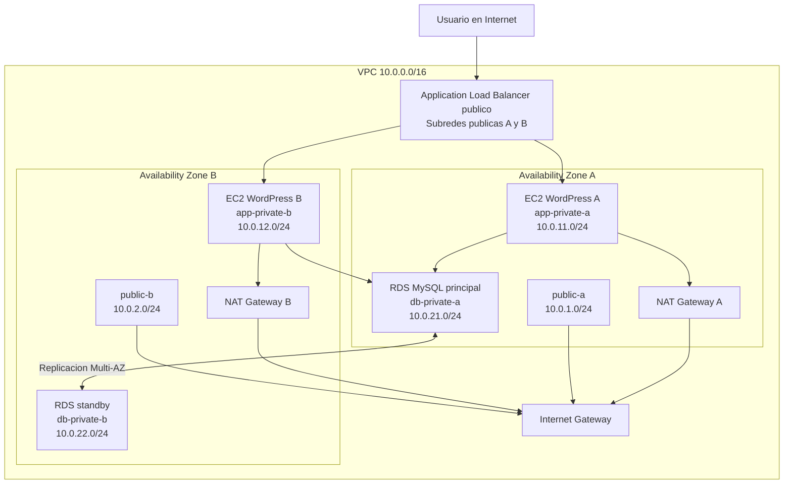

# Documento de entrega y plan de trabajo del equipo

## 1. Proposito del documento

Este documento define como debe estructurarse el informe final de la actividad grupal y como se debe dividir el trabajo entre los integrantes del equipo. Se toma como base el enunciado y la rubrica de `mexissi06_act2_grupal.md`, junto con la guia tecnica de implementacion definida en `01-Guia.md`.

## 2. Documento final que se debe entregar

La entrega debe ser un PDF de maximo 20 paginas, con fuente Calibri 11 e interlineado 1.5. El documento debe mantener redaccion academica, capturas de evidencia y referencias en formato APA.

### 2.1 Estructura recomendada del PDF

| Seccion                            | Paginas sugeridas | Contenido esperado                                                                               |
| ---------------------------------- | ----------------: | ------------------------------------------------------------------------------------------------ |
| Portada                            |                 1 | Nombre de la universidad, asignatura, actividad, integrantes, fecha y titulo del proyecto.       |
| Resumen ejecutivo                  |                 1 | Explicacion breve del objetivo, la aplicacion desplegada y los servicios AWS usados.             |
| Requisitos de la actividad         |                 1 | Relacion directa entre la rubrica y la arquitectura implementada.                                |
| Arquitectura propuesta             |                 2 | Diagrama de red, descripcion de capas, VPC, subredes, rutas y componentes.                       |
| Justificacion tecnica              |                 2 | Por que se usa ALB, Auto Scaling, EC2 privadas, NAT Gateway y RDS Multi-AZ.                      |
| Implementacion en AWS Academy      |                 5 | Pasos ejecutados con capturas: VPC, subredes, rutas, Security Groups, RDS, ALB, ASG y WordPress. |
| Validacion de funcionamiento       |                 2 | Evidencias de targets saludables, WordPress funcionando, RDS privado y prueba de recuperacion.   |
| Trabajo grupal y replicacion       |                 2 | Distribucion de tareas y evidencia de que cada participante intento replicar la guia.            |
| Riesgos, limitaciones y decisiones |                 1 | Restricciones de AWS Academy, decisiones tomadas y mitigaciones aplicadas.                       |
| Conclusiones                       |                 1 | Resultado obtenido y aprendizaje sobre alta disponibilidad en nube publica.                      |
| Referencias                        |                 1 | Fuentes AWS y documentacion consultada en formato APA.                                           |

## 3. Enfoque recomendado para el informe

El informe debe responder claramente a la rubrica. Cada criterio debe tener evidencia visible:

- Red: mostrar VPC, seis subredes, tablas de rutas, Internet Gateway y NAT Gateway.
- Frontend HA: mostrar Application Load Balancer, Target Group saludable y Auto Scaling Group con dos instancias.
- Backend HA: mostrar RDS en subredes privadas, DB Subnet Group y configuracion Multi-AZ si AWS Academy lo permite.
- Redaccion y citacion: usar lenguaje formal, evitar expresiones coloquiales y citar la documentacion oficial de AWS.
- Ortografia: revisar acentos, nombres tecnicos y consistencia antes de exportar a PDF.

## 4. Arquitectura que debe documentarse

La arquitectura final a documentar es una aplicacion WordPress desplegada en EC2 privadas, publicada mediante un Application Load Balancer y conectada a una base de datos RDS MySQL privada.

Componentes principales:

- VPC `10.0.0.0/16`.
- Dos subredes publicas para ALB y NAT Gateway.
- Dos subredes privadas para EC2 WordPress.
- Dos subredes privadas separadas para RDS.
- Internet Gateway para salida desde subredes publicas.
- NAT Gateway para salida desde subredes privadas.
- Application Load Balancer publico con listener HTTP 80.
- Target Group con health check `/health.html`.
- Auto Scaling Group con capacidad deseada 2, minima 2 y maxima 4.
- RDS MySQL privado con DB Subnet Group multi-AZ.
- Security Groups separados para ALB, aplicacion y base de datos.

## 5. Diagrama para incluir en el informe

Este diagrama puede incluirse como Mermaid en el documento fuente y exportarse como imagen para el PDF final.

## 6. Evidencias minimas que debe contener el PDF

Cada captura debe tener un pie de figura explicando que demuestra. No conviene insertar capturas sin contexto.

| Evidencia | Que debe demostrar |
|---|---|
| AWS Academy activo | Que se uso la cuenta del laboratorio. |
| VPC | Que existe una red propia con CIDR privado. |
| Subredes | Que hay seis subredes distribuidas en dos zonas de disponibilidad. |
| Tablas de rutas | Que las publicas salen por Internet Gateway y las privadas por NAT Gateway. |
| Security Groups | Que ALB, EC2 y RDS estan separados por reglas especificas. |
| RDS | Que la base de datos esta en subredes privadas y no es publica. |
| DB Subnet Group | Que RDS usa subredes en al menos dos zonas de disponibilidad. |
| Launch Template | Que la instalacion del frontend se automatizo con `user data`. |
| Target Group | Que existen instancias saludables. |
| Auto Scaling Group | Que se mantiene capacidad minima de dos instancias. |
| ALB DNS | Que la aplicacion responde desde Internet por el balanceador. |
| Prueba de recuperacion | Que al detener una instancia el sistema conserva disponibilidad o la reemplaza. |

## 7. Division del trabajo en cinco tareas

Aunque cada integrante debe intentar replicar la guia en su propia instancia de AWS Academy, el informe grupal se puede organizar en cinco responsabilidades principales.

| Tarea | Responsable sugerido | Entregable |
|---|---|---|
| Tarea 1: Arquitectura y red | Integrante 1 | Diseno de VPC, subredes, rutas, Internet Gateway, NAT Gateway y diagrama final. |
| Tarea 2: Seguridad y base de datos | Integrante 2 | Security Groups, DB Subnet Group, RDS MySQL privado y evidencia de alta disponibilidad. |
| Tarea 3: Frontend y despliegue | Integrante 3 | Launch Template, `user data`, WordPress, Target Group, ALB y validacion del acceso web. |
| Tarea 4: Auto Scaling y pruebas | Integrante 4 | Auto Scaling Group, health checks, prueba de reemplazo de instancia y resultados. |
| Tarea 5: Informe y calidad | Integrante 5 | Integracion del PDF, redaccion academica, formato, referencias APA y revision ortografica. |

Si el equipo tiene menos de cinco integrantes, una persona puede asumir dos tareas. Si el equipo tiene mas de cinco, se puede agregar apoyo en capturas, revision tecnica o edicion del PDF.

## 8. Replicacion individual obligatoria

Ademas de la division anterior, cada participante debe intentar implementar la guia de `01-Guia.md` en su propia sesion de AWS Academy. El objetivo no es que todos creen un informe separado, sino que cada integrante entienda el despliegue y aporte evidencia de practica real.

Cada participante debe entregar al equipo:

- Nombre del participante.
- Region utilizada en AWS Academy.
- Prefijo usado para los recursos, por ejemplo `act2-nombre`.
- Captura de VPC y subredes.
- Captura de RDS o intento de RDS si AWS Academy limita permisos.
- Captura de ALB, Target Group o Auto Scaling Group.
- Captura del sitio WordPress funcionando o descripcion del bloqueo encontrado.
- Tiempo total invertido.
- Problemas encontrados y como se resolvieron.

### 8.1 Tabla de seguimiento individual

| Participante | Region | VPC creada | RDS creado | ALB creado | ASG creado | WordPress funciona | Bloqueos |
|---|---|---|---|---|---|---|---|
| Integrante 1 | Pendiente | Pendiente | Pendiente | Pendiente | Pendiente | Pendiente | Pendiente |
| Integrante 2 | Pendiente | Pendiente | Pendiente | Pendiente | Pendiente | Pendiente | Pendiente |
| Integrante 3 | Pendiente | Pendiente | Pendiente | Pendiente | Pendiente | Pendiente | Pendiente |
| Integrante 4 | Pendiente | Pendiente | Pendiente | Pendiente | Pendiente | Pendiente | Pendiente |
| Integrante 5 | Pendiente | Pendiente | Pendiente | Pendiente | Pendiente | Pendiente | Pendiente |

## 9. Plan de ejecucion grupal

### Antes de la implementacion

1. Acordar region AWS, prefijo de recursos y contrasena temporal para RDS.
2. Revisar `01-Guia.md` completa antes de iniciar AWS Academy.
3. Crear una carpeta compartida para capturas.
4. Asignar las cinco tareas del apartado anterior.
5. Definir un integrante responsable de consolidar el PDF.

### Durante la implementacion

1. Iniciar el laboratorio y anotar hora de inicio.
2. Crear la red primero: VPC, subredes, rutas, Internet Gateway y NAT Gateway.
3. Crear Security Groups antes de RDS y EC2.
4. Crear RDS y copiar endpoint.
5. Crear Launch Template con el endpoint de RDS.
6. Crear Target Group, ALB y Auto Scaling Group.
7. Validar la aplicacion desde el DNS del ALB.
8. Tomar capturas conforme se completa cada bloque.

### Despues de la implementacion

1. Completar la tabla de seguimiento individual.
2. Seleccionar las mejores capturas para el informe final.
3. Redactar la explicacion tecnica con base en la evidencia.
4. Revisar el PDF contra la rubrica.
5. Limpiar recursos en AWS Academy si el laboratorio queda activo.

## 10. Criterios de calidad antes de entregar

Antes de exportar el PDF, verificar lo siguiente:

- El documento no excede 20 paginas.
- El formato usa Calibri 11 e interlineado 1.5.
- El informe explica que se desplego, no solo enumera pasos.
- El diagrama de red coincide con las capturas.
- Las capturas tienen pie de figura y son legibles.
- La arquitectura cumple seis subredes, ALB, ASG y RDS privado.
- Se incluye evidencia de que cada participante intento replicar la guia.
- Las referencias estan en formato APA.
- No hay contrasenas visibles en capturas.
- No hay faltas de ortografia ni texto informal.

## 11. Referencias base para el informe

Amazon Web Services. (s. f.). *Example: VPC with servers in private subnets and NAT*. AWS Documentation. https://docs.aws.amazon.com/vpc/latest/userguide/vpc-example-private-subnets-nat.html

Amazon Web Services. (s. f.). *Use Elastic Load Balancing to distribute incoming application traffic in your Auto Scaling group*. AWS Documentation. https://docs.aws.amazon.com/autoscaling/ec2/userguide/autoscaling-load-balancer.html

Amazon Web Services. (s. f.). *Multi-AZ DB instance deployments for Amazon RDS*. AWS Documentation. https://docs.aws.amazon.com/AmazonRDS/latest/UserGuide/Concepts.MultiAZSingleStandby.html

Amazon Web Services. (s. f.). *Working with a DB instance in a VPC*. AWS Documentation. https://docs.aws.amazon.com/AmazonRDS/latest/UserGuide/USER_VPC.WorkingWithRDSInstanceinaVPC.html
