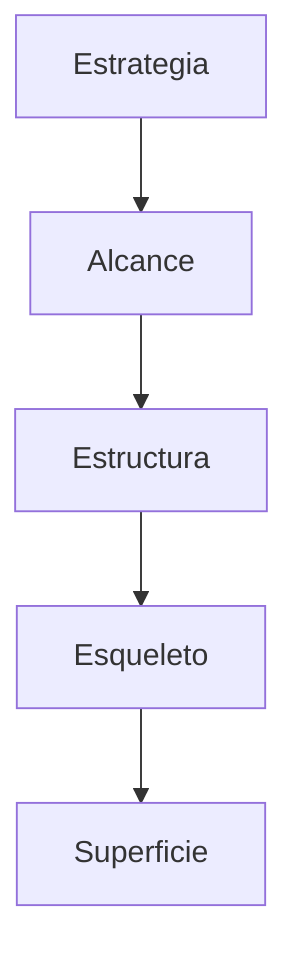
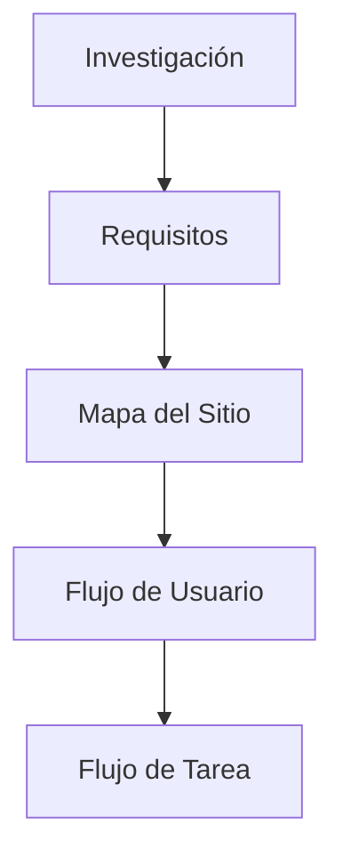

# Introducción a la Asignatura: Experiencia Del Usuario En la Web

## 1. Objetivo De la Asignatura

### Definición General

La asignatura tiene como objetivo enseñar a desarrollar sitios web:

- Accesibles
    
- Usables
    
- Evaluables mediante métricas

Siguiendo estándares establecidos por el W3C.

### Conceptos Clave

#### Usabilidad

- **Definición**: Facilidad con la que un usuario puede utilizar un sistema para lograr un objetivo.
    
- **Importancia**: Reduce errores, mejora eficiencia y satisfacción.
    
- **Contexto**: Interfaces web, aplicaciones, sistemas digitales.

#### Experiencia De Usuario (UX)

- **Definición**: Percepción global del usuario al interactuar con un producto.
    
- **Incluye**: emociones, facilidad de uso, eficiencia.
    
- **Perspectivas**:
    
    - Usuario: facilidad y satisfacción
        
    - Cliente: cumplimiento de objetivos de negocio
        
    - Professional: implementación técnica y diseño

---

## 2. Conceptos Fundamentales En UX

### Diferenciación De Términos

|Término|Definición|
|---|---|
|Página Web|Documento individual accessible en internet|
|Sitio Web|Conjunto de páginas relacionadas|
|Aplicación Web|Software interactivo ejecutado en navegador|

---

## 3. Factores Cognitivos, Sociales Y Emocionales

### Relación Con UX

#### Cognición

- Procesos mentales: memoria, atención, percepción
    
- Impacto: facilidad de navegación y comprensión

#### Factores Sociales

- Interacción entre usuarios
    
- Influencia de comportamientos colectivos

#### Emociones

- Respuesta emocional al diseño
    
- Impacto directo en la satisfacción

### Relevancia

Estos factores son la base de los principios de usabilidad y diseño centrado en el usuario.

---

## 4. Disciplinas Y Fundamentos Del UX

### Contexto Histórico

- Surgimiento en los años 80
    
- Baja estandarización inicial

### Modelo De Jesse James Garrett

Este modelo define los elementos de UX en distintos niveles:

### Explicación De Niveles

|Nivel|Descripción|
|---|---|
|Estrategia|Objetivos del negocio y necesidades del usuario|
|Alcance|Requisitos funcionales y de contenido|
|Estructura|Arquitectura de información e interacción|
|Esqueleto|Wireframes y disposición|
|Superficie|Diseño visual final|

### Entregables

- Documentos generados en cada etapa (ej: wireframes, mapas, prototipos)

---

## 5. Metodologías Y Procesos De Diseño UX

### Definición

Marco conceptual para estructurar el diseño UX.

### Características

- No son rígidas
    
- Se adaptan al proyecto y contexto
    
- Sirven como guía, no como reglas estrictas

### Importancia

Permiten:

- Organizar el trabajo
    
- Reducir incertidumbre
    
- Mejorar resultados

---

## 6. Investigación Y Requisitos De Usuario

### Fases

1. **Recogida de Información**
    
    - Entrevistas
        
    - Encuestas
        
    - Observación
        
2. **Organización de Datos**
    
    - Clasificación
        
    - Análisis
        
3. **Priorización**
    
    - Identificación de necesidades clave

### Objetivo

Definir requisitos claros para el diseño.

---

## 7. Diagramación En UX

### Elementos Principales

#### Mapa Del Sitio

- Representación estructural del contenido

#### Flujo De Usuario

- Camino que sigue el usuario

#### Flujo De Tarea

- Pasos específicos para completar una acción

### Relación De Components

### Disciplinas Relacionadas

|Disciplina|Función|
|---|---|
|Arquitectura de Información|Organización del contenido|
|Diseño de Interacción|Definición de comportamientos|

---

## 8. Interfaces De Usuario (UI)

### Objetivo

Definir:

- Tipos de interfaces
    
- Elementos formales
    
- Components comunes

### Beneficio

Crear un lenguaje común de diseño.

---

## 9. Prototipado UX

### Definición

Creación de representaciones del producto antes de su desarrollo final.

### Características

- Diseño visual
    
- Contenido
    
- Interactividad

### Tipos

- Baja fidelidad
    
- Alta fidelidad

### Evaluación

- Pruebas con usuarios
    
- Validación de diseño

---

## 10. Diseño Visual

### Definición

Etapa final donde se define la apariencia del producto.

### Elementos

|Elemento|Función|
|---|---|
|Tipografía|Legibilidad|
|Colores|Identidad visual|
|Imágenes|Comunicación|
|Composición|Organización visual|

### Objetivo

Mejorar la comunicación entre usuario y cliente.

### Técnicas

#### Moodboard

- Colección visual de inspiración

#### Guía Visual

- Documento con reglas de diseño

---

## 11. Diseño Visual Avanzado Y Colaboración

### Relación Diseñador - Desarrollador

- El diseñador define estilo
    
- El desarrollador implementa en código

### Importancia

Trabajo colaborativo, especialmente en metodologías ágiles.

### Elementos Modernos

- Sistemas de diseño
    
- Bibliotecas de components
    
- UI Kits

### Ventajas

- Consistencia
    
- Reutilización
    
- Escalabilidad

---

## 12. Principios Avanzados Y Ética

### Influencias

- Diseño
    
- Marketing
    
- Neurociencia

### Dark Patterns

#### Definición

Prácticas de diseño que manipulan al usuario.

#### Ejemplos

- Confusión intencional
    
- Opciones engañosas

#### Importancia

- Deben evitarse
    
- Implican ética professional

---

## Resumen De Puntos Clave

- UX busca crear experiencias útiles, usables y satisfactorias.
    
- Se basa en estándares como los del W3C.
    
- Involucra factores cognitivos, sociales y emocionales.
    
- El modelo de Garrett estructura el diseño en 5 niveles.
    
- Las metodologías UX son flexibles y adaptativas.
    
- La investigación de usuario es fundamental para definir requisitos.
    
- Diagrams como mapas de sitio y flujos son esenciales.
    
- El diseño visual representa la fase final del proceso.
    
- La colaboración entre diseñador y desarrollador es clave.
    
- Los sistemas de diseño mejoran consistencia y eficiencia.
    
- La ética en UX evita prácticas manipulativas como los dark patterns.

---

