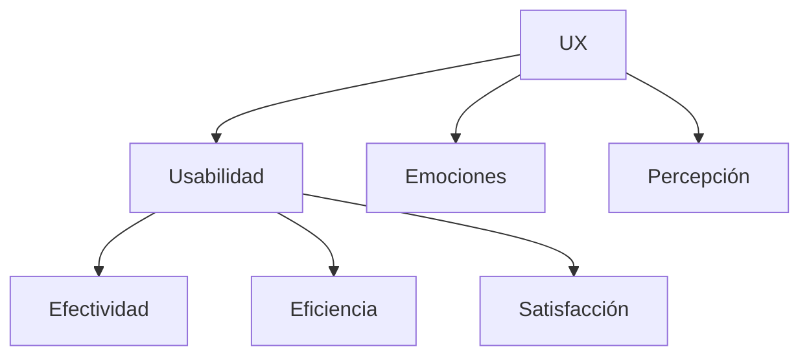

# 1. Introducción a la Experiencia De Usuario (UX) Y Usabilidad

## 1.1 Contexto: Interacción Cotidiana Con la Tecnología

El estudio de la experiencia de usuario (UX) comienza a partir de la observación de cómo las personas interactúan diariamente con herramientas digitales.

### Idea Central

Las tecnologías están diseñadas para:

- Facilitar tareas
    
- Mejorar productividad
    
- Simplificar la vida

Sin embargo, en la práctica pueden generar:

- Frustración
    
- Confusión
    
- Errores

### Pregunta De Reflexión (del transcript)

> “¿Cuáles han sido sus experiencias negativas con las tecnologías y cuáles han sido sus experiencias positivas?”

#### Interpretación

Esta pregunta busca:

- Activar conciencia crítica
    
- Identificar problemas reales de diseño
    
- Conectar teoría con experiencia personal

---

# 2. Experiencias Negativas En UX

## 2.1 Ejemplos Mencionados

### Caso 1: Impresora Que no Imprime

- **Problema**: Falta de feedback claro
    
- **UX issue**: El sistema no comunica el estado real

### Caso 2: Formulario Que Se Borra

- **Problema**: Error sin recuperación
    
- **UX issue**: Mala gestión de errores y persistencia de datos

### Caso 3: Compra Online Fallida

- **Problema**: Sesión se cierra sin explicación
    
- **UX issue**: Falta de visibilidad del sistema

### Caso 4: Aplicaciones Médicas Complejas

- **Problema**: Interfaz difícil de usar
    
- **UX issue**: Impacto crítico en contextos sensibles

## 2.2 Análisis Profundo

Estas situaciones comparten fallas comunes:

|Problema UX|Descripción|Impacto|
|---|---|---|
|Falta de feedback|El sistema no informa qué sucede|Confusión|
|Mala tolerancia a errores|No hay recuperación|Frustración|
|Diseño no centrado en usuario|No considera contexto real|Ineficiencia|
|Sobrecarga cognitiva|Difícil de entender|Fatiga mental|

### Enriquecimiento

Estos problemas violan principios clásicos como:

- Visibilidad del estado del sistema
    
- Control del usuario
    
- Prevención de errores

---

# 3. Experiencias Positivas En UX

## 3.1 Interfaces Táctiles

El transcript menciona un cambio clave:

- Introducción de interfaces táctiles
    
- Uso intuitivo en dispositivos móviles

Ejemplo clave:  
iPhone

## 3.2 Impacto Del Cambio

### Antes

- Interacción indirecta (teclado, mouse)

### Después

- Interacción directa (toque)

### Beneficios

|Beneficio|Explicación|
|---|---|
|Intuitividad|Menor curva de aprendizaje|
|Naturalidad|Interacción similar al mundo físico|
|Accesibilidad|Más usuarios pueden usarlo|

### Enriquecimiento

Este cambio representa:

- Evolución del paradigma de interacción
    
- Base del diseño centrado en el usuario moderno

---

# 4. Usabilidad

## 4.1 Definición Formal

Según la ISO:

> La usabilidad se compone de efectividad, eficiencia y satisfacción.

---

## 4.2 Components De la Usabilidad

### Tabla Resumen

|Componente|Definición|Ejemplo|Importancia|
|---|---|---|---|
|Efectividad|Precisión y completitud al lograr objetivos|Completar un formulario correctamente|Garantiza resultados|
|Eficiencia|Recursos utilizados (tiempo/esfuerzo)|Tiempo para comprar|Optimiza rendimiento|
|Satisfacción|Nivel de agrado del usuario|Experiencia agradable|Fidelización|

---

## 4.3 Explicación Detallada

### Efectividad

- Evalúa si el usuario logra su objetivo
    
- Métrica: tasa de éxito

### Eficiencia

- Evalúa cuánto esfuerzo se require
    
- Métrica: tiempo, número de pasos

### Satisfacción

- Evalúa la percepción subjetiva
    
- Incluye emociones y comodidad

---

# 5. Experiencia De Usuario (UX)

## 5.1 Definición Completa

> “Las percepciones y respuestas del usuario que son resultado del uso de un sistema, producto o servicio ante la expectativa de su utilización.”

### Interpretación Del Quote

- UX no es solo uso
    
- Incluye expectativas previas
    
- Incluye reacción posterior

---

## 5.2 Components De la UX

Incluye múltiples dimensions:

|Dimensión|Descripción|
|---|---|
|Emociones|Cómo se siente el usuario|
|Creencias|Ideas previas|
|Preferencias|Gustos personales|
|Percepciones|Interpretación del sistema|
|Sensaciones|Experiencia física|
|Comportamientos|Acciones del usuario|
|Logros|Resultados obtenidos|

---

## 5.3 Temporalidad De la UX

### Explicación

- **Antes**: expectativas, marca
    
- **Durante**: interacción real
    
- **Después**: recuerdo y evaluación

---

## 5.4 Factores Que Influyen En la UX

|Factor|Descripción|
|---|---|
|Imagen de marca|Influye en expectativas|
|Presentación|Diseño visual|
|Funcionalidad|Capacidades del sistema|
|Rendimiento|Velocidad y estabilidad|
|Interacción|Respuesta del sistema|
|Asistencia|Ayuda al usuario|

---

# 6. Diseño De Experiencia De Usuario

## 6.1 Definición

El diseño UX consiste en:

- Crear productos útiles
    
- Satisfacer necesidades reales
    
- Generar experiencias agradables

---

## 6.2 Principio Clave (quote Del transcript)

> “Uno de los primeros requisitos para una experiencia de usuario ejemplar está relacionado con satisfacer las necesidades exactas del usuario y después vienen la simplicidad y la elegancia para crear productos que sean un placer utilizar.”

Author: Jakob Nielsen

### Interpretación

1. Primero: utilidad (resolver problemas reales)
    
2. Segundo: simplicidad (facilidad de uso)
    
3. Tercero: placer (experiencia emocional)

---

## 6.3 Más Allá De Lo Que El Usuario Pide

### Idea Clave Del Transcript

> “La verdadera experiencia de usuario va mucho más allá de dar al cliente lo que dicen que quiere”

### Explicación

- Los usuarios no siempre saben lo que necesitan
    
- El diseñador debe:
    
    - Anticipar necesidades
        
    - Mejorar la experiencia

---

# 7. Ejemplo Conceptual: Diseño Del Tren

## 7.1 Escenario Comparativo

|Diseño|Característica|Resultado|
|---|---|---|
|Básico|Funcional|Incómodo|
|Mejorado|Centrado en UX|Placentero|

## 7.2 Interpretación

- Ambos cumplen la función
    
- Solo uno ofrece buena experiencia

### Insight Clave

UX = Funcionalidad + Emoción + Comodidad

---

# 8. Relación Entre UX Y Usabilidad

## Explicación

- Usabilidad es un subconjunto de UX
    
- UX es más amplio e incluye:
    
    - Factores emocionales
        
    - Percepción global

---

# 9. Enriquecimiento Conceptual

## Diferencia Clave

|Concepto|Enfoque|
|---|---|
|Usabilidad|Rendimiento funcional|
|UX|Experiencia completa|

## Insight Avanzado

Un sistema puede set:

- Usable pero aburrido
    
- Atractivo pero ineficiente

El objetivo ideal:

- Alta usabilidad + excelente experiencia

---

# Resumen De Puntos Clave

- UX surge de la interacción entre usuario y tecnología.
    
- Las malas experiencias provienen de fallas en diseño e interacción.
    
- Las buenas experiencias simplifican tareas e intuitividad.
    
- La usabilidad se basa en efectividad, eficiencia y satisfacción.
    
- UX incluye emociones, percepciones y comportamiento.
    
- La experiencia ocurre antes, durante y después del uso.
    
- Factores como diseño, rendimiento y marca afectan la UX.
    
- El diseño UX busca satisfacer necesidades reales con simplicidad.
    
- UX va más allá de cumplir requisitos: busca generar placer.
    
- La usabilidad es solo una parte dentro del concepto amplio de UX.

---

## MicroTest 1.1

1. ¿Qué es la experiencia de usuario?
    
    - La respuesta: b. Las percepciones y respuestas del usuario al usar un sistema, producto o servicio, y ante la expectativa de usarlo
        
    - Justificación: Esta definición es la más completa porque incluye tanto la interacción directa como las expectativas previas del usuario, lo cual es fundamental en UX. La opción d es incompleta porque no contempla la expectativa antes del uso, y la a describe usabilidad, no experiencia de usuario.
        
2. ¿Qué hay que medir para determinar la usabilidad de una interfaz?
    
    - La respuesta: a. El grado de efectividad, eficiencia y satisfacción del usuario al usar la interfaz para lograr un objetivo, en un contexto determinado
        
    - Justificación: La usabilidad se define formalmente por estos tres components (efectividad, eficiencia y satisfacción) según estándares internacionales. Las otras opciones son parciales: la b habla de UX en general y la c solo mide eficiencia (tiempo), no la usabilidad completa.
        
3. ¿Cuáles de estos factores de la experiencia de usuario se pueden diseñar?
    
    - La respuesta: c. La imagen de marca, la presentación, la funcionalidad y el comportamiento interactivo de la interfaz de usuario
        
    - Justificación: Estos elementos dependen directamente del diseño del sistema y pueden set controlados por el equipo de UX/UI. En cambio, las experiencias previas, personalidad, necesidades o expectativas del usuario (opciones a, b y d) no se diseñan directamente, aunque sí se consideran en el proceso de diseño.

### **Saber más**

Human Factors International. (2011, enero 27). _The ROI of User_ [ Experience]( **https://www.youtube.com/embed/O94kYyzqvTc?si=crm3UqFRUip_w2xn**) . YouTube.

En este vídeo animado, en inglés, Susan Weinschenk explica y ejemplifica los beneficios para el negocio de la inversión en diseño de UX. También enumera algunas métricas para poder cuantificarlo.