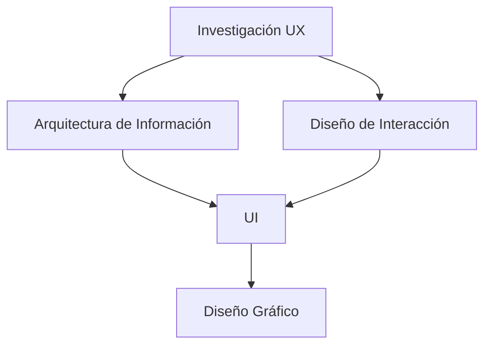
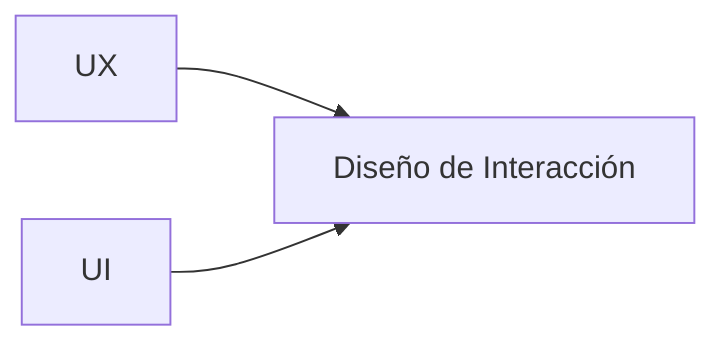

# 1. Introducción: Disciplinas En El Diseño De Experiencia De Usuario

## 1.1 Naturaleza Multidisciplinaria Del UX

El diseño de la experiencia de usuario (UX) no es una disciplina aislada, sino un campo que integra múltiples áreas debido a que la experiencia del usuario depende de diversos factores.

### Idea Clave Del Transcript

- UX está influenciado por factores como:
    
    - Presentación
        
    - Funcionalidad
        
    - Comportamiento interactivo

### Definición

**Diseño UX**: proceso de creación de productos digitales considerando todos los factores que afectan la experiencia del usuario.

### Importancia

- Permite abordar el problema desde diferentes perspectivas
    
- Mejora la calidad del producto final
    
- Reduce errores de diseño centrados solo en un área

### Contexto De Uso

- Desarrollo web
    
- Aplicaciones móviles
    
- Sistemas interactivos

---

# 2. Equipos Multidisciplinares

## 2.1 Definición

Un **equipo multidisciplinar** es un grupo de profesionales con diferentes especialidades que colaboran en un mismo proyecto.

### Importancia En UX

- Ninguna disciplina por sí sola puede cubrir toda la experiencia
    
- Se require integración de:
    
    - Diseño
        
    - Investigación
        
    - Tecnología
        
    - Negocio

### Enriquecimiento

En la práctica, estos roles pueden:

- Estar separados (equipos grandes)
    
- Set asumidos por una misma persona (equipos pequeños)

---

# 3. Principales Disciplinas Del UX

El transcript identifica varias disciplinas clave que conforman el diseño UX.

---

## 3.1 Diseño Gráfico

### Definición

Disciplina encargada de los elementos visuals y la apariencia del producto.

### Incluye

- Colores
    
- Tipografía
    
- Imágenes
    
- Estilo visual

### Importancia

- Genera impacto visual
    
- Mejora la comunicación
    
- Influye en la percepción del usuario

### Ventajas

- Atractivo visual
    
- Identidad de marca

### Limitaciones

- No garantiza buena experiencia por sí solo

---

## 3.2 Arquitectura De la Información (IA)

### Definición

Disciplina encargada de organizar, estructurar y facilitar la recuperación de la información.

### Incluye

- Mapas de sitio
    
- Estructura de navegación
    
- Jerarquía de contenido

### Importancia

- Permite encontrar información fácilmente
    
- Reduce la carga cognitiva

### Contexto

- Sitios web complejos
    
- Sistemas con gran volumen de información

---

## 3.3 Investigación UX

### Definición

Proceso de estudio del usuario para entender:

- Necesidades
    
- Motivaciones
    
- Dificultades

### Importancia

- Base de todo el diseño UX
    
- Evita decisiones basadas en suposiciones

### Métodos Comunes (enriquecimiento)

- Entrevistas
    
- Encuestas
    
- Tests de usuario

### Insight Clave Del Transcript

> La investigación UX es la base de la arquitectura de información y del diseño de interacción

---

## 3.4 Diseño De Interacción

### Definición

Disciplina que define cómo el usuario interactúa con el sistema.

### Incluye

- Flujos de tareas
    
- Comportamiento de controles
    
- Respuestas del sistema

### Importancia

- Determina la usabilidad
    
- Define la lógica de interacción

---

## 3.5 Interfaz De Usuario (UI)

### Definición

Conjunto de elementos visuals con los que el usuario interactúa directamente.

### Relación Con UX

- Es parte del diseño de interacción
    
- Se solapa con:
    
    - Diseño gráfico
        
    - Arquitectura de información

---

# 4. Relación Entre Disciplinas

## 4.1 Estructura Conceptual

---

## 4.2 Explicación Del Diagrama

- **Investigación UX**:
    
    - Punto de partida
        
    - Define necesidades del usuario
        
- **Arquitectura de información**:
    
    - Organiza contenido
        
- **Diseño de interacción**:
    
    - Define comportamiento
        
- **UI**:
    
    - Punto de interacción visible
        
- **Diseño gráfico**:
    
    - Define apariencia

---

## 4.3 Insight Clave

El diseño UX no es lineal, sino:

- Interconectado
    
- Iterativo
    
- Dependiente de múltiples disciplinas

---

# 5. Relación Entre UX Y UI

## 5.1 Diferencias Clave

|UX (Experiencia de Usuario)|UI (Interfaz de Usuario)|
|---|---|
|Enfocado en lo que siente el usuario|Enfocado en la interacción visual|
|Incluye emociones y percepción|Incluye elementos gráficos|
|Es un concepto amplio|Es una parte del sistema|

---

## 5.2 Explicación Profunda

### UX

- Evalúa la experiencia completa
    
- Incluye:
    
    - Antes
        
    - Durante
        
    - Después

### UI

- Se limita a la interfaz
    
- Es el medio de interacción

---

## 5.3 Relación Conceptual

### Idea Clave Del Transcript

- UX + UI → Diseño de interacción

---

# 6. Rol Central De la Investigación UX

## 6.1 Importancia Crítica

La investigación UX:

- Identifica necesidades reales
    
- Detecta problemas potenciales
    
- Reduce riesgo de diseño incorrecto

## 6.2 Qué Aporta

|Elemento|Descripción|
|---|---|
|Necesidades|Qué require el usuario|
|Motivaciones|Por qué actúa|
|Dificultades|Problemas actuales|

---

# 7. Enriquecimiento Conceptual

## 7.1 Integración De Disciplinas

Un buen diseño UX require:

- Base: Investigación
    
- Estructura: Arquitectura de información
    
- Comportamiento: Diseño de interacción
    
- Apariencia: Diseño gráfico

## 7.2 Error Común

Pensar que UX = UI

### Corrección

- UI es solo una parte visible
    
- UX es la experiencia completa

---

# Resumen De Puntos Clave

- UX es una disciplina multidisciplinaria.
    
- Require colaboración entre diferentes áreas.
    
- Principales disciplinas:
    
    - Diseño gráfico
        
    - Arquitectura de información
        
    - Investigación UX
        
    - Diseño de interacción
        
- La investigación UX es la base de todo el proceso.
    
- UI es parte del diseño de interacción.
    
- UX se enfoca en lo que el usuario siente.
    
- UI se enfoca en cómo interactúa.
    
- La integración de UX y UI da lugar al diseño de interacción.
    
- Un buen diseño UX depende de la correcta integración de todas las disciplinas.

---

## MicroTest 1.2

1. Se ocupa de los elementos visuals y la apariencia:
    
    - La respuesta: a. Diseño gráfico
        
    - Justificación: El diseño gráfico es la disciplina encargada de la estética visual del producto, incluyendo colores, tipografía, imágenes y composición. Ninguna de las otras opciones se enfoca en la apariencia, sino en estructura, comportamiento o investigación.
        
2. Se ocupa de la organización y recuperación de la información, los mapas de sitio web y la navegación:
    
    - La respuesta: c. Arquitectura de información
        
    - Justificación: La arquitectura de información se encarga de estructurar y organizar el contenido para que sea fácil de encontrar y navegar. Incluye elementos como mapas de sitio y jerarquías, lo cual no corresponde a diseño gráfico, interacción ni investigación.
        
3. Se ocupa de esclarecer las necesidades, motivaciones y dificultades de los usuarios en relación con el producto que se diseña:
    
    - La respuesta: d. La investigación UX
        
    - Justificación: La investigación UX tiene como objetivo comprender profundamente al usuario, identificando sus necesidades, motivaciones y problemas. Esto sirve como base para todas las demás disciplinas del diseño UX.

### **Saber más**

Budiu, R. (s.f.). _The False-Consensus Effect: You Are Not the User_ [Vídeo]. Nielsen Norman Group.

[Accede a la página](https://www.nngroup.com/v%C3%ADdeos/false-consensus-effect/)

En este vídeo, en inglés, Budiu explica y ejemplifica el concepto de psicología «efecto del falso consenso» y cómo hay que tenerlo en cuenta a la hora de diseñar y desarrollar una interfaz. Este concepto está en la base del mantra del diseño de UX: no eres el usuario.