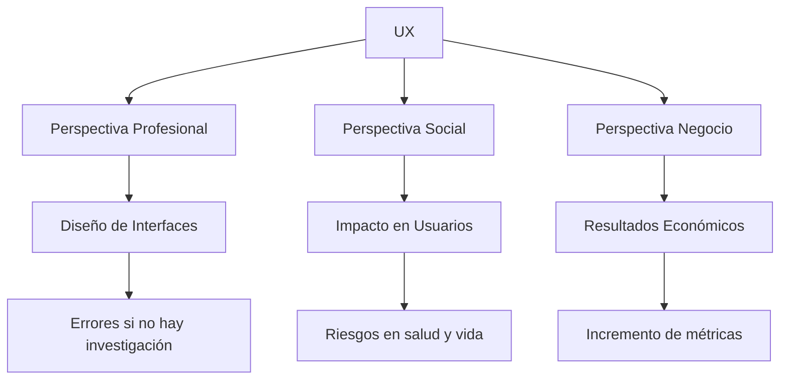

# 1. Importancia Del Diseño De Experiencia De Usuario (UX)

## 1.1 Enfoque General Del Tema

El diseño de experiencia de usuario (UX) es importante porque impacta directamente en:

- La interacción de las personas con sistemas
    
- La efectividad de productos digitales
    
- La seguridad, productividad y satisfacción del usuario

El transcript plantea que su importancia puede analizarse desde **tres perspectivas principales**:

1. Professional
    
2. Social
    
3. De negocio

---

# 2. Perspectivas Del Diseño UX

## 2.1 Perspectiva Professional

### Definición

Se enfoca en la **creación de interfaces de usuario** desde el punto de vista del diseñador o desarrollador.

### Problema Clave

El professional:

- No es el usuario
    
- Tiene diferente:
    
    - Experiencia
        
    - Habilidades
        
    - Actitudes
        
    - Conocimiento del sistema

### Riesgo

Diseñar basado en:

- Intuición
    
- Suposiciones

### Enriquecimiento

Esto genera productos que:

- Funcionan técnicamente
    
- Pero fallan en experiencia real

---

## 2.2 Perspectiva Social

### Definición

Se centra en el impacto del diseño en los usuarios y la sociedad.

### Importancia

- Afecta directamente la vida de las personas
    
- Puede generar:
    
    - Experiencias positivas
        
    - Riesgos graves

---

## 2.3 Perspectiva De Negocio

### Definición

Se enfoca en cómo el UX impacta en:

- Rentabilidad
    
- Métricas de negocio
    
- Retorno de inversión

---

# 3. Factores Intrínsecos Del Usuario

## 3.1 Definición

Son características del usuario que **no pueden set diseñadas directamente**:

|Factor|Descripción|
|---|---|
|Experiencias previas|Historial del usuario|
|Actitudes|Forma de pensar|
|Habilidades|Nivel de conocimiento|
|Personalidad|Rasgos individuales|

---

## 3.2 Importancia

- Influyen directamente en la experiencia
    
- No pueden controlarse
    
- Deben set **comprendidos mediante investigación**

---

## 3.3 Insight Clave

El diseñador debe adaptarse al usuario, no al revés.

---

# 4. Sesgos Cognitivos En El Diseño

## 4.1 Definición: Efecto Del Falso Consenso

> Tendencia a pensar que otras personas comparten nuestras creencias y se comportarán igual que nosotros.

### Explicación

El diseñador assume que:

- El usuario piensa como él
    
- El usuario entiende el sistema igual que él

---

## 4.2 Impacto En UX

|Problema|Consecuencia|
|---|---|
|Suposiciones incorrectas|Mal diseño|
|Falta de validación|Baja usabilidad|
|Diseño centrado en el diseñador|Mala experiencia|

---

## 4.3 Solución

### Idea Clave Del Transcript

> “Para poder tomar decisiones de diseño acertadas, hay que hacer una investigación de las necesidades, motivaciones y dificultades de los usuarios y evaluar los diseños con usuarios reales.”

### Interpretación

- Investigar antes de diseñar
    
- Validar con usuarios reales
    
- Evitar decisiones basadas en intuición

---

# 5. Impacto De la UX En la Vida Real

## 5.1 UX Más Allá De Lo Superficial

El diseño UX no solo afecta:

- Comodidad
    
- Estética

También puede afectar:

- Seguridad
    
- Salud
    
- Vida humana

---

## 5.2 Caso Crítico: TERAC-25

### Descripción

Máquina de radioterapia (1985–1987) que causó:

- Sobredosis de radiación
    
- Muerte de pacientes

---

## 5.3 Problemas De UX Identificados

|Problema|Descripción|
|---|---|
|Mensajes de error confusos|No explicaban el problema|
|Falta de diferenciación|No distinguían errores críticos|
|Sobrecarga de errores|Usuarios se volvieron insensibles|
|Falta de salvaguardas|Permitía continuar operación peligrosa|

---

## 5.4 Consecuencia

- Operadores ignoraban errores
    
- Sistema permitía acciones peligrosas
    
- Resultado: accidentes graves

---

## 5.5 Insight Clave

Un mal diseño UX puede set **fatal** en sistemas críticos.

---

# 6. Ejemplo En Contexto Médico Cotidiano

## 6.1 Problema

Aplicaciones médicas con errores en:

- Recetas electrónicas

## 6.2 Hallazgo

- Hasta **22 tipos de errores**
    
- Posibilidad de:
    
    - Recetar medicamentos incorrectos

---

## 6.3 Interpretación

Incluso errores pequeños en UX:

- Escalan a consecuencias graves
    
- Afectan directamente a pacientes

---

# 7. Áreas De Impacto Del UX

El UX no solo es relevante en salud.

## 7.1 Ámbitos Mencionados

|Área|Impacto|
|---|---|
|Educación|Mejora aprendizaje|
|Participación cívica|Facilita interacción ciudadana|
|Servicios sociales|Acceso a ayuda|
|Aplicaciones públicas|Inclusión digital|

---

# 8. Codiseño (Diseño colaborativo)

## 8.1 Definición

Proceso donde los usuarios participan activamente en el diseño.

---

## 8.2 Ejemplo Del Transcript

Proyecto con niños:

- Biblioteca digital infantil
    
- Rediseño de interfaz

Institución:  
University of Maryland

Sistema:  
International Children's Digital Library

---

## 8.3 Importancia

- Mejora adecuación al usuario
    
- Especialmente útil en:
    
    - Niños
        
    - Usuarios con necesidades específicas

---

## 8.4 Ventajas

|Ventaja|Descripción|
|---|---|
|Mayor precisión|Diseño basado en usuarios reales|
|Inclusión|Considera diversidad|
|Innovación|Nuevas ideas|

---

# 9. UX En El Contexto De Negocio

## 9.1 Problema

- Difícil medir impacto inmediato

## 9.2 Solución

- Uso de métricas
    
- Evaluación a largo plazo

---

## 9.3 Beneficios Documentados

Según Jakob Nielsen (2008):

|Beneficio|Descripción|
|---|---|
|Incremento de conversión|Más ventas|
|Aumento de tráfico|Más usuarios|
|Mayor productividad|Usuarios más eficientes|
|Uso de funcionalidades|Mayor aprovechamiento del sistema|

---

## 9.4 Ejemplos De Aplicación

|Contexto|Beneficio UX|
|---|---|
|E-commerce|Más compras|
|Medios digitales|Más visitas|
|Intranets|Mayor eficiencia|

---

# 10. Relación Global Del UX

---

# Resumen De Puntos Clave

- El UX es importante desde tres perspectivas: professional, social y de negocio.
    
- Los diseñadores no son los usuarios, lo que genera riesgo de malas decisiones.
    
- Existen factores del usuario que no pueden diseñarse (experiencia, personalidad).
    
- El sesgo del falso consenso provoca errores en el diseño.
    
- La investigación UX es esencial para tomar decisiones correctas.
    
- El UX puede impactar la vida y la salud (ejemplo TERAC-25).
    
- Incluso errores pequeños en UX pueden tener consecuencias graves.
    
- UX impacta múltiples áreas: salud, educación, servicios sociales.
    
- El codiseño mejora la calidad del diseño al incluir usuarios reales.
    
- UX aporta valor al negocio: más ventas, tráfico y productividad.

---

## MicroTest 1.3

1. Que perspectivas son importantes en el diseño UX:
    
    - La respuesta: a. Social, professional y negocio
        
    - Justificación: El diseño UX se analiza desde tres perspectivas clave: la professional (diseño de interfaces), la social (impacto en usuarios) y la de negocio (beneficios económicos). Las otras opciones incluyen categorías que no fueron mencionadas en el enfoque del UX del transcript.
        
2. Es uno de los impactos más conocidos por UX:
    
    - La respuesta: c. Mal diseño en aplicaciones médicas
        
    - Justificación: El transcript destaca el caso crítico de sistemas médicos mal diseñados (como TERAC-25), donde errores de UX provocaron consecuencias graves, incluso la muerte de pacientes. Esto demuestra el impacto real y significativo del UX más allá de lo superficial.
        
3. Es uno de los beneficios para el negocio gracias a la usabilidad y experiencia de usuario:
    
    - La respuesta: d. Aumento de ventas
        
    - Justificación: Uno de los beneficios más documentados del buen diseño UX es el incremento en la tasa de conversión, lo que se traduce directamente en más ventas. Las otras opciones no representan beneficios claros o directos del UX según el contenido analizado.

## **Saber más**

Interaction Design Foundation. (2019, octubre 20). _Why is UX Design Important?_ [Vídeo]. YouTube.

En este vídeo, en inglés, Alan Dix explica la importancia del diseño de la experiencia de usuario y por qué se ha convertido en una tendencia en la actualidad.
