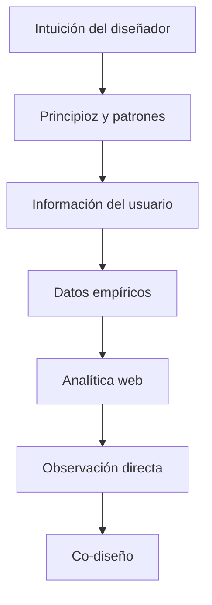
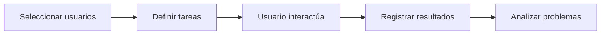
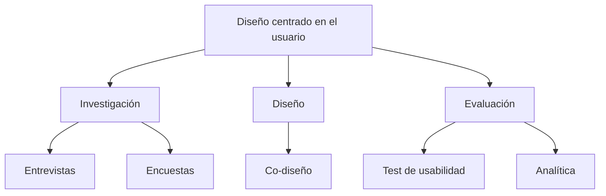

# T01.04 Niveles De Implicación De Los Usuarios En El Diseño De UX

## Introducción

Los niveles de implicación de los usuarios en el diseño de experiencia de usuario (UX) representan las diferentes maneras en que la información de los usuarios puede incorporarse dentro del proceso de diseño. El objetivo principal es aproximar el diseño a la realidad y necesidades de las personas que utilizarán el sistema.

Este concepto surge del enfoque de diseño centrado en el usuario (User-Centered Design, UCD), cuyo principio fundamental consiste en desarrollar productos considerando las necesidades, comportamientos, limitaciones y objetivos de los usuarios finales.

La idea central del transcript es que existen distintos grados de participación del usuario, organizados como una escalera progresiva: conforme se asciende, aumenta la cercanía con la realidad del usuario.

Sin embargo, un punto importante es:

**Mayor cercanía con la realidad del usuario no siempre significa mayor participación directa del usuario.**

---

# Diseño Centrado En El Usuario (User-Centered Design - UCD)

## ¿Qué Es?

Es una metodología de diseño donde el usuario se convierte en el eje principal durante todo el proceso de desarrollo.

El diseño deja de enfocarse únicamente en aspectos técnicos o decisiones intuitivas del diseñador y comienza a considerar:

- Necesidades reales
    
- Problemas reales
    
- Contextos de uso
    
- Objetivos del usuario
    
- Comportamientos observables

---

## ¿Por Qué Es Importante?

Diseñar sin comprender al usuario puede provocar:

- Interfaces difíciles de usar
    
- Frustración
    
- Errores frecuentes
    
- Baja adopción
    
- Costos elevados por rediseños

Al incorporar usuarios en distintas etapas se pueden detectar problemas antes de implementar completamente un sistema.

---

## Fases Donde Puede Involucrarse El Usuario

|Fase|Participación|
|---|--:|
|Investigación|Entrevistas, encuestas|
|Diseño|Co-diseño|
|Desarrollo|Retroalimentación|
|Evaluación|Test de usabilidad|
|Uso real|Analítica y observación|

---

# Escalera De Niveles De Implicación Del Usuario

El transcript describe una estructura en forma de escalera.

Cada peldaño representa un mayor acercamiento hacia la realidad del usuario.

---

# Nivel 1: Decisiones Por Intuición O Asunción

## Definición

En este nivel el diseñador o desarrollador toma decisiones basándose únicamente en:

- Experiencia personal
    
- Suposiciones
    
- Intuición
    
- Creencias

Sin realizar pruebas ni recopilar datos reales.

---

## Características

- No existen usuarios involucrados
    
- No hay evidencia
    
- Se depende completamente del criterio del diseñador

---

## Ejemplo

Un desarrollador decide:

_"Los usuarios probablemente prefieren botones grandes en color rojo porque llaman más la atención."_

La decisión se implementa sin validación.

---

## Ventajas

|Ventajas|
|---|
|Rápido|
|Bajo costo|
|No require investigación|

---

## Desventajas

|Desventajas|
|---|
|Alto riesgo|
|Mucha subjetividad|
|Puede alejarse de necesidades reales|
|Produce errores de diseño|

---

## Contexto De Uso

Puede utilizarse:

- En prototipos iniciales
    
- En proyectos con recursos limitados
    
- Cuando se require rapidez extrema

No es recomendable como único método.

---

# Nivel 2: Decisiones Informadas Basadas En Principios

## Definición

Las decisiones comienzan a sustentarse en:

- Patrones de diseño
    
- Heurísticas
    
- Guías
    
- Principios de usabilidad previamente estudiados

Ya no depende únicamente de la intuición.

---

## Importancia

Permite aprovechar conocimiento previamente validado por investigaciones anteriores.

---

## Ejemplos De Principios Utilizados

### Consistencia

Elementos similares deben comportarse igual.

Ejemplo:

Si un botón azul abre una ventana en una pantalla, otro botón azul debería actuar de forma similar.

---

### Retroalimentación

El sistema debe comunicar lo que ocurre.

Ejemplo:

Mostrar:

"Cargando…"

o una barra de progreso.

---

### Visibilidad

Los elementos importantes deben set fácilmente identificables.

---

## Ventajas

|Ventajas|
|---|
|Menos errores|
|Basado en investigaciones|
|Aumenta usabilidad|

---

## Desventajas

|Desventajas|
|---|
|Puede no ajustarse a usuarios específicos|
|Generaliza demasiado|

---

# Nivel 3: Información Proporcionada Por El Usuario

## Definición

Aquí las decisiones comienzan a incluir información obtenida directamente del usuario mediante técnicas como:

- Encuestas
    
- Entrevistas
    
- Cuestionarios
    
- Formularios

---

## Objetivo

Comprender:

- Necesidades
    
- Preferencias
    
- Problemas
    
- Expectativas

---

## Ejemplo

Preguntar:

> ¿Qué función utilize más dentro de una aplicación bancaria?

---

## Problema Mencionado En El Transcript

Los usuarios:

> "No siempre son conscientes de lo que hacen cuando interactúan con la interfaz."

Esto significa que existe una diferencia entre:

Lo que las personas dicen hacer y lo que realmente hacen.

---

## Ejemplo

Usuario:

> "Siempre reviso las notificaciones."

Comportamiento real:

Los registros muestran que casi nunca abre la sección.

---

## Ventajas

|Ventajas|
|---|
|Información directa|
|Fácil aplicación|
|Bajo costo|

---

## Desventajas

|Desventajas|
|---|
|Sesgo humano|
|Respuestas incorrectas|
|Mala memoria|
|Interpretaciones subjetivas|

---

# Nivel 4: Datos Empíricos Mediante Pruebas De Usabilidad

## Definición

Consiste en observar usuarios reales utilizando el sistema para obtener datos observables y medibles.

---

## ¿Qué Son Los Datos Empíricos?

Son datos obtenidos mediante:

- Observación
    
- Experimentación
    
- Medición

No dependen de opiniones.

---

## Test De Usabilidad

Un test de usabilidad consiste en asignar tareas a usuarios y observar:

- Tiempo requerido
    
- Errores
    
- Dificultades
    
- Comportamientos

---

## Flujo General

---

## Ejemplo

Tarea:

_"Encuentra cómo recuperar tu contraseña."_

Resultados observados:

- Tiempo: 3 minutos
    
- 4 clics erróneos
    
- Confusión

---

## Ventajas

|Ventajas|
|---|
|Datos reales|
|Identifica problemas|
|Reduce errores|

---

## Desventajas

|Desventajas|
|---|
|Costoso|
|Require tiempo|
|Entorno artificial|

---

## Limitación Importante Mencionada

El transcript menciona:

> "Los test de usabilidad se realizan en entornos controlados y con tareas prefijadas."

Esto puede provocar que el comportamiento no refleje completamente la realidad.

---

# Nivel 5: Analítica Web

## Definición

La analítica web obtiene métricas sobre el comportamiento real de usuarios mientras utilizan una aplicación o sitio.

Los usuarios normalmente participan de forma indirecta y muchas veces anónima.

---

## Métricas Comunes

|Métrica|Descripción|
|---|---|
|Tiempo de permanencia|Tiempo dentro del sitio|
|Tasa de rebote|Usuarios que abandonan|
|Clics|Interacciones|
|Conversiones|Objetivos completados|
|Flujo de navegación|Recorrido del usuario|

---

## Importancia

Permite observar:

- Qué usan los usuarios
    
- Qué ignoran
    
- Dónde abandonan procesos

---

## Limitación Crítica Mencionada

Las métricas cuantitativas:

Pueden decir:

> "Qué ocurre"

Pero normalmente no explican:

> "Por qué ocurre"

---

## Ejemplo

La analítica muestra:

- 80% abandona el registro

Pero no explica:

- ¿Formulario muy largo?
    
- ¿Errores?
    
- ¿Diseño confuso?

---

## Ventajas

|Ventajas|
|---|
|Datos reales|
|Grandes cantidades de información|
|Escalable|

---

## Desventajas

|Desventajas|
|---|
|No explica causas|
|Require interpretación|

---

# Nivel 6: Observación Directa

## Definición

Consiste en observar a los usuarios en su entorno real mientras realizan sus actividades normals.

No existen tareas controladas.

---

## Objetivo

Entender:

- Contexto
    
- Hábitos
    
- Limitaciones
    
- Interacciones naturales

---

## Ejemplo

Observar personas usando una aplicación móvil en:

- Transporte público
    
- Casa
    
- Oficina

---

## Información Que Puede Descubrirse

- Distracciones
    
- Problemas ambientales
    
- Interrupciones
    
- Patrones inesperados

---

## Ventajas

|Ventajas|
|---|
|Muy cercana a la realidad|
|Descubre problemas ocultos|

---

## Desventajas

|Desventajas|
|---|
|Costoso|
|Consume tiempo|
|Difícil de controlar|

---

# Nivel 7: Co-diseño (Diseño colaborativo)

## Definición

Representa el mayor nivel de participación de los usuarios.

Los usuarios participan directamente en la construcción de sus propias herramientas.

---

## Actividades Frecuentes

- Talleres
    
- Bocetos
    
- Diseño colaborativo
    
- Priorización de funcionalidades
    
- Evaluación continua

---

## Importancia

Los usuarios dejan de set únicamente observados.

Se convierten en participantes activos.

---

## Ejemplo

Para diseñar una aplicación médica:

- Pacientes participan
    
- Médicos participan
    
- Diseñadores participan
    
- Desarrolladores participan

Todos construyen ideas conjuntamente.

---

## Ventajas

|Ventajas|
|---|
|Alta alineación con necesidades reales|
|Mayor satisfacción|
|Menos errores posteriores|

---

## Desventajas

|Desventajas|
|---|
|Require coordinación|
|Mayor costo|
|Procesos más lentos|

---

# Comparación General De Niveles

|Nivel|Fuente principal|Participación del usuario|Cercanía con realidad|
|---|--:|--:|--:|
|Intuición|Diseñador|Baja|Baja|
|Principios|Investigaciones previas|Baja|Baja-media|
|Información usuario|Encuestas/entrevistas|Media|Media|
|Datos empíricos|Test de usabilidad|Media|Media-alta|
|Analítica web|Métricas reales|Indirecta|Alta|
|Observación directa|Contexto real|Alta|Muy alta|
|Co-diseño|Participación activa|Muy alta|Máxima|

---

# Relación Conceptual General

---

# Resumen Final

## Puntos Clave

- El diseño centrado en el usuario busca desarrollar productos alrededor de necesidades reales.
    
- Los niveles de implicación se representan como una escalera progresiva.
    
- Conforme aumenta el nivel, aumenta el acercamiento a la realidad del usuario.
    
- La intuición es rápida pero poco confiable.
    
- Los principios de diseño utilizan conocimiento validado previamente.
    
- Las entrevistas y encuestas permiten conocer opiniones, pero no siempre comportamientos reales.
    
- Los test de usabilidad generan datos empíricos mediante observación controlada.
    
- La analítica web muestra qué hacen los usuarios, pero no explica por qué.
    
- La observación directa permite comprender contextos reales.
    
- El co-diseño representa la máxima participación del usuario.

## Ideas Más Importantes

1. Diseñar sin usuarios aumenta el riesgo de errores.
    
2. Lo que los usuarios dicen no siempre coincide con lo que hacen.
    
3. Los datos cuantitativos y cualitativos se complementan.
    
4. La mejor comprensión del usuario surge al combinar múltiples niveles.
    
5. El co-diseño es el punto de mayor integración entre usuarios y diseño.

---

## MicroTest 01.04

1. En que peldaño el diseñador por intuición o asunciones sin probar:
    
    - La respuesta: a. Primer peldaño
        
    - Justificación:  
        En el primer peldaño el diseñador o desarrollador toma decisiones únicamente basadas en su intuición, experiencia o suposiciones sin realizar pruebas ni validar con usuarios reales. Es el nivel con menor acercamiento a la realidad del usuario.
        
2. En este peldaño las decisiones se basan en principios, patrones y están probadas e investigadas:
    
    - La respuesta: c. Segundo peldaño
        
    - Justificación:  
        El segundo peldaño deja de depender solo de la intuición y utilize principios, patrones y pautas de diseño que ya fueron investigadas y comprobadas previamente, permitiendo decisiones con una base más sólida.
        
3. Este tipo de métricas pueden aportar información útil sobre el uso real que se está haciendo de una interfaz:
    
    - La respuesta: d. Métricas cuantitativa
        
    - Justificación:  
        En el tema de analítica web se menciona que las métricas cuantitativas permiten obtener información útil sobre el comportamiento real de los usuarios dentro de una interfaz. Estas ayudan a conocer qué ocurre (clics, tiempo de permanencia, abandonos, conversiones), aunque normalmente no explican el porqué ocurre.