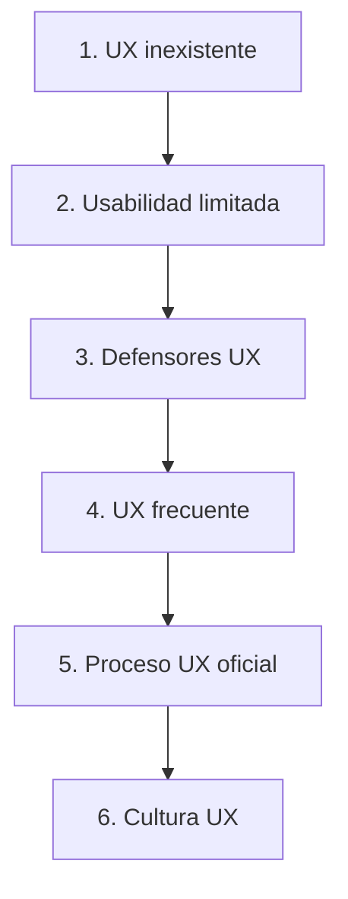
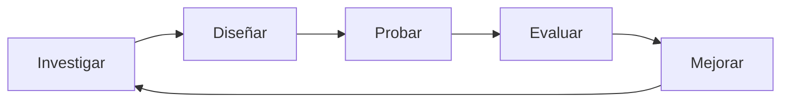
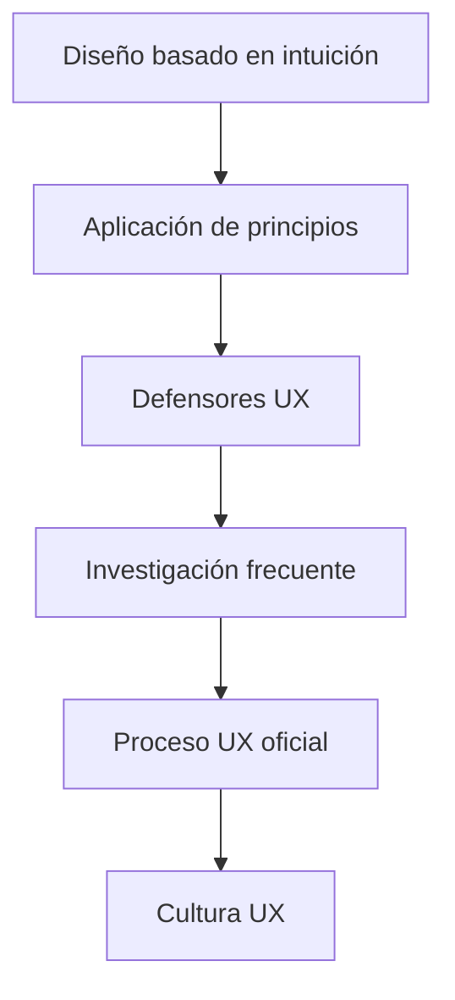

# T01.05 Niveles De Madurez Del Diseño De UX En Las Organizaciones

# Introducción

La madurez del diseño UX en una organización representa el grado en que una empresa integra, comprende y aplica procesos de experiencia de usuario dentro de sus actividades, decisiones y cultura organizacional.

El transcript presenta el modelo de madurez propuesto por Jakob Nielsen (2006), el cual organiza la evolución del diseño UX en una estructura escalonada compuesta por seis niveles o peldaños.

Este modelo sirve como una guía para evaluar qué tan desarrollada está una organización respecto a UX y permite comprender:

- Qué prácticas UX existen actualmente
    
- Qué tan estructuradas están
    
- Qué expectativas son realistas dentro de una empresa
    
- Qué cambios son necesarios para evolucionar

El concepto principal del transcript es:

> "La evolución hacia una cultura UX ocurre progresivamente y no es realista esperar saltar varios peldaños de golpe."

## ¿A Qué Se Refiere Esta Afirmación?

La adopción de UX implica cambios organizacionales profundos:

- Cambio de procesos
    
- Cambio de mentalidad
    
- Cambio de cultura empresarial
    
- Inversión en recursos
    
- Formación de equipos especializados

Debido a esto, una empresa no puede pasar inmediatamente de no utilizar UX a tener una cultura completamente centrada en el usuario.

---

# Definición De Madurez UX

## ¿Qué Es?

La madurez UX es el nivel de integración del diseño centrado en el usuario dentro de una organización.

Mide qué tanto UX:

- Influye en decisiones
    
- Está presente en procesos
    
- Se ejecuta sistemáticamente
    
- Forma parte de la cultura empresarial

---

## ¿Por Qué Es Importante?

La madurez UX permite:

- Mejorar productos
    
- Aumentar satisfacción de usuarios
    
- Reducir errores
    
- Disminuir costos de rediseño
    
- Incrementar competitividad

---

## Contexto De Uso

Puede utilizarse para:

- Evaluar empresas
    
- Definir estrategias UX
    
- Identificar áreas de mejora
    
- Ajustar expectativas profesionales

Ejemplo:

Un diseñador UX que entra a una empresa puede analizar:

- ¿Existe investigación UX?
    
- ¿Hay pruebas con usuarios?
    
- ¿Existe un equipo especializado?

---

# Modelo De Nielsen (2006)

El modelo presenta una evolución gradual mediante seis peldaños.

---

# Peldaño 1: UX no Reconocido

## Definición

En este nivel el diseño UX prácticamente no existe dentro de la organización.

Las decisiones se toman desde una perspectiva:

- Centrada en desarrolladores
    
- Basada en intuición
    
- Basada en suposiciones
    
- Basada en experiencias personales

---

## Características

- No existe investigación UX
    
- No existen usuarios involucrados
    
- No existen pruebas
    
- Diseño basado en hipótesis

---

## Ejemplo

Un desarrollador afirma:

> "Creo que los usuarios van a entender esta pantalla."

La decisión se implementa sin validación.

---

## Ventajas

|Ventajas|
|---|
|Desarrollo rápido|
|Menor inversión inicial|

---

## Desventajas

|Desventajas|
|---|
|Alto riesgo|
|Muchos errores|
|Baja satisfacción|
|Rediseños frecuentes|

---

# Peldaño 2: Conciencia Sobre Usabilidad

## Definición

La empresa continúa centrada principalmente en desarrolladores, pero comienza a reconocer la importancia de la usabilidad.

Ya existen:

- Pautas
    
- Principios
    
- Buenas prácticas

---

## Características

- Uso de reglas de diseño
    
- Aplicación de estándares
    
- Mayor consistencia

---

## Ejemplo

Uso de principios como:

- Consistencia visual
    
- Retroalimentación
    
- Visibilidad

---

## Ventajas

|Ventajas|
|---|
|Menos errores|
|Mejor estructura|

---

## Desventajas

|Desventajas|
|---|
|Sigue sin existir contacto real con usuarios|

---

# Peldaño 3: Defensores UX

## Definición

Comienzan a existir personas dentro de la organización que promueven UX.

El transcript los llama:

> "Defensores UX"

---

## ¿Qué Son Los Defensores UX?

Son personas que intentan impulsar:

- Investigación
    
- Validación
    
- Pruebas con usuarios
    
- Diseño centrado en el usuario

Pueden set:

- Diseñadores
    
- Desarrolladores
    
- Gerentes
    
- Investigadores

---

## Características

- Algunas pruebas con usuarios
    
- Procesos improvisados
    
- Actividades no sistemáticas

---

## Importante

El transcript menciona:

> "Se realizan de manera improvisada y no sistemática"

## Significado

Las actividades UX ocurren ocasionalmente.

Ejemplo:

Un proyecto realiza entrevistas.

Otro proyecto no realiza ninguna actividad UX.

No existe un estándar organizacional.

---

## Ventajas

|Ventajas|
|---|
|Introduce UX en la organización|

---

## Desventajas

|Desventajas|
|---|
|Dependencia de individuos|
|Resultados inconsistentes|

---

# Peldaño 4: UX Frecuente Pero no Sistematizado

## Definición

Las actividades UX comienzan a realizarse regularmente.

Ejemplos:

- Test con usuarios reales
    
- Entrevistas
    
- Investigación UX

---

## Características

- Se aplican técnicas UX con frecuencia
    
- Existe mayor estructura
    
- Los procesos aún dependen del proyecto

---

## Frase Importante Del Transcript

> "No está sistematizado. No es iterativo y depende del proyecto."

## Interpretación

La organización realiza UX, pero:

- No siempre sigue el mismo procedimiento
    
- No existe una metodología official
    
- Algunas iniciativas se abandonan

---

## Diferencia Entre Frecuente Y Sistemático

|Frecuente|Sistemático|
|---|---|
|Ocurre muchas veces|Sigue procesos definidos|
|Puede variar|Tiene reglas establecidas|

---

## Ventajas

|Ventajas|
|---|
|Mayor conocimiento del usuario|

---

## Desventajas

|Desventajas|
|---|
|Resultados variables|

---

# Peldaño 5: Proceso Official De UX

## Definición

La organización establece un proceso formal de diseño centrado en el usuario.

---

## Características Mencionadas

El transcript establece tres elementos:

### 1. Proceso Official

Existe documentación y metodologías claras.

---

### 2. Sistemático

Las actividades siguen una estructura definida.

---

### 3. Iterativo

El proceso se repite constantemente para mejorar resultados.

---

## Proceso Iterativo

La iteración consiste en repetir ciclos:

---

## Equipo UX Dedicado

La empresa cuenta con especialistas:

- Diseñadores UX
    
- Investigadores UX
    
- Diseñadores UI
    
- Arquitectos de información

---

## Ventajas

|Ventajas|
|---|
|Mayor calidad|
|Menos errores|
|Productos consistentes|

---

## Desventajas

|Desventajas|
|---|
|Mayor inversión|

---

# Peldaño 6: Cultura UX

## Definición

Representa el nivel ideal de madurez UX.

UX deja de set únicamente un proceso y se convierte en parte de la cultura organizacional.

---

## Frase Completa Del Transcript

> "Las decisiones empresariales se basan en los resultados de la investigación UX y el seguimiento de métricas UX."

## ¿A Qué Se Refiere?

Las decisiones importantes de la empresa se toman usando evidencia obtenida de:

- Investigación UX
    
- Analítica
    
- Pruebas
    
- Métricas

---

## Características

- UX forma parte de la estrategia empresarial
    
- Todos consideran la experiencia del usuario
    
- Se toman decisiones basadas en datos
    
- Existe mejora continua

---

## Ejemplo

Una empresa detecta mediante métricas:

- Aumento de abandono en compras

Se realizan:

- Entrevistas
    
- Test de usabilidad
    
- Investigación

Posteriormente:

- Se modifica el diseño
    
- Se vuelve a medir

---

## Ventajas

|Ventajas|
|---|
|Máxima alineación con usuarios|
|Mejores productos|
|Menos riesgos|

---

## Posibles Desafíos

|Desafíos|
|---|
|Mayor inversión|
|Require cambio cultural|

---

# Comparación General De Niveles

|Nivel|Diseño centrado en|Usuarios reales|Sistemático|Iterativo|Equipo UX|
|---|--:|--:|--:|--:|--:|
|1|Desarrollador|No|No|No|No|
|2|Desarrollador|No|Parcial|No|No|
|3|Mixto|Occasional|No|No|No|
|4|Mixto|Sí|Parcial|No|Parcial|
|5|Usuario|Sí|Sí|Sí|Sí|
|6|Cultura empresarial|Sí|Sí|Sí|Sí|

---

# Evolución Completa Del Modelo

---

# Información Complementaria

## Diferencia Entre Proceso UX Y Cultura UX

|Proceso UX|Cultura UX|
|---|---|
|Actividades definidas|Mentalidad organizacional|
|Puede existir en un departamento|Involucra toda la empresa|
|Procedimientos|Valores y decisiones|

---

## Idea Importante Para Práctica Professional

Al incorporarse a una empresa no debe asumirse que todas las organizaciones poseen el mismo nivel de madurez UX.

Las expectativas deben ajustarse a:

- Recursos disponibles
    
- Procesos existentes
    
- Cultura empresarial

---

# Resumen Final

## Puntos Clave

- La madurez UX representa el nivel de integración de UX dentro de una organización.
    
- Nielsen (2006) propone seis niveles de evolución.
    
- El crecimiento ocurre gradualmente.
    
- Las empresas no pueden avanzar múltiples niveles instantáneamente.
    
- Los primeros niveles están centrados en desarrolladores.
    
- Los niveles intermedios introducen investigación y pruebas.
    
- Los niveles avanzados incorporan procesos formales.
    
- El nivel máximo es una cultura organizacional centrada en usuarios.

## Ideas Más Importantes

1. UX evoluciona progresivamente.
    
2. La investigación con usuarios aumenta conforme crece la madurez.
    
3. Procesos frecuentes no significan procesos sistemáticos.
    
4. La iteración es una característica de niveles avanzados.
    
5. La cultura UX convierte los datos de usuarios en decisiones empresariales.
    
