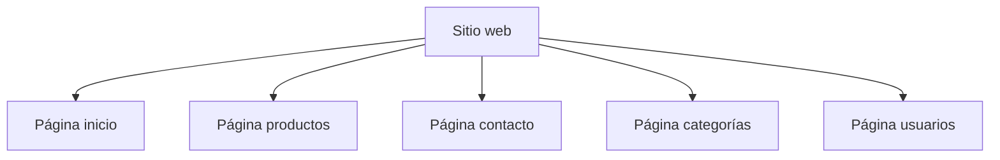
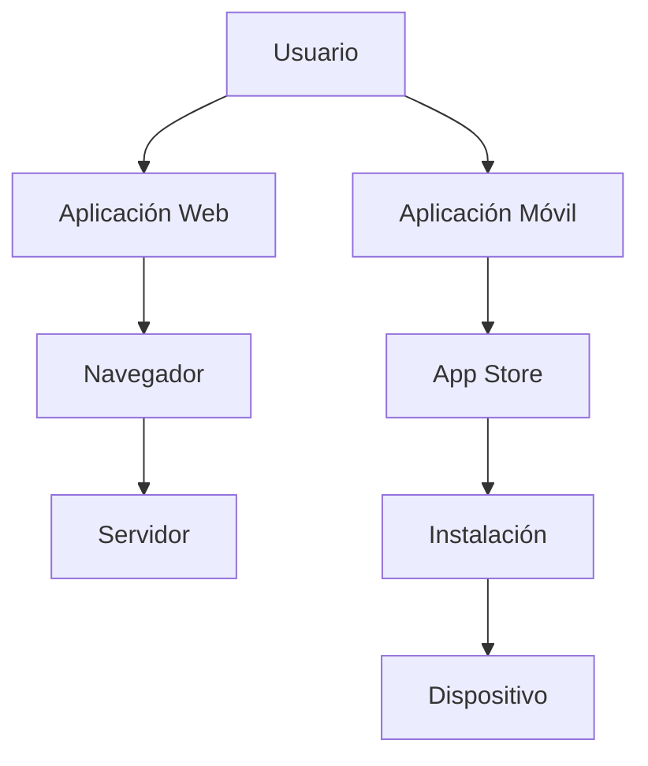

# T01.06 El Objeto De Diseño: Página Web, Sitio Web Y Aplicaciones — Parte I

# Introducción

Dentro del diseño de experiencia de usuario (UX), uno de los primeros aspectos importantes consiste en comprender correctamente cuál es el objeto que se va a diseñar. El transcript introduce una problemática común: frecuentemente se utilizan términos como:

- Página web
    
- Sitio web
    
- Aplicación
    
- Aplicación web
    
- Aplicación móvil

como si fueran equivalentes, cuando en realidad representan conceptos distintos.

La diferencia entre estos conceptos es importante porque afecta:

- El proceso de diseño
    
- La complejidad técnica
    
- El presupuesto
    
- El equipo necesario
    
- Las tecnologías utilizadas
    
- Las decisiones UX

Un diseñador UX necesita comprender estas diferencias para interpretar correctamente lo que necesita el cliente, ya que muchas veces el cliente utilize términos incorrectos o ambiguous.

---

# Problema Principal Planteado

El transcript menciona:

> "En ocasiones se usan indistintamente y no son lo mismo."

## ¿Qué Significa?

En muchos proyectos una persona puede decir:

> "Necesito una página web"

Cuando realmente necesita:

- Una tienda virtual
    
- Una aplicación web
    
- Una plataforma empresarial
    
- Una aplicación móvil

Si el diseñador no identifica correctamente el tipo de producto:

- Se generan expectativas incorrectas
    
- Aumentan los costos
    
- Aparecen problemas de desarrollo
    
- Se seleccionan tecnologías equivocadas

---

# Objeto De Diseño En UX

## ¿Qué Es?

El objeto de diseño representa el producto digital específico que será desarrollado.

Puede set:

- Una página web
    
- Un sitio web
    
- Una aplicación web
    
- Una aplicación móvil
    
- Una plataforma digital

---

## ¿Por Qué Es Importante?

Define:

- El alcance del proyecto
    
- Las funcionalidades
    
- El comportamiento esperado
    
- La tecnología
    
- El proceso de diseño

---

# Página Web

## Definición

Una página web es cada una de las pantallas individuales que forman parte de un sitio web o de una aplicación web.

El transcript menciona:

> "Se trata de un documento desarrollado en HTML."

Aunque normalmente también incorpora:

- CSS
    
- JavaScript
    
- Imágenes
    
- Videos
    
- Animaciones

---

## Components Principales

|Tecnología|Función|
|---|--:|
|HTML|Estructura del contenido|
|CSS|Apariencia visual|
|JavaScript|Interactividad|
|Imágenes|Contenido visual|
|Videos|Contenido multimedia|
|Animaciones|Efectos visuals|

---

## Explicación De Cada Tecnología

### HTML

HTML (HyperText Markup Language) define la estructura de una página.

Ejemplo:

- Títulos
    
- Botones
    
- Formularios
    
- Tablas

---

### CSS

CSS (Cascading Style Sheets) controla:

- Colores
    
- Tamaños
    
- Posiciones
    
- Fuentes

---

### JavaScript

Permite:

- Interacciones
    
- Eventos
    
- Actualizaciones dinámicas
    
- Comunicación con servidores

---

## Ejemplo

Una tienda virtual puede container páginas como:

- Inicio
    
- Productos
    
- Carrito
    
- Perfil
    
- Contacto

Cada una constituye una página web independiente.

---

## Ventajas

|Ventajas|
|---|
|Modularidad|
|Organización del contenido|
|Facilidad de navegación|

---

## Desventajas

|Desventajas|
|---|
|Una página aislada generalmente tiene funcionalidad limitada|

---

# Sitio Web

## Definición

Un sitio web es un conjunto organizado de páginas web agrupadas bajo un dominio común y estructuradas siguiendo un criterio específico.

El transcript utilize el ejemplo:

> CasaDelLibro.com

---

## Ejemplo Explicado

Página principal:

```text
casadellibro.com
```

Página de una categoría:

```text
casadellibro.com/libros-montessori
```

Ambas páginas pertenecen al mismo sitio web.

---

## Components De Un Sitio Web



---

## Características

- Tiene estructura jerárquica
    
- Posee navegación
    
- Tiene múltiples páginas
    
- Utilize un dominio principal

---

## Importancia

Permite organizar grandes cantidades de contenido.

---

# Clasificación De Sitios Web Según Objetivo Y Tecnología

El transcript menciona dos categorías principales:

1. Sitios web informativos
    
2. Aplicaciones web

---

# Sitios Web Informativos

## Definición

Son sitios cuyo objetivo principal consiste en proporcionar información al usuario.

Generalmente son sitios web estáticos.

---

## ¿Qué Significa Sitio Estático?

La información cambia poco y la interacción del usuario es limitada.

Ejemplos:

- Blog
    
- Página empresarial
    
- Portafolio
    
- Noticias
    
- Página institucional

---

## Objetivos Principales

- Informar
    
- Promocionar
    
- Comunicar

---

## Relación Con Marketing

El transcript menciona:

> "Forma parte de la estrategia de marketing"

Esto significa que estos sitios ayudan a:

- Atraer clientes
    
- Mostrar servicios
    
- Mostrar productos
    
- Fortalecer la marca

---

## Nivel De Interacción

Se busca:

- Poca interacción
    
- Ninguna interacción compleja

---

## Tecnologías Utilizadas

El transcript menciona:

### Servidores

- Apache

### Sistemas De Gestión De Contenido (CMS)

- WordPress
    
- Wix
    
- HubSpot

---

## ¿Qué Es Un CMS?

CMS significa:

Content Management System

Permite administrar contenido sin programar completamente el sitio.

---

## Ventajas

|Ventajas|
|---|
|Bajo costo|
|Desarrollo rápido|
|Mantenimiento sencillo|

---

## Desventajas

|Desventajas|
|---|
|Interactividad limitada|
|Menor personalización|

---

# Aplicaciones Web

## Definición

Las aplicaciones web son páginas dinámicas diseñadas para que el usuario interactúe activamente con el sistema.

---

## Características Mencionadas

- Alta interacción
    
- Funcionalidades complejas
    
- Dinamismo
    
- Núcleo del negocio

---

## Frase Importante Del Transcript

> "En organizaciones lucrativas estas aplicaciones se consideran el núcleo del negocio."

## Significado

La aplicación genera valor directo para la empresa.

Ejemplos:

- ERP
    
- Banca en línea
    
- Comercio electrónico
    
- Sistemas administrativos

---

## Tecnologías Mencionadas

- Servidores propios
    
- Librerías
    
- Frameworks
    
- Java
    
- Desarrollo professional

---

## Ejemplos Adicionales

|Aplicación web|Función|
|---|--:|
|Gmail|Correo|
|Trello|Gestión|
|Google Docs|Documentos|
|ERP|Gestión empresarial|

---

## Ventajas

|Ventajas|
|---|
|Alta funcionalidad|
|Escalabilidad|
|Interacción avanzada|

---

## Desventajas

|Desventajas|
|---|
|Desarrollo complejo|
|Mayor costo|

---

# Diferencias Entre Sitio Web Informativo Y Aplicación Web

|Característica|Sitio informativo|Aplicación web|
|---|--:|--:|
|Tipo|Estático|Dinámico|
|Objetivo|Informar|Interactuar|
|Complejidad|Baja|Alta|
|Tecnología|CMS/Servidor básico|Frameworks/servidores|
|Interacción|Baja|Alta|
|Relación negocio|Marketing|Núcleo empresarial|

---

# Aplicaciones Móviles Vs Aplicaciones Web

El transcript introduce un concepto importante:

> "El usuario actual posee comportamiento multidispositivo y multiplataforma."

---

# Usuario Multidispositivo

## Definición

Un usuario multidispositivo utilize diversos dispositivos:

- Computadora
    
- Smartphone
    
- Tablet
    
- Smart TV

---

# Usuario Multiplataforma

## Definición

Utilize distintos sistemas operativos:

- Android
    
- iOS
    
- Windows
    
- Linux

---

# Aplicación Web

## Definición

Se ejecuta mediante:

- Navegador
    
- URL
    
- Servidor remoto

---

## Características

- No require instalación
    
- Puede adaptarse a diferentes pantallas
    
- Funciona mediante navegador

---

# Aplicación Móvil

## Definición

Es software descargable instalado directamente en el dispositivo.

---

## Características Mencionadas

- Descarga mediante App Store o Google Play
    
- Algunas pueden funcionar sin conexión
    
- Aprovechan hardware del dispositivo

---

## Recursos Del Dispositivo Utilizados

- Cámara
    
- Micrófono
    
- Contactos
    
- Sensores
    
- Almacenamiento

---

# Diferencias Entre Aplicación Web Y Aplicación Móvil

|Característica|Aplicación Web|Aplicación Móvil|
|---|--:|--:|
|Instalación|No|Sí|
|Ejecución|Navegador|Dispositivo|
|Descarga|No|Sí|
|Conexión|Generalmente sí|Algunas no|
|Diseño|Adaptable|Específico|
|Complejidad|Menor|Mayor|
|Costo|Menor|Mayor|
|Hardware dispositivo|Limitado|Completo|

---

# Flujo General De Acceso



---

# Complejidad Del Diseño UX

El transcript señala que el diseño móvil puede set más complejo.

## Razones

### Diferentes Sistemas Operativos

- Android
    
- iOS
    
- Windows

---

### Diferentes Tamaños De Pantalla

- Smartphone pequeño
    
- Smartphone grande
    
- Tablet

---

### Diferentes Interacciones

- Toques
    
- Gestos
    
- Sensores

---

### Diferentes Components Físicos

- Cámara
    
- GPS
    
- Micrófono

---

# Información Complementaria

## Responsive Design

Aunque el transcript lo menciona indirectamente cuando habla de adaptación de pantallas, este concepto se refiere a:

Diseños que modifican automáticamente:

- Tamaños
    
- Distribución
    
- Components

según el dispositivo utilizado.

---

# Resumen Final

## Puntos Clave

- Página web, sitio web y aplicación no significan lo mismo.
    
- Una página web es una pantalla individual.
    
- Un sitio web es un conjunto organizado de páginas.
    
- Los sitios informativos buscan principalmente comunicar información.
    
- Las aplicaciones web buscan interacción y suelen representar el núcleo del negocio.
    
- Los usuarios actuales son multidispositivo y multiplataforma.
    
- Las aplicaciones web funcionan mediante navegador.
    
- Las aplicaciones móviles requieren instalación y aprovechan hardware del dispositivo.
    
- El diseño móvil generalmente require mayor complejidad y costo.

## Ideas Más Importantes

1. Definir correctamente el objeto de diseño evita errores de planificación.
    
2. El objetivo del producto determina la tecnología utilizada.
    
3. Sitios informativos y aplicaciones web tienen propósitos distintos.
    
4. Aplicaciones móviles y web presentan diferencias importantes de desarrollo y UX.
    
5. El comportamiento actual de los usuarios obliga a pensar en múltiples dispositivos.

## MicroTest 01.06