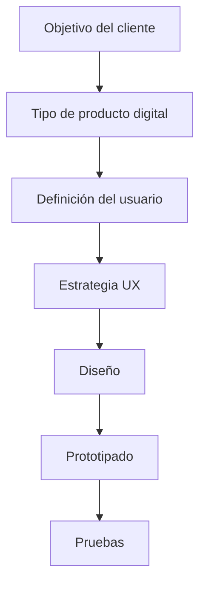
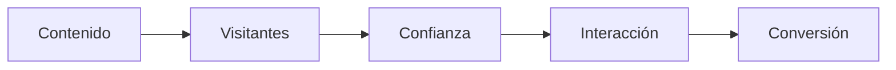
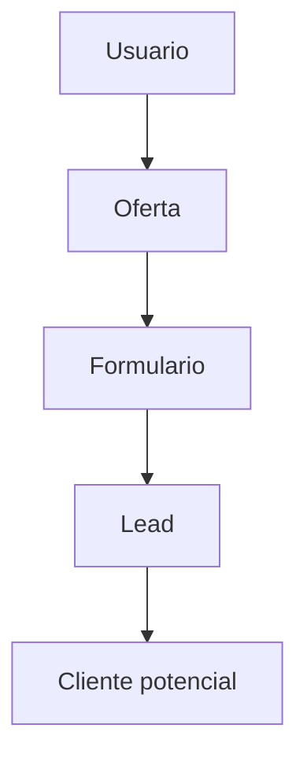
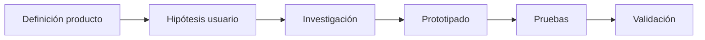

# T01.07 El Objeto De Diseño: Página Web, Sitio Web Y Aplicaciones — Parte II

# Introducción

Esta parte continúa con el análisis del objeto de diseño dentro del contexto UX, pero ahora se enfoca en la **tipología de sitios web y aplicaciones**.

El transcript introduce una idea central:

> "Otro criterio con el que continuamos definiendo al cliente y al usuario está relacionado con el tipo al que pertenece y el objetivo que persigue su presencia en la red."

## ¿A Qué Se Refiere Esta Afirmación?

Antes de diseñar una experiencia de usuario no basta con conocer:

- Quién es el usuario
    
- Qué necesita el cliente

También es necesario comprender:

- Qué tipo de producto digital será desarrollado
    
- Qué objetivo persigue
    
- Cómo interactuará el usuario
    
- Qué comportamiento se espera

Esto se convierte en un punto de partida estratégico para el diseño UX.

---

# Importancia Estratégica De la Tipología Web

La tipología web ayuda a responder preguntas fundamentales:

- ¿Cuál es el objetivo principal?
    
- ¿Qué acciones realizará el usuario?
    
- ¿Qué estructura necesita el sistema?
    
- ¿Qué contenidos son prioritarios?
    
- ¿Qué tipo de interacción existirá?

---

## Relación Con UX

El transcript establece:

> "Este es otro punto de partida para definir al usuario y las páginas que queremos diseñar."

La tipología influye directamente en:

- Arquitectura de información
    
- Navegación
    
- Contenidos
    
- Interacciones
    
- Diseño visual
    
- Objetivos de conversión

---

# Flujo Estratégico Mencionado

---

# Tipologías Web Y Aplicaciones

El transcript menciona que:

> "Se crean aproximadamente 175 sitios web por minuto"

No todos entran perfectamente en una categoría, pero existen tipologías ampliamente utilizadas.

---

# 1. Web Corporativa

## Definición

Es un sitio cuyo objetivo principal consiste en representar digitalmente una empresa, organización o marca.

Su función principal es ofrecer información institucional.

---

## Objetivos

- Presentar la marca
    
- Mostrar productos
    
- Mostrar servicios
    
- Comunicar visión
    
- Comunicar misión
    
- Mostrar factores diferenciadores
    
- Proporcionar contacto

---

## Información Común

|Información|
|---|
|Catálogo de productos|
|Datos de contacto|
|Ubicaciones|
|Clientes|
|Inversionistas|
|Servicios|

---

## Frase Importante

> "Es la tarjeta de visita digital"

### Interpretación

La web corporativa representa la primera impresión digital de una empresa.

Así como una tarjeta física presenta:

- Nombre
    
- Información
    
- Datos de contacto

Una web corporativa funciona de manera similar.

---

## Clientes Típicos

- Empresas grandes
    
- Startups
    
- Autónomos
    
- Agencias
    
- Negocios pequeños

---

## Ventajas

|Ventajas|
|---|
|Fortalece identidad|
|Mejora credibilidad|
|Facilita contacto|

---

## Desventajas

|Desventajas|
|---|
|Require actualización constante|

---

# 2. Portfolios Y Sitios Personales

## Definición

Sitios diseñados para mostrar:

- Experiencia
    
- Formación
    
- Reconocimientos
    
- Proyectos
    
- Habilidades

---

## Objetivo

Presentar méritos profesionales.

---

## Características Mencionadas

- Diseño minimalista
    
- Poco texto
    
- Gran contenido visual

---

## Usuarios Frecuentes

Originalmente:

- Pintores
    
- Fotógrafos
    
- Escultores
    
- Diseñadores

Actualmente:

- Programadores
    
- Arquitectos
    
- Consultores
    
- Profesionales independientes

---

## Ventajas

|Ventajas|
|---|
|Fortalece marca personal|
|Facilita mostrar proyectos|

---

## Desventajas

|Desventajas|
|---|
|Necesita actualización continua|

---

# 3. Blogs

## Definición

Sitios diseñados para publicar contenido o historias periódicamente.

---

## Objetivo Principal

Compartir contenido editorial generalmente con tono informal.

---

## Características

- Actualización frecuente
    
- Periodicidad constante
    
- Interacción mediante comentarios
    
- Estrategias de contenido

---

## Frase Importante

> "Forma parte de una estrategia de marketing"

### Interpretación

Los blogs permiten atraer usuarios sin publicidad agresiva.

La estrategia consiste en:

1. Crear contenido útil
    
2. Atraer usuarios
    
3. Generar confianza
    
4. Convertir visitantes

---

## Flujo Típico De Marketing De Contenidos

---

## Tipos

### Blog Tradicional

- Texto
    
- Imágenes

### Videoblog (Vlog)

- Video como contenido principal

---

## Clientes Frecuentes

- Bloggers
    
- Influencers
    
- Empresas
    
- Profesionales

---

# 4. Micrositios

## Definición

Son pequeños sitios o subconjuntos de páginas pertenecientes a una empresa.

---

## Objetivos

Generalmente buscan:

- Promoción
    
- Marketing
    
- Posicionamiento
    
- Campañas específicas

---

## Características

- Diseño llamativo
    
- Alta atención visual
    
- Enfoque en un objetivo específico

---

## Ejemplo De Uso

Campaña de lanzamiento:

"Nueva línea de productos"

---

## Ventajas

|Ventajas|
|---|
|Muy enfocados|
|Aumentan conversiones|

---

## Desventajas

|Desventajas|
|---|
|Vida útil limitada|

---

# 5. Landing Page (Página De aterrizaje)

## Definición

Página diseñada específicamente para convertir visitantes en posibles clientes.

---

## Frase Importante Del Transcript

> "Busca convertir usuarios en lead"

---

## ¿Qué Es Un Lead?

Un lead es:

Un usuario que proporciona voluntariamente información personal:

- Nombre
    
- Correo
    
- Teléfono

para convertirse en un possible cliente.

---

## Objetivos

- Obtener registros
    
- Conseguir ventas
    
- Generar suscripciones

---

## Características

- Una sola página (One Page)
    
- Diseño persuasivo
    
- Llamados a la acción

---

## Flujo Típico

---

## Ventajas

|Ventajas|
|---|
|Alta conversión|
|Fácil medición|

---

## Desventajas

|Desventajas|
|---|
|Muy dependiente del contenido|

---

# 6. Comercio Electrónico (E-Commerce)

## Definición

Sitios destinados a vendor productos y servicios digitalmente.

---

## Información Necesaria

El transcript menciona:

- Precios
    
- Imágenes
    
- Composición
    
- Dimensions
    
- Tallas
    
- Métodos de pago
    
- Entregas
    
- Contacto
    
- Preguntas frecuentes

---

## Objetivo

Facilitar decisiones de compra.

---

## Clientes

- Empresas
    
- Distribuidores
    
- Autónomos

---

## Ventajas

|Ventajas|
|---|
|Ventas globales|
|Automatización|

---

## Desventajas

|Desventajas|
|---|
|Complejidad logística|

---

# 7. Prensa Digital Y Revistas

## Definición

Plataformas informativas enfocadas en noticias y contenidos editoriales.

---

## Objetivos

Responder intereses:

- Informativos
    
- Ideológicos
    
- Sociales

---

## Clientes

- Revistas
    
- Medios periodísticos

---

## Características

- Actualización frecuente
    
- Gran volumen de contenido

---

# 8. Wikis

## Definición

Sitios colaborativos donde usuarios pueden:

- Crear contenido
    
- Modificar contenido
    
- Debatir contenido

---

## Características

- Colaboración
    
- Comunidad
    
- Edición abierta

---

## Ejemplo Mencionado

WikiHow

---

## Ventajas

|Ventajas|
|---|
|Crecimiento colaborativo|

---

## Desventajas

|Desventajas|
|---|
|Riesgo de información incorrecta|

---

# 9. Portales Web

## Definición

Plataformas que recopilan contenidos y servicios desde múltiples fuentes.

---

## Servicios Mencionados

- Chat
    
- Correo
    
- Noticias
    
- Buscadores
    
- Foros

---

## Tipos

### Portales Horizontales

Dirigidos a usuarios generales.

### Portales Verticales

Especializados:

- Geografía
    
- Temas
    
- Intereses

---

# 10. Redes Sociales

## Definición

Plataformas donde usuarios crean y comparten contenido.

---

## Contenidos Mencionados

- Videos
    
- Imágenes
    
- Texto
    
- Noticias
    
- Enlaces

---

## Diferenciadores

Cada red social se diferencia por:

- Formato
    
- Tipo de interacción
    
- Audiencia

---

## Ventajas

|Ventajas|
|---|
|Alta interacción|
|Comunidad|

---

## Desventajas

|Desventajas|
|---|
|Saturación de contenido|

---

# Relación Entre Tipología Y Diseño UX

El transcript finaliza con:

> "El punto de partida estratégico que define al usuario en un proyecto UX es la definición del producto."

## Interpretación

El diseñador primero define:

- Producto
    
- Objetivos
    
- Necesidades del cliente

Posteriormente:

- Formula hipótesis
    
- Diseña
    
- Investiga
    
- Prototipa
    
- Valida

---

## Flujo UX Mencionado

---

# Algoritmos

El transcript no presenta algoritmos formales.

---

# Código

El transcript no presenta código.

---

# Resumen Final

## Puntos Clave

- La tipología web ayuda a definir estrategias UX.
    
- Existen múltiples categorías de productos digitales.
    
- Cada tipo responde a objetivos distintos.
    
- Las web corporativas representan marcas.
    
- Los portfolios muestran experiencia.
    
- Los blogs apoyan estrategias de contenido.
    
- Los micrositios apoyan campañas específicas.
    
- Las landing pages buscan conversión.
    
- Los comercios electrónicos facilitan ventas.
    
- Los wikis permiten colaboración.
    
- Los portales centralizan servicios.
    
- Las redes sociales facilitan interacción.

## Ideas Más Importantes

1. El tipo de producto determina decisiones UX.
    
2. El objetivo del cliente define la experiencia.
    
3. La definición del usuario inicia desde la estrategia.
    
4. La investigación valida hipótesis iniciales.
    
5. UX depende tanto del usuario como del propósito del producto.

## MicroTest 01.07

1. Este tipo de web ofrece información sobre la marca, producto o servicio; la visión y la misión, sus factores diferenciadores y su presencia:
    
    - La respuesta: a. Webs corporativas
        
    - Justificación:  
        Las webs corporativas tienen como objetivo principal representar digitalmente a una empresa o marca. Incluyen información como misión, visión, productos, servicios, factores diferenciadores y presencia de la empresa para comunicar identidad y fortalecer su imagen.
        
2. Este tipo de web muestra los conocimientos, experiencia y reconocimiento de un professional:
    
    - La respuesta: c. Sitios personales
        
    - Justificación:  
        Los sitios personales o portfolios están orientados a mostrar conocimientos, experiencia, proyectos, logros y reconocimientos profesionales. Se utilizan para exponer méritos y fortalecer la marca personal.
        
3. Pueden componerse de una o pocas páginas y se utilize para mostrar información sobre un nuevo producto o servicio y suele set efímero:
    
    - La respuesta: c. Micrositios Web
        
    - Justificación:  
        Los micrositios web suelen estar compuestos por una o pocas páginas enfocadas en una campaña específica, producto o servicio determinado. Suelen set temporales o efímeros porque normalmente se crean para objetivos concretos de marketing o promoción.