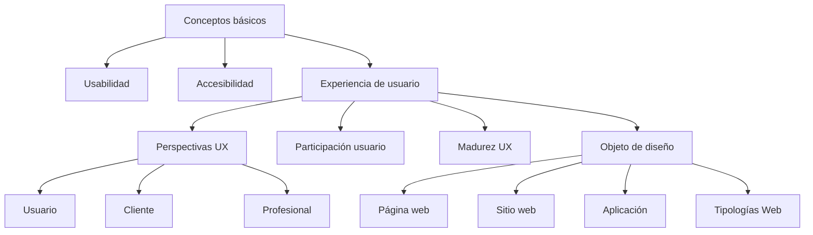
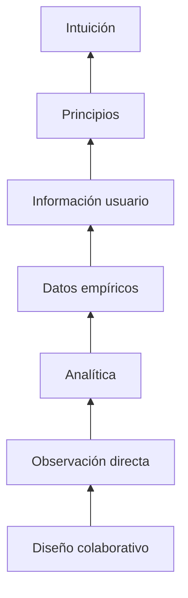
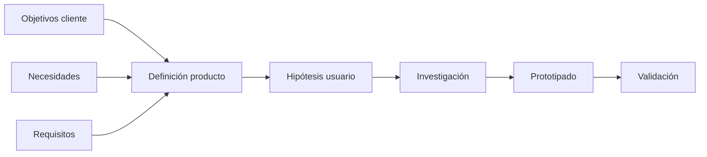

# T01.08 Resumen Del Tema

# Introducción General Del Tema

El transcript presenta un cierre integral del Tema 1, cuyo propósito principal fue construir una base conceptual sólida sobre el diseño de experiencia de usuario (UX), aclarando conceptos que suelen confundirse y estableciendo una visión estratégica sobre cómo UX participa en el desarrollo de productos digitales.

El resumen no introduce conceptos completamente nuevos; en cambio, conecta y relaciona todos los temas vistos anteriormente:

- Usabilidad
    
- Experiencia de usuario (UX)
    
- Accesibilidad
    
- Motivación e importancia de UX
    
- Perspectiva del usuario
    
- Perspectiva del cliente
    
- Perspectiva professional
    
- Niveles de implicación de usuarios
    
- Niveles de madurez UX
    
- Página web
    
- Sitio web
    
- Aplicación
    
- Tipologías web
    
- Objetivos estratégicos

La intención general del tema fue formar una visión completa del diseño UX antes de entrar a procesos más avanzados.

---

# Objetivo General Del Tema

Según el transcript:

> "El objetivo inicialmente fue definir y aclarar los conceptos iniciales que se pueden dar en el campo."

## Interpretación

Antes de diseñar experiencias digitales es necesario comprender el lenguaje y los conceptos fundamentales.

La razón es que múltiples conceptos relacionados con UX suelen confundirse:

Por ejemplo:

- Usabilidad ≠ UX
    
- UX ≠ Accesibilidad
    
- Página web ≠ Sitio web
    
- Sitio web ≠ Aplicación

Comprender estas diferencias evita errores de diseño y comunicación.

---

# Relación General Entre Los Temas Estudiados

---

# Conceptos Fundamentales Revisados

# 1. Usabilidad

## Definición

La usabilidad es el grado en que un sistema permite a los usuarios alcanzar objetivos específicos:

- Eficazmente
    
- Eficientemente
    
- Con satisfacción

---

## Importancia

La usabilidad permite que un usuario:

- Complete tareas fácilmente
    
- Cometa menos errores
    
- Aprenda rápidamente

---

## Contexto De Uso

Se aplica en:

- Sitios web
    
- Aplicaciones móviles
    
- Sistemas empresariales
    
- Software

---

## Ventajas

|Ventajas|
|---|
|Reduce errores|
|Aumenta productividad|
|Disminuye frustración|

---

## Posibles Limitaciones

Una interfaz puede set usable pero generar una mala experiencia emocional.

Por ello aparece UX.

---

# 2. Experiencia De Usuario (UX)

## Definición

La experiencia de usuario representa las percepciones, emociones y respuestas que una persona experimenta durante la interacción con un sistema.

---

## Components Principales

UX involucra:

- Facilidad de uso
    
- Emociones
    
- Satisfacción
    
- Diseño visual
    
- Eficiencia
    
- Valor percibido

---

## Importancia

El transcript menciona que UX permite:

> "Que los usuarios finales puedan llevar a cabo sus actividades sin mayor problema."

---

## Impacto Empresarial

Un buen UX puede generar:

- Mayor satisfacción
    
- Más ventas
    
- Fidelización
    
- Menos abandono

---

# Diferencia Entre Usabilidad, Accesibilidad Y UX

|Concepto|Definición|Objetivo|
|---|--:|--:|
|Usabilidad|Facilidad de uso|Completar tareas|
|Accesibilidad|Acceso universal|Inclusión|
|UX|Experiencia completa|Satisfacción integral|

---

# Motivación E Importancia Del Diseño UX

El transcript menciona tres perspectivas involucradas.

---

# Perspectiva Del Usuario

## Intereses Principales

El usuario busca:

- Simplicidad
    
- Rapidez
    
- Eficiencia
    
- Satisfacción

---

## Preguntas Que Responde UX

- ¿Puedo completar mi tarea?
    
- ¿Es fácil?
    
- ¿Es agradable?

---

# Perspectiva Del Cliente

## Intereses Principales

El cliente busca:

- Incrementar ventas
    
- Obtener conversiones
    
- Mejorar posicionamiento
    
- Aumentar satisfacción

---

## Problema Mencionado

El transcript señala:

> "No siempre el cliente va a conocer lo que quiere."

### Interpretación

El cliente puede expresar soluciones en lugar de necesidades reales.

Ejemplo:

Cliente:

> "Necesito una app"

Necesidad real:

> "Necesito que mis usuarios hagan pedidos fácilmente."

La función UX consiste en transformar necesidades ambiguas en soluciones concretas.

---

# Perspectiva Professional

## Intereses

Los profesionales UX buscan:

- Investigar usuarios
    
- Identificar necesidades
    
- Diseñar soluciones
    
- Validar resultados

---

# Niveles De Implicación De Usuarios En UX

El transcript recuerda que se estudiaron diferentes formas de involucrar usuarios durante el diseño.

---

## Escalera De Implicación

---

## Interpretación

A mayor nivel:

- Más cercanía a la realidad del usuario
    
- Mayor evidencia
    
- Mejor comprensión

---

# Niveles De Madurez UX En Organizaciones

El transcript explica que esto ayuda a generar expectativas sobre el mercado laboral.

---

## Objetivo

Permite identificar:

- Qué tan integrada está UX
    
- Qué prácticas existen
    
- Qué tan consolidada está la cultura UX

---

## Resumen De Niveles

|Nivel|Característica|
|---|--:|
|1|UX inexistente|
|2|Principios de usabilidad|
|3|Defensores UX|
|4|Investigación occasional|
|5|Proceso UX formal|
|6|Cultura UX|

---

## Importancia Laboral

Ayuda a comprender:

- Qué prácticas esperar
    
- Qué herramientas podrían existir
    
- Qué procesos estarán disponibles

---

# Nivel Estratégico Del Diseño

El transcript menciona:

> "Se comenzó a comprender el nivel estratégico del diseño."

---

## ¿Qué Significa Diseño Estratégico?

No consiste únicamente en diseñar pantallas.

Implica comprender:

- Objetivos empresariales
    
- Usuarios
    
- Necesidades
    
- Productos
    
- Contexto

---

# Diferenciación Entre Productos Digitales

Los conceptos revisados fueron:

---

## Página Web

Definición:

Pantalla individual dentro de un sitio o aplicación.

---

## Sitio Web

Definición:

Conjunto estructurado de páginas.

---

## Aplicación

Definición:

Sistema orientado a interacción y funcionalidades específicas.

---

# Comparación Resumida

|Característica|Página Web|Sitio Web|Aplicación|
|---|--:|--:|--:|
|Unidad individual|Sí|No|No|
|Varias páginas|No|Sí|Puede|
|Interacción compleja|Baja|Media|Alta|

---

# Tipologías Web Estudiadas

El transcript recuerda que se revisaron distintos tipos:

|Tipología|
|---|
|Web corporativa|
|Portfolios|
|Blogs|
|Micrositios|
|Landing pages|
|Comercio electrónico|
|Revistas digitales|
|Wikis|
|Portales|
|Redes sociales|

---

# Proceso Estratégico Mencionado

El transcript concluye que el producto debe definirse mediante:

- Objetivos del cliente
    
- Necesidades
    
- Requisitos

Posteriormente se desarrollan hipótesis sobre usuarios.

---

## Flujo Estratégico UX Completo

---

# Algoritmos

El transcript no menciona algoritmos formales.

---

# Código

El transcript no presenta código.

---

# Resumen Final

## Puntos Clave

- UX involucra mucho más que diseño visual.
    
- La usabilidad y UX son conceptos distintos.
    
- La accesibilidad busca inclusión.
    
- UX debe considerar usuario, cliente y professional.
    
- Los usuarios pueden involucrarse en múltiples niveles.
    
- Las organizaciones presentan distintos grados de madurez UX.
    
- El producto digital debe definirse estratégicamente.
    
- Página web, sitio web y aplicación no representan lo mismo.
    
- Existen diversas tipologías de productos digitales.

## Ideas Más Importantes

1. UX conecta necesidades del usuario con objetivos del negocio.
    
2. Un cliente puede no expresar correctamente sus necesidades.
    
3. El diseño UX require investigación y validación.
    
4. La madurez UX influye en el trabajo professional.
    
5. El diseño inicia desde una estrategia y no únicamente desde pantallas.
