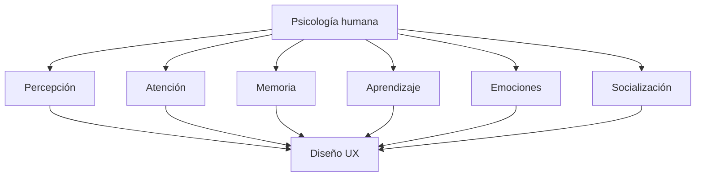
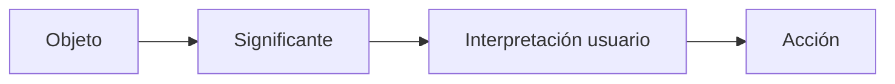

# T02.01 Factores Cognitivos Y UX — Parte I

# Introducción

El objetivo principal del tema es comprender la relación entre la psicología humana y la interacción con interfaces digitales. El transcript establece que el diseño UX no depende únicamente de elementos visuals o tecnológicos; también depende de cómo funciona la mente humana.

La psicología aporta conocimientos sobre:

- Cómo perciben las personas la información
    
- Cómo prestan atención
    
- Cómo recuerdan elementos
    
- Cómo aprenden
    
- Cómo toman decisiones
    
- Cómo buscan información

Estos factores afectan directamente la forma en que un usuario interactúa con:

- Aplicaciones móviles
    
- Sitios web
    
- Sistemas empresariales
    
- Interfaces digitales

---

# Objetivo Principal Del Tema

El transcript menciona:

> "Despertar la conciencia sobre la relación entre la psicología humana y la interacción con interfaces de usuario."

## Interpretación

El diseño UX no consiste únicamente en crear interfaces visualmente atractivas.

También implica comprender:

- Cómo piensa una persona
    
- Cómo interpreta estímulos
    
- Cómo procesa información
    
- Cómo responde emocionalmente

---

# Relación Entre Psicología Y UX

La psicología proporciona conocimientos sobre el comportamiento humano que permiten diseñar interfaces más intuitivas.

## Ejemplos

Sin comprender procesos cognitivos:

- Botones podrían colocarse incorrectamente
    
- Información importante podría pasar desapercibida
    
- Usuarios podrían confundirse
    
- Tareas simples podrían convertirse en tareas difíciles

Con comprensión cognitiva:

- Se reduce esfuerzo mental
    
- Se mejora navegación
    
- Se disminuyen errores
    
- Se incrementa satisfacción

---

# Relación General Entre Cognición Y UX



---

# Procesos Cognitivos

## Definición

Los procesos cognitivos son mecanismos mentales mediante los cuales las personas:

- Reciben información
    
- Procesan información
    
- Interpretan información
    
- Almacenan información
    
- Utilizan información

El transcript menciona una característica importante:

> "Son interdependientes"

---

## ¿Qué Significa Interdependientes?

Significa que los procesos cognitivos no funcionan por separado.

Trabajan simultáneamente.

Ejemplo:

Un usuario abre una aplicación bancaria:

### Percepción

Ve botones y colores.

### Atención

Se concentra en el saldo.

### Memoria

Recuerda dónde estaba el botón de transferencias.

### Aprendizaje

Aprende una nueva funcionalidad.

Todo ocurre simultáneamente.

---

# Procesos Mencionados

|Proceso cognitivo|Función|
|---|--:|
|Percepción|Captar estímulos|
|Atención|Concentrarse|
|Memoria|Retener información|
|Aprendizaje|Adquirir conocimientos|
|Búsqueda de información|Encontrar datos|

---

# La Percepción

## Definición

La percepción es el proceso mediante el cual una persona obtiene información del entorno utilizando sus sentidos y transforma esa información en experiencias significativas.

---

## Importancia

La percepción permite:

- Reconocer objetos
    
- Interpretar elementos visuals
    
- Identificar patrones
    
- Comprender interfaces

---

## Contexto En UX

La percepción influye directamente en:

- Distribución visual
    
- Colores
    
- Botones
    
- Tipografía
    
- Imágenes
    
- Jerarquías visuals

---

# Psicología Gestalt

El transcript menciona:

> "En relación con el diseño de interfaces se extendió hacia la psicología Gestalt."

## Definición

La psicología Gestalt estudia cómo las personas organizan e interpretan estímulos visuals.

Su principio principal puede resumirse como:

> "El todo es diferente a la suma de sus partes."

---

# Principios Gestalt Mencionados

Se mencionan cuatro principios:

1. Figura-Fondo
    
2. Proximidad
    
3. Continuidad
    
4. Cierre

---

# 1. Principio Figura-Fondo

## Definición

Las personas distinguen:

- Un elemento principal (figura)
    
- Un contexto secundario (fondo)

---

## Uso En UX

Permite destacar:

- Botones
    
- Ventanas emergentes
    
- Mensajes importantes
    
- Alertas

---

## Ejemplo Mencionado

Una ventana emergente:

```text
Pantalla principal oscurecida

        +----------------+
        | Mensaje nuevo  |
        +----------------+
```

El usuario interpreta:

Figura:

- Ventana emergente

Fondo:

- Interfaz oscurecida

---

## Importancia Del Contraste

El transcript menciona:

> "El contraste de color es importante"

Porque ayuda a:

- Mejorar visibilidad
    
- Guiar atención
    
- Evitar confusión

---

# 2. Principio De Proximidad

## Definición

Los objetos cercanos se perciben como pertenecientes al mismo grupo.

---

## Uso En UX

Agrupar:

- Botones similares
    
- Opciones relacionadas
    
- Campos de formularios

---

## Ejemplo

Incorrecto:

```text
Guardar

Eliminar

Editar
```

Correcto:

```text
[Guardar] [Editar]

[Eliminar]
```

Los botones relacionados se perciben juntos.

---

## Ventajas

|Ventajas|
|---|
|Mejor organización|
|Menor carga mental|
|Mayor comprensión|

---

# 3. Principio De Continuidad

## Definición

Existe una tendencia natural a percibir patrones continuous incluso cuando están interrumpidos.

---

## Uso En UX

Aplicaciones:

- Alineación de elementos
    
- Menús
    
- Formularios
    
- Sliders

---

## Ejemplo Mencionado

Slider:

```text
-------O-------
```

El usuario percibe:

Una línea continua.

No elementos independientes.

---

## Ventajas

|Ventajas|
|---|
|Mejora navegación visual|
|Reduce esfuerzo cognitivo|

---

# 4. Principio De Cierre

## Definición

Las personas completan mentalmente información faltante.

---

## Ejemplo

```text
◜     ◝

◟     ◞
```

Aunque no existe un círculo completo:

El cerebro percibe:

```text
○
```

---

## Uso En UX

El transcript menciona:

Ventanas superpuestas.

Aunque una ventana esté parcialmente cubierta:

El usuario interpreta:

- Existe una ventana completa detrás

---

## Ventajas

|Ventajas|
|---|
|Reduce saturación visual|
|Simplifica diseños|

---

# Comparación De Principios Gestalt

|Principio|Qué hace|Aplicación UX|
|---|--:|--:|
|Figura-Fondo|Separa elemento principal|Ventanas emergentes|
|Proximidad|Agrupa elementos|Botones|
|Continuidad|Percibe líneas continuas|Sliders|
|Cierre|Completa información faltante|Ventanas|

---

# Affordance Y Significante

El transcript introduce:

> "Para que la affordance pueda set percibida por una persona el objeto necesita una propiedad llamada significante"

---

# Affordance

## Definición

Affordance representa las acciones que un objeto permite realizar.

Ejemplos:

- Botón → presionar
    
- Barra → deslizar
    
- Puerta → abrir

---

## Importancia

Permite que el usuario entienda:

- Qué puede hacer
    
- Cómo hacerlo

Sin instrucciones adicionales.

---

# Significante

## Definición

El significante es la señal visual que comunica cómo interactuar con un objeto.

---

## Ejemplos Mencionados

Puertas:

- Picaporte
    
- Barra
    
- Pomo

Íconos:

- Lupa → buscar
    
- Papelera → eliminar
    
- Casa → inicio

---

# Ejemplo Explicado Del Transcript

Una puerta:

Si posee:

- Barra

El usuario entiende:

> Empujar

Si posee:

- Picaporte

El usuario entiende:

> Jalar

---

## Problema De Mal Diseño

El transcript menciona:

> "Si es necesario aclararlo con un cartel que dice empujar entonces no está bien diseñado"

Interpretación:

Un diseño adecuado comunica acciones naturalmente.

---

# Relación Affordance → Significante → Acción



---

# Algoritmos

El transcript no presenta algoritmos formales.

$$  
\text{No se mencionan algoritmos en el contenido analizado}  
$$

## Variables

No aplica.

## Funcionamiento

No aplica.

## Casos De Uso

No aplica.

---

# Código

El transcript no presenta código.

---

# Resumen Final

## Puntos Clave

- UX se fundamenta parcialmente en principios psicológicos.
    
- Los procesos cognitivos trabajan simultáneamente.
    
- La percepción transforma estímulos en experiencias.
    
- La psicología Gestalt explica cómo interpretamos información visual.
    
- Figura-fondo ayuda a destacar información.
    
- Proximidad agrupa elementos relacionados.
    
- Continuidad guía navegación visual.
    
- Cierre completa información faltante.
    
- Affordance define acciones posibles.
    
- Significantes comunican cómo actuar.

## Ideas Más Importantes

1. Las personas no procesan interfaces únicamente de forma racional.
    
2. Los procesos cognitivos afectan directamente la interacción digital.
    
3. Una buena interfaz aprovecha principios psicológicos.
    
4. El diseño debe comunicar acciones naturalmente.
    
5. Un usuario no debería necesitar instrucciones para comprender una interfaz.

## MicroTest 02.01

1. Nos permite adquirir información del medio que nos rodea a través de los sentidos y transformarla en experiencias:
    
    - La respuesta: b. Percepción
        
    - Justifacion: La percepción es el proceso cognitivo que permite captar información del entorno mediante los sentidos (vista, oído, tacto, etc.) y convertir esos estímulos en experiencias significativas. El transcript menciona específicamente que la percepción "nos va a permitir adquirir información del medio que nos rodea a través de los sentidos y transformarlo en experiencias".
        
2. Consiste en que tendemos a asociar, o considerar como un grupo, los objetos que están más próximos entre sí:
    
    - La respuesta: a. Principio de proximidad
        
    - Justifacion: El principio de proximidad de la psicología Gestalt establece que los elementos que están cercanos físicamente tienden a percibirse como relacionados o pertenecientes a un mismo grupo. En UX esto se utilize para agrupar botones, formularios y opciones relacionadas para facilitar la comprensión visual.
        
3. Consiste en nuestra capacidad de percibir como un todo completo las formas separadas, con ayuda del contexto:
    
    - La respuesta: c. Principio de cierre
        
    - Justifacion: El principio de cierre describe la capacidad del cerebro de completar información faltante y percibir una figura completa aunque existan partes ausentes. El transcript lo explica como la capacidad de percibir formas separadas como un todo utilizando el contexto visual disponible.


## Saber Mas

<iframe src="https://www.nngroup.com/articles/trustworthy-design/" allow="fullscreen" allowfullscreen="" style="height:100%;width:100%; aspect-ratio: 16 / 9; "></iframe>