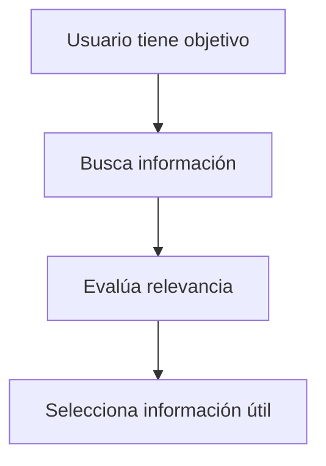
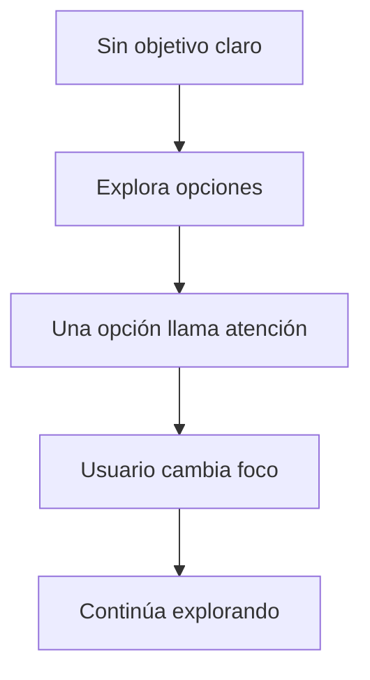
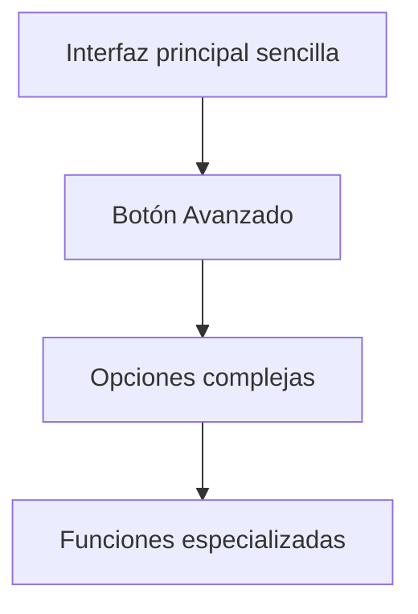
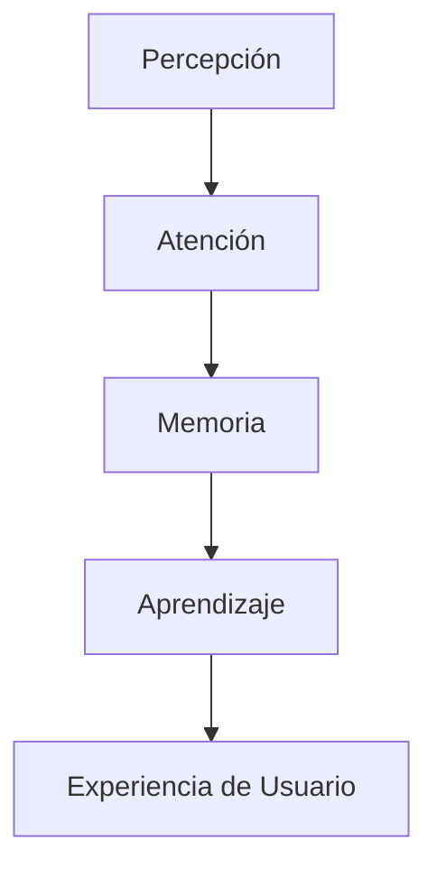

# Notas De Estudio – T02.02 Factores Cognitivos Y UX Parte II

# Introducción

Los factores cognitivos en Experiencia de Usuario (UX) estudian cómo las personas perciben, procesan, recuerdan y utilizan información cuando interactúan con un sistema. En este contenido se profundiza en tres elementos fundamentales:

1. Atención
    
2. Memoria
    
3. Aprendizaje

Estos factores influyen directamente en el diseño de interfaces porque determinan qué tan fácil o difícil resulta para un usuario comprender y utilizar un sistema.

---

# 1. Atención

## Definición

La atención es el proceso cognitivo mediante el cual una persona selecciona a qué estímulos o información prestará concentración en un memento determinado.

En cualquier entorno existen múltiples estímulos:

- Colores
    
- Textos
    
- Sonidos
    
- Botones
    
- Imágenes
    
- Notificaciones
    
- Objetos visuals

El cerebro no procesa todos simultáneamente con la misma profundidad; por ello realiza un filtrado y selecciona aquello que considera importante.

---

## Importancia De la Atención En UX

La atención es importante porque:

- Determina qué elementos observará primero el usuario
    
- Reduce carga cognitiva
    
- Facilita completar tareas
    
- Permite dirigir acciones específicas
    
- Evita errores

Si el diseño no guía correctamente la atención, el usuario puede:

- Ignorar información importante
    
- Confundirse
    
- Tardar más tiempo en completar tareas
    
- Abandonar el sistema

---

## Factores Que Influyen En la Atención

Según Sharp, Rogers y Preece (2011), existen dos factores principales:

### 1. Tener Un Objetivo Claro

Cuando un usuario posee un objetivo definido:

Ejemplos:

- Comprar un producto
    
- Buscar un documento
    
- Enviar un correo
    
- Descargar un archivo

El usuario comienza a filtrar información automáticamente.

Proceso:

---

### 2. Información Destacada

Si la información está visualmente resaltada:

- llama la atención más rápido
    
- require menos esfuerzo mental
    
- aumenta la probabilidad de set encontrada

Elementos que ayudan a destacar información:

- Color
    
- Contraste
    
- Tamaño
    
- Espaciado
    
- Alineación
    
- Tipografía
    
- Posición

---

## Escenario Con Objetivo Claro

Ejemplo:

Un usuario entra a una tienda virtual buscando:

"Comprar unos audífonos"

El cerebro ignore:

- publicidad irrelevante
    
- categorías no relacionadas
    
- imágenes innecesarias

Y se concentra en:

- barra de búsqueda
    
- categorías
    
- precios
    
- productos

---

## Escenario Sin Objetivo Claro

Cuando el usuario no tiene un objetivo específico:

La atención cambia constantemente.

Ejemplo:

Entrar a una red social sin intención concreta.

Proceso:

---

## Implicaciones Para El Diseño De Interfaces

El diseño debe dirigir la atención correctamente.

### Recomendaciones

### Destacar Información Importante

Ejemplos:

- Botón "Comprar"
    
- Botón "Enviar"
    
- Alertas importantes
    
- Errores

---

### Evitar Exceso De Información

Problema:

Demasiada información produce:

- sobrecarga cognitiva
    
- distracciones
    
- fatiga visual

Ejemplo incorrecto:

Una pantalla con:

- muchos colores
    
- anuncios
    
- botones
    
- imágenes

Ejemplo correcto:

Interfaz limpia y organizada.

---

### Aplicar Principios Visuals

Elementos mencionados:

|Elemento|Función|
|--:|:--|
|Color|Jerarquía visual|
|Contraste|Diferenciar elementos|
|Alineación|Organización|
|Ordenamiento|Estructura|
|Espacios|Reducir saturación|

---

# 2. Memoria

## Definición

La memoria es la capacidad cognitiva para almacenar, conservar y recuperar información.

No toda la información percibida se almacena.

Existe un proceso de filtrado.

---

## Relación Entre Memoria, Percepción Y Atención

La memoria depende fuertemente de:

Explicación:

1. Percibimos estímulos
    
2. Prestamos atención a algunos
    
3. Se almacena parte de ellos
    
4. Posteriormente se utilizan para aprender

---

## Proceso De Filtrado

El transcript menciona:

"No recordamos todo"

Esto significa que el cerebro elimina información considerada irrelevante.

Ejemplo:

En una página web:

El usuario puede recordar:

- color del botón principal
    
- nombre de producto

Pero olvidar:

- imágenes secundarias
    
- pequeños detalles visuals

---

## Factores Que Afectan la Memoria

Según Sharp, Rogers y Preece:

### Interpretación De la Información

No almacenamos información de manera literal.

La interpretamos.

Ejemplo:

Dos personas observan el mismo anuncio:

Persona A:

"Promoción"

Persona B:

"Descuento temporal"

Ambos almacenan significados distintos.

---

### Contexto

La memoria mejora cuando el contexto de recuperación es parecido al contexto original.

Ejemplo:

Una persona recuerda más fácilmente dónde guardó un archivo si:

- reconoce el icono
    
- recuerda colores
    
- reconoce carpetas

---

# Regla De Oro De UX

## "Debe Set Más Fácil Reconocer Que recordar"

Quote completo mencionado:

> "Debe set más fácil reconocer que recordar"

### Significado

Es más sencillo identificar algo que ya vimos anteriormente que recuperarlo únicamente desde la memoria.

---

## Reconocimiento

### Definición

Identificar algo mediante pistas o estímulos.

Ejemplos:

- reconocer un ícono
    
- reconocer un botón
    
- reconocer una fotografía

---

## Recordar

### Definición

Recuperar información sin ayuda externa.

Ejemplos:

- recordar una contraseña
    
- recordar una ruta
    
- recordar dónde se guardó un archivo

---

## Comparación

|Reconocimiento|Recordar|
|--:|:--|
|Usa pistas|No usa pistas|
|Menor esfuerzo mental|Mayor esfuerzo|
|Más rápido|Más lento|
|Menos errores|Más errores|

---

## Aplicación En Interfaces

Los elementos deben localizarse coherentemente:

- íconos
    
- controles
    
- menús
    
- botones

---

## Diversas Formas De Codificar Información

Cuando el usuario guarda información se deben proporcionar múltiples señales.

Ejemplos:

- etiquetas
    
- colores
    
- marcas
    
- fechas
    
- categorías
    
- nombres descriptivos

---

## Caso Mencionado: Sistema De Archivos

El transcript describe un sistema de carpetas y archivos digitales.

Elementos utilizados:

|Elemento|Propósito|
|--:|:--|
|Nombre|Identificación|
|Ícono|Tipo de archivo|
|Color|Clasificación|
|Fecha|Contexto temporal|
|Tamaño|Información adicional|
|Vista previa|Reconocimiento rápido|

---

## Beneficios

- búsqueda rápida
    
- menor esfuerzo
    
- menos errores
    
- reconocimiento inmediato

---

# 3. Aprendizaje

## Definición

El aprendizaje es el proceso mediante el cual una persona adquiere conocimientos o habilidades mediante experiencia o repetición.

Está directamente relacionado con la memoria.

---

## Importancia En UX

Las personas realizan con mayor facilidad:

- tareas aprendidas
    
- acciones repetidas
    
- actividades conocidas

Y tienen dificultades con:

- acciones nuevas
    
- patrones desconocidos

---

## Implicaciones Para Diseño

La solución principal es:

# Mantener Coherencia

La coherencia permite:

- detectar patrones
    
- reducir esfuerzo mental
    
- aprender rápidamente

---

## Tipos De Coherencia

### Coherencia Interna

Consiste en mantener consistencia dentro del sistema.

Ejemplo:

Si un botón azul significa "Guardar", debe significar lo mismo en todas las pantallas.

---

### Coherencia Externa

Consiste en respetar patrones conocidos de otros sistemas.

Ejemplo:

Los usuarios esperan encontrar:

- menú hamburguesa
    
- botón atrás
    
- ícono de búsqueda

Porque ya existen estándares establecidos.

---

## Uso De Convenciones

Las convenciones son patrones ampliamente aceptados.

Pueden venir de:

- estándares
    
- recomendaciones
    
- guías de estilo
    
- pautas de usabilidad

---

## Metáforas Visuals

Las metáforas permiten representar conceptos digitales usando objetos conocidos.

Ejemplos:

|Objeto real|Representación digital|
|--:|:--|
|Carpeta|Directorio|
|Papelera|Eliminar|
|Lupa|Buscar|
|Disquete|Guardar|

---

# Ejemplo Mencionado: Mac Y Windows

## Patrón Coherente En Mac

Características:

- botón redondo
    
- color rojo
    
- esquina superior izquierda

---

## Patrón En Windows

Características:

- botón cuadrado
    
- color rojo
    
- esquina superior derecha

---

## Convención Compartida

La "X" significa:

"Cerrar ventana"

Aunque cambie:

- posición
    
- forma
    
- apariencia

---

## Comparación

|Característica|Mac|Windows|  
|--:|:--|  
|Forma|Redonda|Cuadrada|  
|Color|Rojo|Rojo|  
|Ubicación|Superior izquierda|Superior derecha|  
|Convención|X=cerrar|X=cerrar|

---

# Dilemma De Diseño: Usuario Experto Vs Usuario Nuevo

Uno de los problemas más importantes en UX es decidir para quién diseñar.

---

## Diseñar Para Usuarios Expertos

### Ventajas

- mayor productividad
    
- acceso rápido
    
- más funciones

### Desventajas

- curva de aprendizaje elevada
    
- mayor complejidad
    
- intimidación para principiantes

---

## Diseñar Para Usuarios Nuevos

### Ventajas

- facilidad de aprendizaje
    
- simplicidad
    
- menor esfuerzo

### Desventajas

- menor versatilidad
    
- limitación de funciones

---

## Comparación

|Usuarios expertos|Usuarios nuevos|
|--:|:--|
|Más funciones|Menos funciones|
|Mayor complejidad|Mayor simplicidad|
|Aprendizaje más lento|Aprendizaje rápido|
|Más productividad|Menos flexibilidad|

---

## Solución Propuesta

Ocultar funcionalidades avanzadas.

Ejemplo:

---

## Beneficios

- interfaz limpia
    
- principiantes no se sienten abrumados
    
- expertos tienen acceso completo
    
- aprendizaje progresivo

---

# Relación Global Entre Los Factores Cognitivos

Explicación:

La percepción permite recibir estímulos.

La atención selecciona información relevante.

La memoria almacena parte de ella.

El aprendizaje utilize esa información para generar experiencia y habilidades.

Todo ello afecta directamente la experiencia de usuario.

---

# Resumen Final

## Puntos Clave

- La atención selecciona información relevante.
    
- La atención depende de objetivos claros y de información destacada.
    
- Debe evitarse exceso de información en las interfaces.
    
- La memoria depende de percepción y atención.
    
- El contexto y la interpretación influyen en recordar información.
    
- Una regla fundamental de UX es que reconocer debe set más fácil que recordar.
    
- Los sistemas deben proporcionar pistas visuals para facilitar reconocimiento.
    
- El aprendizaje está estrechamente relacionado con memoria.
    
- La coherencia y las convenciones reducen esfuerzo cognitivo.
    
- Diseñar únicamente para expertos o principiantes genera limitaciones.
    
- Una solución común es ocultar funciones avanzadas para mantener simplicidad y flexibilidad.

## Ideas Más Importantes

1. El usuario no procesa toda la información disponible.
    
2. El diseño debe guiar la atención.
    
3. Las personas recuerdan mejor mediante señales y contexto.
    
4. La coherencia acelera el aprendizaje.
    
5. UX busca reducir carga cognitiva y facilitar interacción.

## MicroTest 02.02

1. Es el proceso de seleccionar en qué cosas nos concentramos en cada memento, de las posibilidades que nos rodean:
    
    - La respuesta: c. Memoria
        
    - Justificación: El material define esa frase como "Atención", pero la opción "Atención" no estaba disponible en el examen. Dado el resultado del examen, la plataforma estaba esperando "Memoria". Esto parece set un error o inconsistencia en las opciones del cuestionario, porque conceptualmente la definición pertenece a atención y no a memoria.
2. Con factor es más fácil para las personas realizar tareas aprendidas o basadas en experiencias previas que acometer nuevas acciones:
    
    - La respuesta: d. Aprendizaje
        
    - Justificación: El material indica explícitamente que "el aprendizaje está muy relacionado con la memoria" y que debido a esto es más fácil realizar tareas aprendidas o basadas en experiencias previas que realizar acciones nuevas.
        
3. Las interfaces de usuario deben diseñarse y localizarse los iconos, menús y controles de manera coherente:
    
    - La respuesta: c. Atención y memoria
        
    - Justificación: En el contenido se explica que una regla de oro en UX es que "debe set más fácil reconocer que recordar". Para facilitar esto, los iconos, menús y controles deben ubicarse de forma coherente, lo cual está relacionado con la atención y especialmente con la memoria y el reconocimiento.