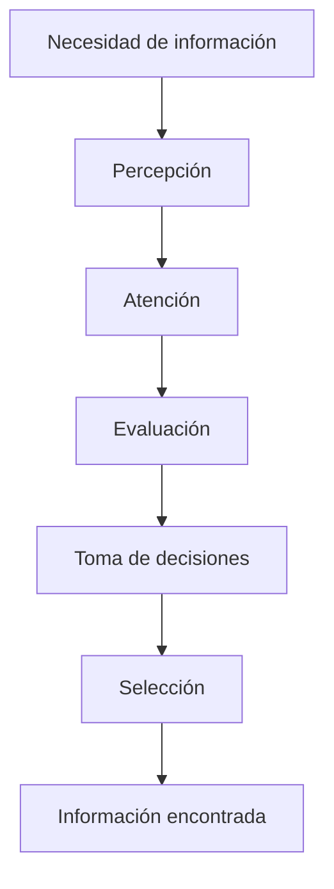
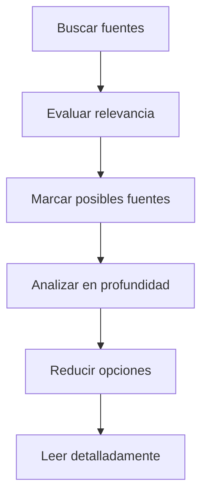
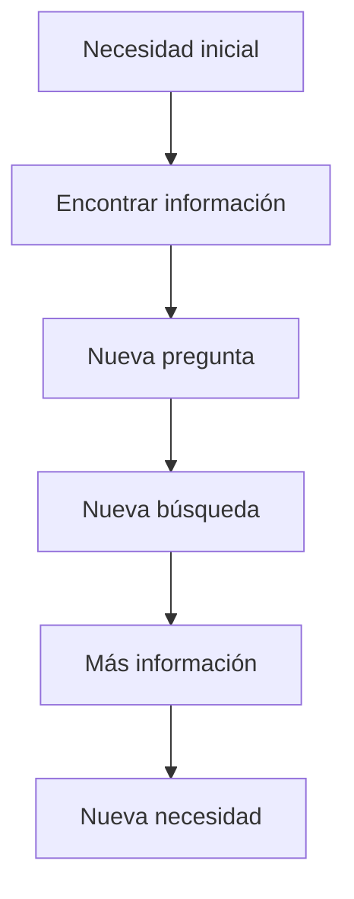
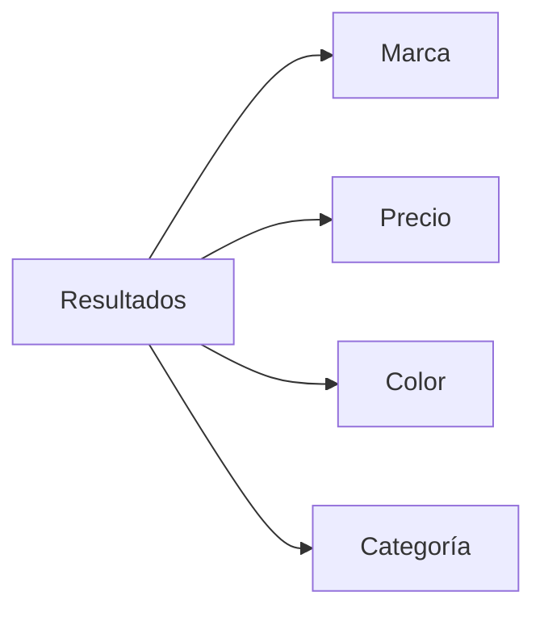
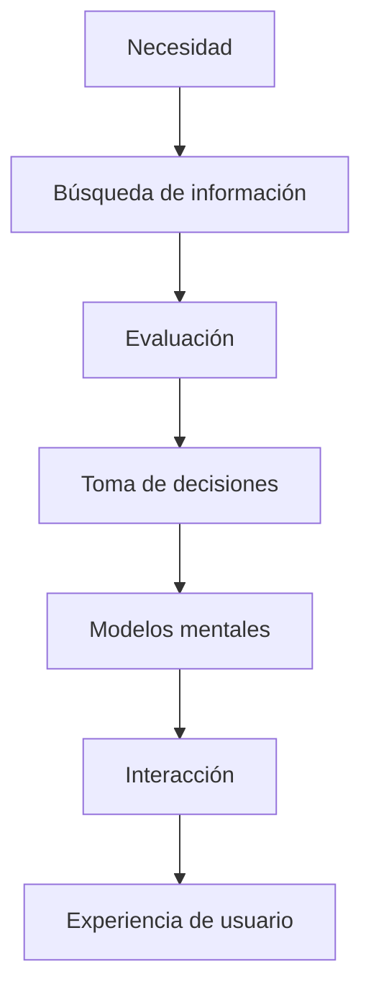

# Notas De Estudio – T02.03 Factores Cognitivos Y UX Parte III

# Introducción

En esta sección se continúa estudiando los factores cognitivos aplicados a Experiencia de Usuario (UX), enfocándose principalmente en:

1. Búsqueda de información
    
2. Modelos de búsqueda de información
    
3. Rastreo de información (Information Foraging)
    
4. Modelo Berry Picking
    
5. Sistemas de recuperación de información
    
6. Modelos mentales
    
7. Implicaciones para el diseño de interfaces

La búsqueda de información es una actividad cotidiana y fundamental en UX porque la mayoría de las interacciones de los usuarios consistent en encontrar algo:

- Encontrar un producto
    
- Buscar una respuesta
    
- Localizar un documento
    
- Encontrar una función
    
- Resolver un problema

La facilidad o dificultad de esta actividad afecta directamente la experiencia del usuario.

---

# 1. Búsqueda De Información

## Definición

La búsqueda de información es un proceso cognitivo mediante el cual una persona intenta localizar información relevante para satisfacer una necesidad específica o responder una pregunta.

No consiste únicamente en escribir algo en una barra de búsqueda.

Implica múltiples procesos mentales:

- análisis
    
- evaluación
    
- comparación
    
- toma de decisiones
    
- resolución de problemas
    
- selección
    
- filtrado

---

## Importancia En UX

La búsqueda de información es importante porque:

- determina la facilidad de encontrar contenido
    
- reduce tiempo y esfuerzo
    
- disminuye frustración
    
- mejora productividad
    
- mejora la percepción del sistema

Un sistema con mala búsqueda genera:

- abandono
    
- cansancio
    
- errores
    
- pérdida de usuarios

---

## Procesos Cognitivos Involucrados

La búsqueda de información involucra procesos cognitivos complejos:

|Proceso cognitivo|Función|
|--:|:--|
|Toma de decisiones|Elegir entre alternativas|
|Resolución de problemas|Encontrar una solución|
|Memoria|Recordar información previa|
|Atención|Seleccionar información relevante|
|Percepción|Interpretar estímulos|

---

# Relación Entre Procesos Cognitivos

---

# 2. Modelo Information Foraging (Rastreo De información)

## Definición

El modelo Information Foraging (Rastreo de información) fue propuesto por Pirolli y Card (1999).

Está inspirado en una teoría biológica relacionada con el comportamiento de depredadores al buscar alimento.

La teoría intenta responder:

> ¿Vale la pena gastar energía para obtener una recompensa?

En UX:

La pregunta equivalente es:

> ¿Vale la pena invertir tiempo y esfuerzo para obtener la información que busco?

---

## Idea Central Del Modelo

Los usuarios evalúan rápidamente:

- si una fuente contiene información útil
    
- cuánto tiempo requerirá obtenerla
    
- si el esfuerzo compensa el beneficio

---

## Concepto De Costo-beneficio

El usuario realiza inconscientemente una evaluación:

$$  
Valor\ percibido = Beneficio\ esperado - Costo\ de\ obtención  
$$

Variables:

- Beneficio esperado:
    
    - utilidad de la información encontrada
        
- Costo:
    
    - tiempo
        
    - esfuerzo mental
        
    - número de clics
        
    - navegación requerida

---

## Explicación Paso a Paso

1. El usuario tiene una necesidad
    
2. Encuentra varias fuentes posibles
    
3. Evalúa señales o pistas
    
4. Estima utilidad
    
5. Estima costo
    
6. Decide continuar o abandonar

---

## Casos Donde Se Utilize

- Motores de búsqueda
    
- Tiendas virtuales
    
- Sitios web
    
- Bibliotecas digitales
    
- Sistemas empresariales
    
- Aplicaciones móviles

---

## Explicación Del Comportamiento Observado

El transcript explica:

Las personas escanean páginas web en lugar de leer completamente.

¿Por qué ocurre?

Porque:

- leer completamente require esfuerzo
    
- el usuario busca pistas rápidas
    
- existe cansancio cognitivo
    
- el usuario abandona si percibe poco valor

---

## Flujo Del Modelo

---

## Pistas Utilizadas Por El Usuario

Durante la evaluación el usuario utilize señales como:

- títulos
    
- subtítulos
    
- imágenes
    
- palabras clave
    
- categorías
    
- botones
    
- etiquetas
    
- fragmentos de texto

---

# 3. Modelo Berry Picking

## Definición

Berry Picking significa:

"Recolección de frutos del bosque"

Fue propuesto por Bates (1989).

Este modelo afirma que la búsqueda de información no es un proceso lineal.

---

## Idea Principal

El usuario no sigue siempre un camino fijo:

Consulta → resultado → respuesta

En realidad ocurre algo más dinámico:

La necesidad cambia mientras se obtiene nueva información.

---

## Ejemplo

Usuario inicial:

"Quiero comprar una laptop"

Posteriormente:

"¿Cuánta RAM necesito?"

Después:

"¿Qué procesador es mejor?"

Luego:

"¿Cuál consume menos batería?"

La pregunta evoluciona continuamente.

---

## Flujo Del Modelo Berry Picking

---

## Ventajas Del Modelo

|Ventajas|Descripción|
|--:|:--|
|Representa comportamiento real|Describe mejor cómo buscan las personas|
|Flexible|Acepta cambios de necesidad|
|Adaptativo|Permite múltiples caminos|

---

## Desventajas

|Desventajas|Descripción|
|--:|:--|
|Difícil de predecir|Cada usuario cambia distinto|
|Más complejo|Require diseños flexibles|

---

# 4. Implicaciones Para El Diseño De Interfaces

El transcript menciona diversas recomendaciones importantes.

---

## Organización Y Estructura

La información debe:

- estar organizada
    
- set clara
    
- tener estructura visual

---

## Títulos Descriptivos

Los títulos deben permitir comprender rápidamente el contenido.

Ejemplo incorrecto:

"Información"

Ejemplo correcto:

"Cómo recuperar contraseña"

---

## Evitar Exceso De Información

Demasiados elementos provocan:

- sobrecarga cognitiva
    
- cansancio
    
- dificultad para escanear

---

## Facilitar Consultas

Los sistemas deberían ofrecer:

### Autocompletado

Ejemplo:

Usuario escribe:

"Comp…"

Sistema sugiere:

- computadora
    
- compras
    
- comparación

---

### Consultas Alternativas

Ejemplo:

"Quizá quisiste decir…"

---

# 5. Resultados De Búsqueda Y Relevancia

Los resultados deben ordenarse por relevancia.

La relevancia se determina mediante diversos factores:

- coincidencia de palabras
    
- consultas similares
    
- comportamiento de usuarios
    
- popularidad
    
- contexto

---

# Precisión Y Exhaustividad

## Precisión

### Definición

La precisión mide qué porcentaje de los documentos encontrados son relevantes.

Fórmula:

$$  
Precisión=  
\frac{Documentos\ relevantes\ recuperados}  
{Total\ de\ documentos\ recuperados}  
$$

Variables:

- Documentos relevantes recuperados:  
    Información útil encontrada
    
- Total documentos recuperados:  
    Todos los resultados mostrados

---

## Interpretación

Valor alto:

La mayoría de resultados son útiles.

Valor bajo:

Muchos resultados irrelevantes.

---

## Exhaustividad

### Definición

Mide qué tantos documentos relevantes fueron encontrados.

Fórmula:

$$  
Exhaustividad=  
\frac{Documentos\ relevantes\ recuperados}  
{Total\ de\ documentos\ relevantes\ existentes}  
$$

Variables:

- Documentos relevantes recuperados:  
    Resultados útiles encontrados
    
- Total de documentos relevantes existentes:  
    Información relevante disponible

---

## Comparación

|Característica|Precisión|Exhaustividad|  
|--:|:--|  
|Objetivo|Calidad de resultados|Cobertura|  
|Importancia|Motores como Google|Buscadores especializados|  
|Prioridad|Menos ruido|No perder información|

---

# 6. Sistemas De Recuperación De Información

## Definición

Son sistemas diseñados para localizar y entregar información relevante.

Ejemplos:

- Google
    
- bibliotecas digitales
    
- bases de datos
    
- tiendas virtuales

---

## Métodos De Búsqueda

### Búsqueda Por Palabras Clave

Ejemplo:

"UX modelos mentales"

---

### Navegación

Ejemplo:

Categorías:

Tecnología

→ Computadoras

→ Laptops

---

### Filtros

Permiten reducir resultados.

Ejemplo:

Tienda virtual:

- precio
    
- marca
    
- tamaño
    
- color

---

## Ejemplo Del Transcript

Reducir resultados mediante dimensions:

---

# 7. Modelos Mentales

## Definición

Los modelos mentales son representaciones internas que los usuarios construyen para comprender cómo funciona un sistema.

Se crean mediante:

- experiencia
    
- observación
    
- aprendizaje
    
- analogías

---

## Importancia

Permiten:

- hacer predicciones
    
- anticipar comportamientos
    
- comprender sistemas nuevos
    
- aprender más rápido

---

## Quote Completo Mencionado

> "Los usuarios construyen un modelo mental de cómo interactúan con un sistema a medida que lo usan y aprenden."

### Significado

El usuario crea una explicación interna del funcionamiento del sistema.

---

# Modelo Mental Vs Modelo Conceptual

## Modelo Mental

Es la idea que tiene el usuario.

## Modelo Conceptual

Es cómo realmente fue diseñado el sistema.

---

## Comparación

|Modelo mental|Modelo conceptual|
|--:|:--|
|Creado por usuario|Creado por diseñador|
|Basado en experiencia|Basado en implementación|
|Puede set incorrecto|Representa funcionamiento real|

---

## Problemas Cuando no Coinciden

Cuando ambos modelos difieren:

- aparecen errores
    
- existe frustración
    
- aumenta confusión
    
- disminuye usabilidad

---

## Ejemplo

Usuario:

Piensa que una imagen es un botón.

Sistema:

No tiene interacción.

Resultado:

Confusión.

---

# Analogías En Modelos Mentales

Las analogías permiten utilizar experiencias previas.

Ejemplos:

|Objeto real|Sistema digital|
|--:|:--|
|Carpeta física|Carpeta digital|
|Papelera|Eliminar|
|Calculadora|Aplicación calculadora|

---

# Implicaciones Para Diseño De Interfaces

## Interacciones Intuitivas

Los sistemas deben set:

- fáciles de comprender
    
- fáciles de aprender
    
- predecibles

---

## Feedback Útil

El sistema debe responder a las acciones.

Ejemplos:

- mensajes
    
- indicadores
    
- barras de progreso

---

## Instrucciones Claras

Las instrucciones deben:

- set simples
    
- set específicas
    
- evitar ambigüedad

---

## Ayuda Contextual

La documentación debe:

- adaptarse al usuario
    
- considerar experiencia
    
- mostrarse cuando sea necesaria

---

## Investigación De Usuarios

Debe realizarse antes de diseñar:

Objetivos:

- comprender necesidades
    
- comprender expectativas
    
- identificar modelos mentales

---

## Evaluación Con Usuarios Reales

Permite identificar diferencias entre:

- modelo mental
    
- modelo conceptual

---

# Relación Global De Conceptos

---

# Resumen Final

## Puntos Clave

- La búsqueda de información involucra procesos cognitivos complejos.
    
- Information Foraging explica la búsqueda mediante costo-beneficio.
    
- Las personas escanean información antes de leer detalladamente.
    
- Berry Picking explica que la necesidad cambia durante la búsqueda.
    
- Las interfaces deben organizar información claramente.
    
- Los buscadores deben ofrecer autocompletado y sugerencias.
    
- Precisión mide calidad de resultados.
    
- Exhaustividad mide cobertura de resultados.
    
- Los usuarios crean modelos mentales continuamente.
    
- Cuando el modelo mental difiere del conceptual aparece confusión.
    
- UX debe diseñar sistemas intuitivos y fáciles de comprender.

## Ideas Más Importantes

1. Buscar información no es un proceso lineal.
    
2. El usuario constantemente evalúa esfuerzo versus beneficio.
    
3. Los modelos mentales determinan cómo se utilize un sistema.
    
4. La estructura y organización afectan decisiones rápidas.
    
5. El diseño debe alinearse con expectativas reales del usuario.

## MicroTest 02.03

1. Inspirado en la teoría de biología sobre el coste que le supone a un depredador conseguir su alimento frente a la ganancia:
    
    - La respuesta: a. Modelo rastreo de información
        
    - Justificación: El transcript menciona que el modelo _Information Foraging_ (Rastreo de información) está inspirado en una teoría biológica sobre el costo que supone a un depredador conseguir alimento comparado con la ganancia obtenida. El usuario evalúa esfuerzo versus beneficio antes de continuar buscando información.
        
2. Incide en cómo la búsqueda de información no es un proceso lineal en el que el usuario plantea una consulta y compara los documentos recibidos con esta:
    
    - La respuesta: b. Modelo de recolección de frutos del bosque
        
    - Justificación: El modelo _Berry Picking_ o _Recolección de frutos del bosque_ propuesto por Bates explica que la búsqueda de información no ocurre de forma lineal, sino que va cambiando conforme el usuario encuentra nueva información.
        
3. Es un proceso en el que la necesidad de información va variando en función de lo que va encontrando y examinando en el proceso:
    
    - La respuesta: d. Búsqueda
        
    - Justificación: El transcript establece que la búsqueda de información es un proceso dinámico donde la necesidad de información cambia conforme el usuario examina y descubre nuevos datos durante el proceso.