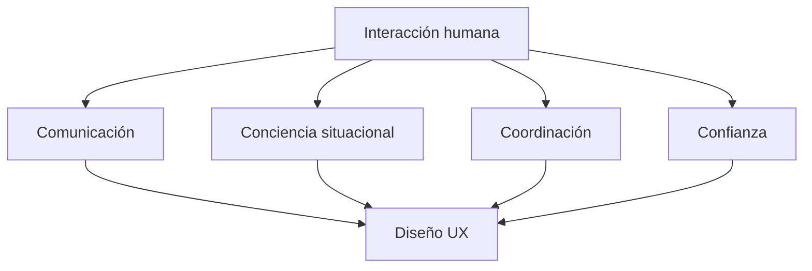
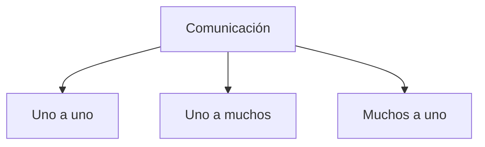
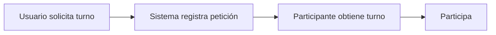
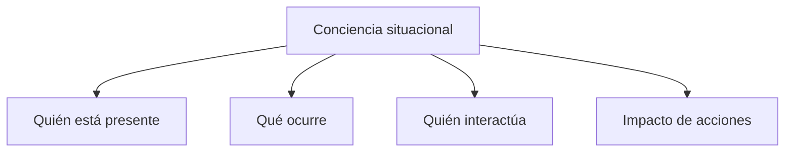
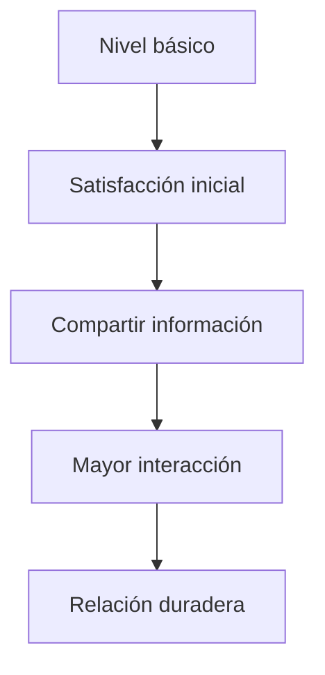
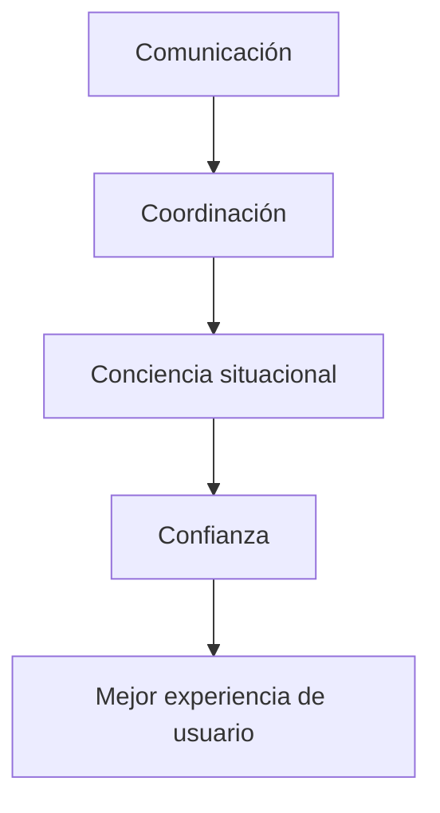

# Notas De Estudio – T02.04 Aspectos Sociales En El Diseño De UX

# Introducción

La experiencia de usuario (UX) no solamente se enfoca en cómo un individuo interactúa con una interfaz, sino también en cómo las personas interactúan entre sí utilizando tecnología como intermediaria.

Los seres humanos son naturalmente sociales:

- conversan
    
- colaboran
    
- comparten información
    
- coordinan actividades
    
- construyen relaciones
    
- desarrollan confianza

Con la evolución de tecnologías digitales y redes sociales, gran parte de estas interacciones se trasladó al entorno digital.

Los aspectos sociales abordados en este contenido son:

1. Comunicación
    
2. Conciencia situacional
    
3. Coordinación
    
4. Confianza

Todos estos factores tienen implicaciones directas en el diseño de interfaces de usuario.

---

# Relación General De Los Aspectos Sociales En UX

---

# 1. Comunicación Mediada Por Tecnología

## Definición

La comunicación mediada por tecnología ocurre cuando las personas utilizan herramientas digitales para intercambiar información.

La tecnología funciona como intermediaria entre usuarios.

Ejemplos:

- correo electrónico
    
- chats
    
- videollamadas
    
- redes sociales
    
- plataformas colaborativas
    
- foros

---

## Importancia En UX

La forma en que una interfaz permite comunicarse afecta:

- rapidez de interacción
    
- claridad del mensaje
    
- comprensión
    
- colaboración
    
- satisfacción del usuario

Un mal diseño puede producir:

- interrupciones
    
- malentendidos
    
- frustración
    
- pérdida de información

---

# Tipos De Comunicación

El transcript distingue dos categorías:

## Comunicación Síncrona

### Definición

Se produce cuando las personas interactúan simultáneamente en tiempo real.

Ambos participantes están presentes al mismo tiempo.

Ejemplos:

- videollamadas
    
- llamadas telefónicas
    
- chat en tiempo real
    
- reuniones virtuales

---

## Características

|Característica|Descripción|
|--:|:--|
|Tiempo|Simultáneo|
|Respuesta|Inmediata|
|Interacción|Alta|
|Retroalimentación|Instantánea|

---

## Ventajas

- resolución rápida de problemas
    
- aclaración inmediata
    
- colaboración eficiente

---

## Desventajas

- require disponibilidad simultánea
    
- puede generar interrupciones
    
- require mayor atención

---

## Comunicación Asíncrona

### Definición

Se produce cuando los participantes no interactúan al mismo tiempo.

Existe una separación temporal.

Ejemplos:

- correo electrónico
    
- mensajes almacenados
    
- publicaciones
    
- comentarios

---

## Características

|Característica|Descripción|
|--:|:--|
|Tiempo|Diferido|
|Respuesta|Posterior|
|Interacción|Menor inmediatez|
|Retroalimentación|No instantánea|

---

## Ventajas

- flexibilidad
    
- permite reflexión
    
- no require coincidencia temporal

---

## Desventajas

- respuestas lentas
    
- retrasos
    
- posibles malentendidos

---

## Comparación General

|Aspecto|Síncrona|Asíncrona|  
|--:|:--|  
|Tiempo|Simultáneo|Diferido|  
|Respuesta|Inmediata|Posterior|  
|Ejemplos|Chat, videollamada|Correo electrónico|  
|Necesidad de disponibilidad|Alta|Baja|

---

# Formatos De Comunicación Digital

El transcript menciona múltiples formas de intercambio de información:

- texto
    
- audio
    
- video
    
- imágenes
    
- gráficos
    
- emoticones

---

## Importancia De Múltiples Formatos

Diferentes situaciones requieren diferentes medios.

Ejemplo:

Texto:

Adecuado para instrucciones.

Video:

Adecuado para demostraciones.

Audio:

Adecuado para conversaciones.

Imágenes:

Adecuadas para ejemplos visuals.

Emoticones:

Adecuados para expresar emociones.

---

# 2. Tipos De Interlocutores

Los interlocutores representan la estructura de comunicación entre participantes.

---

## Uno a Uno

### Definición

Existe un emisor y un receptor.

Ejemplos:

- mensaje privado
    
- WhatsApp individual
    
- videollamada entre dos personas
    
- correo electrónico individual

---

## Uno a Muchos

### Definición

Una persona transmite información a múltiples receptores.

Ejemplos:

- blogs
    
- redes sociales
    
- correos masivos
    
- grupos de WhatsApp

---

## Muchos a Uno

### Definición

Múltiples usuarios transmiten información a un único receptor.

Ejemplos:

- comentarios en redes sociales
    
- formularios
    
- encuestas
    
- plataformas de soporte

---

## Estructura Visual

---

# Implicaciones De Diseño Para Comunicación

El diseño debe decidir:

- quién puede comunicarse
    
- cómo se comunica
    
- qué formatos utilizar
    
- cuándo ocurre la comunicación

---

# Conversaciones Y Reglas Sociales

El transcript menciona que las conversaciones siguen reglas que normalmente realizamos de forma inconsciente.

---

## Turnos De Conversación

### Definición

Son mecanismos que regulan quién habla y cuándo.

Incluyen:

- inicio de conversación
    
- intervención
    
- respuesta
    
- cierre

---

## Elementos Involucrados

- quién interviene
    
- quién responde
    
- orden de participación
    
- apertura
    
- cierre

---

## Ejemplos De Apoyo Visual

### Burbujas De Mensajes

Permiten:

- identificar participantes
    
- ordenar conversación
    
- distinguir emisores

---

### Botón Para Pedir Palabra

Utilizado frecuentemente en videoconferencias.

Permite:

- evitar interrupciones
    
- organizar participación
    
- controlar turnos

---

---

# 3. Conciencia Situacional Y Coordinación

# Coordinación

## Definición

La coordinación es el proceso mediante el cual varias personas organizan actividades para alcanzar un objetivo común.

---

## Mecanismos De Coordinación

Las personas coordinan mediante:

### Comunicación Verbal

Ejemplos:

- instrucciones
    
- órdenes
    
- avisos

---

### Gestos

Ejemplos:

- señalar
    
- asentir
    
- movimientos corporales

---

### Artefactos

Son herramientas utilizadas para coordinar acciones.

Ejemplo mencionado:

- batuta de director de orquesta

---

# Conciencia Situacional

## Definición

La conciencia situacional consiste en comprender el contexto actual y percibir:

- quién está presente
    
- qué sucede
    
- quién interactúa con quién
    
- cómo afectan nuestras acciones

---

## Importancia

Es esencial porque permite:

- colaboración efectiva
    
- coordinación adecuada
    
- reducción de errores
    
- toma de decisiones

---

## Components

---

# Ejemplo: Miro

El transcript menciona la plataforma colaborativa Miro.

Características:

- videollamadas
    
- audio
    
- colaboración simultánea
    
- edición compartida
    
- visualización de cursores

---

## Elementos Utilizados Para Conciencia Situacional

|Elemento|Función|
|--:|:--|
|Cursor|Identifica actividad|
|Color|Distingue usuarios|
|Nombre|Identifica participante|
|Posición|Muestra ubicación|

---

## Beneficio

Los usuarios pueden saber:

- quién trabaja
    
- dónde trabaja
    
- qué está haciendo

---

# 4. Confianza

## Definición

La confianza es la percepción de seguridad y credibilidad que tiene un usuario respecto a un sistema.

---

## Importancia En UX

La confianza influye en:

- comprar productos
    
- compartir información personal
    
- registrarse
    
- regresar a una plataforma

---

# Niveles De Confianza Según Sherwin (2016)

El transcript menciona cinco niveles progresivos.

Proceso simplificado:

---

## Explicación

Los usuarios avanzan gradualmente.

No puede solicitarse inmediatamente:

- información privada
    
- datos bancarios
    
- registros extensos

Sin construir confianza primero.

---

## Quote Mencionado

> "No hay atajos"

### Significado

No es possible pedir niveles altos de compromiso o información sin construir primero confianza progresivamente.

---

## Consecuencias De Ignorarlo

- abandono del sitio
    
- desconfianza
    
- cancelación de procesos
    
- pérdida de usuarios

---

# Factores De Credibilidad Según Harley (2016)

El transcript menciona cuatro elementos necesarios para generar confianza.

---

## 1. Calidad Del Diseño

Incluye:

- organización adecuada
    
- títulos descriptivos
    
- imágenes apropiadas
    
- vocabulario comprensible
    
- colores adecuados

---

## Importancia

Una interfaz desordenada puede percibirse como:

- poco professional
    
- insegura
    
- poco confiable

---

## 2. Errores

Los errores reducen credibilidad.

Ejemplos:

- enlaces rotos
    
- errores ortográficos
    
- imágenes faltantes
    
- errores técnicos

---

## 3. Transparencia De Información

Ejemplo mencionado:

Mostrar costos de envío antes de comprar.

Beneficios:

- evita sorpresas
    
- aumenta confianza

---

## 4. Información Completa Y Autoridad

Debe set:

- correcta
    
- actualizada
    
- precisa
    
- respaldada

Puede apoyarse mediante:

- referencias
    
- opiniones
    
- clientes
    
- fuentes externas

---

## Tabla Resumen

|Factor|Impacto|
|--:|:--|
|Calidad visual|Mejora credibilidad|
|Errores|Disminuyen confianza|
|Transparencia|Genera seguridad|
|Autoridad|Aumenta credibilidad|

---

# Relación Global De Aspectos Sociales Y UX

---

# Resumen Final

## Puntos Clave

- La comunicación puede set síncrona o asíncrona.
    
- La comunicación puede usar múltiples formatos: texto, audio, video e imágenes.
    
- Existen estructuras de comunicación: uno a uno, uno a muchos y muchos a uno.
    
- Las conversaciones siguen reglas sociales implícitas.
    
- Los turnos de conversación necesitan apoyo visual.
    
- La coordinación permite organizar actividades colaborativas.
    
- La conciencia situacional ayuda a comprender el contexto.
    
- Las plataformas colaborativas utilizan señales visuals para mantener coordinación.
    
- La confianza afecta la disposición a compartir datos y realizar acciones.
    
- La confianza se construye progresivamente.
    
- La credibilidad depende de diseño, errores, transparencia y autoridad.

## Ideas Más Importantes

1. UX no solo trata interacción persona-sistema, también interacción persona-persona.
    
2. La coordinación y la conciencia situacional son esenciales para trabajo colaborativo.
    
3. Las personas necesitan señales visuals para entender conversaciones.
    
4. La confianza se construye gradualmente.
    
5. Un diseño organizado aumenta credibilidad y adopción.

## MicroTest 02.04

1. Se produce cuando las personas están interactuando y comunicándose al mismo tiempo, por ejemplo, en una videollamada, o en un chat
    
    - La respuesta: a. Comunicación síncrona
        
    - Justificación: El material menciona que la comunicación síncrona ocurre cuando las personas interactúan en el mismo memento y existe intercambio en tiempo real. Los ejemplos dados fueron videollamadas y chats.
        
2. Se produce en tiempos distintos, por ejemplo, cuando una persona envía un correo electrónico a otra, que lo lee al día siguiente:
    
    - La respuesta: b. Comunicación asíncrona
        
    - Justificación: La comunicación asíncrona sucede cuando los participantes no interactúan simultáneamente. El transcript utilize como ejemplo el correo electrónico, donde una persona envía un mensaje y la otra lo revisa posteriormente.
        
3. Aspecto social que debe tenerse en cuenta en el diseño de interfaces de usuario:
    
    - La respuesta: d. Confianza
        
    - Justificación: El transcript menciona explícitamente que la confianza es un aspecto social que debe considerarse en el diseño de interfaces porque influye en decisiones como compartir información personal, registrarse en plataformas y comprar productos o servicios.