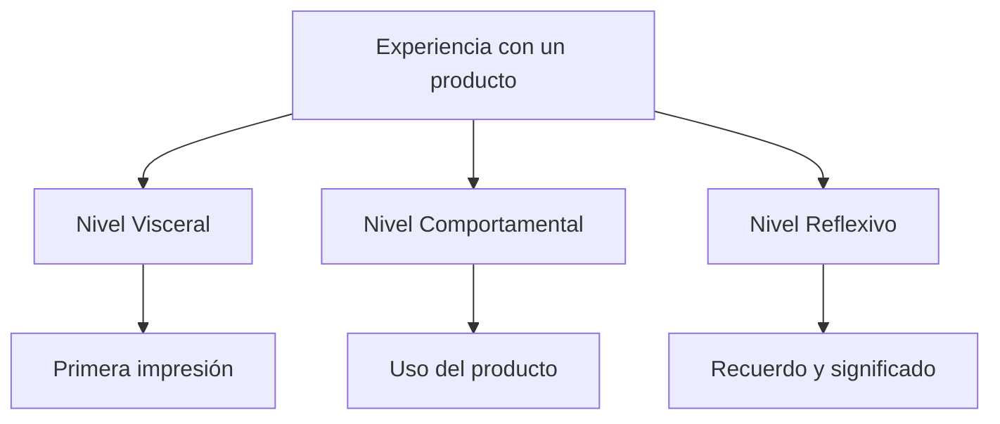
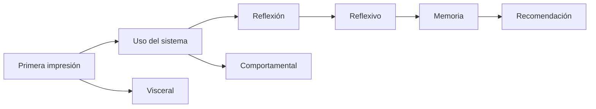
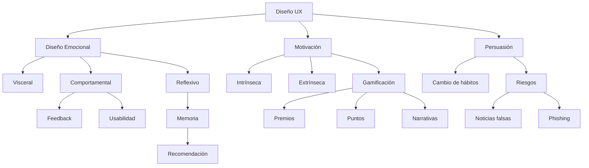

# Emociones Y Diseño De Experiencia De Usuario (UX)

## Introducción

El diseño de experiencia de usuario (UX) no consiste únicamente en crear interfaces visualmente atractivas. Aunque intuitivamente solemos asociar el diseño visual con la primera impresión y la atracción del usuario, la relación entre el diseño y las emociones humanas es mucho más compleja.

El diseño influye continuamente sobre cómo las personas:

- Perciben un producto.
    
- Interactúan con él.
    
- Lo recuerdan.
    
- Lo recomiendan.
    
- Desarrollan una conexión emocional con la experiencia.

Uno de los modelos más importantes para comprender esta relación es el **Modelo del Diseño Emocional de Donald Norman (2013)**, el cual explica cómo las personas procesan cognitivamente una experiencia mediante tres niveles distintos.

---

# Modelo Del Diseño Emocional De Donald Norman (2013)

Donald Norman propone que la experiencia emocional ocurre mediante **tres niveles de procesamiento**:



Los tres niveles trabajan simultáneamente, aunque cada uno participa en una etapa distinta de la interacción.

---

# Nivel Visceral

## Definición

Es el nivel más inmediato del procesamiento humano.

Corresponde a las respuestas automáticas, rápidas e inconscientes que ocurren apenas una persona entra en contacto con un objeto o interfaz.

No require razonamiento.

Es prácticamente instantáneo.

Norman explica que este nivel sirve para emitir juicios rápidos sobre el entorno.

Ejemplos de dichos juicios son:

- Seguro o peligroso
    
- Bueno o malo
    
- Atractivo o desagradable
    
- Familiar o extraño

---

## Importancia

Desde el punto de vista evolutivo, este mecanismo permitió al set humano reaccionar rápidamente ante posibles amenazas.

En UX ocurre exactamente igual.

En cuestión de segundos un usuario decide si una aplicación parece:

- Professional
    
- Confiable
    
- Moderna
    
- Complicada
    
- Segura

Sin haber interactuado todavía con ella.

---

## Características

|Característica|Descripción|
|---|---|
|Inmediato|Ocurre antes del razonamiento|
|Automático|No require esfuerzo consciente|
|Subconsciente|El usuario no controla esta reacción|
|Basado en percepción|Color, forma, sonido, textura, movimiento|

---

## Ejemplos Mencionados

El transcript utilize dos ejemplos de respuestas viscerales:

- miedo a las alturas
    
- miedo a la oscuridad

Estas respuestas no son emociones completas todavía.

Norman aclara algo importante:

> Las respuestas viscerales **no son todavía emociones**, sino que constituyen los **precursores de las emociones**.

### ¿Qué Significa Esto?

Primero aparece una reacción automática.

Después el cerebro interpreta esa reacción.

Finalmente aparece la emoción consciente.

Por ejemplo:

```Python
Objeto desconocido

↓

Respuesta visceral

↓

Interpretación

↓

Miedo
```

---

## Relación Con El Diseño UX

Los diseñadores aprovechan este nivel para producir una excelente primera impresión.

Se trabaja especialmente mediante:

- Diseño visual
    
- Colores
    
- Tipografía
    
- Iconografía
    
- Sonidos
    
- Animaciones
    
- Texturas
    
- Diseño táctil

Todo ello busca generar atracción inmediata.

---

# Nivel Comportamental

## Definición

Este nivel aparece durante la interacción con el producto.

Mientras el usuario utilize una interfaz comienza a ejecutar acciones aprendidas.

Aunque el objetivo sea consciente, la ejecución suele realizarse de manera inconsciente.

Norman lo resume indicando que:

> El objetivo puede set consciente, pero los detalles de la ejecución suceden de manera inconsciente.

### Significado

Cuando usamos un mouse, escribimos en un teclado o desbloqueamos un teléfono:

- pensamos en el resultado,
    
- pero no pensamos en cada movimiento muscular.

Esas habilidades ya fueron aprendidas.

---

## Ejemplo Mencionado

Mover el brazo para tomar un objeto.

La persona piensa:

> "Quiero tomar el vaso."

No piensa:

- cuánto mover el hombro
    
- cuánto doblar el code
    
- cómo cerrar la mano

Todo eso ocurre automáticamente.

---

# Expectativas Del Usuario

Una de las ideas centrales de este nivel es la creación de expectativas.

Cada acción del usuario genera una expectativa sobre lo que debería ocurrir.

Ejemplo:

El usuario presiona un botón.

Su expectativa es:

- abrir una ventana
    
- guardar información
    
- enviar un formulario

---

# Feedback

## Definición

El feedback es la respuesta que el sistema proporciona después de una acción del usuario.

Sirve para confirmar o desmentir las expectativas.

---

## Importancia

Norman destaca que el feedback es fundamental porque:

- reduce incertidumbre
    
- confirma acciones
    
- facilita el aprendizaje
    
- evita errores
    
- mejora la usabilidad

Sin feedback el usuario no sabe si la acción ocurrió correctamente.

---

## Ejemplos De Feedback

- Mensaje "Guardado correctamente"
    
- Barra de progreso
    
- Animación de carga
    
- Cambio de color de un botón
    
- Sonido de confirmación
    
- Vibración del dispositivo

---

# Emociones Producidas Por El Feedback

Cuando las expectativas se cumplen aparecen emociones positivas como:

- satisfacción
    
- alivio

Cuando no se cumplen aparecen emociones negativas como:

- frustración

Estas emociones nacen precisamente de la diferencia entre:

- lo esperado
    
- lo obtenido

---

## Relación Con la Usabilidad

Este nivel está directamente relacionado con la **usabilidad**.

Una interfaz usable:

- responde correctamente
    
- comunica claramente
    
- ofrece feedback
    
- facilita completar tareas

---

# Nivel Reflexivo

## Definición

Es el nivel más alto del procesamiento emocional.

Aquí aparecen procesos completamente conscientes.

Incluye:

- comprensión
    
- razonamiento
    
- análisis
    
- evaluación
    
- toma de decisiones

Generalmente ocurre después de haber utilizado el producto.

---

## ¿Qué Analiza El Usuario?

Después de terminar una experiencia el usuario reflexiona sobre:

- qué ocurrió
    
- por qué ocurrió
    
- quién fue responsible
    
- si valió la pena
    
- cómo se sintió

---

## Emociones Complejas

En este nivel aparecen emociones mucho más elaboradas.

Ejemplos del transcript:

- culpa
    
- orgullo

Norman también explica que la anticipación de eventos futuros forma parte del nivel reflexivo.

Por ello pueden surgir emociones como:

- miedo
    
- deseo

Estas emociones ya no provienen de una reacción inmediata, sino del pensamiento consciente sobre posibles consecuencias.

---

# Impacto Sobre la Memoria

El transcript enfatiza que:

El nivel reflexivo tiene **mayor impacto en la memoria** que los otros dos niveles.

Esto significa que el recuerdo que el usuario conserva de una experiencia depende principalmente de este nivel.

Por ello, el objetivo final del diseño UX no es solamente crear una interfaz bonita o fácil de usar.

También busca que el usuario recuerde positivamente la experiencia.

---

## Recomendación Del Producto

Como consecuencia de una buena experiencia reflexiva:

- aumenta la satisfacción
    
- mejora el recuerdo
    
- incrementa la probabilidad de recomendar el producto a otras personas

---

# Comparación De Los Tres Niveles

|Nivel|Procesamiento|Memento|En qué se centra|Relación con UX|
|---|---|---|---|---|
|Visceral|Automático|Primera impresión|Apariencia, estética, percepción inmediata|Diseño visual|
|Comportamental|Semiconsciente|Durante el uso|Acciones, feedback, expectativas|Usabilidad|
|Reflexivo|Consciente|Después de usar el producto|Memoria, significado, evaluación|Experiencia global y fidelización|

---

# Relación Entre Los Tres Niveles



---

# Motivación

## Definición

La motivación es el proceso psicológico que:

- origina
    
- mantiene
    
- orienta

el comportamiento humano hacia el cumplimiento de determinadas metas.

En UX es fundamental porque explica **por qué un usuario decide interactuar con un sistema y continuar utilizándolo**.

---

# Components De la Motivación

Según Herrera y Matos (2009), para que exista motivación intervienen varios components:

|Componente|Función|
|---|---|
|Necesidades|Generan el impulso inicial.|
|Cogniciones|Pensamientos, expectativas y creencias que orientan la conducta.|
|Emociones|Influyen en la intensidad y persistencia del comportamiento.|
|Condiciones externas|Factores del entorno que favorecen o dificultan la motivación.|

Dentro de las cogniciones, el transcript menciona ejemplos como:

- expectativas
    
- creencias
    
- autoconcepto

Estos factores condicionan la manera en que una persona interpreta una situación y decide actuar.

---

# Motivación Intrínseca

## Definición

La motivación intrínseca surge cuando la propia actividad resulta satisfactoria.

La persona realiza una tarea porque disfruta hacerla.

No necesita recompensas externas.

---

## Ejemplo

Leer un libro por interés personal.

---

## Fuentes De Motivación Intrínseca

El transcript menciona cuatro fuentes principales:

- desafío
    
- curiosidad
    
- control
    
- fantasía

Estas características hacen que la actividad sea atractiva por sí misma.

---

# Motivación Extrínseca

## Definición

La motivación extrínseca aparece cuando la actividad se realiza para conseguir un resultado externo.

Ese resultado puede set:

- premio
    
- reconocimiento
    
- evitar un castigo

La satisfacción proviene del resultado, no de la actividad.

---

# Comparación

|Motivación Intrínseca|Motivación Extrínseca|
|---|---|
|Interés propio|Recompensa externa|
|Disfrute de la actividad|Beneficio obtenido|
|Más sostenible|Puede desaparecer al eliminar la recompensa|

---

# Gamificación

## Definición

La gamificación consiste en utilizar elementos propios de los juegos dentro de contextos que originalmente no son juegos.

Su objetivo es incrementar la motivación y el compromiso del usuario.

---

## Aplicación En UX

Se emplea para incentivar la realización de tareas mediante mecánicas lúdicas.

El transcript menciona ejemplos como:

- narrativas
    
- competiciones
    
- incentivos
    
- sistemas de recompensas
    
- premios
    
- puntos

---

## Ejemplos

Una actividad cotidiana puede transformarse mediante una historia que dé sentido a las acciones del usuario.

También pueden emplearse:

- tablas de clasificación
    
- logros
    
- niveles
    
- insignias

Estas mecánicas buscan aumentar la participación.

---

# Riesgos De la Gamificación

El transcript cita investigaciones de Hamari y Fox que muestran una limitación importante.

Cuando una persona ya está motivada de forma intrínseca, introducir recompensas externas como:

- puntos
    
- premios
    
- competiciones

puede disminuir su motivación intrínseca y reemplazarla por motivación extrínseca.

Esto no es deseable, ya que la persona deja de realizar la actividad por interés propio y pasa a depender de las recompensas.

Por ello, el uso de premios, puntos o competiciones es más adecuado para incentivar tareas que resultan aburridas o poco atractivas por sí mismas.

---

# Persuasión En UX

## Definición

Las interfaces pueden diseñarse para persuadir al usuario, es decir, para influir en su forma de pensar y en su comportamiento.

La persuasión busca orientar decisiones o fomentar determinados hábitos mediante el diseño de la interacción.

---

## Aplicaciones Positivas

El transcript menciona diversos ámbitos donde la tecnología persuasiva puede utilizarse con fines beneficiosos:

- Comercio electrónico.
    
- Medicina preventiva.
    
- Actividad física.
    
- Aprendizaje.
    
- Consumo responsible de energía.
    
- Reducción del consumo de agua.
    
- Concienciación sobre el cambio climático.

En estos casos, el diseño pretende promover comportamientos que mejoren el bienestar físico, emocional o ambiental.

---

## Riesgos Y Uso Ético

Las mismas técnicas persuasivas pueden utilizarse con fines engañosos.

El transcript menciona dos ejemplos principales:

- Difusión de noticias falsas.
    
- Fraudes para obtener información personal o bancaria mediante **phishing**.

El **phishing** es una técnica de ingeniería social en la que un atacante suplanta la identidad de una entidad confiable (como un banco o una empresa) para convencer al usuario de revelar credenciales, datos personales o información financiera. Suele emplear correos electrónicos, mensajes o sitios web falsificados que aparentan set legítimos.

Esto resalta la importancia de aplicar principios éticos en el diseño de interfaces, evitando manipular al usuario o inducirlo a acciones perjudiciales.

---

# Relación General De Los Conceptos



---

# Resumen

## Puntos Clave

- El diseño UX busca generar experiencias positivas tanto funcionales como emocionales.
    
- El modelo de Donald Norman divide el procesamiento emocional en tres niveles: visceral, comportamental y reflexivo.
    
- El nivel visceral corresponde a la primera impresión y está relacionado con la estética y la percepción inmediata.
    
- El nivel comportamental ocurre durante la interacción y depende de la usabilidad, las expectativas del usuario y un feedback adecuado.
    
- El nivel reflexivo implica razonamiento consciente, influye de forma decisiva en la memoria del usuario y determina la probabilidad de recomendar el producto.
    
- La motivación dirige el comportamiento humano y se compone de necesidades, cogniciones, emociones y condiciones externas.
    
- La motivación intrínseca surge del interés por la actividad, mientras que la extrínseca depende de recompensas o consecuencias externas.
    
- La gamificación aplica mecánicas de juego en contextos no lúdicos para incrementar la participación, pero un uso inadecuado puede disminuir la motivación intrínseca.
    
- Las tecnologías persuasivas pueden utilizarse para promover hábitos saludables y comportamientos responsables, aunque también pueden emplearse de forma engañosa, como en el phishing o la difusión de noticias falsas.
    
- Un buen diseño UX integra los tres niveles emocionales para crear productos memorables, útiles, satisfactorios y éticamente responsables.

## MicroTest 2.5

1. En este nivel hacen juicios rápidos sobre el entorno, si es bueno o malo, seguro o peligroso:
    
    - **La respuesta:** a. Nivel visceral
        
    - **Justificación:** El nivel visceral corresponde a las respuestas automáticas e inmediatas del cerebro. En este nivel se realizan juicios rápidos sobre el entorno, como determinar si algo es bueno o malo, seguro o peligroso, incluso antes de que exista un razonamiento consciente.
        
2. En este nivel se basa en el aprendizaje de habilidades, pero sucede todavía en parte de manera inconsciente:
    
    - **La respuesta:** b. Nivel comportamental
        
    - **Justificación:** El nivel comportamental está relacionado con la ejecución de acciones aprendidas. Aunque el objetivo de la acción puede set consciente, los detalles de su ejecución ocurren de manera parcialmente inconsciente, como al mover la mano para tomar un objeto o utilizar una interfaz que ya conocemos.
        
3. Este nivel incluye la comprensión, el razonamiento y la toma consciente de decisiones:
    
    - **La respuesta:** c. Nivel reflexivo
        
    - **Justificación:** El nivel reflexivo es el encargado del procesamiento consciente. En él se analizan las experiencias, se comprende lo ocurrido, se razona sobre las acciones realizadas y se toman decisiones conscientes, además de influir significativamente en la memoria y la evaluación de la experiencia.