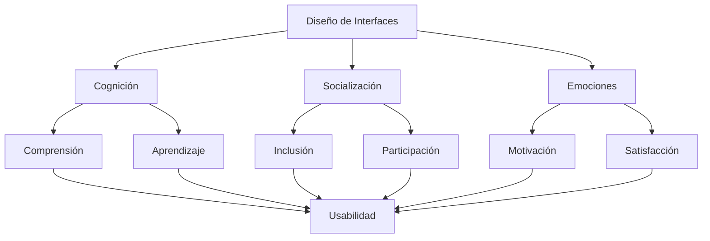
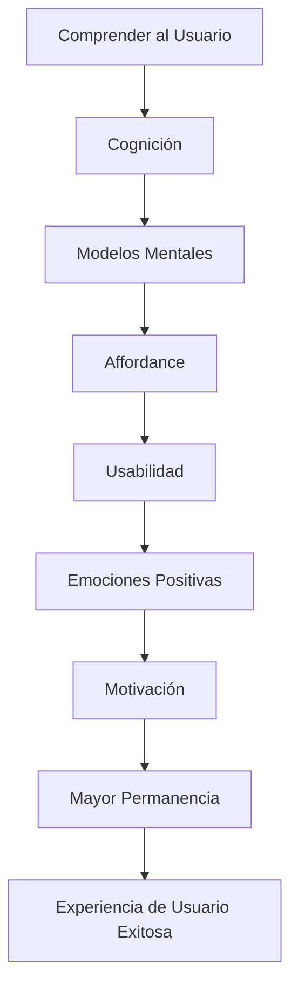

# Resumen Del Tema: Psicología Humana Y Diseño De Interfaces De Usuario

# Introducción

Este tema constituye una síntesis de los conceptos fundamentales estudiados sobre la relación entre la **psicología humana** y el **diseño de interfaces de usuario (UI)**. El objetivo principal es comprender que una interfaz exitosa no depende únicamente de su apariencia visual, sino de cómo responde a la manera en que las personas **piensan, perciben, aprenden, recuerdan, interactúan y sienten**.

El diseño centrado en el usuario integra conocimientos provenientes de la psicología cognitiva, la psicología social y el diseño emocional para construir interfaces más intuitivas, accesibles y fáciles de utilizar.

El transcript destaca que tres grandes pilares sostienen el diseño de interfaces modernas:

- Cognición.
    
- Socialización.
    
- Emociones.

Estos elementos sirven como base para desarrollar productos con una alta usabilidad y una experiencia de usuario (UX) satisfactoria.

---

# Objetivo General Del Tema

El propósito principal del tema fue:

- Despertar la conciencia sobre la relación entre la psicología humana y la interacción con las interfaces de usuario.
    
- Comprender cómo diversos modelos psicológicos se aplican directamente al diseño de interfaces.
    
- Establecer las bases de los principios de usabilidad mediante el estudio de la cognición, la socialización y las emociones.

En otras palabras, el objetivo no fue únicamente aprender principios de diseño, sino entender **por qué funcionan**, considerando la forma en que las personas procesan la información y toman decisiones.

---

# La Psicología Aplicada Al Diseño De Interfaces

El diseño de interfaces modernas se apoya en disciplinas de la psicología para comprender cómo interactúan las personas con los sistemas digitales.

El transcript resume tres áreas fundamentales.

## Cognición

### Definición

La cognición comprende todos los procesos mentales relacionados con:

- Percepción.
    
- Atención.
    
- Memoria.
    
- Aprendizaje.
    
- Resolución de problemas.
    
- Toma de decisiones.

En UX, estos procesos determinan cómo el usuario interpreta la información presentada por una interfaz.

### Importancia

Comprender la cognición permite diseñar interfaces que:

- Sean fáciles de aprender.
    
- Reduzcan la carga mental.
    
- Disminuyan errores.
    
- Faciliten recordar cómo realizar tareas.

Una interfaz que respeta las capacidades cognitivas del usuario require menos esfuerzo mental y genera una mejor experiencia.

---

## Socialización

### Definición

La socialización estudia cómo las personas interactúan entre sí mediante herramientas digitales.

Actualmente muchas interfaces no son únicamente herramientas individuales, sino espacios donde múltiples usuarios colaboran, comparten información o participan en comunidades.

### Importancia

El diseño debe facilitar:

- Comunicación.
    
- Colaboración.
    
- Inclusión.
    
- Participación.

Esto implica diseñar sistemas accesibles para la mayor cantidad possible de personas, independientemente de sus capacidades.

---

## Emociones

### Definición

Las emociones representan las respuestas afectivas que experimenta una persona al interactuar con un producto.

No solamente influyen en la satisfacción del usuario, sino también en:

- La percepción de calidad.
    
- La confianza.
    
- La motivación.
    
- La permanencia dentro del sistema.
    
- La recomendación del producto.

### Importancia

Una interfaz agradable emocionalmente:

- Motiva al usuario.
    
- Genera confianza.
    
- Reduce la frustración.
    
- Favorece el uso continuo.

---

# El Concepto De Affordance (Affordance)

> **Nota:** En el transcript aparece pronunciado como _accordance_, pero el término correcto en diseño de interacción es **Affordance**, propuesto por James J. Gibson y popularizado en UX por Donald Norman.

## Definición

El affordance es la propiedad de un objeto o interfaz que comunica al usuario cómo debe utilizarse.

Permite que una persona comprenda intuitivamente qué acciones puede realizar.

En otras palabras:

> Un buen diseño "invita" a set utilizado correctamente sin necesidad de instrucciones.

---

## Importancia

El transcript enfatiza que el affordance:

- Permite utilizar correctamente los objetos.
    
- Facilita realizar acciones de la forma más apropiada.
    
- Reduce errores.
    
- Disminuye el tiempo de aprendizaje.

Cuando una interfaz posee un buen affordance, el usuario entiende naturalmente cómo interactuar con ella.

---

## Ejemplos

En interfaces digitales:

- Un botón con relieve invita a presionarlo.
    
- Un enlace azul subrayado invita a hacer clic.
    
- Un campo de texto invita a escribir.

En objetos físicos:

- Una manija invita a jalar.
    
- Una placa plana invita a empujar.

---

# Principios Básicos De Usabilidad

El transcript recuerda varios principios fundamentales estudiados anteriormente.

## ¿Qué Es la Usabilidad?

La usabilidad es el grado en que un producto puede set utilizado por usuarios específicos para alcanzar objetivos específicos de forma:

- Eficaz.
    
- Eficiente.
    
- Satisfactoria.

Una interfaz usable minimiza el esfuerzo necesario para completar tareas.

---

## Evitar El Exceso De Información

Uno de los principios más importantes consiste en reducir la cantidad de información presentada al usuario.

### ¿Por Qué?

El exceso de información provoca:

- Sobrecarga cognitiva.
    
- Distracciones.
    
- Confusión.
    
- Mayor tiempo para encontrar información.
    
- Incremento de errores.

Una buena interfaz presenta únicamente la información necesaria en cada memento.

---

## Destacar la Información Relevante

No toda la información tiene la misma importancia.

Por ello el diseñador debe utilizar recursos visuals para dirigir la atención hacia los elementos más importantes.

Ejemplos:

- Tamaño.
    
- Color.
    
- Contraste.
    
- Jerarquía tipográfica.
    
- Espaciado.

Esto facilita que el usuario identifique rápidamente aquello que necesita.

---

## Reconocimiento En Lugar Del Recuerdo

El transcript menciona uno de los principios clásicos de Nielsen.

### Definición

Es preferible que el usuario reconozca las opciones disponibles en lugar de tener que recordarlas de memoria.

Esto disminuye la carga cognitiva.

Ejemplos:

- Menús visible.
    
- Iconos familiares.
    
- Autocompletado.
    
- Historial reciente.
    
- Sugerencias de búsqueda.

---

## Uso De Convenciones

Las convenciones son patrones ampliamente conocidos por los usuarios.

Ejemplos:

- Logotipo en la esquina superior izquierda.
    
- Icono de lupa para buscar.
    
- Carrito de compras.
    
- Menú hamburguesa en dispositivos móviles.
    
- Icono de engrane para configuración.

Respetar estas convenciones reduce el aprendizaje porque el usuario ya conoce su significado.

---

## Ejemplo Mencionado: Sitio Web De Olympics

El transcript menciona el sitio web de **Olympics** como ejemplo de aplicación de principios de usabilidad.

En este tipo de sitios se implementan elementos que favorecen la accesibilidad y la inclusión de personas con diferentes habilidades, demostrando cómo las convenciones, la organización de la información y la facilidad de navegación pueden mejorar la experiencia de una amplia variedad de usuarios.

---

# Modelos Mentales Y Niveles De Aprendizaje

## Modelos Mentales

Los modelos mentales son las representaciones internas que los usuarios construyen sobre cómo creen que funciona un sistema.

Cuando una interfaz coincide con estos modelos:

- El aprendizaje es más rápido.
    
- Se reducen errores.
    
- La interacción resulta más natural.

Cuando contradice dichos modelos aparecen:

- Confusión.
    
- Frustración.
    
- Errores frecuentes.

---

## Niveles De Aprendizaje

Los usuarios poseen distintos niveles de experiencia.

Por ello un diseñador debe considerar tanto:

- Usuarios principiantes.
    
- Usuarios intermedios.
    
- Usuarios expertos.

Una buena interfaz ofrece apoyo suficiente para quienes comienzan sin limitar la eficiencia de quienes ya dominan el sistema.

---

# Integración De Cognición, Socialización Y Emociones

El transcript vuelve a enfatizar que estos tres components deben trabajar conjuntamente.



Una interfaz verdaderamente centrada en el usuario considera simultáneamente estos aspectos, ya que todos influyen en la experiencia final.

---

# Relación Entre Affordance Y Usabilidad

El transcript recuerda que no debe descuidarse ninguno de estos conceptos.

## Affordance

Permite comprender cómo utilizar correctamente un objeto.

## Usabilidad

Permite realizar tareas de forma sencilla, eficiente y satisfactoria.

Ambos conceptos trabajan conjuntamente.

```mermaid
flowchart LR

Affordance--> Comprensión

Comprensión--> (Uso correcto)

(Uso correcto) --> (Mayor Usabilidad)

(Mayor Usabilidad) --> (Mejor Experiencia de Usuario)
```

Sin un buen affordance, la usabilidad disminuye porque el usuario no entiende cómo interactuar con la interfaz.

---

# Reducción De la Información Para Mejorar la Navegación

El transcript señala que una interfaz con demasiada información puede dificultar la navegación.

## Problemas Del Exceso De Información

- Confusión.
    
- Sobrecarga cognitiva.
    
- Pérdida de atención.
    
- Dificultad para encontrar contenido.
    
- Mayor abandono del sitio.

Por ello, uno de los objetivos del diseño consiste en organizar y jerarquizar adecuadamente el contenido.

---

# Aspectos Sociales Del Diseño

El transcript destaca que las tecnologías actuales favorecen la comunicación y la participación social.

Por ello, las interfaces deben diseñarse considerando aspectos como:

- Inclusión.
    
- Accesibilidad.
    
- Igualdad de oportunidades.
    
- Participación.

El objetivo es que todas las personas puedan utilizar el sistema, independientemente de sus capacidades físicas, cognitivas o sensoriales.

Esto está alineado con los principios del **Diseño Universal**, que busca crear productos utilizables por el mayor número possible de personas sin necesidad de adaptaciones especiales.

---

# Emociones, Motivación Y Comportamiento Del Usuario

Uno de los puntos finales del transcript consiste en comprender cómo el diseño afecta directamente el comportamiento humano.

## Relación Entre Emociones Y Permanencia

Un usuario puede ingresar a un sitio únicamente por curiosidad o interés en conocer un producto.

Sin embargo:

Si la interfaz:

- no resulta atractiva,
    
- no transmite confianza,
    
- no genera emociones positivas,
    
- no motiva a continuar,

es muy probable que el usuario abandon rápidamente el sitio.

---

## Motivación

La motivación impulsa al usuario a continuar navegando.

Puede mantenerse mediante:

- Buena organización.
    
- Contenido relevante.
    
- Navegación sencilla.
    
- Interacciones satisfactorias.
    
- Diseño emocional positivo.

Cuando la motivación disminuye, aumenta considerablemente la probabilidad de abandono.

---

# Flujo General Del Diseño Centrado En El Usuario



---

# Tabla Resumen De Conceptos

|Concepto|Definición|Objetivo|
|---|---|---|
|Cognición|Procesos mentales de percepción, memoria y aprendizaje.|Facilitar el procesamiento de información.|
|Socialización|Interacción entre personas mediante tecnología.|Favorecer comunicación e inclusión.|
|Emociones|Respuestas afectivas durante el uso del sistema.|Incrementar satisfacción y confianza.|
|Affordance|Propiedad que comunica cómo utilizar un objeto.|Facilitar el uso intuitivo.|
|Usabilidad|Facilidad con la que un usuario logra sus objetivos.|Mejorar eficiencia y satisfacción.|
|Modelos mentales|Representaciones internas sobre el funcionamiento de un sistema.|Diseñar interfaces acordes con las expectativas del usuario.|
|Motivación|Impulso que mantiene al usuario interactuando con el sistema.|Favorecer la permanencia y el compromiso.|

---

# Resumen

## Puntos Clave

- El diseño de interfaces debe fundamentarse en principios de la psicología humana para crear experiencias centradas en el usuario.
    
- Los tres pilares fundamentales estudiados son la cognición, la socialización y las emociones, los cuales constituyen la base de la usabilidad.
    
- El concepto de **Affordance** permite que los usuarios comprendan intuitivamente cómo utilizar objetos e interfaces, reduciendo errores y mejorando el aprendizaje.
    
- Los principios básicos de usabilidad incluyen evitar el exceso de información, destacar el contenido relevante, favorecer el reconocimiento sobre el recuerdo y utilizar convenciones ampliamente conocidas.
    
- Los modelos mentales y los diferentes niveles de aprendizaje de los usuarios deben considerarse al diseñar una interfaz para que esta resulte intuitiva y fácil de aprender.
    
- Reducir la cantidad de información innecesaria disminuye la carga cognitiva y facilita la navegación.
    
- Las interfaces modernas deben promover la inclusión y la accesibilidad para personas con distintas capacidades, favoreciendo la participación social.
    
- El diseño emocional y la motivación influyen directamente en el comportamiento del usuario, aumentando la permanencia y reduciendo la probabilidad de abandono del sitio.
    
- La combinación de cognición, socialización, emociones, affordance y usabilidad permite construir experiencias de usuario efectivas, satisfactorias y memorables.
