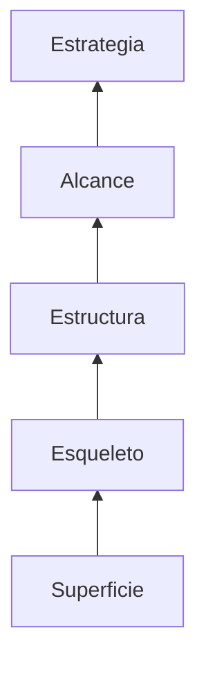
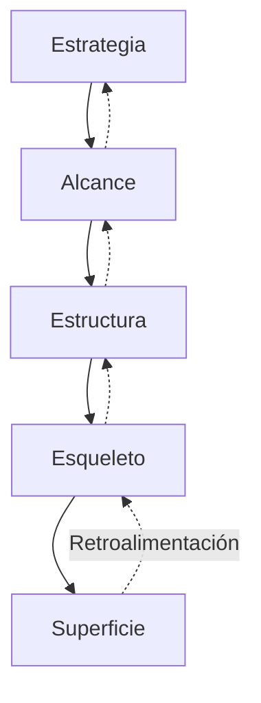
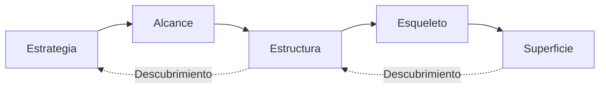
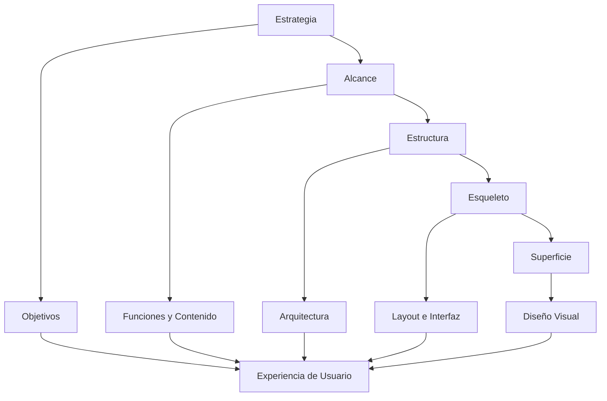

# Los Elementos De la Experiencia De Usuario (UX)

# Introducción

La **Experiencia de Usuario (User Experience o UX)** es una disciplina que busca diseñar productos digitales que no solo funcionen correctamente, sino que también sean útiles, fáciles de utilizar, satisfactorios y capaces de cumplir tanto los objetivos del negocio como las necesidades del usuario.

Este transcript introduce uno de los modelos más importantes dentro del diseño UX: el **Modelo de los Cinco Planos de Jesse James Garrett**, una metodología que permite descomponer el diseño de un producto digital en distintos niveles de abstracción para comprender qué decisiones deben tomarse en cada etapa del desarrollo.

El objetivo del modelo es evitar que el diseño visual sea una decisión aislada al final del proyecto y, en cambio, construir la experiencia desde los objetivos estratégicos hasta el producto final.

---

# Contexto Histórico Del Modelo De Garrett

## La Situación Durante la Década De Los Años 90

Durante los años noventa comenzaron a popularizarse conceptos como:

- Usabilidad.
    
- Experiencia de Usuario (UX).
    
- Diseño centrado en el usuario.

Estos conceptos fueron impulsados principalmente por investigadores y diseñadores como:

- **Jakob Nielsen**, reconocido por sus heurísticas de usabilidad y por popularizar el diseño centrado en el usuario.
    
- **Steve Krug** (el transcript lo menciona como "Steve Croc"), author de _Don't Make Me Think_, obra fundamental sobre usabilidad web.
    
- **Donald Norman**, creador del concepto moderno de Experiencia de Usuario y del modelo del Diseño Emocional.

Sin embargo, a pesar de la existencia de estas ideas, la mayoría de los equipos de desarrollo seguían considerando la interfaz como un componente secundario.

---

## La Prioridad De Los Proyectos En Esa Época

El transcript explica que el principal objetivo era entregar:

- Tecnología.
    
- Funcionalidad.
    
- Software operativo.

La satisfacción del usuario era vista como un aspecto complementario.

La prioridad recaía en:

- Grandes desarrolladores.
    
- Complejidad técnica.
    
- Cantidad de funcionalidades.

No existía todavía una cultura sólida de diseño centrado en el usuario.

---

## La Crisis De Las ".com"

Uno de los acontecimientos que cambió esta visión fue la **crisis de las empresas punto com (Dot-com Bubble)** a principios de los años 2000.

### ¿Qué Ocurrió?

Después del crecimiento explosivo de Internet durante los años noventa, muchas empresas tecnológicas desaparecieron.

Esto provocó un cambio importante:

Ya no bastaba con desarrollar tecnología.

Ahora era necesario ofrecer productos que realmente generaran valor para el usuario.

---

## Cambios Que Impulsaron El UX

El transcript identifica varios factores que favorecieron el nacimiento del enfoque moderno de UX.

### La Tecnología Se Volvió Más Accessible

Las herramientas tecnológicas comenzaron a set:

- Más económicas.
    
- Más fáciles de desarrollar.
    
- Disponibles para un mayor número de empresas.

Como consecuencia, la tecnología dejó de set el principal diferenciador.

---

### Sobrecarga Cognitiva

Los usuarios comenzaron a enfrentarse a una enorme cantidad de información.

Esta situación produjo:

- Mayor dificultad para procesar contenido.
    
- Disminución del tiempo de atención.
    
- Necesidad de interfaces más simples.

El diseño pasó a enfocarse en facilitar el procesamiento de información.

---

### Expansión De Las Ciencias Cognitivas

El transcript menciona la creciente importancia de las ciencias cognitivas durante esa década.

En particular destaca la publicación del libro:

**"El Error de Descartes" (1995)** de **Antonio Damasio**.

Esta obra revolucionó la comprensión de la relación entre:

- Razón.
    
- Emoción.
    
- Toma de decisiones.

Su impacto trascendió la psicología y llegó al mundo empresarial y al diseño de experiencias.

---

# El Cambio De Paradigma

Como consecuencia de estos cambios, las empresas comenzaron a competir mediante la experiencia ofrecida al usuario.

Antes:

```text
Más funcionalidades = Mejor producto
```

Después:

```text
Mejor experiencia = Mayor satisfacción = Mayor diferenciación
```

El objetivo pasó a set que el usuario disfrutara la experiencia completa, desde el primer contacto hasta la finalización de la interacción con el producto.

---

# El Modelo De Los Cinco Planos De Garrett

## Definición

El modelo de Garrett divide el diseño UX en **cinco planos** o niveles.

Cada plano representa un grado diferente de abstracción.

Estos planos permiten:

- Identificar problemas.
    
- Organizar decisiones.
    
- Definir responsabilidades.
    
- Relacionar disciplinas del diseño.

---

## Características Del Modelo

Los planos:

- Van del nivel más abstracto al más concreto.
    
- Se construyen de abajo hacia arriba.
    
- No funcionan de manera independiente.
    
- Se retroalimentan continuamente.

Es decir, una decisión tomada en una capa superior puede obligar a modificar una inferior y vice-versa.

---

## Los Cinco Planos



---

# Plano 1. Estrategia

## Definición

Es el plano más abstracto.

Aquí se define:

- El propósito del producto.
    
- Los objetivos del negocio.
    
- Las necesidades reales del usuario.

Es la base sobre la cual se construye todo el proyecto.

---

## Objetivo

Encontrar un equilibrio entre:

- Objetivos del cliente.
    
- Necesidades del usuario.

Si este equilibrio no existe, el producto probablemente fracasará.

---

## Preguntas Fundamentales

El transcript menciona las siguientes preguntas:

- ¿Por qué estamos creando este producto?
    
- ¿Qué quiere nuestro cliente?
    
- ¿Qué desea el usuario?
    
- ¿Qué necesidades satisface?
    
- ¿Qué nos diferencia de la competencia?
    
- ¿Qué valor agregado ofrecemos?

Estas preguntas ayudan a definir la dirección estratégica del proyecto.

---

# Plano 2. Alcance

## Definición

Una vez definida la estrategia, debe establecerse qué incluirá el producto.

Este plano determina:

- Funcionalidades.
    
- Contenidos.

En otras palabras:

Define **qué hará el sistema**.

---

## Components

### Requisitos Funcionales

Describen las funciones que deberá ofrecer el sistema.

Ejemplos:

- Registro de usuarios.
    
- Búsqueda.
    
- Pagos.
    
- Carrito de compras.

---

### Requisitos De Contenido

Determinan toda la información que deberá container el producto.

Ejemplos:

- Imágenes.
    
- Textos.
    
- Videos.
    
- Documentación.
    
- Noticias.

---

## Preguntas Principales

- ¿Qué contenidos debemos entregar?
    
- ¿Qué funciones esperan los usuarios?

---

# Plano 3. Estructura

## Definición

En este plano se organiza la forma en que el usuario interactuará con el sistema.

No se diseña todavía la apariencia.

Se diseña la lógica del funcionamiento.

---

## Objetivos

Definir:

- Organización del contenido.
    
- Flujo de navegación.
    
- Relación entre funciones.
    
- Interacción del usuario.

---

## Preguntas

- ¿Cómo se organizará el contenido?
    
- ¿Cómo interactuará el usuario?
    
- ¿Cómo presentaremos las funciones?

---

# Plano 4. Esqueleto (Skeleton)

## Definición

Corresponde al diseño de la disposición física de los elementos dentro de cada pantalla.

Aquí se determina dónde estarán ubicados:

- Botones.
    
- Menús.
    
- Imágenes.
    
- Formularios.
    
- Bloques de texto.
    
- Pestañas.

---

## Objetivo

Optimizar la distribución visual para facilitar el acceso al contenido y las funciones.

No se trabaja todavía la estética, sino la organización.

---

## Pregunta Principal

¿Cómo distribuiremos visualmente la información y las funciones?

---

# Plano 5. Superficie

## Definición

Es el nivel más concreto del modelo.

Aquí aparece el diseño visual definitivo.

---

## Elementos

Incluye:

- Colores.
    
- Tipografía.
    
- Iconografía.
    
- Fotografía.
    
- Espaciados.
    
- Estilo gráfico.
    
- Identidad visual.

---

## Objetivo

Materializar todas las decisiones tomadas en las capas inferiores.

Una buena superficie depende completamente de una buena estrategia, alcance, estructura y esqueleto.

---

# Relación Entre Los Cinco Planos



El transcript enfatiza que los planos **no son independientes**, sino un sistema interconectado donde las decisiones pueden retroalimentarse continuamente.

---

# La Dualidad De la Web Según Garrett

Uno de los aportes más importantes del modelo es reconocer que la Web posee una naturaleza dual:

1. Es un **software interactivo**.
    
2. Es un **sistema de información hipertextual**.

Estas dos perspectivas atraviesan los cinco planos del modelo.

---

# Origen De Esta Dualidad

Garrett reflexiona sobre el trabajo de **Tim Berners-Lee**, creador de la **World Wide Web (WWW)**.

Originalmente la Web fue creada para permitir que investigadores de distintas partes del mundo compartieran artículos científicos (_papers_) e investigaciones.

Posteriormente evolucionó hasta convertirse en una plataforma altamente interactiva.

Por ello, una aplicación web debe considerar tanto el comportamiento del software como la organización y presentación de la información.

---

# Dos Perspectivas Del Modelo

Garrett incorpora dos formas de recorrer el modelo.

## Tiempo

Representa un proceso lineal.

Va desde:

- Lo más abstracto.
    
- Hasta lo más concreto.

Es el flujo típico de diseño.

---

## Descubrimiento

Representa un proceso iterativo.

Durante el desarrollo pueden descubrirse nuevos problemas que obliguen a regresar a planos anteriores.

Por ello el diseño UX no es completamente lineal.

---



---

# Disciplinas Asociadas a Cada Plano

## Estrategia

### Software

Objetivos del producto.

### Información

Necesidades del usuario.

Ambas dimensions deben mantenerse alineadas.

---

## Alcance

### Software

Especificaciones funcionales.

Definen qué herramientas tendrá el producto.

### Información

Especificación del contenido.

Define qué información será necesaria.

---

## Estructura

Aquí aparecen dos disciplinas fundamentales.

### Diseño De Interacción

Define cómo responderá el sistema ante las acciones del usuario.

El transcript menciona varias recomendaciones:

- Indicar cuándo el usuario puede interactuar.
    
- Prevenir errores.
    
- Ayudar a completar tareas.
    
- Facilitar el logro de objetivos.

Estas recomendaciones buscan crear interacciones claras, predecibles y eficientes.

---

### Arquitectura De la Información

Organiza y estructura el contenido para que el usuario pueda encontrar fácilmente la información que necesita.

Incluye:

- Jerarquías.
    
- Categorías.
    
- Relaciones entre contenidos.
    
- Organización lógica de la información.

---

# Plano Esqueleto

En este nivel aparecen dos disciplinas.

## Diseño De Información

Se ocupa de presentar la información de forma:

- Clara.
    
- Comprensible.
    
- Fácil de interpretar.

Busca minimizar la carga cognitiva del usuario mediante una adecuada organización visual.

---

## Diseño De Interfaz

Diseña todos los elementos con los que el usuario interactuará.

Ejemplos:

- Botones.
    
- Campos.
    
- Formularios.
    
- Controles.
    
- Menús.

---

## Diseño De Navegación

Desde la perspectiva del hipertexto, este plano incorpora el diseño de navegación.

Su objetivo es permitir que el usuario recorra fácilmente la estructura de información.

Ejemplo mencionado:

- Composición del menú de navegación.

---

# Plano Superficie

La superficie representa el resultado visible del trabajo realizado en todas las capas anteriores.

Es donde el usuario observa finalmente:

- Colores.
    
- Tipografía.
    
- Imágenes.
    
- Iconos.
    
- Apariencia visual general.

Aunque suele set el aspecto más visible, depende completamente de todas las decisiones estratégicas tomadas previamente.

---

# Relación General Del Modelo



---

# Responsabilidad Multidisciplinaria

El transcript concluye señalando que cada una de estas áreas require especialistas responsables.

Entre los perfiles que normalmente participan se encuentran:

|Plano|Responsible habitual|
|---|---|
|Estrategia|Product Manager, UX Strategist|
|Alcance|Analista funcional, Product Owner|
|Estructura|UX Designer, Arquitecto de Información|
|Esqueleto|UX/UI Designer|
|Superficie|Diseñador UI o Diseñador Visual|

Aunque los nombres pueden variar entre organizaciones, la idea central es que cada plano implica decisiones especializadas que deben coordinarse para construir una experiencia de usuario coherente.

---

# Resumen

## Puntos Clave

- Durante los años noventa, el desarrollo de software priorizaba la funcionalidad y relegaba la experiencia del usuario, hasta que la crisis de las empresas punto com impulsó un cambio hacia el diseño centrado en el usuario.
    
- Factores como la mayor accesibilidad tecnológica, la sobrecarga cognitiva y el advance de las ciencias cognitivas favorecieron la consolidación de la UX como disciplina.
    
- El Modelo de Garrett organiza el diseño de la experiencia de usuario en cinco planos: **Estrategia, Alcance, Estructura, Esqueleto y Superficie**, ordenados desde el nivel más abstracto hasta el más concreto.
    
- Los cinco planos forman un sistema de capas interdependientes con retroalimentación continua; una decisión en un nivel puede afectar a los demás.
    
- La **Estrategia** define los objetivos del negocio y las necesidades del usuario.
    
- El **Alcance** determina las funcionalidades y los contenidos del producto.
    
- La **Estructura** organiza la interacción y la arquitectura de la información.
    
- El **Esqueleto** establece la disposición de los elementos de la interfaz mediante el diseño de información, el diseño de interfaz y el diseño de navegación.
    
- La **Superficie** materializa todas las decisiones anteriores en el diseño visual definitivo.
    
- Garrett integra la dualidad de la Web como software interactivo y como sistema de información hipertextual, incorporando disciplinas específicas para cada perspectiva.
    
- El modelo puede recorrerse tanto de manera lineal (tiempo) como iterativa (descubrimiento), permitiendo revisar y ajustar decisiones durante el proceso de diseño.

## MicroTest 3.1

1. En este plano se definen los objetivos generales del diseño de la web/app, tratando siempre de equilibrar los objetivos de nuestro cliente con las necesidades del usuario:
    
    - **La respuesta:** b. Estrategia
        
    - **Justificación:** El plano de **Estrategia** es el primer nivel del Modelo de Garrett y establece los objetivos generales del producto. En esta etapa se busca equilibrar las metas del cliente con las necesidades y expectativas del usuario, respondiendo preguntas como por qué se crea el producto, qué necesidades satisface y qué valor aporta frente a la competencia.
        
2. Este plano está situado debajo de la capa de superficie, nos indica la colocación de botones, pestañas, bloques de texto y fotos:
    
    - **La respuesta:** d. Esquema
        
    - **Justificación:** El plano de **Esquema** (Skeleton) se encuentra inmediatamente debajo de la superficie y define la distribución de los elementos de la interfaz, como botones, pestañas, bloques de texto e imágenes. Su objetivo es organizar visualmente la información y las funciones para facilitar la interacción del usuario antes de aplicar el diseño visual final.
        
3. Define la forma en la que se van a entregar los contenidos y funciones, es decir, cómo se estructura el contenido y cómo se interactúa con él:
    
    - **La respuesta:** c. Estructura
        
    - **Justificación:** El plano de **Estructura** determina cómo se organizan los contenidos y las funcionalidades del sistema. En esta etapa se define la arquitectura de la información y el diseño de interacción, estableciendo cómo navegará el usuario y cómo interactuará con el contenido y las funciones de la aplicación o sitio web.

<iframe loading="lazy" title="Tim Berners-Lee: Tim Berners-Lee: El año en que los datos de libre acceso se globalizaron" height="315" width="560" src="https://embed.ted.com/talks/lang/es/tim_berners_lee_the_year_open_data_went_worldwide" allowfullscreen="" allow="fullscreen" style="aspect-ratio: 1.77778 / 1; width: 100%; height: 100%;"></iframe>

