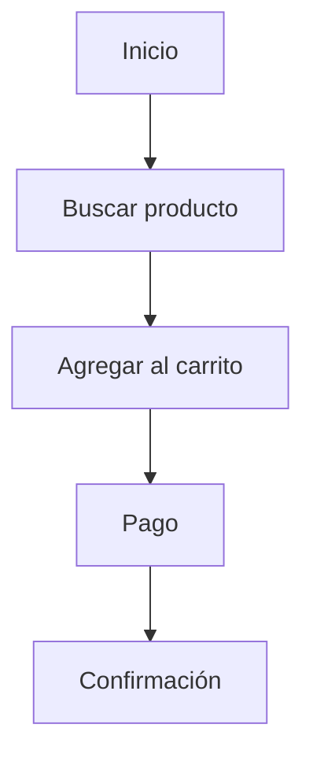

# Disciplinas En El Proceso De Diseño UX

# Introducción

El diseño de **Experiencia de Usuario (UX, User Experience)** es una disciplina multidisciplinaria que integra conocimientos de diseño, psicología, investigación, arquitectura de información e interacción humano-computadora para desarrollar productos digitales útiles, intuitivos y satisfactorios.

Uno de los errores más comunes dentro del desarrollo de productos digitales consiste en confundir **UX (User Experience)** con **UI (User Interface)**. Aunque ambas disciplinas trabajan conjuntamente y son pilares del desarrollo web y móvil, **no representan el mismo concepto ni desempeñan las mismas funciones**.

Este transcript tiene como objetivo explicar las diferencias entre UX y UI, presentar las principales disciplinas involucradas en el proceso de diseño UX y mostrar cómo todas ellas colaboran para construir una experiencia de usuario completa.

---

# UX Y UI: Dos Disciplinas Complementarias

## ¿Por Qué Suelen Confundirse?

El transcript señala que UX y UI son considerados los dos pilares del diseño de productos digitales.

Esto ocurre porque ambos participan durante el desarrollo de:

- Sitios web.
    
- Aplicaciones móviles.
    
- Plataformas digitales.
    
- Sistemas interactivos.

Sin embargo, muchas personas utilizan ambos términos como sinónimos, cuando en realidad representan disciplinas distintas con responsabilidades diferentes.

---

# ¿Qué Es UX (User Experience)?

## Definición

La **Experiencia de Usuario (UX)** comprende el diseño de toda la experiencia que una persona vive al utilizar un producto digital.

No se limita únicamente a la interfaz visual, sino que analiza aspectos como:

- Utilidad del producto.
    
- Facilidad de uso.
    
- Fluidez de las tareas.
    
- Comprensión del contenido.
    
- Satisfacción del usuario.
    
- Emociones generadas durante el uso.

En términos generales, UX responde a la pregunta:

> **¿Cómo se siente utilizar este producto?**

---

## Objetivo Principal

El transcript explica que UX busca:

- Analizar al usuario.
    
- Comprender su comportamiento.
    
- Traducir dicho comportamiento al diseño del producto.
    
- Garantizar una experiencia satisfactoria.

Todo ello procurando equilibrar:

- Las necesidades del cliente.
    
- Las necesidades del usuario.

---

## Responsabilidades Del UX Designer

Según el transcript, el professional de UX tiene una visión estratégica del proyecto.

Entre sus funciones se encuentran:

- Investigar usuarios.
    
- Comprender comportamientos.
    
- Definir objetivos de la experiencia.
    
- Diseñar la interacción.
    
- Crear prototipos.
    
- Elaborar wireframes.
    
- Diseñar la arquitectura de información.
    
- Evaluar la usabilidad.
    
- Analizar la satisfacción del usuario.
    
- Actuar como mediador entre cliente y usuario.

---

## UX Como Disciplina Estratégica

El transcript menciona que UX se sitúa en el **plano de Estrategia** del modelo de Garrett.

Esto significa que participa desde las primeras decisiones del proyecto, antes incluso de comenzar el diseño visual.

---

# ¿Qué Es UI (User Interface)?

## Definición

La **Interfaz de Usuario (UI)** corresponde al diseño visual mediante el cual el usuario interactúa con el sistema.

Incluye todos los elementos gráficos visible del producto.

En términos generales responde a la pregunta:

> **¿Cómo luce el producto?**

---

## Objetivo Principal

Crear una interfaz:

- Atractiva.
    
- Coherente.
    
- Clara.
    
- Fácil de utilizar.

---

## Responsabilidades Del UI Designer

El transcript señala que el diseñador UI se encarga principalmente de:

- La parte visual de la aplicación.
    
- La estética.
    
- La apariencia general.
    
- La ubicación de los elementos.
    
- El nivel de dificultad de la interacción.
    
- Mantener coherencia con la identidad visual de la empresa.

Aunque participa en aspectos relacionados con la interacción, su enfoque principal es la presentación visual del producto.

---

# Comparación Entre UX Y UI

|UX (Experiencia de Usuario)|UI (Interfaz de Usuario)|
|---|---|
|Diseña la experiencia completa|Diseña la apariencia visual|
|Se enfoca en el usuario|Se enfoca en la interfaz|
|Analiza necesidades y comportamientos|Diseña elementos gráficos|
|Evalúa usabilidad|Define estética y estilo visual|
|Investiga usuarios|Selecciona colores, tipografías e iconografía|
|Diseña flujos de interacción|Diseña pantallas e interfaces|
|Tiene visión estratégica|Tiene visión visual y estética|

---

# Relación Entre UX Y UI

El transcript deja claro que ambas disciplinas trabajan juntas.


Una buena interfaz visual no puede compensar una mala experiencia de usuario, mientras que una excelente experiencia necesita una interfaz clara para materializarse correctamente.

---

# Components Principales Del UX

El transcript muestra diversas áreas que forman parte del proceso de UX.

## Diseño De Interacción

### Definición

Es la disciplina encargada de diseñar la forma en que el usuario interactuará con el sistema.

Busca que cada acción sea:

- Natural.
    
- Intuitiva.
    
- Fácil de aprender.

---

### Objetivo

Diseñar experiencias donde el usuario pueda completar sus tareas de la forma más sencilla possible.

---

### Flujo Del Usuario (User Flow)

El transcript menciona el **flujo del usuario**, que representa el recorrido que sigue una persona para completar una tarea.

Ejemplo:



---

### Flujo De Tareas

Representa la secuencia específica de pasos necesarios para realizar una acción concreta.

Su propósito consiste en minimizar:

- Errores.
    
- Pasos innecesarios.
    
- Confusión.

---

### Diseño Amigable Y Usable

El transcript enfatiza que el diseño de interacción debe priorizar:

- Facilidad de uso.
    
- Comprensión.
    
- Eficiencia.

Por encima de la estética.

Es decir:

> Primero debe funcionar correctamente.

Después debe verse bien.

---

# Prototipado Y Wireframes

## Prototipado

El UX Designer tiene la capacidad de visualizar anticipadamente cómo funcionará la interfaz mediante prototipos.

Los prototipos permiten:

- Validar ideas.
    
- Detectar problemas.
    
- Probar funcionalidades.
    
- Obtener retroalimentación antes del desarrollo.

---

## Wireframes

Los **Wireframes** representan el esquema básico de una interfaz.

Incluyen únicamente:

- Distribución.
    
- Organización.
    
- Jerarquía.

Sin incorporar todavía diseño visual.

Su objetivo es definir la estructura antes de invertir tiempo en el aspecto gráfico.

---

# Necesidades Del Usuario Y Objetivos Del Sitio

## Necesidades Del Usuario

El transcript explica que las necesidades del usuario se identifican mediante técnicas de investigación.

Estas técnicas permiten comprender:

- Problemas.
    
- Expectativas.
    
- Comportamientos.
    
- Objetivos.

---

## Objetivos Del Sitio

Representan las metas del negocio.

Pueden incluir:

- Objetivos comerciales.
    
- Objetivos institucionales.
    
- Objetivos internos.

---

## Equilibrio Entre Ambos

Una de las responsabilidades principales del UX Designer consiste en equilibrar:

```mermaid
flowchart LR

Necesidades del Usuario

--> Diseño UX

<--> Objetivos del Negocio
```

El éxito del producto depende de satisfacer simultáneamente ambas perspectivas.

---

# Arquitectura De la Información (IA)

## Definición

El transcript indica que **Richard Saul Wurman** utilizó por primera vez el término **Arquitectura de la Información** en 1975.

La define como:

> El estudio de la organización de la información con el objetivo de permitir que el usuario pueda encontrar su vía de navegación hacia el conocimiento y la comprensión de la información.

### ¿Qué Significa?

Consiste en organizar el contenido de un sistema para que las personas encuentren fácilmente la información que necesitan.

---

## Objetivos

La Arquitectura de la Información busca que el contenido sea:

- Comprensible.
    
- Intuitivo.
    
- Fácil de localizar.
    
- Fácil de utilizar.

---

## UX Y Arquitectura De la Información

El transcript aclara que:

La Arquitectura de la Información forma parte del UX.

Sin embargo:

UX ≠ Arquitectura de Información.

La IA constituye únicamente una de las múltiples disciplinas que conforman la experiencia de usuario.

---

# Diseño De Información

## Definición

Se ocupa de presentar la información de forma que resulte fácilmente comprensible.

Busca responder preguntas como:

- ¿Qué información mostrar?
    
- ¿En qué orden?
    
- ¿Cómo facilitar su interpretación?

---

## Objetivo

Reducir la carga cognitiva y facilitar la comprensión del contenido.

---

# Diseño De Interfaz

## Definición

El diseño de interfaz desarrolla todos los elementos mediante los cuales el usuario interactúa con el sistema.

Incluye:

- Botones.
    
- Formularios.
    
- Menús.
    
- Controles.
    
- Campos de entrada.

El transcript señala que esta disciplina proviene del estudio tradicional de la **Interacción Humano-Computadora (HCI, Human-Computer Interaction)**.

---

# Diseño De Navegación

## Definición

Diseña los mecanismos mediante los cuales el usuario recorre la arquitectura de información.

Ejemplos:

- Menús.
    
- Breadcrumbs.
    
- Navegación lateral.
    
- Navegación principal.
    
- Hipervínculos.

---

## Objetivo

Permitir que el usuario encuentre rápidamente cualquier contenido sin perderse dentro del sistema.

---

# Diseño Visual

## Definición

Corresponde al tratamiento gráfico del producto.

Incluye:

- Tipografía.
    
- Imágenes.
    
- Iconografía.
    
- Colores.
    
- Components gráficos.
    
- Elementos de navegación.

Su objetivo consiste en comunicar visualmente la identidad del producto y mejorar la percepción estética sin comprometer la usabilidad.

---

# Principios De Usabilidad De Jakob Nielsen

El transcript menciona que estos principios se revisarán en un material complementario y que guardan una estrecha relación con UX y UI.

Aunque no se desarrollan en este video, es importante recordar que las heurísticas de Nielsen constituyen una guía para evaluar la facilidad de uso de las interfaces, abordando aspectos como la visibilidad del estado del sistema, la consistencia, la prevención de errores y el reconocimiento antes que el recuerdo.

---

# Accesibilidad

## Definición

El transcript enfatiza que **accesibilidad** y **usabilidad** no significan lo mismo.

La accesibilidad consiste en el conjunto de técnicas que permiten que cualquier persona pueda utilizar un producto digital, incluso cuando presenta alguna discapacidad.

---

## Objetivo

Eliminar barreras para usuarios con:

- Discapacidad visual.
    
- Discapacidad auditiva.
    
- Discapacidad motriz.
    
- Discapacidad cognitiva.

---

## Diferencias Entre Accesibilidad Y Usabilidad

|Accesibilidad|Usabilidad|
|---|---|
|Busca eliminar barreras de acceso.|Busca facilitar el uso del sistema.|
|Está orientada a usuarios con distintas capacidades.|Está orientada a todos los usuarios.|
|Garantiza que el contenido pueda utilizarse.|Garantiza que las tareas puedan realizarse fácilmente.|
|Se apoya en estándares como WCAG.|Se evalúa mediante principios y pruebas de usabilidad.|

Una interfaz puede set usable para la mayoría de los usuarios y, aun así, no set accessible para personas con discapacidad. Por ello, ambos conceptos deben considerarse de manera conjunta durante el diseño.

---

# La Naturaleza Multidisciplinaria Del UX

El transcript concluye señalando que la Experiencia de Usuario integra múltiples disciplinas.

Muchas de ellas presentan áreas de trabajo compartidas.

Sin embargo, todas tienen un objetivo común:

Crear una experiencia satisfactoria para el usuario.

```mermaid
flowchart TD

UX

--> Investigación

UX --> Arquitectura de Información

UX --> Diseño de Interacción

UX --> Wireframes

UX --> Prototipado

UX --> Diseño de Información

UX --> Diseño de Navegación

UX --> Diseño Visual

UX --> Accesibilidad

UX --> Usabilidad

UX --> UI
```

Esto demuestra que la UX no es una tarea aislada, sino un proceso colaborativo donde intervienen especialistas con distintos perfiles y responsabilidades.

---

# Resumen

## Puntos Clave

- UX y UI son disciplinas complementarias, pero diferentes: UX diseña la experiencia completa del usuario, mientras que UI se centra en la interfaz visual.
    
- El UX Designer trabaja desde una perspectiva estratégica, investigando usuarios, definiendo objetivos, diseñando la interacción y equilibrando las necesidades del usuario con los objetivos del negocio.
    
- El UI Designer desarrolla la apariencia visual del producto, incluyendo colores, tipografía, iconografía, distribución de elementos e identidad visual.
    
- El diseño de interacción define cómo el usuario realiza tareas mediante flujos intuitivos, priorizando la usabilidad sobre la estética.
    
- El prototipado y los wireframes permiten validar ideas y estructurar la interfaz antes del desarrollo y del diseño visual definitivo.
    
- La Arquitectura de la Información, introducida por Richard Saul Wurman en 1975, organiza el contenido para que sea comprensible, intuitivo y fácil de encontrar.
    
- El diseño de información, el diseño de interfaz y el diseño de navegación trabajan conjuntamente para presentar el contenido de manera clara y facilitar la interacción y el desplazamiento dentro del sistema.
    
- La accesibilidad elimina barreras para personas con discapacidad y no debe confundirse con la usabilidad, aunque ambas disciplinas son complementarias.
    
- La experiencia de usuario es una disciplina multidisciplinaria que integra investigación, interacción, arquitectura de información, navegación, diseño visual, accesibilidad y usabilidad para construir productos digitales centrados en las personas.

## MicroTest 3.2

1. En este diseño se realiza el tratamiento visual de texto, tipografías, imágenes y gráficos, además de los components de la navegación:
    
    - **La respuesta:** c. Diseño visual
        
    - **Justificación:** El **diseño visual** es la disciplina encargada del aspecto gráfico de la interfaz. Según el transcript, comprende el tratamiento visual del texto, las tipografías, las imágenes, los gráficos y los components de navegación, con el objetivo de crear una interfaz atractiva, coherente y alineada con la identidad visual del producto.
        
2. Diseño de los elementos para facilitar la interacción del usuario con la funcionalidad. Proviene del estudio de interacción humano-computador tradicional:
    
    - **La respuesta:** c. Diseño de la interfaz
        
    - **Justificación:** El **diseño de la interfaz** se ocupa de crear los elementos con los que el usuario interactúa, como botones, formularios, menús y controles. El transcript indica que esta disciplina proviene del estudio de la **Interacción Humano-Computadora (Human-Computer Interaction, HCI)** y busca facilitar la interacción entre el usuario y las funcionalidades del sistema.
        
3. Es el conjunto de técnicas enfocadas a que cualquier usuario pueda acceder al contenido de un producto digital sin que sea un obstáculo su grado de discapacidad:
    
    - **La respuesta:** a. Accesibilidad
        
    - **Justificación:** La **accesibilidad** consiste en aplicar técnicas y principios de diseño para que cualquier persona, independientemente de sus capacidades o discapacidades, pueda utilizar un producto digital. El transcript aclara que no debe confundirse con la usabilidad, ya que la accesibilidad se enfoca en eliminar barreras de acceso para todos los usuarios.


