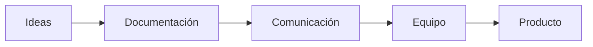
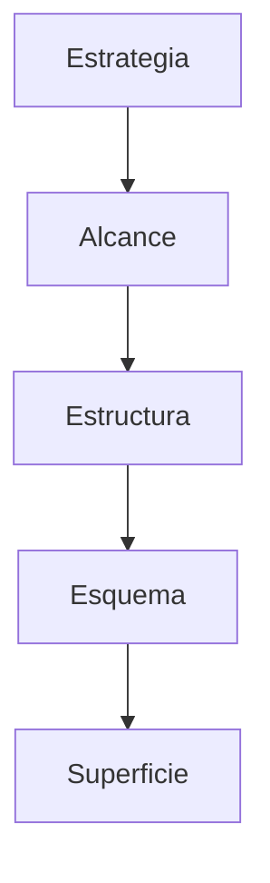
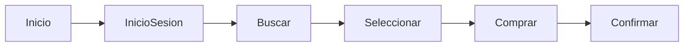
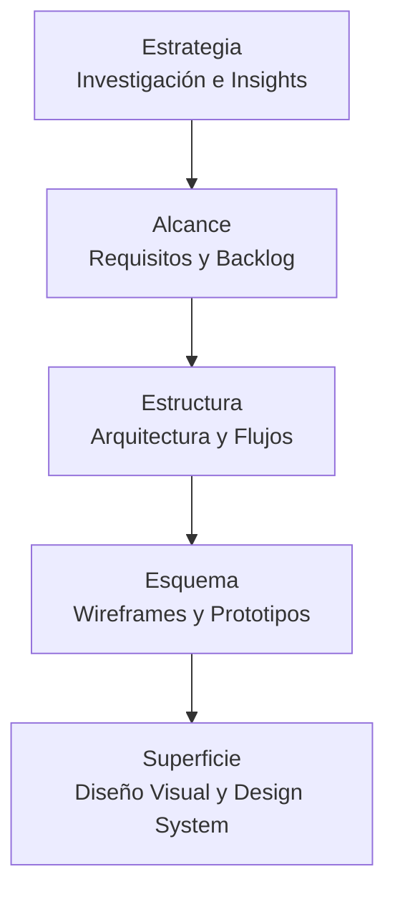

# Entregables Del Proceso De UX

# Introducción

El proceso de **Experiencia de Usuario (UX)** no consiste únicamente en diseñar interfaces atractivas o realizar investigaciones sobre usuarios. También implica generar una series de **entregables (deliverables)** que documentan las decisiones tomadas durante el proyecto y sirven como herramientas de comunicación entre todos los involucrados.

El transcript explica que, independientemente de la metodología utilizada (tradicional o ágil), siempre existirán documentos, diagrams, prototipos y modelos que representan el advance del proyecto y permiten que diseñadores, desarrolladores, clientes y demás participantes trabajen con una visión compartida.

Estos entregables se organizan siguiendo los **cinco planos del modelo de Jesse James Garrett**, estudiados en el tema anterior:

1. Estrategia.
    
2. Alcance.
    
3. Estructura.
    
4. Esquema (Skeleton).
    
5. Superficie.

Cada plano posee entregables específicos que reflejan el nivel de madurez del diseño.

---

# ¿Qué Son Los Entregables (Deliverables) eN UX?

## Definición

Un **entregable** es cualquier documento, modelo, prototipo, plano o artefacto generado durante el proceso de diseño que sirve para comunicar información, registrar decisiones o apoyar el desarrollo del producto.

En UX, los entregables permiten transformar ideas abstractas en elementos concretos que pueden set analados, validados y utilizados por todo el equipo.

---

## Importancia De Los Entregables

El transcript destaca que la documentación **no constituye un fin en sí mismo**, sino un medio para facilitar el desarrollo del proyecto.

Los entregables permiten:

- Comunicar ideas entre los miembros del equipo.
    
- Registrar las decisiones tomadas.
    
- Facilitar la colaboración multidisciplinaria.
    
- Presentar advances al cliente.
    
- Reducir ambigüedades.
    
- Servir como referencia durante el desarrollo.
    
- Mantener la trazabilidad de las decisiones de diseño.

En otras palabras, funcionan como el lenguaje común entre diseñadores, desarrolladores, clientes y demás interesados.

---

# La Documentación En Metodologías Ágiles

## Cambio De Paradigma

El transcript menciona que, con la llegada de las metodologías ágiles durante el nuevo milenio, cambió la forma de entender la documentación.

Anteriormente:

- Se producía gran cantidad de documentación.
    
- Muchos documentos nunca volvían a utilizarse.
    
- El objetivo era documentar absolutamente todo.

Con las metodologías ágiles:

- La documentación deja de set el objetivo principal.
    
- Se produce únicamente la documentación que aporta valor.
    
- Cada documento debe facilitar la comunicación del proyecto.

---

## Principio Fundamental

La documentación debe set:

- Útil.
    
- Clara.
    
- Fácil de mantener.
    
- Relevante.
    
- Efectiva.

No se documenta por obligación, sino porque ayuda al proyecto.

---

---

# Los Entregables Dentro Del Modelo De Garrett

El transcript organiza los entregables según los cinco planos del modelo de Garrett.

Cada nivel produce documentación diferente conforme aumenta el detalle del producto.

---

# Plano De Estrategia

## Objetivo

Es la primera etapa del proyecto.

Su finalidad consiste en comprender:

- Qué problema se resolverá.
    
- Para quién se diseña.
    
- Qué espera el cliente.
    
- Qué necesita el usuario.

Toda decisión posterior dependerá de esta fase.

---

## Entregables Del Plano De Estrategia

### 1. Resultados E Insights De Investigación

El transcript menciona que esta etapa reúne toda la información obtenida durante la investigación.

Puede incluir:

- Entrevistas.
    
- Encuestas.
    
- Investigación etnográfica.
    
- Pruebas con usuarios.
    
- Analítica del producto.
    
- Investigación del servicio.
    
- Observaciones.

### ¿Qué Son Los Insights?

Los **insights** son hallazgos importantes obtenidos durante la investigación que ayudan a comprender comportamientos, necesidades o problemas de los usuarios.

No son simples datos, sino conclusiones que orientan las decisiones de diseño.

---

### 2. Definición Del Reto De Diseño

Consiste en establecer claramente el problema que deberá resolver el proyecto.

Este entregable evita que el equipo diseñe soluciones para problemas mal definidos.

---

### 3. Documento De Propuesta

Es el documento donde se describe:

- Objetivos.
    
- Alcance inicial.
    
- Justificación.
    
- Beneficios esperados.

Sirve como acuerdo entre cliente y equipo.

---

### 4. Canvas Del Modelo De Negocio

El transcript menciona el **Canvas** como uno de los entregables posibles.

El Business Model Canvas resume aspectos fundamentales del negocio, como:

- Propuesta de valor.
    
- Segmentos de clientes.
    
- Recursos clave.
    
- Actividades clave.
    
- Socios estratégicos.
    
- Fuentes de ingresos.
    
- Costos.

Su propósito es asegurar que el diseño apoye los objetivos del negocio.

---

# Plano De Alcance

## Objetivo

En esta etapa se definen las necesidades concretas del usuario y se determina qué incluirá el producto.

Responde a preguntas como:

- ¿Qué funcionalidades tendrá?
    
- ¿Qué contenido ofrecerá?
    
- ¿Qué se desarrollará primero?

---

## Entregables Del Plano De Alcance

### Plan Del Proyecto

Documento que organiza:

- Actividades.
    
- Recursos.
    
- Responsables.
    
- Cronograma.

Permite coordinar el desarrollo del producto.

---

### Presupuesto

Define los recursos económicos necesarios para desarrollar el proyecto.

Incluye:

- Costos.
    
- Tiempo.
    
- Recursos humanos.
    
- Herramientas.

---

### Requisitos Funcionales

Describen qué debe hacer el sistema.

Ejemplos:

- Registrar usuarios.
    
- Buscar productos.
    
- Generar reportes.

Son la base para el desarrollo técnico.

---

### Requisitos De Contenido

Definen toda la información que el sistema deberá container.

Por ejemplo:

- Imágenes.
    
- Textos.
    
- Videos.
    
- Documentación.
    
- Noticias.

---

### Backlog

El transcript menciona el **Backlog** como uno de los principales entregables.

## ¿Qué Es?

Es una lista priorizada de todas las funcionalidades pendientes del proyecto.

En metodologías ágiles se actualiza continuamente conforme evoluciona el producto.

---

### Hitos (Milestones)

Representan puntos importantes del proyecto.

Ejemplos:

- Finalización del diseño.
    
- Entrega del prototipo.
    
- Inicio de pruebas.
    
- Liberación de versión beta.

Permiten medir el advance.

---

### Fechas De Entrega

Especifican cuándo debe entregarse cada fase del proyecto.

---

### Historias De Usuario

Las historias de usuario describen funcionalidades desde la perspectiva del usuario.

Generalmente siguen el formato:

> Como **[tipo de usuario]**, quiero **[funcionalidad]** para **[beneficio]**.

Ejemplo:

> Como cliente, quiero recuperar mi contraseña para volver a acceder a mi cuenta.

Su propósito es mantener el desarrollo centrado en las necesidades reales del usuario.

---

# Plano De Estructura

## Objetivo

Define la organización funcional del producto.

En esta etapa se establece:

- Cómo funcionará.
    
- Cómo navegará el usuario.
    
- Cómo estarán relacionadas las distintas funcionalidades.

---

## Entregables Del Plano De Estructura

### Modelos De IA

El transcript menciona "modelos de inteligencia artificial". Aunque la referencia puede set breve, en el contexto del curso se presenta como un entregable asociado a este plano. Pueden representar modelos o components que describen cómo intervienen capacidades inteligentes dentro del sistema, cuando forman parte de los requisitos funcionales.

---

### Estrategias De Contenido

Definen:

- Qué contenido existirá.
    
- Cómo será organizado.
    
- Cuándo aparecerá.
    
- A quién estará dirigido.

Buscan garantizar coherencia y utilidad para el usuario.

---

### Modelos De Navegación

Representan el recorrido possible del usuario.

Definen:

- Menús.
    
- Secciones.
    
- Relaciones entre páginas.
    
- Caminos de navegación.

---

### Card Sorting

El transcript menciona los resultados del **Card Sorting**.

## ¿Qué Es?

Es una técnica de investigación donde los usuarios agrupan contenidos en categorías que consideran lógicas.

Su objetivo consiste en construir una arquitectura de información más intuitiva.

---

### Flujos De Usuario

Representan el camino que sigue el usuario para completar una tarea.

Ejemplo:

Los flujos permiten detectar:

- Pasos innecesarios.
    
- Problemas de navegación.
    
- Cuellos de botella.

---

# Plano De Esquema (Skeleton)

## Objetivo

Transformar la estructura lógica en una organización visual de la interfaz.

Aquí se diseñan:

- Navegación.
    
- Organización.
    
- Etiquetado.
    
- Búsqueda.

---

## Entregables Del Plano De Esquema

### Bocetos (Sketches)

Representaciones rápidas hechas normalmente a mano.

Permiten explorar ideas sin invertir demasiado tiempo.

---

### Wireframes

Representaciones estructurales de una pantalla.

Muestran:

- Distribución.
    
- Jerarquía.
    
- Ubicación de components.

No incluyen diseño visual definitivo.

---

### Prototipos

Simulaciones funcionales de la interfaz.

Permiten:

- Validar interacción.
    
- Detectar problemas.
    
- Obtener retroalimentación.

---

### Mapas De Información

Representan la organización del contenido del sitio.

Ayudan a comprender cómo se conectan todas las páginas.

---

### Diagrams De Flujo

Describen la secuencia de procesos que seguirá el usuario o el sistema.

Facilitan la comunicación entre diseñadores y desarrolladores.

---

### Validaciones Técnicas

Permiten comprobar que las propuestas de diseño sean técnicamente viables antes del desarrollo definitivo.

---

### Requisitos Finales Para Backend

El transcript menciona este entregable como la especificación definitiva de las necesidades que deberá implementar el backend.

Esto facilita la comunicación entre el equipo de UX y el equipo de desarrollo.

---

# Plano De Superficie

## Objetivo

Es la etapa donde el producto adquiere su apariencia definitiva.

Todo lo definido en las capas anteriores se materializa visualmente.

---

## Entregables Del Plano De Superficie

### Diseño Visual Interactivo

Representa el aspecto final del producto incluyendo:

- Colores.
    
- Tipografía.
    
- Iconografía.
    
- Components.
    
- Animaciones.
    
- Estados visuals.

---

### Prototipos De Alta Fidelidad

Son simulaciones casi idénticas al producto final.

Permiten realizar pruebas con usuarios antes del desarrollo definitivo.

---

### Criterios De Diseño

Conjunto de reglas que garantizan consistencia visual y funcional durante todo el proyecto.

---

### Manuales Y Guías De Estilo

Documentan:

- Colores.
    
- Tipografía.
    
- Iconografía.
    
- Espaciados.
    
- Components.
    
- Patrones de interacción.

Permiten que todos los miembros del equipo diseñen de forma consistente.

---

### Sistema De Diseño (Design System)

El transcript finaliza mencionando los **Sistemas de Diseño**.

## Definición

Un Design System es una colección organizada de:

- Components reutilizables.
    
- Patrones.
    
- Reglas.
    
- Guías.
    
- Estándares.

Su finalidad es mantener la coherencia entre todos los productos digitales de una organización y acelerar el desarrollo mediante components reutilizables.

---

# Resumen De Entregables Por Plano

|Plano|Objetivo principal|Entregables mencionados|
|---|---|---|
|**Estrategia**|Definir objetivos y comprender al usuario|Resultados e insights de investigación, entrevistas, encuestas, investigación etnográfica, pruebas, analítica, investigación del producto, definición del reto de diseño, documento de propuesta, Business Model Canvas|
|**Alcance**|Definir qué tendrá el producto|Plan del proyecto, presupuesto, requisitos funcionales, requisitos de contenido, backlog, hitos, fechas de entrega, historias de usuario|
|**Estructura**|Organizar funciones y contenido|Modelos de IA, estrategias de contenido, modelos de navegación, resultados de Card Sorting, flujos de usuario|
|**Esquema (Skeleton)**|Diseñar la organización visual|Bocetos, wireframes, prototipos, mapas de información, diagrams de flujo, validaciones técnicas, requisitos finales para backend|
|**Superficie**|Materializar el diseño final|Diseño visual interactivo, prototipos de alta fidelidad, criterios de diseño, manuales, guías de estilo, sistemas de diseño|

---

# Relación Entre Los Entregables

Este flujo muestra cómo cada plano genera entregables que sirven como entrada para el siguiente. A medida que el proyecto avanza, las decisiones se vuelven más concretas y el nivel de detalle aumenta hasta llegar al diseño visual final.

---

# Algoritmos

Durante este transcript **no se presenta ningún algoritmo**, procedimiento matemático ni pseudocódigo, por lo que no aplica la representación en LaTeX solicitada.

---

# Código

El transcript **no incluye fragmentos de código**, por lo que este apartado no aplica.

---

# Resumen

## Puntos Clave

- Los entregables son documentos, modelos y artefactos que registran y comunican las decisiones tomadas durante el proceso de UX.
    
- En metodologías ágiles, la documentación deja de set un fin y se convierte en un instrumento para facilitar la comunicación y la colaboración.
    
- Los entregables se organizan siguiendo los cinco planos del modelo de Garrett: Estrategia, Alcance, Estructura, Esquema y Superficie.
    
- En **Estrategia** se generan resultados de investigación, insights, la definición del reto de diseño, propuestas y el Business Model Canvas.
    
- En **Alcance** se establecen el plan del proyecto, presupuesto, requisitos, backlog, hitos, fechas de entrega e historias de usuario.
    
- En **Estructura** se definen modelos de IA, estrategias de contenido, modelos de navegación, resultados de Card Sorting y flujos de usuario.
    
- En **Esquema** se producen bocetos, wireframes, prototipos, mapas de información, diagrams de flujo, validaciones técnicas y requisitos finales para backend.
    
- En **Superficie** se materializa el diseño mediante diseños visuals interactivos, prototipos de alta fidelidad, guías de estilo, criterios de diseño y sistemas de diseño.
    
- Todos los entregables tienen como objetivo reducir la incertidumbre, mejorar la comunicación entre los participantes y facilitar la construcción de productos digitales centrados en el usuario.

## MicroTest 3.3

1. En esta fase se presentan como principales entregables como entrevistas, encuestas, investigación etnográfica, pruebas A/B, analíticas, investigación sobre el producto:
    
    - **La respuesta:** a. Fase estrategia
        
    - **Justificación:** En la **fase de Estrategia** se busca comprender al usuario y definir los objetivos del proyecto. Por ello, sus principales entregables son los resultados de la investigación, como entrevistas, encuestas, investigación etnográfica, pruebas, analíticas e investigación del producto o servicio. Esta información sirve como base para todas las decisiones posteriores del proceso de UX.
        
2. En esta fase se identifican las necesidades de los usuarios:
    
    - **La respuesta:** b. Fase alcance
        
    - **Justificación:** La **fase de Alcance** tiene como objetivo identificar las necesidades de los usuarios y traducirlas en requisitos concretos para el producto. En esta etapa se generan entregables como el plan del proyecto, presupuesto, requisitos funcionales y de contenido, backlog, hitos, fechas de entrega e historias de usuario.
        
3. Se realizan el diseño de los sistemas de navegación, organización, etiquetado y búsqueda:
    
    - **La respuesta:** d. Fase esqueleto
        
    - **Justificación:** La **fase de Esqueleto (Skeleton)** se encarga de diseñar la organización visual y funcional de la interfaz. Según el transcript, en esta etapa se desarrollan los sistemas de navegación, organización, etiquetado y búsqueda, además de entregables como bocetos, wireframes, prototipos, mapas de información y diagrams de flujo.