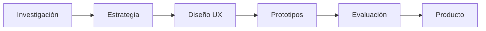
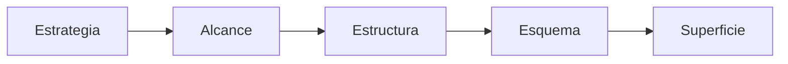
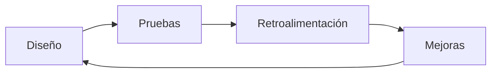
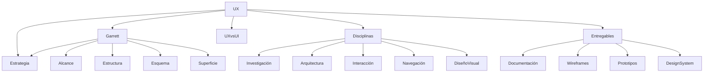

# Resumen Del Tema 3: Elementos, Disciplinas Y Entregables Del Proceso UX

# Introducción

Este tema constituye una visión integral del **proceso de Diseño de Experiencia de Usuario (UX)**. A lo largo de las lecciones anteriores se estudiaron sus fundamentos, el modelo de los elementos de la experiencia de usuario propuesto por **Jesse James Garrett**, las disciplinas que intervienen en el proceso, la diferencia entre UX y UI, así como los entregables que se generan durante el desarrollo de un proyecto.

El objetivo de este resumen es consolidar todos esos conceptos y comprender cómo se integran dentro de un proceso professional de diseño centrado en el usuario.

---

# El Diseño UX Como Disciplina

## ¿Qué Es El Diseño UX?

El **Diseño de Experiencia de Usuario (UX)** es una disciplina que busca diseñar productos digitales útiles, eficientes y satisfactorios para las personas que los utilizan.

No se limita al diseño visual de una interfaz, sino que abarca todo el proceso de interacción entre el usuario y el producto, desde la identificación de necesidades hasta la validación de la experiencia final.

Su propósito es garantizar que el usuario pueda alcanzar sus objetivos de manera intuitiva y agradable, al mismo tiempo que el producto cumple los objetivos del negocio.

---

## Una Disciplina Relativamente Joven

El transcript señala que el diseño UX comenzó a desarrollarse hace algunas décadas, por lo que aún existen pocos niveles de estandarización en comparación con otras disciplinas de ingeniería o diseño.

### Implicaciones De Esta Situación

Debido a su evolución relativamente reciente:

- Existen diferentes metodologías de trabajo.
    
- Hay múltiples herramientas disponibles.
    
- No todas las organizaciones siguen exactamente el mismo proceso.
    
- Los equipos pueden adaptar las metodologías según las necesidades del proyecto.

Sin embargo, sí existen principios y fundamentos ampliamente aceptados que sirven como guía para el desarrollo de productos digitales centrados en el usuario.

---

# Fundamentos Del Proceso De UX

Durante el tema se estudiaron los components básicos que conforman el proceso de diseño de experiencia de usuario.

Estos incluyen:

- El proceso general de diseño.
    
- Las disciplinas involucradas.
    
- Las metodologías utilizadas.
    
- Las técnicas de investigación.
    
- Las herramientas de diseño y validación.

Todos estos elementos trabajan de manera conjunta para construir una experiencia de usuario completa.

---

# Origen Del Concepto De Experiencia De Usuario

El transcript recuerda que durante el tema se analizaron las circunstancias históricas que dieron origen a la filosofía de UX.

Entre los factores que impulsaron esta disciplina se encuentran:

- El crecimiento del desarrollo web.
    
- La necesidad de diferenciar productos más allá de sus funcionalidades.
    
- El aumento de la competencia.
    
- La importancia creciente de la satisfacción del usuario.
    
- La incorporación de conocimientos provenientes de la psicología y las ciencias cognitivas.

Como consecuencia, el usuario dejó de set un elemento secundario y pasó a convertirse en el centro del proceso de diseño.

---

# El Modelo De Los Elementos De la Experiencia De Usuario (Garrett)

Uno de los principales aportes estudiados durante el tema fue el modelo desarrollado por **Jesse James Garrett**, conocido como **Los Elementos de la Experiencia de Usuario**.

Este modelo organiza el proceso de diseño en cinco planos jerárquicos.

## Los Cinco Planos

|Plano|Propósito|
|---|---|
|Estrategia|Definir objetivos del negocio y necesidades del usuario.|
|Alcance|Determinar funcionalidades y contenidos.|
|Estructura|Organizar la arquitectura de información y la interacción.|
|Esquema (Skeleton)|Diseñar la distribución de los elementos de la interfaz.|
|Superficie|Materializar el diseño visual final.|

Cada plano depende de las decisiones tomadas en el nivel anterior, permitiendo transformar una idea abstracta en un producto completamente diseñado.

---

# Los Diferentes Niveles Del Modelo De Garrett

El transcript menciona que el modelo permite comprender distintos niveles del proceso de diseño.

## Nivel De Abstracción

Las decisiones comienzan siendo altamente conceptuales.

Ejemplos:

- Objetivos del proyecto.
    
- Necesidades del usuario.
    
- Problemas que resolverá el producto.

A medida que el proyecto avanza, estas ideas se transforman en elementos concretos.

---

## Desarrollo Lineal

El proceso puede entenderse como una secuencia lógica que va desde la estrategia hasta la superficie.

Cada plano proporciona la información necesaria para desarrollar el siguiente.

---

## Iteración

Aunque el modelo presenta una secuencia ordenada, el transcript recuerda que el proceso no es completamente lineal.

Las decisiones pueden revisarse continuamente conforme aparecen nuevos hallazgos.

Por ello, UX combina:

- Planeación.
    
- Evaluación.
    
- Retroalimentación.
    
- Mejora continua.

---

# UX Y UI: Conceptos Diferentes

Uno de los objetivos principales del tema fue diferenciar claramente ambos conceptos.

## UX (Experiencia dE Usuario)

Se enfoca en:

- Investigación.
    
- Usabilidad.
    
- Arquitectura de información.
    
- Flujos.
    
- Prototipos.
    
- Necesidades del usuario.
    
- Satisfacción.

Pregunta principal:

> ¿Cómo vive el usuario toda la experiencia?

---

## UI (Interfaz dE Usuario)

Se enfoca en:

- Diseño visual.
    
- Colores.
    
- Tipografía.
    
- Iconografía.
    
- Components gráficos.
    
- Identidad visual.

Pregunta principal:

> ¿Cómo luce la interfaz?

---

## Comparación

|UX|UI|
|---|---|
|Diseña la experiencia completa|Diseña la apariencia visual|
|Investigación|Diseño gráfico|
|Arquitectura de información|Tipografía|
|Usabilidad|Colores|
|Interacción|Components visuals|
|Estrategia|Estética|

El transcript enfatiza que ambos conceptos son complementarios, pero no equivalentes.

---

# Integración Del Criterio Del Desarrollador Y Del Diseñador

Uno de los objetivos alcanzados durante el tema fue comprender que el desarrollo de un producto exitoso require integrar dos perspectivas:

- La perspectiva técnica del desarrollador.
    
- La perspectiva centrada en el usuario del diseñador UX.

Esto permite construir productos funcionales y, al mismo tiempo, fáciles de utilizar.

---

# Conciliar Los Objetivos Del Cliente Y Del Usuario

Uno de los principios fundamentales del diseño UX consiste en equilibrar dos intereses que pueden set distintos:

## Objetivos Del Cliente

Buscan satisfacer necesidades del negocio.

Ejemplos:

- Incrementar ventas.
    
- Reducir costos.
    
- Mejorar productividad.
    
- Incrementar conversiones.

---

## Necesidades Del Usuario

Buscan resolver problemas reales de las personas.

Ejemplos:

- Encontrar información rápidamente.
    
- Completar tareas fácilmente.
    
- Ahorrar tiempo.
    
- Evitar errores.

El éxito de un proyecto depende de encontrar un equilibrio entre ambos.

---

---

# Aspectos Funcionales Y Aspectos Visuals

El transcript señala que otra de las aportaciones del modelo consiste en separar claramente:

## Aspectos Funcionales

Relacionados con:

- Funcionalidades.
    
- Procesos.
    
- Arquitectura.
    
- Navegación.
    
- Interacción.

---

## Aspectos Visuals

Relacionados con:

- Colores.
    
- Tipografía.
    
- Distribución.
    
- Iconografía.
    
- Estética.

Sin embargo, el transcript añade una idea importante:

El aspecto visual no únicamente comunica estética.

También comunica elementos:

- Sociales.
    
- Emocionales.

Estos factores influyen directamente sobre la permanencia del usuario dentro del sitio web.

Una interfaz agradable puede incrementar:

- Confianza.
    
- Motivación.
    
- Permanencia.
    
- Satisfacción.

---

# UX Desde Una Perspectiva Táctica Y Estratégica

El transcript menciona que durante el tema se aprendió a comprender UX desde dos niveles.

## Nivel Estratégico

Corresponde a las decisiones de alto nivel.

Ejemplos:

- Objetivos.
    
- Público objetivo.
    
- Valor del producto.
    
- Estrategia del negocio.

---

## Nivel Táctico

Corresponde a la ejecución práctica.

Ejemplos:

- Wireframes.
    
- Prototipos.
    
- Diseño visual.
    
- Navegación.
    
- Arquitectura de información.

Ambos niveles deben mantenerse alineados durante todo el proyecto.

---

# Enfoque Lineal E Iterativo

El proceso UX combina dos enfoques.

## Enfoque Lineal

Sigue una secuencia organizada.

---

## Enfoque Iterativo

Después de cada evaluación pueden realizarse mejoras.

El transcript destaca que armonizar ambos enfoques permite construir productos de mayor calidad.

---

# Disciplinas Involucradas En UX

Durante el tema se revisaron diversas disciplinas que participan dentro del proceso.

Entre ellas:

- Investigación de usuarios.
    
- Arquitectura de información.
    
- Diseño de interacción.
    
- Diseño de interfaz.
    
- Diseño visual.
    
- Diseño de navegación.
    
- Accesibilidad.
    
- Usabilidad.

Cada una aporta conocimientos especializados para mejorar la experiencia final.

---

# Entregables Del Proyecto UX

El transcript concluye recordando que un proyecto UX genera distintos entregables durante cada plano del modelo de Garrett.

Estos entregables permiten comunicar el advance del proyecto y servir de guía para el desarrollo.

## Resumen De Entregables

|Plano|Entregables principales|
|---|---|
|Estrategia|Investigación, entrevistas, encuestas, insights, Canvas, propuesta de proyecto|
|Alcance|Requisitos, backlog, historias de usuario, presupuesto, cronograma|
|Estructura|Arquitectura de información, modelos de navegación, flujos de usuario, Card Sorting|
|Esquema|Bocetos, wireframes, prototipos, mapas de información, diagrams de flujo|
|Superficie|Diseño visual, prototipos de alta fidelidad, guías de estilo, sistemas de diseño|

Estos documentos representan el advance del proyecto desde la idea inicial hasta el producto terminado.

---

# Relación Entre Todos Los Conceptos Del Tema 3

Este diagrama resume cómo los principales conceptos estudiados durante el tema se relacionan entre sí para formar un proceso completo de diseño de experiencia de usuario.

---

# Algoritmos

El transcript **no presenta algoritmos, fórmulas matemáticas ni pseudocódigo**, por lo que no aplica la representación en LaTeX solicitada.

---

# Código

El transcript **no contiene fragmentos de código**, por lo que este apartado no aplica.

---

# Resumen

## Puntos Clave

- El diseño de UX es una disciplina relativamente reciente que integra conocimientos de diseño, psicología, investigación y desarrollo para crear productos centrados en el usuario.
    
- Aunque existen diferentes metodologías, todas comparten principios y fundamentos orientados a comprender las necesidades del usuario y mejorar su experiencia.
    
- El modelo de Jesse James Garrett organiza el proceso de UX en cinco planos: Estrategia, Alcance, Estructura, Esquema y Superficie, avanzando desde decisiones abstractas hasta el diseño visual final.
    
- El proceso combina un enfoque lineal para organizar el trabajo y un enfoque iterativo que permite revisar y mejorar continuamente el producto.
    
- UX y UI son disciplinas complementarias: UX diseña la experiencia completa del usuario, mientras que UI se centra en la apariencia y la interacción visual de la interfaz.
    
- Un proyecto exitoso require equilibrar los objetivos del cliente con las necesidades del usuario, integrando tanto la perspectiva técnica como la de diseño.
    
- Los aspectos funcionales y visuals deben desarrollarse conjuntamente, considerando que el diseño visual también comunica elementos sociales y emocionales que influyen en la percepción y permanencia del usuario.
    
- Las principales disciplinas de UX incluyen investigación de usuarios, arquitectura de información, diseño de interacción, diseño de interfaz, diseño visual, navegación, usabilidad y accesibilidad.
    
- Cada plano del modelo de Garrett genera entregables específicos que documentan el advance del proyecto y facilitan la comunicación entre todos los participantes.

