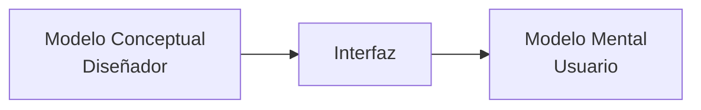
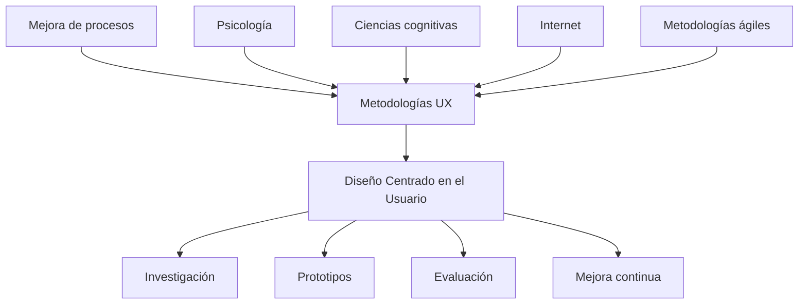

# Postulados Y Tendencias Que Convergen En Las Metodologías UX. Parte I

## Introducción

Las metodologías de **Experiencia de Usuario (UX)** no surgieron de manera aislada. Son el resultado de la evolución de múltiples disciplinas relacionadas con el diseño, la administración empresarial, la ingeniería, la psicología y la mejora continua de procesos.

A lo largo de las últimas décadas, diferentes corrientes de pensamiento han convergido para formar los métodos modernos de UX, donde el objetivo principal ya no es únicamente construir un producto funcional, sino crear productos que satisfagan las necesidades reales de las personas.

Este tema explica cómo evolucionaron estas metodologías y cómo nació el **Diseño Centrado en el Usuario (User-Centered Design, UCD)**.

---

# Evolución Histórica De Las Metodologías UX

## Origen De Las Metodologías Modernas

El transcript explica que las metodologías UX son el resultado de múltiples principios provenientes de diferentes ámbitos.

Entre ellos destacan:

- Mejora de procesos industriales japoneses.
    
- Gestión empresarial.
    
- Diseño industrial.
    
- Psicología.
    
- Ciencias cognitivas.
    
- Metodologías ágiles.
    
- Diseño centrado en las personas.

Todos estos enfoques fueron integrándose poco a poco hasta convertirse en lo que actualmente conocemos como metodologías de Experiencia de Usuario.

---

## ¿Qué Cambios Impulsaron Estas Metodologías?

Durante la segunda mitad del siglo XX las empresas comenzaron a cambiar su manera de desarrollar productos.

Antes predominaban:

- procesos largos
    
- producción lineal
    
- documentación extensa
    
- poca participación del usuario

Con el tiempo comenzaron a incorporarse nuevos conceptos:

- satisfacción del usuario
    
- emociones
    
- creatividad
    
- innovación
    
- colaboración
    
- retroalimentación continua

Todo esto terminó formando la base de los procesos UX actuales.

---

# Cambios Empresariales Entre Los Años 80 Y 90

Durante los años 80 y 90 la mayoría de industrias que producían bienes físicos enfrentaban nuevos retos.

Aunque aparecieron nuevas disciplinas, las metodologías todavía evolucionaban lentamente.

Las empresas continuaban trabajando mediante procesos tradicionales.

Características principales:

- desarrollo sequential
    
- poca iteración
    
- cambios costosos
    
- largos tiempos de producción

---

# El Cambio Radical Provocado Por Internet

El transcript menciona que **Internet cambió completamente la forma de desarrollar software**.

Antes:

- distribución mediante discos flexibles
    
- distribución mediante CD-ROM
    
- fabricación física
    
- envío del producto

Después:

- distribución completamente en línea
    
- actualizaciones inmediatas
    
- ciclos de desarrollo mucho más cortos
    
- reducción del costo de distribución

Esto permitió modificar completamente los procesos de desarrollo.

---

## Consecuencias Del Internet Sobre UX

La llegada de Internet provocó varios cambios importantes.

### Desarrollo Más Rápido

Los productos digitales podían actualizarse continuamente.

Ya no era necesario esperar meses para publicar nuevas versiones.

---

### Clientes Más Exigentes

Los usuarios comenzaron a esperar:

- mayor calidad
    
- menos errores
    
- interfaces intuitivas
    
- rapidez
    
- mejoras constantes

Las empresas tuvieron que adaptarse.

---

### Ciclos Iterativos

En lugar de desarrollar un producto durante años, comenzaron a aparecer ciclos pequeños de mejora continua.

Esto dio origen a metodologías ágiles y a procesos iterativos de UX.

---

# Tendencias Actuales En Metodologías UX

El transcript resume varias tendencias actuales.

## Trabajo Colaborativo

Los equipos trabajan conjuntamente.

No existen departamentos completamente aislados.

Participan:

- diseñadores
    
- desarrolladores
    
- investigadores UX
    
- clientes
    
- usuarios

---

## Mayor Importancia Al Entendimiento

Las metodologías modernas prefieren:

- comunicación efectiva
    
- colaboración
    
- comprensión del problema

antes que producir enormes cantidades de documentación.

La documentación sigue siendo importante, pero ahora funciona como una herramienta de comunicación y no como el objetivo principal del proyecto.

---

## Combinación De Procesos Lineales E Iterativos

El desarrollo moderno combina ambos enfoques.

### Proceso Lineal

Permite:

- organizar fases
    
- definir entregables
    
- establecer objetivos

### Proceso Iterativo

Permite:

- probar
    
- aprender
    
- corregir
    
- mejorar continuamente

---

## Feedback Del Usuario

Uno de los principios más importantes del UX moderno.

Consiste en obtener información directamente de los usuarios para mejorar continuamente el producto.

El feedback permite descubrir:

- problemas de usabilidad
    
- dificultades
    
- necesidades reales
    
- oportunidades de mejora

Mientras más temprano se obtenga esta retroalimentación, menor será el costo de corregir errores.

---

# Metodología Centrada En El Usuario (User-Centered Design)

## Origen

El transcript sitúa su nacimiento durante la década de los años 50 dentro del:

- diseño industrial
    
- diseño militar

Su objetivo inicial era comprender mejor las necesidades reales de quienes utilizarían los productos.

---

# Henry Dreyfuss

Uno de los principales pioneros del Diseño Centrado en el Usuario.

En 1955 publicó:

**Design for People**

Este libro ayudó a popularizar la idea de que el diseño debía construirse pensando primero en las personas.

---

## Aportes Principales

Henry Dreyfuss estudiaba:

- forma
    
- tamaño
    
- proporciones
    
- color
    
- ergonomía
    
- forma de uso

Su enfoque no consistía únicamente en fabricar objetos.

También analizaba:

- cómo eran percibidos
    
- cómo eran utilizados
    
- qué dificultades encontraban los usuarios

Este cambio representó uno de los primeros enfoques formales de diseño centrado en las personas.

---

# Ejemplo: Teléfono Modelo 500

El transcript utilize el teléfono Modelo 500 como ejemplo de diseño centrado en el usuario.

Cada decisión fue tomada pensando en mejorar la experiencia del usuario.

|Característica|Objetivo|
|---|---|
|Patas del teléfono|Evitar que se corte la llamada cuando el teléfono se voltea.|
|Cuerpo semirrectangular|Evitar que el teléfono gire al sostenerlo.|
|Distancia entre micrófono y auricular|Basada en el promedio de más de 2000 rostros humanos para mejorar la ergonomía.|
|Letras y números en bajo relieve|Reducir el desgaste provocado por el uso continuo.|
|Cordón extensible|Evitar enredos y adaptarse a diferentes distancias.|

Este ejemplo demuestra cómo el diseño considera el comportamiento real del usuario y no únicamente la apariencia del producto.

---

# Donald Norman Y El Diseño Centrado En El Usuario

Durante los años 80, **Donald Norman**, professor de Northwestern University y cofundador del Nielsen Norman Group, popularizó el término **User-Centered Design (UCD)**.

El UCD comenzó a utilizarse como un marco formal para:

- investigación
    
- diseño
    
- evaluación de interfaces
    
- desarrollo de productos digitales

---

# Los Tres Conceptos De Norman

Norman explica que para comprender el diseño de interfaces deben analizarse tres elementos.

## 1. Modelo Conceptual

Es la representación del funcionamiento del sistema creada por el diseñador.

Responde a preguntas como:

- ¿Cómo debería funcionar el sistema?
    
- ¿Qué comportamiento espera el diseñador?

---

## 2. Interfaz

Es la representación visible del sistema.

Es el medio mediante el cual el usuario interactúa con el producto.

La interfaz comunica el modelo conceptual al usuario.

---

## 3. Modelo Mental

Es la representación que construye el usuario sobre el funcionamiento del sistema.

No siempre coincide con el modelo conceptual.

Mientras mayor coincidencia exista entre ambos, más fácil será utilizar el sistema.

---

# Relación Entre Los Tres Modelos

La interfaz funciona como puente entre lo que el diseñador pretende comunicar y lo que finalmente entiende el usuario.

---

# Importancia Del Modelo Mental

Cuando el modelo mental coincide con el modelo conceptual:

- disminuyen errores
    
- aumenta la facilidad de aprendizaje
    
- mejora la usabilidad
    
- el usuario necesita menos ayuda

Si ambos modelos difieren demasiado:

- aparecen confusiones
    
- errores frecuentes
    
- frustración
    
- abandono del sistema

---

# Filosofías De Diseño Según Calvache (2007)

El transcript compara el Diseño Centrado en el Usuario con otras filosofías.

## Diseño Centrado En El Diseñador

### Definición

Las decisiones dependen principalmente del criterio del diseñador.

Se assume que el diseñador sabe qué es mejor.

### Ventajas

- rapidez
    
- libertad creativa

### Desventajas

- puede ignorar necesidades reales del usuario

---

## Diseño Centrado En la Empresa

### Definición

Las decisiones se toman considerando principalmente los objetivos organizacionales.

El sitio refleja la estructura de la empresa.

### Ventajas

- favorece objetivos comerciales

### Desventajas

- puede descuidar la experiencia del usuario

---

## Diseño Centrado En El Contenido

### Definición

La organización del sitio gira alrededor de la información disponible.

La navegación depende del contenido.

### Ventajas

- estructura documental sólida

### Desventajas

- puede resultar poco intuitivo para usuarios nuevos

---

## Diseño Centrado En la Tecnología

### Definición

Las decisiones se toman buscando la solución técnicamente más eficiente.

### Ventajas

- alto rendimiento
    
- innovación tecnológica

### Desventajas

- la tecnología puede imponerse sobre la facilidad de uso

---

## Diseño Centrado En El Usuario

### Definición

Integra todos los factores anteriores, pero siempre priorizando las necesidades del usuario final.

No elimina:

- negocio
    
- tecnología
    
- contenido
    
- diseño

Simplemente establece prioridades.

Cuando existe conflicto, prevalece la experiencia del usuario.

---

# Comparación De Filosofías

|Filosofía|Prioridad principal|Riesgo principal|
|---|---|---|
|Centrada en el diseñador|Creatividad del diseñador|Ignorar usuarios|
|Centrada en la empresa|Objetivos organizacionales|Mala experiencia|
|Centrada en el contenido|Información|Navegación compleja|
|Centrada en la tecnología|Tecnología|Interfaces difíciles|
|Centrada en el usuario|Necesidades del usuario|Require mayor investigación|

---

# Objetivo Principal Del Diseño Centrado En El Usuario

Según el transcript, el objetivo principal consiste en:

**Evaluar la usabilidad del diseño.**

Para lograrlo es necesario comprender:

- necesidades
    
- restricciones
    
- características
    
- comportamientos
    
- contexto de uso

Todo ello mediante procesos sistemáticos de investigación con usuarios.

---

# Relación General De Las Metodologías UX

---

# Ideas Clave Del Transcript

- Las metodologías UX surgieron de la integración de disciplinas empresariales, psicológicas y de diseño.
    
- Internet transformó completamente la forma de desarrollar software.
    
- Las metodologías actuales favorecen procesos colaborativos e iterativos.
    
- El feedback del usuario es uno de los pilares del diseño moderno.
    
- Henry Dreyfuss fue uno de los primeros diseñadores en centrar el diseño en las personas.
    
- Donald Norman formalizó el Diseño Centrado en el Usuario (UCD).
    
- El modelo conceptual, la interfaz y el modelo mental deben mantenerse alineados para lograr una buena experiencia de usuario.
    
- Existen distintas filosofías de diseño, pero el enfoque moderno prioriza al usuario sin ignorar negocio, tecnología o contenido.

# Resumen Final

## Puntos Clave

- Las metodologías UX evolucionaron gracias a cambios en la industria, la tecnología y la psicología.
    
- Internet permitió ciclos de desarrollo más rápidos e iterativos.
    
- El Diseño Centrado en el Usuario coloca las necesidades del usuario como criterio principal para la toma de decisiones.
    
- Henry Dreyfuss impulsó el diseño pensado para las personas mediante estudios ergonómicos.
    
- Donald Norman introdujo el concepto moderno de UCD y explicó la relación entre modelo conceptual, interfaz y modelo mental.
    
- Las metodologías UX modernas integran investigación, colaboración, retroalimentación continua y mejora iterativa.

## Ideas Más Importantes

- El éxito de un producto no depende únicamente de que funcione correctamente, sino de que resulte útil, comprensible y satisfactorio para el usuario.
    
- La interfaz actúa como puente entre la intención del diseñador y la comprensión del usuario.
    
- Comprender el comportamiento humano es indispensable para diseñar experiencias digitales de alta calidad.
    
- El Diseño Centrado en el Usuario no reemplaza otras filosofías de diseño; las integra, pero siempre priorizando las necesidades del usuario final.

## MicroTest 4.1

1. Metodología con un interés por complacer y adaptarse a las necesidades y exigencias de los usuarios:
    
    - La respuesta: **b. Metodología centrada en el usuario**
        
    - Justificación: El transcript indica que esta metodología nació con el objetivo de **complacer las necesidades y exigencias de los usuarios**, priorizando sus necesidades, restricciones y características durante todo el proceso de diseño. Su propósito principal es crear productos que respondan a las expectativas del usuario final y evaluar su usabilidad.
        
2. Un enfoque de la metodología centrada en el usuario donde el sitio web se diseña atendiendo a la estructura y necesidades de la empresa:
    
    - La respuesta: **d. Diseño centrado en la empresa**
        
    - Justificación: El transcript explica que en el **diseño centrado en la empresa**, el sitio web se desarrolla considerando principalmente **la estructura y las necesidades de la organización**, privilegiando los objetivos empresariales antes que otros factores.
        
3. En este enfoque de la metodología centrada en el usuario el cuerpo de la información es la base para organizar el sitio y la estructura de la navegación:
    
    - La respuesta: **a. Diseño centrado en el contenido**
        
    - Justificación: El transcript menciona que en el **diseño centrado en el contenido**, **el cuerpo de la información constituye la base para organizar el sitio web y estructurar su navegación**, es decir, la arquitectura del sitio se construye alrededor del contenido disponible.