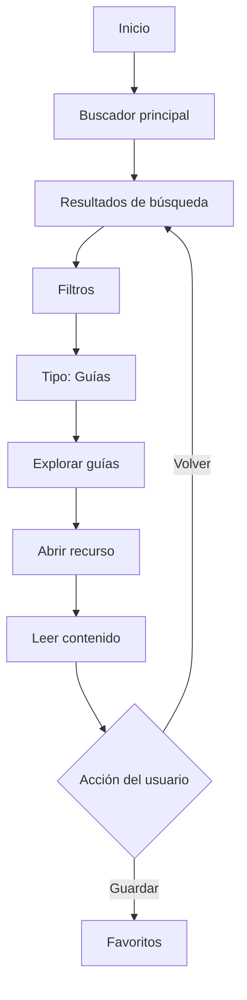
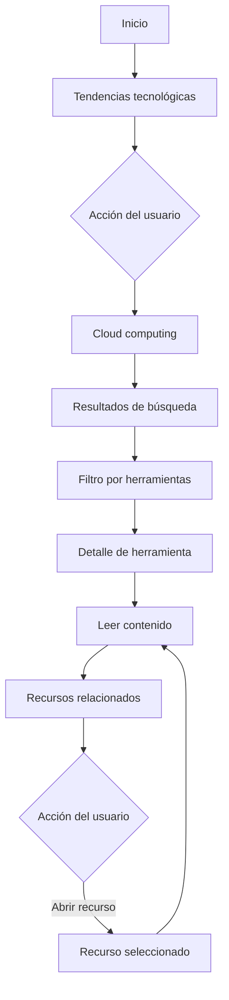
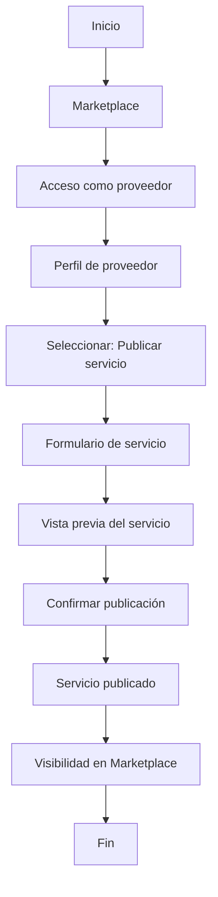

# Actividad 2. Metodologías Y Elementos Del Proceso De Diseño UX

**Universidad:** Universidad Internacional de La Rioja  
**Asignatura:** Experiencia e interfaz de usuario  
**Actividad:** Actividad 2. Metodologías y elementos del proceso de diseño UX  
**Proyecto:** UNIR Dev  
**Alumno:** Miguel de Jesús Chávez Barraan  
**Docente:** [Escribe el nombre del docente, si aplica]  
**Fecha:** [Escribe la fecha de entrega]

## 1. Introducción

El presente documento desarrolla una propuesta de diseño UX para **UNIR Dev**, una plataforma orientada a estudiantes, profesionistas de TI y proveedores tecnológicos. La propuesta busca centralizar recursos de aprendizaje, herramientas, tendencias, productos y servicios relacionados con desarrollo web y tecnologías emergentes.

Se plantea **Microsoft Learn** como plataforma de referencia para el análisis. Esta plataforma presenta características similares al propósito de UNIR Dev, como rutas formativas, módulos, contenidos tecnológicos, navegación por temas y recursos dirigidos a estudiantes, desarrolladores y profesionistas de TI.

## 2. Contexto Del Proyecto

UNIR Dev se plantea como una plataforma de apoyo para usuarios interesados en tecnología. Su finalidad es reunir recursos educativos, tendencias, herramientas, productos y servicios tecnológicos en un mismo entorno digital.

La plataforma responde a una necesidad común: los usuarios suelen consultar diferentes sitios para encontrar información confiable, comparar herramientas o descubrir proveedores. Esta dispersión hace que la búsqueda sea más lenta y menos clara.

## 2.1 Análisis De Microsoft Learn

Microsoft Learn funciona como referencia porque organiza contenidos tecnológicos mediante rutas de aprendizaje, módulos, cursos, recursos para estudiantes y rutas profesionales. También permite explorar contenidos por objetivos de aprendizaje, temas específicos y necesidades profesionales.

Los elementos más relevantes observados son:

- **Rutas de aprendizaje:** agrupan contenidos en recorridos guiados.
- **Módulos individuales:** permiten consultar temas concretos sin recorrer una ruta completa.
- **Centro para estudiantes:** concentra recursos útiles para alumnos.
- **Rutas profesionales:** conectan aprendizaje con objetivos laborales.
- **Contenido popular y reciente:** ayuda a descubrir temas relevantes.
- **Centro de Preguntas y respuestas**: 
- **Opciones de accesibilidad:** incluye tema claro, oscuro y contraste alto.

Para UNIR Dev, estos elementos se adaptan como rutas de aprendizaje, categorías tecnológicas, recursos educativos, tendencias, y perfiles de usuario con favoritos.

Figura 1: Ruta de Aprendizaje

![[Pasted image 20260622200741.png]]

Figura 2: Categoria tecnológicas 

![[Pasted image 20260622200959.png]]

Figura 3: Ruta recomendada al ingresar al perfil

![[Pasted image 20260622201357.png]]

Figura 4: Perfil

![[Pasted image 20260622201441.png]]

Figura 5: Centro de preguntas y respuestas

![[Pasted image 20260622202629.png]]

Figura 6: Accessibiliad

![[Pasted image 20260622202148.png]]

## 3. Brief Del Proyecto

### 3.1 Nombre Del Proyecto

**UNIR Dev**

### 3.2 Descripción General

La plataforma que se propone es **UNIR Dev**, orientada a estudiantes, profesionistas de TI y proveedores tecnológicos. Su objetivo es centralizar recursos, herramientas, tendencias, productos y servicios relacionados con el mundo del desarrollo y las tecnologías emergentes, apoyando la búsqueda, comparación y consulta de información.

### 3.3 Problema Que Resuelve

Con esta aplicación buscamos reducir la dispersión de información, recursos y servicios tecnológicos que existe entre varios sitios. Esta dispersión causa dificultad para comparar opciones, encontrar recursos confiables y localizar proveedores relevantes.

Además, los proveedores tecnológicos necesitan espacios donde puedan presentar sus productos y servicios a usuarios interesados en tecnología.

### 3.4 Objetivo Del Producto

El objetivo es crear una experiencia organizada y fácil de navegar que permita consultar recursos tecnológicos, descubrir tendencias recientes y conectar con productos y servicios del sector.

### 3.5 Público Objetivo

La plataforma se dirige a tres públicos principales:

- **Estudiantes de UNIR:** usuarios que buscan recursos de aprendizaje, guías, tutoriales y herramientas para fortalecer sus conocimientos.
- **Profesionistas de TI:** usuarios que desean actualizarse, comparar soluciones y consultar tendencias aplicables a su trabajo.
- **Proveedores tecnológicos:** empresas o profesionales que desean promocionar productos, servicios, capacitaciones o soluciones digitales.

### 3.6 Propuesta De Valor

UNIR Dev ofrece una experiencia centrada en descubrir, consultar y guardar recursos tecnológicos. El valor principal es reunir contenido educativo, tendencias y servicios en un mismo entorno, con una navegación sencilla y una arquitectura de información clara.

### 3.7 Alcance

El alcance inicial contempla una versión de la plataforma con las siguientes secciones:

- Página de inicio con buscador global y categorías destacadas.
- Sección de rutas de aprendizaje por tema.
- Sección de recursos educativos.
- Sección de tendencias tecnológicas.
- **Marketplace de productos y servicios.**
- Perfil de usuario con favoritos, historial y preferencias.
- Pantalla de detalle para recursos, cursos, productos o proveedores.
- Formulario de inscripción con recomendación de estudios.

### 3.8 Necesidades Principales Del Usuario

Las necesidades principales identificadas son:

- Encontrar recursos confiables sin revisar demasiados sitios.
- Consultar guías, tutoriales y herramientas recomendadas.
- Comparar herramientas, productos y servicios tecnológicos.
- Filtrar información por tema, nivel, tipo de contenido o tecnología.
- Guardar recursos para consultarlos después.
- Descubrir tendencias recientes.
- Contactar proveedores tecnológicos.

### 3.9 Supuestos De Diseño

La propuesta parte de los siguientes supuestos basándonos en la referencia de Microsoft Learn:

- Los usuarios valoran una navegación simple y categorías claras.
- Los estudiantes necesitan recursos organizados por tema y nivel.
- Los profesionistas de TI prefieren filtros rápidos y contenido aplicable a proyectos reales.
- Los proveedores requieren fichas claras para mostrar beneficios, servicios y datos de contacto.

### 3.10 Criterios De Éxito

Los criterios de éxito propuestos son:

- El usuario puede encontrar un recurso relevante en pocos pasos.
- La plataforma permite distinguir claramente recursos educativos, tendencias y servicios comerciales.
- Los filtros facilitan la búsqueda de contenido específico.
- Los usuarios pueden guardar recursos en favoritos.
- Los proveedores tienen una ficha clara con acciones de contacto visible.
- Los wireframes representan el happy path del usuario para obtener la mejor experiencia.

### 3.11 Funcionalidades Principales

Las funcionalidades principales propuestas son:

- Buscador global de recursos, herramientas, proveedores y tendencias.
- Categorías tecnológicas destacadas.
- Sección de recursos educativos.
- Marketplace de productos y servicios.
- Filtros por tema, nivel, tipo de contenido y tecnología.
- Perfil de usuario con favoritos e historial.
- Sección de recomendaciones.
- Botones de contacto para proveedores.

## 4. Público Objetivo

Definición de personas.

### 4.1 Estudiantes De UNIR

Los estudiantes necesitan una plataforma que les permita encontrar recursos confiables sobre desarrollo web y nuevas tecnologías. Este grupo valora la claridad, la organización del contenido y la posibilidad de guardar materiales para consultarlos posteriormente.

**Necesidades principales:**

- Acceder a guías y tutoriales.
- Consultar herramientas recomendadas.
- Entender tendencias tecnológicas.
- Guardar recursos para estudio posterior.

#### 4.1.1 Persona: Estudiante

**Nombre:** Andrea Martínez  
**Edad:** 28 años  
**Perfil:** estudiante de maestría relacionada con tecnología.  
**Objetivo:** encontrar recursos claros para aprender sobre desarrollo web y herramientas digitales.  
**Frustración:** la información está dispersa en muchos sitios y no siempre identifica cuáles recursos son confiables.  
**Necesidad en UNIR Dev:** contar con categorías claras, buscador, recursos recomendados y favoritos.
![[Persona_ Estudiante.png]]

### 4.2 Profesionistas De TI

Los profesionistas de TI buscan información actualizada, útil y aplicable a proyectos reales. Este grupo necesita comparar tecnologías, descubrir herramientas y encontrar servicios que puedan resolver necesidades laborales.

**Necesidades principales:**

- Comparar herramientas.
- Consultar tendencias actuales.
- Encontrar servicios especializados.
- Filtrar información de acuerdo con intereses concretos.

#### 4.2.1 Persona: Profesionista De TI

**Nombre:** Carlos Ríos  
**Edad:** 35 años  
**Perfil:** desarrollador web con interés en actualizarse.  
**Objetivo:** comparar herramientas y consultar tendencias aplicables a su trabajo.  
**Frustración:** pierde tiempo revisando diferentes fuentes para encontrar información útil.  
**Necesidad en UNIR Dev:** filtros, tarjetas comparables, recursos relacionados y búsqueda eficiente.

![[Persona_ Profesionista De TI.png]]

### 4.3 Proveedores Tecnológicos

Los proveedores requieren visibilidad ante usuarios interesados en tecnología. Para ellos, la plataforma debe ofrecer espacios claros para mostrar productos, servicios y datos de contacto.

**Necesidades principales:**

- Publicar productos o servicios.
- Mostrar beneficios.
- Captar usuarios interesados.
- Facilitar el contacto comercial.

#### 4.3.1 Persona: Proveedor Tecnológico

**Nombre:** Laura Hernández  
**Edad:** 40 años  
**Perfil:** representante de una empresa de servicios cloud.  
**Objetivo:** promocionar servicios tecnológicos ante una audiencia interesada.  
**Frustración:** le cuesta llegar a usuarios especializados.  
**Necesidad en UNIR Dev:** perfil de proveedor, catálogo de servicios y acciones de contacto visible.

![[Persona_ Proveedor Tecnológico.png]]

## 5. Objetivos De la Interfaz

Los objetivos UX definidos para la propuesta son los siguientes:

1. Facilitar la búsqueda de recursos tecnológicos en pocos pasos.
2. Organizar la información mediante categorías comprensibles.
3. Permitir la exploración de tendencias, herramientas y servicios.
4. Reducir la carga cognitiva del usuario mediante una interfaz clara.
5. Ofrecer filtros útiles para encontrar información específica.
6. Permitir guardar recursos mediante una sección de favoritos.
7. Facilitar el contacto con proveedores tecnológicos.
8. Mantener una navegación consistente en todas las pantallas.

## 6. Arquitectura De Información

La arquitectura de información propuesta organiza la plataforma en siete secciones principales: Inicio, Rutas de aprendizaje, Recursos tecnológicos, Marketplace, Tendencias, Perfil y Contacto.

```text
UNIR Dev
|
|-- Inicio
|   |-- Buscador principal
|   |-- Categorías destacadas
|   |-- Recomendaciones
|   |-- Tendencias recientes
|
|-- Rutas de aprendizaje
|   |-- Desarrollo web
|   |-- Inteligencia artificial
|   |-- Nube y datos
|   |-- Ciberseguridad
|   |-- DevOps
|
|-- Recursos tecnológicos
|   |-- Guías
|   |-- Tutoriales
|   |-- Cursos recomendados
|   |-- Herramientas
|   |-- Artículos
|
|-- Marketplace
|   |-- Productos
|   |-- Servicios
|   |-- Proveedores destacados
|   |-- Comparador de soluciones
|
|-- Tendencias
|   |-- Temas populares
|   |-- Contenido nuevo
|   |-- Recomendaciones por perfil
|
|-- Perfil
|   |-- Mis favoritos
|   |-- Historial
|   |-- Preferencias
|   |-- Alertas
|
|-- Contacto
    |-- Formulario
    |-- Soporte
    |-- Información institucional
```

La arquitectura se divide según las principales necesidades de los usuarios. La sección de recursos atiende a estudiantes que buscan aprendizaje. La sección de tendencias tecnológicas permite explorar temas actuales. El marketplace separa los productos y servicios comerciales para evitar mezclarlos con contenido educativo. La sección de perfil permite personalizar la experiencia mediante favoritos, historial, progreso y preferencias.

Esta organización facilita la navegación porque cada sección tiene un propósito claro y reduce la posibilidad de que el usuario se pierda dentro de la plataforma.

## 7. Estrategia De Navegación Y Experiencia De Usuario

Para mantener el interés del usuario y facilitar la navegación, se proponen los siguientes elementos de interfaz:

- **Menú superior fijo:** permite acceder a las secciones principales desde cualquier pantalla.
- **Buscador global:** facilita la búsqueda directa de recursos, servicios o tendencias.
- **Categorías destacadas:** ayudan al usuario a explorar sin necesidad de conocer términos específicos.
- **Filtros laterales:** permiten ordenar resultados por tipo, nivel, tecnología o proveedor cuando lo require.
- **Tarjetas de contenido:** muestran información resumida y acciones claras.
- **Favoritos:** permiten guardar recursos importantes.
- **Recomendaciones:** sugieren contenidos relacionados con los intereses del usuario.
- **Migas de pan:** ayudan a entender la ubicación dentro del sitio.
- **Botones de acción claros:** guían al usuario hacia acciones como ver, guardar o contactar.

Esta estrategia busca que la experiencia sea comprensible, eficiente y útil para los distintos tipos de usuarios.

### 7.1 Flujo Para Estudiante



Este flujo permite que un estudiante encuentre rápidamente una guía o tutorial y lo guarde para consultarlo después.

### 7.2 Flujo Para Profesionista De TI



Este flujo facilita la exploración de tecnologías actuales y permite revisar contenidos relacionados con una necesidad professional.

### 7.3 Flujo Para Proveedor



Este flujo permite que un proveedor publique o presente sus servicios ante usuarios interesados en soluciones tecnológicas.

## 8. Wireframes

### 8.1 Pantalla De Inicio

**Objetivo de la pantalla:** presentar la plataforma, permitir búsqueda rápida y mostrar categorías principales.

**Elementos principales:**

- Logo de UNIR Dev.
- Menú principal.
- Buscador global.
- Categorías destacadas.
- Recomendaciones.
- Tendencias recientes.
![[Low-Wireframe_ Inicio - UNIR Dev.png]]
![[Wireframe_ Inicio - UNIR Dev.png]]

### 8.2 Pantalla De Búsqueda O Filtrado

**Objetivo de la pantalla:** permitir que el usuario refine resultados por tema, nivel, tipo de contenido o tecnología.

**Elementos principales:**

- Buscador dentro de la categoría.
- Filtros laterales.
- Lista de resultados.
- Tarjetas de recursos o servicios.
- Botón para guardar o ver detalle.
![[Low-Wireframe_ Resultados - UNIR Dev.png]]
![[Wireframe_ Resultados - UNIR Dev.png]]

### 8.3 Pantalla De Detalle De Recurso, Curso, Producto O Servicio

**Objetivo de la pantalla:** mostrar información completa y acciones claras.

**Elementos principales:**

- Título del recurso o servicio.
- Categoría.
- Author o proveedor.
- Descripción.
- Beneficios principales.
- Botón de guardar en favoritos.
- Recursos relacionados.
![[Low-Wireframe_ Detalle - UNIR Dev.png]]
![[Wireframe_ Detalle - UNIR Dev.png]]

### 8.4 Pantalla De Rutas De Aprendizaje

**Objetivo de la pantalla:** organizar contenidos por recorridos temáticos similares a la lógica observada en Microsoft Learn.

**Elementos principales:**

- Lista de rutas por tema.
- Nivel sugerido.
- Duración estimada.
- Módulos o recursos incluidos.
- Progreso del usuario.

![[Low-Wireframe_ Ruta de Aprendisaje- UNIR Dev.png]]

![[Wireframe_ Ruta de Aprendisaje- UNIR Dev.png]]

### 8.5 Pantalla De Perfil De Usuario

**Objetivo de la pantalla:** Mostrar el usuario y habilitar sus settings de configuración también le permite ver su progreso y todas sus recursos tanto como guardados como en progreso y una sección de actividad.

**Elementos principales:**

- Botón de editar perfil
- Sección de Mis Recursos guardados
- Sección de Recomendado para ti
- Sección de Actividad 
- Tarjetas seleccionables al contenido 

![[Low-Wireframe_ Perfil - UNIR Dev.png]]

![[Wireframe_ Perfil - UNIR Dev.png]]

### 8 .6 Pagina De Registro De Estudiante

![[Low-Wireframe_ Registro de Estudiante - UNIR Dev.png]]

![[Wireframe_ Registro de Estudiante - UNIR Dev.png]]

#### 8 .7 Pagina De Marketplace

![[Low-Wireframe_ Marketplace - Exploración.png]]

![[Wireframe_ Marketplace - Exploración.png]]

#### 8.8 Registrar Nuevo Servico

![[Low-Wireframe_ Publicar Servicio.png]]

![[Wireframe_ Publicar Servicio.png]]

## 9. Justificación De la Propuesta

La propuesta se enfoca en una experiencia simple, ordenada y orientada a la búsqueda de información tecnológica. La arquitectura de información permite separar recursos educativos, tendencias y servicios comerciales, evitando que el usuario se pierda entre contenidos de distinta naturaleza.

El uso de tarjetas, filtros y buscador global facilita la exploración. Además, la opción de guardar recurso aporta valor para estudiantes y profesionistas que desean guardar recursos para consultarlos después.

La referencia de Microsoft Learn ayuda a justificar la organización por rutas, temas y módulos, mientras que UNIR Dev adapta esa lógica a un contexto que también incluye marketplace y proveedores tecnológicos.

## 10. Conclusiones

El diseño propuesto para UNIR Dev responde a las necesidades de sus principales públicos: estudiantes, profesionistas de TI y proveedores tecnológicos. La interfaz se organiza mediante una arquitectura clara, una navegación sencilla y pantallas principales que permiten buscar, filtrar, consultar, guardar y contactar.

Microsoft Learn sirve como referencia para comprender cómo una plataforma tecnológica puede organizar contenidos de aprendizaje y guiar al usuario mediante rutas, módulos y categorías. A partir de ese análisis, UNIR Dev puede proponer una experiencia propia enfocada en recursos educativos, tendencias tecnológicas y servicios especializados.

## 11. Referencias

- Microsoft Learn. (2026). **Aprendizaje: cursos, rutas de aprendizaje, módulos**. [https://learn.microsoft.com/es-es/training/](https://learn.microsoft.com/es-es/training/)
- Microsoft Learn. (2026). **Examinar todos los cursos, rutas de aprendizaje y módulos**. [https://learn.microsoft.com/es-es/training/browse/](https://learn.microsoft.com/es-es/training/browse/)
- Microsoft Learn. (2026). **Explore las rutas profesionales de Microsoft Learn**. [https://learn.microsoft.com/es-es/training/career-paths/](https://learn.microsoft.com/es-es/training/career-paths/)
