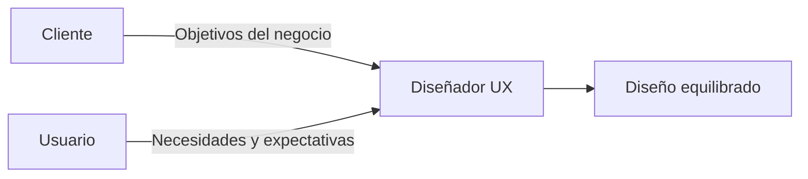
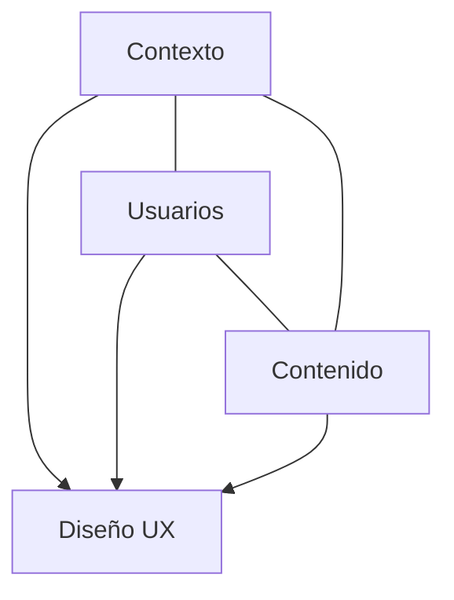
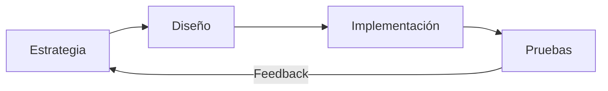
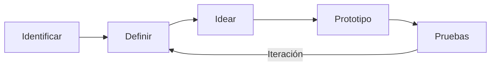
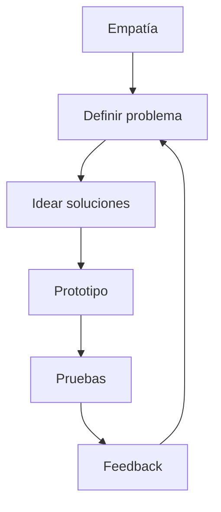

# T04.02. Postulados Y Tendencias Que Convergen En Las Metodologías UX. Parte II

## Introducción

Las metodologías modernas de **Experiencia de Usuario (UX)** continúan evolucionando integrando conceptos provenientes de la psicología, el diseño, la innovación y la ingeniería. En esta segunda parte se profundiza en cómo el diseño UX busca equilibrar la **razón** y la **emoción**, presenta el modelo de los **Círculos de Morville**, diferencia la **UX de la usabilidad**, explica los **siete atributos de una buena experiencia de usuario**, revisa la **toma de decisiones lineal e iterativa** y concluye con el **Design Thinking** como metodología para resolver problemas de manera creativa.

---

# UX Como Integración Entre Razón Y Emoción

## ¿Qué Busca El Diseño UX?

El diseño de Experiencia de Usuario tiene como objetivo principal establecer una **relación armoniosa entre la tecnología y las personas**.

No basta con que un sistema funcione correctamente desde un punto de vista técnico. También debe generar:

- satisfacción
    
- confianza
    
- facilidad de uso
    
- emociones positivas
    
- valor para el usuario

El diseño UX intenta equilibrar dos dimensions:

- **Razón:** aspectos funcionales, eficiencia, cumplimiento de objetivos y resolución de problemas.
    
- **Emoción:** percepciones, sentimientos, confianza, satisfacción y conexión emocional con el producto.

Una experiencia exitosa combina ambas dimensions.

---

## La Dificultad De Medir Las Emociones

El transcript menciona que uno de los mayores desafíos del UX consiste en medir:

- emociones
    
- percepciones
    
- valoraciones del usuario

Esto ocurre porque:

- las emociones cambian entre personas;
    
- un mismo diseño puede generar reacciones distintas;
    
- las valoraciones son subjetivas e incluso inconsistentes.

Por ello, el proceso de UX require múltiples iteraciones y pruebas con usuarios reales.

---

# El Diseñador UX Como Mediador

El diseñador UX no trabaja únicamente para el cliente ni exclusivamente para el usuario.

Su función consiste en actuar como un **mediador** entre ambos.

Debe equilibrar:

|Cliente|Usuario|
|---|---|
|Objetivos del negocio|Necesidades reales|
|Comunicación de la marca|Facilidad de uso|
|Funcionalidad requerida|Experiencia satisfactoria|
|Restricciones del proyecto|Accesibilidad y usabilidad|

El éxito del proyecto depende de encontrar un equilibrio entre ambas perspectivas.

---

---

# Los Círculos De Morville (2004)

## ¿Quién Fue Peter Morville?

Peter Morville es uno de los principales especialistas en:

- Arquitectura de la Información.
    
- Experiencia de Usuario.
    
- Organización del contenido.

Fue fundador de **Semantic Studios** y desde la década de 1990 ha trabajado desarrollando metodologías relacionadas con la arquitectura de información.

Inicialmente diseñó este modelo para Arquitectura de Información, pero posteriormente se observó que también explicaba muy bien el proceso de UX.

---

## Los Tres Círculos De Morville

El modelo propone que todo proyecto UX depende de la interacción entre tres elementos.

- Contexto
    
- Usuarios
    
- Contenido

---

## Contexto

Representa todas las condiciones donde se utilizará el producto.

Incluye:

- entorno
    
- dispositivos
    
- restricciones
    
- cultura
    
- negocio
    
- objetivos organizacionales

---

## Usuarios

Representa:

- necesidades
    
- comportamientos
    
- habilidades
    
- expectativas
    
- limitaciones

Todo el diseño debe adaptarse a ellos.

---

## Contenido

Incluye toda la información que ofrecerá el sistema.

Debe responder preguntas como:

- ¿Qué información necesita el usuario?
    
- ¿Cómo debe organizarse?
    
- ¿Cómo facilitar su comprensión?

---

## Flexibilidad Del Modelo

El transcript enfatiza que las decisiones de diseño **no son rígidas**.

Cada proyecto cambia dependiendo de:

- contexto
    
- usuarios
    
- contenido

Por ello los diseñadores deben abandonar procesos completamente rígidos.

---

# UX Más Allá De la Usabilidad

Peter Morville observó que la experiencia de usuario es un concepto mucho más amplio que la simple usabilidad.

## Usabilidad

Se refiere principalmente a:

- facilidad de uso
    
- eficiencia
    
- eficacia
    
- cumplimiento de tareas

## Experiencia De Usuario

Además de la usabilidad incorpora:

- emociones
    
- confianza
    
- accesibilidad
    
- valor
    
- atractivo visual
    
- credibilidad
    
- utilidad

Por tanto:

> Una interfaz puede set usable sin ofrecer una excelente experiencia de usuario.

---

# El Panal De Morville (User Experience Honeycomb)

Para explicar esta diferencia, Morville desarrolló el conocido **Honeycomb UX**, compuesto por siete atributos.

---

## 1. Útil (Useful)

### Definición

El producto debe resolver una necesidad real.

No debe desarrollarse una función únicamente porque sea técnicamente possible.

Debe responder a un problema concreto del usuario.

### Importancia

Si el producto no resulta útil, ninguna otra característica compensará esa deficiencia.

---

## 2. Usable (Usable)

### Definición

Capacidad del sistema para permitir que el usuario alcance sus objetivos:

- eficazmente
    
- eficientemente
    
- con facilidad

### Importancia

Una interfaz complicada incrementa errores y frustración.

Sin embargo, el transcript recalca que la usabilidad **es necesaria, pero no suficiente**.

---

## 3. Deseable (Desirable)

### Definición

Busca generar una respuesta emocional positiva mediante:

- identidad visual
    
- estética
    
- marca
    
- diseño gráfico

### Importancia

Los usuarios desarrollan preferencias emocionales hacia productos visualmente atractivos.

---

## 4. Encontrable (Findable)

### Definición

El usuario debe localizar fácilmente:

- contenido
    
- funciones
    
- opciones
    
- información

### Importancia

Una mala organización obliga al usuario a buscar demasiado.

---

## 5. Accessible (Accessible)

### Definición

El producto debe poder utilizarse por personas con discapacidad.

El transcript menciona ejemplos como:

- personas invidentes
    
- personas sordas
    
- personas con daltonismo
    
- otras discapacidades

### Importancia

La accesibilidad permite incluir a toda la población.

Además suele mejorar la experiencia para todos los usuarios.

---

## 6. Creíble (Credible)

### Definición

El usuario debe confiar en:

- la información
    
- el sistema
    
- la empresa
    
- el funcionamiento del producto

### Importancia

La confianza determina si el usuario continuará utilizando el sistema.

---

## 7. Valioso (Valuable)

### Definición

El producto debe aportar valor.

Puede hacerlo de distintas maneras.

### Empresas Con Fines De Lucro

Debe contribuir a:

- ingresos
    
- productividad
    
- cumplimiento de objetivos

### Organizaciones Sin Fines De Lucro

Debe ayudar a cumplir:

- misión
    
- impacto social
    
- objetivos institucionales

---

# Tabla Resumen Del Panal De Morville

|Atributo|Objetivo principal|
|---|---|
|Útil|Resolver necesidades reales|
|Usable|Facilitar el uso|
|Deseable|Generar atracción emocional|
|Encontrable|Facilitar la localización de información|
|Accessible|Permitir el uso a cualquier persona|
|Creíble|Generar confianza|
|Valioso|Aportar beneficios al usuario y a la organización|

---

# Toma De Decisiones Lineales E Iterativas

El transcript retoma el modelo de Garrett.

Explica dos perspectivas complementarias.

---

## Tiempo (Proceso lIneal)

Las decisiones avanzan desde:

- estrategia
    
- alcance
    
- estructura
    
- esqueleto
    
- superficie

Cada nivel añade mayor nivel de detalle.

---

## Descubrimiento (Proceso iTerativo)

No siempre se avanza en una sola dirección.

Durante el diseño es común:

- regresar
    
- modificar
    
- replantear
    
- corregir

Cada descubrimiento puede afectar decisiones tomadas anteriormente.

---

---

# Design Thinking (Pensamiento dE Diseño)

## Definición

El Design Thinking es una metodología enfocada en resolver problemas de forma:

- creativa
    
- colaborativa
    
- centrada en las personas

El transcript también lo denomina:

> Pensamiento fuera de la caja.

Busca encontrar soluciones innovadoras comprendiendo profundamente al usuario.

---

## Empresas Que Utilizan Design Thinking

El transcript menciona como ejemplos:

- Apple
    
- Google
    
- General Electric

Además señala que numerosas universidades ya enseñan esta metodología.

---

# Etapas Del Design Thinking

El transcript presenta cinco etapas.

---

## 1. Identificar

Se investiga al usuario.

Se observa:

- contexto
    
- necesidades
    
- comportamientos

---

## 2. Definir

Se formula correctamente el problema.

No únicamente se describen síntomas.

Se intenta descubrir la verdadera causa.

---

## 3. Idear

Se generan múltiples soluciones.

No se busca la primera respuesta.

Se fomenta el pensamiento creativo.

---

## 4. Prototipo

Se construyen representaciones del producto.

Pueden set:

- bocetos
    
- wireframes
    
- prototipos interactivos

---

## 5. Pruebas

Los usuarios utilizan el prototipo.

Se obtiene retroalimentación.

Posteriormente se vuelve a iterar.

---

# Características Del Design Thinking

## Proceso Iterativo

Las etapas no son completamente secuenciales.

Puede avanzarse y retrocederse continuamente.

---

## Desafiar Supuestos

Uno de los principios fundamentales consiste en cuestionar:

- ideas preconcebidas
    
- soluciones tradicionales
    
- patrones automáticos de pensamiento

Esto permite descubrir alternativas innovadoras.

---

## Empatía

La comprensión profunda del usuario constituye el centro del proceso.

Implica estudiar:

- emociones
    
- motivaciones
    
- necesidades
    
- comportamientos
    
- contexto

---

## Comprensión Holística

El transcript enfatiza que el análisis debe set integral.

Debe combinar:

### Comprensión Empática

- emociones
    
- impulsos
    
- motivaciones

### Investigación Analítica

- evidencia
    
- observación
    
- análisis racional

El resultado es una comprensión mucho más completa del problema.

---

# Relación Entre UX Y Design Thinking

---

# Ideas Clave Del Transcript

- El diseño UX busca equilibrar la razón y las emociones del usuario.
    
- El diseñador UX actúa como mediador entre los objetivos del cliente y las necesidades del usuario.
    
- Los Círculos de Morville establecen que el diseño depende del contexto, los usuarios y el contenido.
    
- La experiencia de usuario es más amplia que la usabilidad.
    
- El Panal de Morville define siete atributos fundamentales: útil, usable, deseable, encontrable, accessible, creíble y valioso.
    
- Las decisiones en UX combinan procesos lineales con procesos iterativos.
    
- El Design Thinking es una metodología centrada en las personas para resolver problemas mediante empatía, creatividad e iteración.

# Resumen Final

## Puntos Clave

- UX integra factores racionales y emocionales para ofrecer experiencias satisfactorias.
    
- El diseñador UX debe equilibrar los intereses del negocio con las necesidades del usuario.
    
- El modelo de Morville amplía el concepto de usabilidad incorporando siete atributos esenciales para una experiencia completa.
    
- El diseño moderno utilize ciclos iterativos donde el feedback permite mejorar continuamente el producto.
    
- El Design Thinking promueve la empatía, la creatividad y la experimentación para resolver problemas complejos.

## Ideas Más Importantes

- Una buena experiencia de usuario no depende únicamente de la facilidad de uso; también require utilidad, accesibilidad, credibilidad, valor y una conexión emocional positiva.
    
- El proceso de UX es flexible y evoluciona conforme se obtiene nueva información sobre el usuario y el contexto.
    
- El Design Thinking no busca encontrar rápidamente una solución, sino comprender profundamente el problema para generar alternativas innovadoras y validadas mediante prototipos y pruebas.

## MicroTest 4.2

1. Es una tendencia dentro del mundo del diseño, con una series de técnicas para resolver problemas de manera creativa e innovadora:
    
    - La respuesta: **c. Pensamiento del diseño**
        
    - Justificación: En el transcript se explica que el **Pensamiento del diseño (Design Thinking)** es una tendencia actual en el mundo del diseño que emplea un conjunto de técnicas para resolver problemas de forma creativa e innovadora. Además, se menciona que empresas como Apple, Google y General Electric lo utilizan y que se basa en la empatía, la iteración, la redefinición de problemas y la generación de soluciones innovadoras.
        
2. Confiar en que el producto haga lo que tiene que hacer o que posea el contenido que debe tener corresponde a la siguiente característica:
    
    - La respuesta: **c. Creíble**
        
    - Justificación: El transcript, al explicar los **siete atributos de la experiencia de usuario de Peter Morville**, indica que una experiencia debe set **creíble**, es decir, el usuario debe confiar en que el producto funciona correctamente y que el contenido presentado es verdadero, confiable y cumple con lo prometido.
        
3. Se refiere a la capacidad y atributos del producto que permite a los usuarios alcanzar su objetivo de manera eficiente y efectiva; la facilidad de uso es básica, pero no suficiente:
    
    - La respuesta: **c. Usable**
        
    - Justificación: El atributo **Usable** hace referencia a la **usabilidad** del producto, es decir, a que los usuarios puedan cumplir sus objetivos de manera eficiente, efectiva y con facilidad. El transcript enfatiza que la facilidad de uso es un requisito fundamental, aunque por sí sola no garantiza una experiencia de usuario completa.