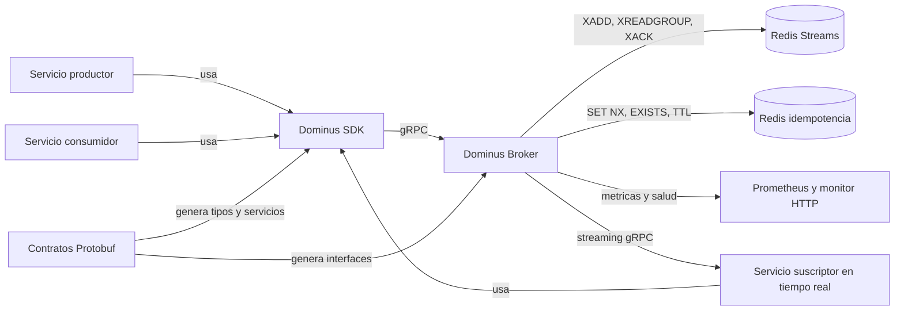
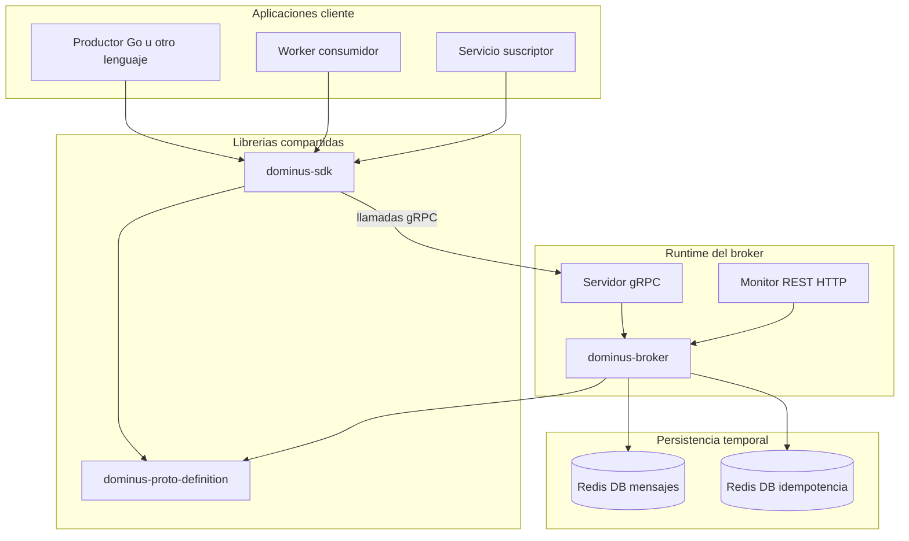
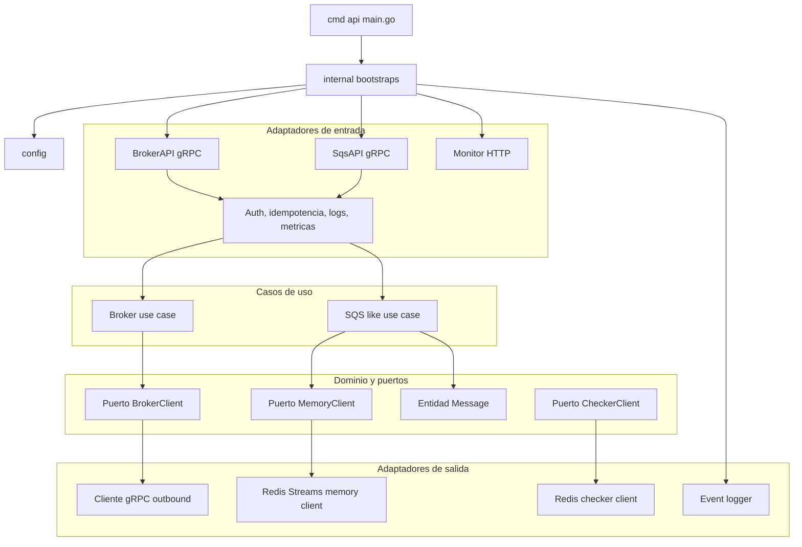
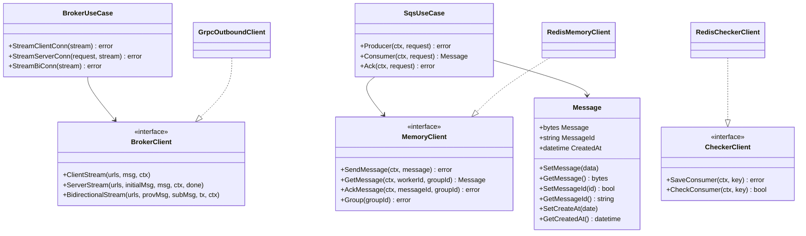
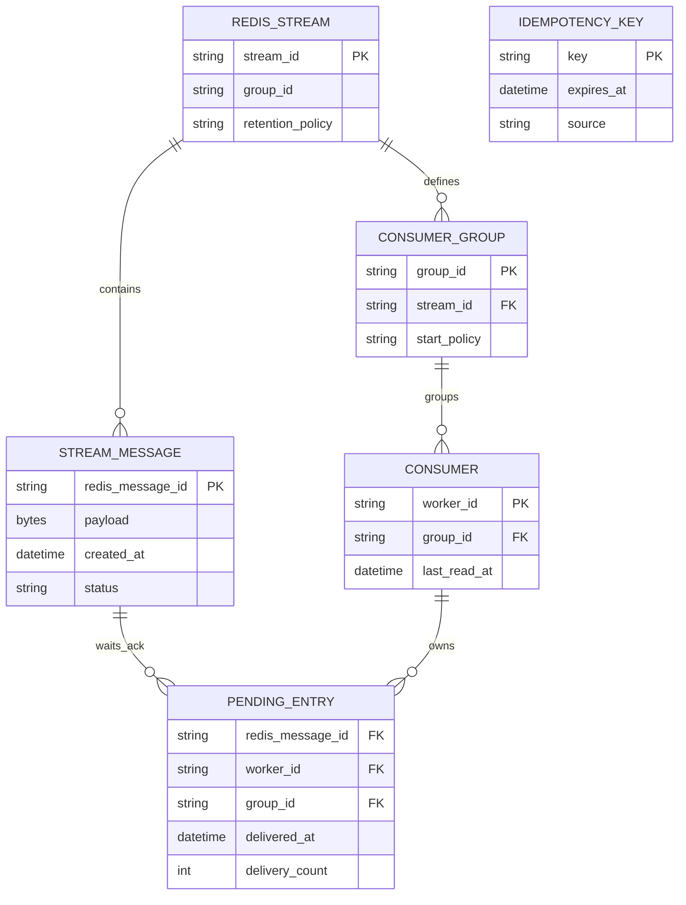
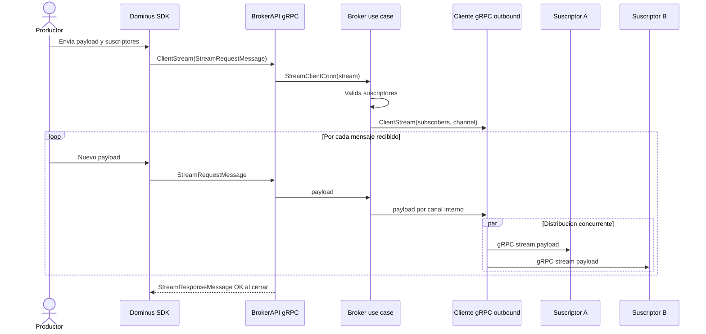
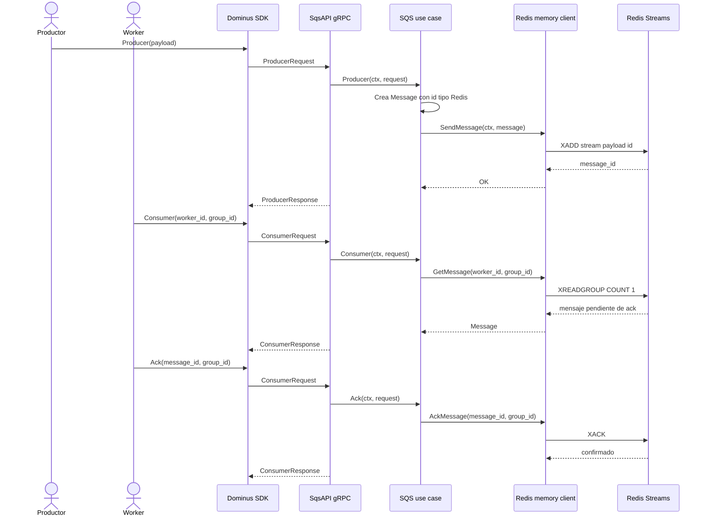
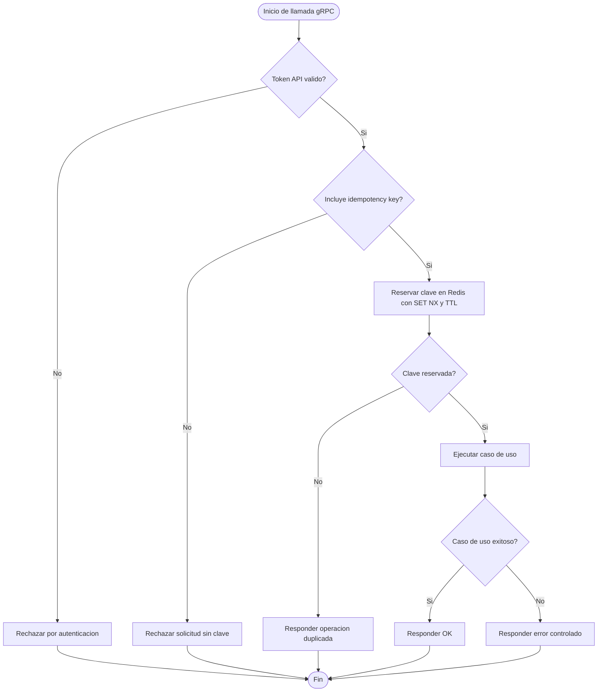
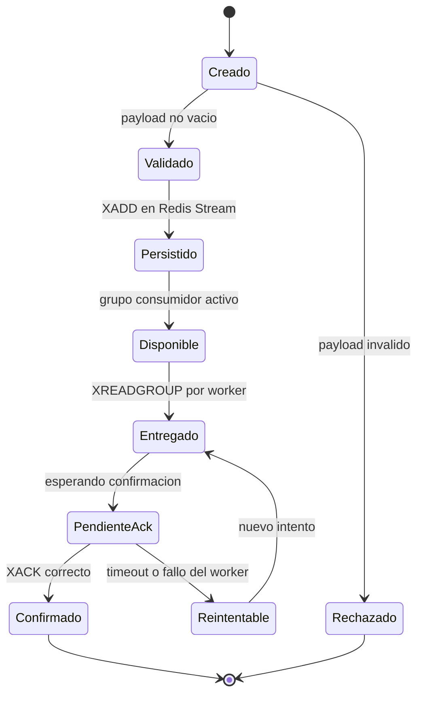
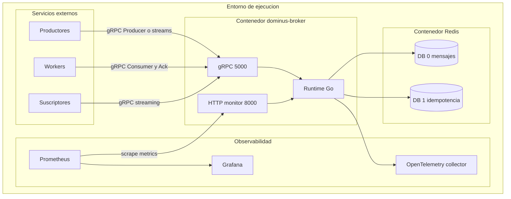

# Diagramas UML para el diseño arquitectónico de Dominus Broker

## Resumen

Este documento complementa la actividad de metodología y arquitectura mediante una propuesta de diagramas UML y vistas arquitectónicas en Mermaid. El objetivo no es afirmar que todas las piezas ya estén terminadas como producto final, sino representar cómo se implementaría la solución tomando como base el estado actual del proyecto Dominus: un broker de mensajería híbrido que combina comunicación en tiempo real mediante gRPC, mensajería asíncrona con Redis Streams, contratos Protobuf y un SDK para reducir la complejidad de integración en los clientes.

En esta fase de diseño, los diagramas permiten razonar antes de programar. Sirven para separar responsabilidades, detectar dependencias innecesarias, revisar la persistencia, entender los flujos de mensajes y explicar de forma visual por qué la arquitectura propuesta puede evolucionar hacia una implementación mantenible.

## Alcance de la propuesta

La solución se plantea como un prototipo académico de broker híbrido. No se presenta como sustituto directo de plataformas maduras como Kafka, RabbitMQ o NATS, sino como una arquitectura de estudio que integra dos necesidades frecuentes en sistemas distribuidos:

- Comunicación inmediata entre servicios mediante streams gRPC.
- Comunicación desacoplada mediante una cola temporal basada en Redis Streams.
- Control básico de duplicados mediante claves de idempotencia en Redis.
- Contratos compartidos mediante Protobuf.
- SDK para facilitar la integración de productores, consumidores y suscriptores.
- Observabilidad mediante health checks, métricas y trazas.

La arquitectura toma como referencia una separación limpia por capas. El dominio define las entidades y los puertos; la capa de aplicación coordina los casos de uso; la infraestructura implementa gRPC, Redis, seguridad, métricas y monitoreo; y el arranque del sistema conecta todas las piezas.

## Utilidad de los diagramas en la fase de diseño

Los diagramas aportan valor porque reducen ambigüedad. En un broker de mensajería, no basta con decir que "hay productores, consumidores y un broker". Es necesario ver qué componente recibe el mensaje, qué capa decide el caso de uso, dónde se guarda el evento, cómo se confirma el procesamiento, qué ocurre ante duplicados y qué servicios quedan protegidos por contratos.

En este trabajo se usan varios tipos de diagramas porque cada uno responde una pregunta distinta. Los diagramas de componentes explican la estructura. Los diagramas de clases muestran las entidades e interfaces principales. Los diagramas de secuencia describen el orden de interacción entre actores. Los diagramas de actividad ayudan a entender decisiones y ramas. Los diagramas de estado muestran el ciclo de vida de un mensaje. El diagrama de persistencia aclara cómo Redis participa en la solución sin convertirlo en el dueño de la lógica de negocio.

## Inventario de diagramas

| Número | Tipo | Propósito |
|---|---|---|
| Figura 1 | Contexto del sistema | Ubicar usuarios técnicos, repositorios y sistemas externos. |
| Figura 2 | Contenedores | Mostrar las aplicaciones principales y sus responsabilidades. |
| Figura 3 | Componentes internos | Explicar las capas del broker. |
| Figura 4 | Clases | Modelar dominio, puertos y casos de uso. |
| Figura 5 | Persistencia | Diseñar la capa de Redis Streams e idempotencia. |
| Figura 6 | Secuencia | Describir fan-out en tiempo real. |
| Figura 7 | Secuencia | Describir cola asíncrona con Producer, Consumer y Ack. |
| Figura 8 | Actividad | Mostrar la decisión de idempotencia. |
| Figura 9 | Estados | Representar el ciclo de vida del mensaje asíncrono. |
| Figura 10 | Despliegue | Proponer la distribución futura en contenedores. |

## Figura 1

### Contexto general del sistema

Este diagrama ubica Dominus Broker dentro del ecosistema completo. El broker recibe mensajes desde servicios productores, los distribuye a consumidores o suscriptores y utiliza Redis como soporte de persistencia temporal. El SDK y el repositorio de contratos Protobuf reducen el acoplamiento entre clientes y servidor.

El aporte principal de esta vista es que separa la arquitectura conceptual de la implementación interna. También deja claro que Protobuf no es un detalle secundario, sino el contrato que permite que broker y SDK hablen el mismo idioma.

## Figura 2

### Vista de contenedores

La vista de contenedores muestra las piezas ejecutables o versionables que formarían la solución. Esta división ayuda a planificar repositorios, responsabilidades de despliegue y puntos de integración.

Esta vista aporta una lectura práctica para el desarrollo futuro. Permite ver qué se versiona por separado, qué se ejecuta en producción y qué componentes son apoyo operativo.

## Figura 3

### Componentes internos del broker

Este diagrama representa el broker con una arquitectura limpia o hexagonal. La capa de aplicación depende de puertos, no de detalles concretos de Redis o gRPC. La infraestructura implementa adaptadores.

El valor de esta figura está en la dirección de dependencias. Si el diseño se implementa de esta manera, los casos de uso pueden probarse con mocks y no quedan atados a Redis, fasthttp o gRPC.

## Figura 4

### Diagrama de clases del dominio y casos de uso

El modelo de clases se centra en las entidades, puertos y servicios de aplicación que aparecen en el broker actual. La entidad `Message` mantiene el identificador, el payload y la fecha de creación. Los puertos abstraen Redis y las conexiones gRPC de salida.

Este diagrama ayuda a revisar si las clases principales son suficientes para la primera versión. También muestra una oportunidad clara: el control de idempotencia existe como puerto, pero se ejecuta como preocupación transversal en middleware.

## Figura 5

### Capa de persistencia

La persistencia de Dominus no se plantea como una base de datos transaccional tradicional. Redis se usa como memoria intermedia: una base lógica para mensajes y otra para claves de idempotencia. Esta separación evita mezclar el ciclo de vida del mensaje con el control de duplicados.

Aunque Redis no se modela exactamente como una base relacional, esta vista ERD sirve para explicar la persistencia desde la lógica del sistema. El equipo puede ver qué datos existen, quién los consume y cuándo dejan de ser necesarios.

## Figura 6

### Secuencia de fan-out en tiempo real

Este flujo representa el envío de un mensaje desde un productor hacia varios suscriptores usando gRPC streaming. El broker valida la solicitud, obtiene la lista de suscriptores y delega la distribución al cliente gRPC de salida.

Este diagrama aporta claridad sobre el patrón fan-out. El productor no necesita llamar directamente a cada suscriptor; el broker concentra esa responsabilidad.

## Figura 7

### Secuencia de cola asíncrona con Producer, Consumer y Ack

Este flujo representa la cara asíncrona de la solución. El productor guarda un mensaje en Redis Streams. El consumidor lo solicita mediante un modelo pull y confirma el procesamiento con `Ack`.

Este diagrama es central para la capa de persistencia. Permite explicar que Redis conserva temporalmente el mensaje hasta que un consumidor confirma su procesamiento.

## Figura 8

### Actividad de idempotencia

El control de idempotencia reduce el riesgo de procesar dos veces la misma operación lógica. En una implementación futura conviene que la reserva de la clave sea atómica mediante `SET NX` antes de ejecutar el caso de uso protegido.

El aporte de esta figura es preventivo. Ayuda a detectar una decisión importante de arquitectura: la idempotencia no debe quedar dispersa en cada caso de uso, sino concentrarse en un middleware o adaptador transversal.

## Figura 9

### Estados del mensaje asíncrono

El mensaje asíncrono cambia de estado desde que se produce hasta que se confirma. Esta vista permite discutir errores, reintentos y mensajes pendientes.

Este diagrama aporta una conversación que normalmente se deja tarde: qué pasa cuando un worker falla después de recibir un mensaje. En un sistema distribuido, esa pregunta debe quedar clara desde el diseño.

## Figura 10

### Despliegue futuro en contenedores

La solución puede desplegarse como un conjunto de contenedores. El broker expone gRPC para el comportamiento principal y HTTP para monitoreo. Redis queda separado porque cumple dos responsabilidades: streams de mensajes e idempotencia.

Esta vista ayuda a discutir operación. También obliga a pensar en puertos, variables de entorno, certificados, escalamiento y monitoreo antes de que el sistema llegue a producción.

## Lectura integrada de los diagramas

Los diez diagramas no son piezas aisladas. Juntos forman una ruta de diseño.

Primero, el contexto y los contenedores explican qué problema cubre Dominus y cómo se separan sus repositorios. Después, la vista de componentes muestra cómo el broker mantiene la lógica de aplicación separada de la infraestructura. El diagrama de clases baja el diseño a entidades, puertos y casos de uso. La persistencia explica por qué Redis se divide en mensajes e idempotencia. Las secuencias muestran dos comportamientos distintos: comunicación inmediata y cola asíncrona. La actividad de idempotencia define una regla transversal. Los estados del mensaje ayudan a diseñar reintentos y confirmaciones. Finalmente, el despliegue muestra cómo esa arquitectura podría ejecutarse en contenedores.

Esta combinación aporta más que una imagen general. Permite revisar consistencia entre capas. Por ejemplo, si el diagrama de secuencia muestra `Ack`, el diagrama de persistencia debe mostrar que hay una entrada pendiente de confirmación. Si el diagrama de componentes muestra un puerto `MemoryClient`, el diagrama de clases debe indicar qué operaciones expone. Si la actividad de idempotencia reserva claves en Redis, el despliegue debe considerar una base lógica separada para esas claves.

## Implicaciones para el desarrollo futuro

Si esta solución se implementa desde la fase de diseño, el primer paso sería estabilizar los contratos Protobuf. Después se construirían los casos de uso del broker y de la cola asíncrona con pruebas unitarias sobre interfaces. Una vez validada la lógica de aplicación, se conectarían los adaptadores reales: servidor gRPC, cliente gRPC outbound, Redis Streams, middleware de autenticación, middleware de idempotencia y monitor HTTP.

El diseño también deja algunas decisiones que conviene tratar con cuidado. La idempotencia debe reservar la clave de forma atómica antes de ejecutar operaciones sensibles. La configuración de TLS no debería depender únicamente de si existen archivos de certificados, porque eso puede provocar despliegues inseguros por accidente. Redis funciona bien como persistencia temporal, pero no debe presentarse como almacenamiento definitivo si el requisito futuro exige durabilidad fuerte. Estas observaciones no debilitan la propuesta; ayudan a que la siguiente iteración sea más clara.

## Conclusión

El uso de Mermaid permite mantener los diagramas junto con la documentación del proyecto. Esto facilita que el diseño evolucione con el código y evita que las figuras queden desconectadas de la implementación real. Para la actividad de metodología y arquitectura, estos diagramas cumplen una función concreta: muestran cómo el broker Dominus podría pasar de una idea técnica a una arquitectura verificable, con responsabilidades separadas, flujos definidos y una capa de persistencia entendible.

La principal aportación de esta documentación es que traduce el proyecto a vistas revisables. El lector puede entender qué hace el sistema, cómo se comunican sus partes, dónde se guardan los mensajes, cómo se evita el reprocesamiento y qué decisiones deben protegerse durante la implementación.
