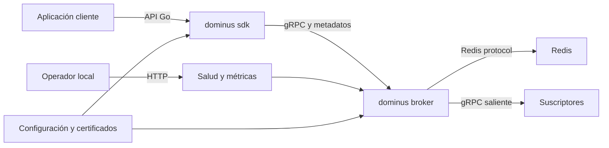

# Guía intensiva para el análisis de ciberseguridad de Dominus

## 1. Propósito y criterio de la actividad

Esta guía sirve para preparar la sección de ciberseguridad de la actividad "Pruebas de la herramienta". El análisis cubre estos componentes:

- `dominus-broker`: servicio backend escrito en Go que expone APIs gRPC, endpoints HTTP de salud y métricas, conexiones salientes hacia suscriptores y persistencia en Redis.
- `dominus-sdk`: biblioteca Go utilizada por las aplicaciones cliente para conectarse al broker, enviar metadatos de autenticación y consumir las operaciones Broker y SQS.

El entorno evaluado es local. No se presupone exposición a Internet, usuarios anónimos ni datos personales reales. Esto reduce la probabilidad de explotación remota, pero no elimina los problemas que pueden causar caída del proceso, filtración de credenciales dentro de la red local, conexiones hacia destinos no autorizados o duplicación de operaciones.

### Justificación del SDK como interfaz cliente

El proyecto no contiene una interfaz gráfica. Por esta razón, para la rúbrica se considera `dominus-sdk` como la interfaz mediante la cual otro software utiliza el backend. El SDK valida direcciones, establece conexiones gRPC, agrega el token de acceso y la clave de idempotencia, serializa mensajes y presenta las operaciones que consume una aplicación. La prueba del lado cliente comprobará estos comportamientos, no aspectos visuales como XSS, formularios, cookies o DOM.

Texto sugerido para la entrega:

> Dominus no dispone de una interfaz gráfica. Su interfaz de consumo es el paquete `dominus-sdk`, que encapsula la conexión de las aplicaciones cliente con el servicio gRPC. Por ello, la prueba de seguridad de la interfaz se aplicó al SDK y se centró en validación de destinos, protección del canal TLS, envío de credenciales, control de errores y límites de tiempo. Las pruebas propias de un navegador, como XSS, CSRF o seguridad de cookies, no son aplicables a la arquitectura evaluada.

Conviene confirmar esta interpretación con el docente. Si "front-end" se entiende estrictamente como interfaz gráfica, el proyecto necesitaría una aplicación consumidora adicional; no sería correcto inventar una UI que no forma parte del alcance.

## 2. Qué exige realmente la rúbrica

La rúbrica pide describir una prueba de seguridad en backend y otra en front-end. Para obtener una evidencia defendible, cada prueba debe incluir:

1. Objetivo y riesgo que se intenta detectar.
2. Componente y versión examinados.
3. Herramienta o técnica empleada.
4. Preparación del laboratorio.
5. Entradas utilizadas, sin revelar credenciales reales.
6. Resultado esperado.
7. Resultado observado.
8. Evidencia: salida de consola, captura, registro o prueba automatizada.
9. Interpretación del resultado.
10. Recomendación y prueba de regresión.

No basta con pegar el resultado de un escáner. La parte valiosa es explicar qué significa el resultado en esta arquitectura.

## 3. Evidencia inicial del repositorio

La revisión estática inicial permite trazar el siguiente mapa:

| Elemento | Evidencia en el repositorio | Relevancia de seguridad |
|---|---|---|
| Entrada del servicio | `dominus-broker/cmd/api/main.go:43-46` | Arranca el bootstrap a partir de opciones CLI. |
| Listener gRPC | `dominus-broker/internal/bootstraps/bootstraps.go:161-173` | La reflexión está activa y el servicio escucha en todas las interfaces. |
| Listener HTTP | `dominus-broker/internal/bootstraps/bootstraps.go:178-217` | Expone `/health` y `/metrics`, con token y filtro de red. |
| Autenticación gRPC | `dominus-broker/internal/infrastructure/grpc/middlewares/middlewares.go:41-55` | Compara el token en tiempo constante, pero el acceso al primer encabezado requiere una prueba negativa. |
| Idempotencia | `dominus-broker/internal/infrastructure/grpc/middlewares/middlewares.go:86-112` | Comprueba Redis y guarda la clave de forma asíncrona; existe una ventana de carrera documentada. |
| Autenticación HTTP | `dominus-broker/internal/infrastructure/fasthttp/middlewares/api_middleware.go:27-42` | Protege las rutas mediante `x-api-key`. |
| Restricción HTTP por red | `dominus-broker/internal/infrastructure/fasthttp/middlewares/host_allowed.go:24-34` | Usa la IP remota contra un CIDR. El nombre `allow_origins` puede confundirse con CORS. |
| Destinos de suscriptores | `dominus-broker/internal/application/usecases/stream_client/stream_client_service.go:13-32` | Las direcciones suministradas por el cliente se pasan al cliente saliente. |
| Conexiones salientes | `dominus-broker/internal/infrastructure/grpc/outbound/client_stream.go:29-79` | El broker abre conexiones gRPC y goroutines hacia los destinos recibidos. |
| Redis | `dominus-broker/internal/infrastructure/redis/cmemory/outbound.go:21-49` | Admite TLS y credenciales; la configuración de desarrollo merece revisión de privilegios. |
| Cliente sin TLS | `dominus-sdk/dominus/broker_client_factory.go:48-58` y `sqs_client_factory.go:46-56` | Existe un modo explícito con credenciales de transporte inseguras para desarrollo. |
| Cliente con TLS | `dominus-sdk/dominus/broker_client_factory.go:28-45` y `sqs_client_factory.go:26-43` | Carga una CA y valida el nombre del servidor. |
| Metadatos cliente | `dominus-sdk/dominus/interceptors.go:23-42` | Envía `x-api-key`; las llamadas unary también envían idempotencia. |
| Validación de direcciones | `dominus-sdk/dominus/rules.go:9-16` y `enum.go:33-34` | Valida el formato con una expresión regular, pero no determina si el destino está autorizado. |
| Contextos del SDK | `dominus-sdk/dominus/broker_client_conn.go:25-50` y `sqs_client_services.go:25-35` | Usa `context.Background()`, por lo que el consumidor no puede imponer cancelación o fecha límite. |
| Serialización del SDK | `dominus-sdk/dominus/broker_client_services.go:22-33` y `47-60` | El error de `json.Marshal` se descarta. |
| Contenedor | `dominus-broker/Dockerfile:27-32` | El proceso cambia a un usuario sin privilegios, lo cual es un control existente. |
| Automatización | `dominus-broker/Makefile.ps1:277-306` | Ya contempla lint, `govulncheck`, auditoría y verificación previa al despliegue. |

El inventario encontró 50 funciones `Test...` bajo `dominus-broker/tests` y ninguna en `dominus-sdk`. Este conteo describe el estado del código; no significa que las pruebas hayan pasado.

## 4. Modelo compacto del sistema



### Límites de confianza

- Aplicación cliente → SDK: recibe cuerpos arbitrarios, destinos, token y clave de idempotencia proporcionados por la aplicación.
- SDK → broker: cruza una frontera de red gRPC. La autenticación depende de `x-api-key`; la confidencialidad depende de seleccionar TLS.
- Broker → Redis: cruza otra conexión de red y transporta mensajes, estados de consumo y claves de idempotencia.
- Broker → suscriptores: el broker actúa como cliente y conecta con direcciones obtenidas de una solicitud autenticada.
- Operador → monitor HTTP: `/health` y `/metrics` están sujetos a token y CIDR, pero revelan disponibilidad y telemetría.
- Sistema de archivos/configuración → procesos: certificados, token API y credenciales de Redis entran por configuración local o `APP_CONFIG`.

### Activos que deben protegerse

| Activo | Objetivo |
|---|---|
| Token API de gRPC y HTTP | Confidencialidad e integridad |
| Credenciales de Redis | Confidencialidad |
| Contenido de mensajes y metadatos | Confidencialidad e integridad |
| Estado de ACK e idempotencia | Integridad |
| Disponibilidad del broker, Redis y clientes | Disponibilidad |
| Certificados y clave privada | Confidencialidad e integridad |
| Registros y métricas | Integridad y confidencialidad operativa |

## 5. Hipótesis de riesgo que guían las pruebas

Estas son hipótesis, no resultados confirmados. Solo deben convertirse en hallazgos después de reproducirlas.

| ID | Hipótesis | Prioridad en laboratorio local | Evidencia que la motiva |
|---|---|---|---|
| TM-001 | Una llamada gRPC sin `x-api-key` podría provocar un `panic` al acceder a `md.Get(...)[0]`, en vez de responder `Unauthenticated`. | Alta | `middlewares.go:43-53` |
| TM-002 | Si faltan certificados, el broker y el SDK aceptan transporte sin TLS; el token viaja como metadato sin cifrar. | Media | `bootstraps.go:73-89`, `broker_client_factory.go:48-58` |
| TM-003 | Un cliente autenticado podría hacer que el broker se conecte a destinos internos o no autorizados mediante la lista de suscriptores. | Alta | `stream_client_service.go:17-24`, `client_stream.go:29-39` |
| TM-004 | Dos solicitudes simultáneas con la misma clave podrían ejecutarse antes de que la clave se guarde en Redis. | Alta | `middlewares.go:101-110`, `doc/grpc-security.md` |
| TM-005 | Listas grandes de suscriptores o streams prolongados podrían consumir conexiones, goroutines y memoria sin límites de aplicación. | Media | `client_stream.go:71-79`, `stream_bidirectional_service.go:21-38` |
| TM-006 | La configuración de desarrollo de Redis podría contener una credencial estática y permisos demasiado amplios. | Media | `terraform/dev/redis/redis.conf:14` |
| TM-007 | La reflexión gRPC facilita enumerar servicios. En local es útil; en un despliegue público ampliaría el reconocimiento. | Baja | `bootstraps.go:161-162` |
| TM-008 | Las llamadas del SDK podrían quedar bloqueadas indefinidamente porque usan contextos sin fecha límite. | Media | `broker_client_conn.go:25-50`, `sqs_client_services.go:25-35` |
| TM-009 | Un objeto no serializable podría producir un payload vacío porque se ignora el error de `json.Marshal`. | Media | `broker_client_services.go:24-30`, `49-55` |

## 6. Preparación segura del laboratorio

### 6.1 Reglas de operación

- Trabajar con una copia o rama de laboratorio y registrar el commit examinado.
- Usar tokens y certificados desechables. No utilizar credenciales de producción.
- Limitar las pruebas de carga a `127.0.0.1` y a un número pequeño de peticiones.
- No probar rangos de red, servicios ajenos ni direcciones públicas.
- Redactar tokens, contraseñas, cabeceras y rutas privadas antes de guardar capturas.
- Separar el resultado del broker del resultado del SDK. Son componentes con responsabilidades distintas.

### 6.2 Registrar la línea base

Desde PowerShell:

```powershell
$brokerPath = 'C:\Users\Dev\repos\toonchavez8\Unir-Notes\Maestría-Ingeniería-de-Software\10-Proyecto-de-Applicacion\Referance\dominus-broker'
$sdkPath = 'C:\Users\Dev\repos\toonchavez8\Unir-Notes\Maestría-Ingeniería-de-Software\10-Proyecto-de-Applicacion\Referance\dominus-sdk'

git -C $brokerPath rev-parse HEAD
git -C $sdkPath rev-parse HEAD
go version
docker version
```

Guardar las salidas sin datos sensibles. Si los repositorios tienen cambios locales, anotarlo; un hash por sí solo ya no identifica todo el código evaluado.

### 6.3 Herramientas

En la inspección del equipo se detectaron:

| Herramienta | Estado actual | Uso previsto |
|---|---|---|
| Go | Disponible | Tests, race detector y compilación |
| Docker | Disponible | Laboratorio aislado |
| `curl.exe` | Disponible | Monitor HTTP |
| `govulncheck` | No detectado | Vulnerabilidades alcanzables en dependencias Go |
| `gosec` | No detectado | Reglas estáticas específicas de Go |
| `gitleaks` | No detectado | Secretos presentes o históricos |
| `grpcurl` | No detectado | Pruebas dinámicas gRPC |
| `golangci-lint` | No detectado | Calidad y patrones peligrosos |
| Trivy | No detectado | Dependencias, imagen y configuración |
| Terraform | No detectado | Validación de infraestructura local |

Instalación mínima mediante Go, revisando primero que `GOBIN` esté en `PATH`:

```powershell
go install golang.org/x/vuln/cmd/govulncheck@latest
go install github.com/securego/gosec/v2/cmd/gosec@latest
go install github.com/fullstorydev/grpcurl/cmd/grpcurl@latest
go install github.com/gitleaks/gitleaks/v8@latest
```

No se debe afirmar que una herramienta fue utilizada hasta conservar su versión y su salida. Para una entrega reproducible, anotar `govulncheck -version`, `gosec -version`, `grpcurl -version` y `gitleaks version`.

## 7. Fase 1: establecer la línea base funcional

La seguridad se prueba sobre una versión que primero debe compilar y ejecutar sus pruebas normales.

### Broker

```powershell
Set-Location $brokerPath
go test -race -count=1 ./...
.\Makefile.ps1 -Target test
.\Makefile.ps1 -Target test-cover
```

Registrar:

- paquetes ejecutados;
- cantidad de pruebas y fallos;
- presencia de carreras;
- cobertura total obtenida en esta ejecución;
- fecha, commit y versión de Go.

El repositorio documenta 91.8 % como una medición previa. No debe copiarse como resultado actual sin volver a ejecutar la cobertura.

### SDK

```powershell
Set-Location $sdkPath
go test -race -count=1 ./...
```

El SDK no contiene funciones de prueba detectables en el inventario actual. Un resultado como `[no test files]` no es un aprobado: demuestra ausencia de pruebas. Esta observación justifica crear pruebas específicas de seguridad del cliente.

## 8. Fase 2: análisis de dependencias, código y secretos

Ejecutar los comandos por separado en ambos repositorios.

### 8.1 Dependencias alcanzables

```powershell
Set-Location $brokerPath
govulncheck ./...

Set-Location $sdkPath
govulncheck ./...
```

Para cada vulnerabilidad anotar módulo, versión, símbolo vulnerable, si el símbolo es alcanzable y recomendación de versión. Un CVE en una dependencia no es automáticamente explotable; `govulncheck` ayuda a distinguir presencia de uso alcanzable.

### 8.2 Análisis estático

```powershell
Set-Location $brokerPath
go vet ./...
gosec -fmt=json -out=gosec-broker.json ./...

Set-Location $sdkPath
go vet ./...
gosec -fmt=json -out=gosec-sdk.json ./...
```

Revisar manualmente los resultados de severidad alta y media. El archivo, la línea, el flujo de datos y las condiciones de explotación deben verificarse antes de redactar un hallazgo.

El broker ya incluye una ruta de automatización:

```powershell
Set-Location $brokerPath
.\Makefile.ps1 -Target audit
.\Makefile.ps1 -Target deploy-check
```

Estos objetivos requieren `govulncheck` y `golangci-lint` instalados. `deploy-check` también ejecuta pruebas y cobertura, por lo que es el mejor candidato para un control de CI.

### 8.3 Secretos

```powershell
Set-Location $brokerPath
gitleaks detect --source . --redact --report-format json --report-path gitleaks-broker.json

Set-Location $sdkPath
gitleaks detect --source . --redact --report-format json --report-path gitleaks-sdk.json
```

Buscar también en el historial si el repositorio se va a publicar. Nunca pegar el valor encontrado en el documento. Basta con registrar tipo de secreto, archivo, línea, alcance, estado de revocación y corrección.

Revisión manual prioritaria:

- `dominus-broker/env/*.json`;
- `dominus-broker/terraform/dev/redis/redis.conf`;
- variables `APP_CONFIG`, `api_token`, `password`, rutas de certificados y claves;
- ejemplos del README y scripts de despliegue.

### 8.4 Imagen e infraestructura

Cuando Trivy y Terraform estén disponibles:

```powershell
Set-Location $brokerPath
trivy fs --scanners vuln,secret,misconfig .
trivy config .\terraform
terraform -chdir=.\terraform fmt -check -recursive
terraform -chdir=.\terraform validate
docker build -t dominus-broker:security-lab .
trivy image dominus-broker:security-lab
```

Verificar usuario del contenedor, imagen base, paquetes del runtime, puertos publicados, volumen de certificados, permisos de Redis y redes internas. El `Dockerfile` ya cambia a un usuario no privilegiado; se debe conservar como control positivo.

## 9. Fase 3: pruebas dinámicas del backend

Las pruebas siguientes deben ejecutarse contra una instancia aislada. En todos los casos se usará un token desechable almacenado temporalmente en `$env:DOMINUS_TEST_TOKEN`; no se mostrará en capturas.

### BE-01. Autenticación gRPC y resistencia ante cabeceras ausentes

Objetivo: comprobar que una solicitud sin token o con token incorrecto se rechaza sin cerrar el proceso.

Procedimiento:

1. Iniciar broker y Redis en el laboratorio.
2. Confirmar que el proceso está activo.
3. Ejecutar una consulta sin cabecera:

```powershell
grpcurl -plaintext 127.0.0.1:5000 list
```

4. Ejecutar otra con token incorrecto:

```powershell
grpcurl -plaintext -H 'x-api-key: token-invalido-de-laboratorio' 127.0.0.1:5000 list
```

5. Ejecutar la misma consulta con el token desechable correcto:

```powershell
grpcurl -plaintext -H "x-api-key: $env:DOMINUS_TEST_TOKEN" 127.0.0.1:5000 list
```

6. Repetir `/health` después de cada caso para comprobar que el proceso sigue vivo.

Resultado seguro esperado:

- ausencia de token → `Unauthenticated`;
- token erróneo → `Unauthenticated`;
- token válido → se permite enumerar únicamente en el laboratorio;
- ninguna entrada provoca `panic`, reinicio o traza sensible.

Motivo de atención: el middleware verifica que exista metadata, pero accede directamente al índice cero de `md.Get(enum.X_API_KEY)`. La prueba sin cabecera debe ejecutarse primero en un proceso descartable.

Evidencia: captura del estado gRPC, código recibido, PID antes y después, y registro redactado.

### BE-02. Protección del monitor HTTP

Objetivo: verificar token, CIDR y ausencia de confianza indebida en cabeceras reenviadas.

```powershell
curl.exe -i http://127.0.0.1:8000/health
curl.exe -i -H "x-api-key: token-invalido" http://127.0.0.1:8000/health
curl.exe -i -H "x-api-key: $env:DOMINUS_TEST_TOKEN" http://127.0.0.1:8000/health
curl.exe -i -H "x-api-key: $env:DOMINUS_TEST_TOKEN" http://127.0.0.1:8000/metrics
```

Repetir con una configuración CIDR que excluya `127.0.0.1`. Agregar `X-Forwarded-For` no debería eludir el control, pues el código usa `RemoteIP()`.

Resultado seguro esperado: `403` sin credenciales o fuera del CIDR; `200` únicamente con token válido y origen permitido. Revisar que las respuestas de error no incluyan token, configuración, rutas o trazas.

### BE-03. Idempotencia bajo concurrencia

Objetivo: verificar que una misma clave solo permita una operación unary, incluso cuando llegan solicitudes simultáneas.

La prueba más confiable es una integración Go con `bufconn` o Redis local:

1. Crear 10 a 20 goroutines sincronizadas por una barrera.
2. Todas invocan `Producer` con el mismo `idempotency-header`.
3. Contar cuántas llamadas llegan al caso de uso y cuántas reciben `codes.Aborted`.
4. Repetir al menos 20 veces con `go test -race -count=20`.

Resultado seguro esperado: exactamente una llamada alcanza el manejador; todas las demás son rechazadas como duplicadas.

El flujo actual hace `EXISTS`, lanza una goroutine para `SET NX` y permite continuar. Si más de una solicitud alcanza el manejador, el hallazgo está confirmado. La corrección sería reservar sincrónicamente la clave con una sola operación atómica `SET NX` antes del handler.

### BE-04. Destinos de suscriptores y conexión saliente

Objetivo: determinar si un cliente autenticado puede inducir conexiones hacia destinos no autorizados.

Prueba segura:

1. Levantar un receptor gRPC de prueba exclusivamente en `127.0.0.1` y registrar conexiones, sin payload sensible.
2. Enviar al Broker API una lista de suscriptores que contenga ese receptor.
3. Confirmar que el broker intenta conectarse.
4. Repetir con una dirección de loopback que la política propuesta debería bloquear.
5. No probar IPs de la LAN, metadata cloud ni sistemas externos.

Resultado seguro esperado: el broker solo conecta con destinos incluidos en una allowlist operativa. Validar que una cadena parezca IP o FQDN no basta; una dirección sintácticamente válida todavía puede apuntar a un servicio interno.

Si no existe allowlist, registrar el riesgo como conexión saliente controlada por un cliente autenticado. En el entorno local la prioridad es alta para revisión, pero su impacto real crecería si el broker se desplegara en una red con servicios sensibles.

### BE-05. Límites de payload, suscriptores y streams

Objetivo: medir si una entrada grande o una conexión ociosa agota recursos.

Prueba acotada:

1. Registrar memoria, goroutines y latencia iniciales.
2. Enviar payloads de 1 KiB, 64 KiB, 1 MiB y, como máximo en este laboratorio, 4 MiB.
3. Probar listas de 1, 10, 50 y 100 destinos simulados de loopback.
4. Abrir hasta 20 streams ociosos durante 30 segundos.
5. Cerrar todas las conexiones y verificar recuperación de recursos.

No convertir esta prueba en un ataque de denegación de servicio. El objetivo es encontrar el umbral y comprobar una política, no derribar el equipo.

Resultado seguro esperado: límites explícitos, códigos `ResourceExhausted` o `InvalidArgument`, fechas límite y recuperación posterior. Si el único límite es el valor predeterminado de gRPC, documentar la falta de una decisión de aplicación.

### BE-06. TLS y degradación a texto plano

Objetivo: comprobar que el modo seguro valida certificado y nombre, y que una configuración incompleta no pasa inadvertida.

Casos:

- certificado y clave válidos → conexión TLS exitosa;
- CA no confiable → conexión rechazada;
- nombre de servidor incorrecto → conexión rechazada;
- archivo de certificado ausente → en local puede activarse plaintext, pero el registro debe advertirlo con claridad;
- producción simulada sin certificados → el proceso debería fallar cerrado en vez de degradarse.

El token se envía sin hash en metadata y se compara mediante SHA-256 en el servidor. El hash no cifra la red: TLS es lo que evita que el token sea observado durante el tránsito.

### BE-07. Redis y privilegios

Objetivo: verificar aislamiento, autenticación y mínimo privilegio.

Comprobar:

- Redis no está publicado más allá de la red local de Docker;
- el usuario de Dominus solo puede operar sobre las claves y comandos necesarios;
- las credenciales de ejemplo no se reutilizan fuera del laboratorio;
- TLS se activa si Redis cruza una frontera de red no confiable;
- un fallo de Redis no revela la contraseña en logs;
- las claves de idempotencia expiran según la configuración.

La configuración de desarrollo contiene una credencial y una ACL amplia. En la entrega se debe citar el archivo y redactar el valor.

## 10. Fase 4: pruebas de la interfaz cliente `dominus-sdk`

Para esta parte conviene crear `dominus/security_test.go` en una rama de laboratorio. El archivo debe usar servidores gRPC locales y certificados efímeros generados durante la prueba.

### CL-01. Validación TLS del servidor

Objetivo: demostrar que el SDK rechaza un servidor no confiable o con nombre incorrecto.

Casos de prueba:

| Caso | Entrada | Resultado esperado |
|---|---|---|
| CA válida y nombre válido | Certificado local firmado por CA de prueba | La conexión funciona |
| CA distinta | Certificado no firmado por la CA configurada | Error de verificación |
| Nombre incorrecto | `serverName` diferente al SAN | Error de nombre |
| Archivo CA inexistente | Ruta temporal inválida | Inicialización rechazada sin exponer secretos |

Esta es la mejor prueba para representar la seguridad de la interfaz cliente en la entrega: es concreta, observable y corresponde directamente a la responsabilidad del SDK.

### CL-02. Metadata de autenticación

Objetivo: confirmar que las llamadas unary incluyen `x-api-key` e `idempotency-header`, mientras que los streams incluyen el token según el diseño.

Crear un interceptor de servidor de prueba que registre solamente la presencia y longitud de los campos, nunca su contenido. Probar:

- token vacío rechazado durante inicialización;
- idempotencia vacía rechazada en SQS;
- token de prueba recibido por el servidor;
- metadatos no impresos en errores o logs;
- transporte TLS utilizado cuando el token cruza una conexión.

### CL-03. Validación y autorización de destinos

Objetivo: distinguir formato válido de destino autorizado.

La expresión regular del SDK acepta IPv4 con puerto o un FQDN con al menos un punto. Probar direcciones válidas, puertos fuera de rango semántico, paths inesperados, loopback y direcciones que apunten a servicios internos. La regex solo comprueba forma; una política de allowlist o resolución segura debe decidir si se permite el destino.

Resultado seguro esperado: destinos fuera de la política se rechazan antes de abrir una conexión. Evitar basar la autorización únicamente en una regex o en el nombre DNS, ya que la resolución puede cambiar.

### CL-04. Cancelación y tiempo límite

Objetivo: comprobar que una aplicación puede abandonar una llamada cuando el servidor no responde.

1. Levantar un servidor local que acepte la conexión y no responda.
2. Invocar una operación SDK con un límite de uno o dos segundos.
3. Verificar que retorna `DeadlineExceeded` y libera la conexión.

El API actual crea `context.Background()` internamente, por lo que no permite al consumidor suministrar el contexto. Si la prueba queda bloqueada, se confirma una debilidad de disponibilidad. La recomendación es aceptar `context.Context` en las operaciones públicas y propagarlo hasta gRPC.

### CL-05. Error de serialización

Objetivo: impedir que un objeto no serializable se convierta silenciosamente en un mensaje vacío.

Usar como cuerpo un valor que `encoding/json` no pueda serializar, por ejemplo una función o un canal. El método debe devolver el error y no debe llamar a `Send`.

El código actual descarta el error de `json.Marshal`. Si se observa un envío vacío o `nil`, registrar el hallazgo como pérdida de integridad y corregirlo antes de repetir la prueba.

### CL-06. Ciclo de vida de conexiones

Objetivo: comprobar que múltiples operaciones no dejan conexiones y goroutines sin cerrar.

Ejecutar un número acotado de operaciones, cerrar los streams, forzar el fin del servidor local y comparar goroutines/conexiones antes y después. El SDK debería ofrecer cierre explícito o reutilización controlada de `ClientConn`.

## 11. Selección mínima para la rúbrica

Si el documento solo dispone de dos o tres páginas para ciberseguridad, usar estas dos pruebas principales:

### Prueba backend seleccionada

`BE-01: autenticación gRPC ante token ausente, incorrecto y válido`.

Razones:

- prueba directamente el punto de entrada del backend;
- cubre autenticación y disponibilidad;
- tiene un resultado inequívoco mediante códigos gRPC;
- puede revelar el posible `panic` por cabecera ausente;
- produce una captura clara y una prueba de regresión sencilla.

### Prueba de interfaz cliente seleccionada

`CL-01: rechazo de certificado o nombre TLS no confiable por dominus-sdk`.

Razones:

- corresponde a una función de seguridad que depende del SDK;
- demuestra protección del token durante el tránsito;
- no necesita fingir que existe una interfaz gráfica;
- puede automatizarse y repetirse con certificados locales.

Como evidencia complementaria, incluir `BE-03` sobre idempotencia o `CL-04` sobre timeouts. Esto muestra que el análisis no se limitó a ejecutar un escáner.

## 12. Plantilla para documentar cada prueba

| Campo | Contenido |
|---|---|
| Identificador | BE-01, CL-01, etc. |
| Nombre | Descripción corta y específica |
| Objetivo | Propiedad de seguridad comprobada |
| Riesgo | Qué daño produciría el fallo |
| Componente | Broker o SDK, archivo/símbolo y commit |
| Entorno | Windows, Go, Docker, puertos locales y versiones |
| Datos de prueba | Valores ficticios o redactados |
| Procedimiento | Pasos numerados y comandos |
| Resultado esperado | Comportamiento seguro observable |
| Resultado obtenido | Salida real, sin interpretar todavía |
| Estado | Aprobada, fallida o inconclusa |
| Severidad | Baja, media, alta o crítica con justificación |
| Evidencia | Captura, log, JSON o nombre de test |
| Recomendación | Cambio concreto y ubicación |
| Regresión | Prueba que debe pasar después del cambio |

### Ejemplo de redacción sin inventar resultados

> Se envió una solicitud de reflexión gRPC sin la cabecera `x-api-key` contra la instancia local. El comportamiento esperado era recibir `Unauthenticated` y conservar el proceso activo. La ejecución devolvió `[CÓDIGO REAL]`; después se consultó `/health` y se obtuvo `[RESULTADO REAL]`. La evidencia se conserva en la figura `[NÚMERO]`. Por tanto, la prueba se clasificó como `[APROBADA/FALLIDA]`. El resultado afecta a `[AUTENTICACIÓN/DISPONIBILIDAD]` porque `[EXPLICACIÓN BASADA EN LO OBSERVADO]`.

Los corchetes deben sustituirse por resultados reales. No se deben rellenar antes de ejecutar la prueba.

## 13. Evidencias recomendadas

Conservar como mínimo:

- captura del commit y versiones de herramientas;
- salida de `go test -race -count=1 ./...`;
- resumen de `govulncheck` y `gosec` con secretos redactados;
- una captura de BE-01 y otra de CL-01;
- log que demuestre que el proceso siguió activo o se detuvo;
- tabla de resultados esperados frente a observados;
- diagrama del sistema y límites de confianza;
- fragmentos breves de código con archivo y línea;
- evidencia de la repetición después de la corrección, si se implementa.

Nombrar las evidencias de forma estable, por ejemplo:

```text
E01-versiones-y-commits.png
E02-go-test-race-broker.txt
E03-govulncheck-broker.txt
E04-BE-01-auth-grpc.png
E05-CL-01-validacion-tls.png
E06-regresion-BE-01.txt
```

## 14. Cómo clasificar los resultados

La severidad debe considerar el contexto local:

- Crítica: ejecución de código o pérdida total de secretos sin autenticación, incluso en la configuración normal del laboratorio. No hay evidencia inicial suficiente para asignar esta categoría.
- Alta: caída remota reproducible del broker, conexión a destinos internos controlada por un cliente, bypass de autenticación o duplicación de operaciones con impacto de integridad.
- Media: plaintext habilitado deliberadamente en local, falta de timeouts, fuga limitada de métricas, permisos amplios de Redis o pérdida silenciosa de un mensaje.
- Baja: información útil para reconocimiento, mensajes de error demasiado descriptivos o endurecimiento sin explotación directa en el entorno local.

Si el sistema pasa a producción o se expone a Internet, deben recalcularse TM-001, TM-002, TM-003, TM-005 y TM-007. La probabilidad y el impacto cambiarían de forma apreciable.

## 15. Estructura sugerida para la sección de la actividad

Para una sección de dos a tres páginas dentro del documento total:

1. Alcance y justificación del SDK como interfaz cliente: medio párrafo.
2. Arquitectura y amenazas examinadas: diagrama y tabla breve.
3. Metodología: análisis estático, dependencias y prueba dinámica.
4. Prueba backend BE-01: objetivo, pasos, resultado y evidencia.
5. Prueba cliente CL-01: objetivo, pasos, resultado y evidencia.
6. Hallazgos adicionales: idempotencia, destinos de suscriptores y timeouts.
7. Recomendaciones y prueba de regresión.

No dedicar espacio a describir todas las herramientas. Es preferible explicar dos pruebas con rigor y usar la exploración restante para justificar por qué fueron seleccionadas.

## 16. Orden recomendado de ejecución

1. Guardar commits, versiones y estado de los repositorios.
2. Ejecutar las pruebas funcionales y el race detector.
3. Instalar y registrar las herramientas faltantes.
4. Ejecutar `govulncheck`, `go vet`, `gosec` y `gitleaks`.
5. Levantar el laboratorio local con credenciales desechables.
6. Ejecutar BE-01 y BE-02.
7. Crear y ejecutar la prueba concurrente BE-03.
8. Ejecutar BE-04 y BE-05 solo contra loopback y con límites conservadores.
9. Crear las pruebas CL-01 a CL-06 en el SDK.
10. Corregir un hallazgo a la vez y añadir su regresión.
11. Repetir análisis y pruebas.
12. Redactar resultados reales y anexar evidencias redactadas.

## 17. Criterio de finalización

El análisis estará listo para la entrega cuando:

- se identifique exactamente la versión evaluada;
- las dos pruebas principales tengan resultado real y evidencia;
- la prueba del SDK se justifique como interfaz cliente;
- los secretos estén redactados;
- cada hallazgo cite archivo y línea;
- las prioridades reflejen que el entorno es local;
- no se confunda ausencia de hallazgos automáticos con ausencia de riesgo;
- toda corrección tenga una prueba de regresión;
- el documento distinga hechos observados, hipótesis y recomendaciones.

## 18. Rutas prioritarias para revisión manual

| Ruta | Motivo |
|---|---|
| `dominus-broker/internal/infrastructure/grpc/middlewares/middlewares.go` | Autenticación e idempotencia |
| `dominus-broker/internal/bootstraps/bootstraps.go` | TLS, listeners, reflexión y límites del servidor |
| `dominus-broker/internal/infrastructure/grpc/outbound/client_stream.go` | Conexiones salientes y concurrencia |
| `dominus-broker/internal/application/usecases/stream_*` | Validación de suscriptores y ciclo de vida de streams |
| `dominus-broker/internal/infrastructure/redis` | Credenciales, TLS, ACK e idempotencia |
| `dominus-broker/internal/infrastructure/fasthttp` | Token, CIDR, métricas y respuestas de error |
| `dominus-broker/config/config.go` | Carga y validación de configuración sensible |
| `dominus-broker/env` | Riesgo de secretos versionados |
| `dominus-broker/terraform` | Puertos, redes, volúmenes y privilegios |
| `dominus-broker/Dockerfile` | Usuario, imagen base y superficie del contenedor |
| `dominus-sdk/dominus/interceptors.go` | Metadata de autenticación |
| `dominus-sdk/dominus/*_client_factory.go` | Selección TLS/plaintext y validación |
| `dominus-sdk/dominus/broker_client_conn.go` | Contextos y ciclo de conexión |
| `dominus-sdk/dominus/broker_client_services.go` | Serialización y propagación de errores |
| `dominus-sdk/dominus/rules.go` | Validación de destinos |

---

Esta guía no afirma que las hipótesis TM-001 a TM-009 estén confirmadas. Su función es convertirlas en pruebas controladas, repetibles y documentables. El informe académico debe usar únicamente los resultados que realmente se obtengan en el laboratorio.
