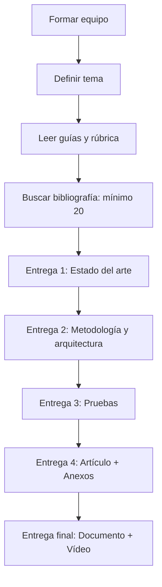
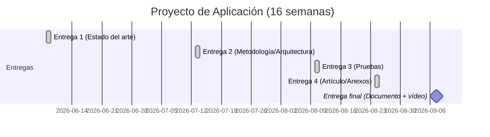

# Notas de estudio — Proyecto de Aplicación (Clase inicial)

## 1) Contexto general del curso y objetivo
Se indicó que la asignatura se centra en **guiar el desarrollo de un documento final** que se entrega al cierre del curso. Es un curso **práctico**, con entregas parciales y productos finales (documento, artículo y vídeo).

### Qué implica
- Se espera un **trabajo escrito completo** que evolucione con entregas parciales.
- El producto final incluye **anexos** y **exposición oral en vídeo**.

---

## 2) Acceso a materiales en la plataforma
Se reportó que algunas personas no podían descargar archivos. Se dieron estas recomendaciones:

- **Cambiar de navegador** (ejemplo: de Edge a Safari).
- **Borrar cookies y caché**.
- Si el problema persiste, **avisar por el foro** para que se suban los documentos al apartado de documentación.

**Importancia:** sin guías, rúbricas y plantillas no es posible avanzar con seguridad en los entregables.

---

## 3) Canal de comunicación y grupos
El canal principal es el **foro del aula virtual**, no el correo. La razón es que hay **tres grupos** (uno grande y dos pequeños) con ~100 estudiantes; el correo es inmanejable.

**Consecuencia práctica:** preguntas generales se responden a los tres grupos para mantener a todos informados.

---

## 4) Organización de equipos
Se trabajará **en equipo**. Los equipos serán asignados próximamente y es probable que se mantengan los mismos equipos de otras asignaturas.

**Recomendación:** avanzar desde ya en la definición de tema, porque el tiempo es limitado.

---

## 5) Programación de sesiones
No está claro aún cada cuándo habrá sesiones. Normalmente se programan con **dos semanas de antelación**, y en casos extraordinarios con **una semana**.

---

## 6) Cronograma general (16–17 semanas)
Se mencionó que el curso tiene **16–17 semanas** según el día de entrega final. Al ser lunes 7 de septiembre, se consideran **16 semanas efectivas**.

### Semana de repaso
La programación incluye una **semana 16 de repaso**, típica de cursos con examen. Aquí **no hay examen**, porque la evaluación es por entrega final, así que esa semana queda como margen de trabajo.

**Conclusión:** el tiempo es ajustado y se debe empezar cuanto antes.

---

## 7) Entregas parciales y evaluación
El sistema tiene **4 entregas parciales** y **una entrega final**. Cada entrega parcial vale **1.25 puntos**, y la final vale **5 puntos**, sumando **10**.

### Tabla de entregas
| Entrega | Fecha | Alcance mínimo esperado | Valor |
|---|---|---|---|
| 1 | 8 de junio | Estado del arte (capítulos iniciales) | 1.25 |
| 2 | 13 de julio | Metodología y arquitectura (cap. 3) | 1.25 |
| 3 | 10 de agosto | Pruebas de herramientas (cap. 4) | 1.25 |
| 4 | 24 de agosto | Anexos y artículo | 1.25 |
| Final | 7 de septiembre | Documento completo + vídeo | 5 |

### Recomendación clave
> “Pónganse como meta lo que se pide, pero si pueden avanzar más, mucho mejor.”

**Interpretación:** las entregas parciales son el mínimo evaluable; avanzar más reduce riesgos por retrasos.

---

## 8) Microtests (sin puntuación)
Los microtests son **preguntas de opción múltiple** ligadas a los PDF de cada fase.

- **Fase 1:** 1.1, 1.2, 1.3, 1.4
- **Fase 2:** 2.1 … 2.9
- **Fase 3:** 3.1 … 3.6

**Valor:** 0 puntos. **Uso sugerido:** reforzar comprensión del contenido teórico.

---

## 9) Documentos obligatorios de lectura
1. **Guía del trabajo** (se describió como lectura corta y rápida).
2. **Reglamento institucional**.
3. **Rúbrica de evaluación**.
4. **Manual de uso de sistemas de IA generativa**.

**Importancia:** contienen criterios de evaluación, estructura y restricciones.

---

## 10) Rúbrica de evaluación
La rúbrica tiene **tres apartados**: dos para el documento y uno para el vídeo. Se indicó que se evaluará estrictamente con esa rúbrica.

**Consejo:** apuntar a la **última columna**, que concentra la mayor puntuación.

---

## 11) Plantilla del documento
La plantilla incluye:

- Portada con título, autores, modalidad, fechas.
- Resumen y abstract.
- Índice.
- Capítulos y anexos.

### Resumen y abstract se hacen al final
> “El resumen se hace al final del trabajo… porque describe lo que ya se hizo.”

**Consecuencia:** no se revisa en entregas parciales, porque se redacta al concluir el proyecto.

### Detalles de formato y mejoras
Se indicó que la plantilla tiene **defectos de formato** (índice no justificado a la derecha). Por ello se comparará con otra plantilla mejor formateada y, si no hay diferencias críticas, se compartirá esa versión.

---

## 12) Extensión del documento (inconsistencias)
Se señaló una discrepancia entre documentos:

- Plantilla: **60–90 páginas**.
- Guía: **80–120 páginas**.
- Referencias de trabajos similares: **75–90** en trabajo grupal.

**Criterio acordado:**
- **Mínimo orientativo:** 70–75 páginas.
- **Máximo flexible:** hasta 120, sin excederse innecesariamente.

**Matiz:** el **mínimo** es la mayor preocupación; el máximo es menos crítico mientras no se exagera.

---

## 13) Estructura por capítulos y entregas
El documento avanza por capítulos; las entregas se alinean con esa estructura:

- **Entrega 1:** capítulos iniciales + estado del arte.
- **Entrega 2:** **capítulo 3** (metodología y arquitectura).
- **Entrega 3:** **capítulo 4** (pruebas).
- **Entrega 4:** artículo y anexos.

---

## 14) Estado del arte y bibliografía mínima
Se requiere **mínimo 20 referencias**. Esto implica una investigación bibliográfica considerable.

**Estimación:** un estado del arte completo puede ocupar **20–30 páginas** solo en la primera entrega.

---

## 15) Tipos de trabajo posibles (elección clave)
Se plantearon **tres alternativas**:

1. **Desarrollo práctico:** construir un prototipo funcional realizable en el tiempo disponible.  
   - Ventaja: demuestra aplicación real.
   - Riesgo: requiere implementación rápida y alcance acotado.

2. **Planificación de un proyecto de envergadura:** diseñar la receta completa para un sistema mayor.  
   - Incluye arquitectura, pruebas, despliegue y organización.
   - No exige implementar todo, sino **planificarlo rigurosamente**.

3. **Propuesta de metodología nueva o combinada:** definir un enfoque propio (o mezcla) para desarrollar software.  
   - Se sustenta en comparación de metodologías conocidas.
   - Exige justificar por qué aporta valor frente a métodos existentes.

---

## 16) Metodologías y arquitecturas
Se mencionaron ejemplos que sirven como base de decisión:

- **UML** como conocimiento mínimo de modelado.
- **Metodologías ágiles** (p. ej., Scrum).
- **Cascada**.
- Arquitecturas de software diversas.

**Idea central:** seleccionar o combinar lo que mejor se adapte al proyecto propuesto.

---

## 17) Pruebas en la propuesta
En el capítulo de pruebas se sugieren principalmente:

- **Pruebas unitarias**.
- **Pruebas de integración**.
- **Pruebas de usabilidad**.

Además, se mencionó **ciberseguridad** como opción si la propuesta lo requiere. No es obligatoria en todos los casos.

---

## 18) Artículo y vídeo (anexos críticos)
El artículo es un **anexo obligatorio**. Se indicó que la **plantilla del artículo no está visible** en el aula, por lo que se solicitará y, si tarda, se compartirá una plantilla alternativa.

### Posibles formatos del artículo
- **Tipo congreso:** 4–8 páginas.
- **Tipo científico:** 8–12 páginas.

**La extensión final depende de la plantilla real que se publique.**

### Vídeo
También se requiere una plantilla (aún no visible). Se anticipa que el vídeo puede requerir **edición** y **participación de todo el equipo**. Se darán recomendaciones específicas más adelante.

---

## 19) Anexos posibles
Además del artículo, se sugirió incluir información adicional útil:

- Diagramas UML completos.
- Diagramas Gantt detallados (si el del cuerpo es simplificado).
- Descripción de herramientas usadas.
- Requisitos de hardware/software, instalación y mantenimiento.

**Objetivo:** documentar elementos que sustentan la propuesta, sin saturar el cuerpo principal.

---

## 20) Uso de IA generativa (prohibición explícita)
Se indicó una prohibición clara de IA generativa en los textos entregados.

> “No lo van a poder utilizar, ni Copilot, ni ChatGPT, ni Gemini…”

Se explicó que si se detecta IA generativa:
- **No se revisará el trabajo** (ni avances ni final).
- La calificación será **cero automático**.

**Matiz permitido:** se puede usar IA **solo como apoyo externo** (p. ej., para localizar bibliografía), pero nunca para redactar el contenido.

---

## 21) Originalidad y estilo académico
Se remarcó que el trabajo debe ser **inédito y original**. El estilo debe ser **académico**, no coloquial.

### Qué no se hará
- No se corrige ortografía ni gramática.
- No se reescribe el texto.

### Qué sí se hará
- Señalar errores graves si se detectan.
- Recomendar autocorrecciones (p. ej., usar correctores como Word).

---

## 22) Fuentes bibliográficas sugeridas
No se proporcionarán fuentes directas, pero se sugirió buscar en:

- Repositorios con licencias institucionales.
- ResearchGate.
- arXiv.
- DOI para acceso directo (con credenciales institucionales).

---

## 23) Plataforma del aula: ubicaciones clave
Se mostraron secciones relevantes:

- **Clases**: acceso a sesiones.
- **Programación**: cronograma.
- **Foro**: comunicación oficial.
- **Anuncios**: avisos generales.
- **Documentación**: guías, rúbrica, plantilla.
- **Envío de actividades**: portal de entregas.

---

# Diagramas (Mermaid)

## Flujo general de trabajo

## Línea temporal de entregas

---

# Resumen final (puntos clave)
- Curso práctico con **documento final**, **artículo** y **vídeo**.
- **16 semanas** reales hasta el 7 de septiembre.
- **4 entregas parciales** (1.25 puntos cada una) + **entrega final** (5 puntos).
- **Mínimo 20 referencias** y citas en **APA** desde el inicio.
- Resumen y abstract **solo al final**.
- **IA generativa prohibida** en el texto entregado (cero automático si se detecta).
- Trabajo **en equipo** y elección temprana del tipo de proyecto.

---

## MicroTest 10.10
