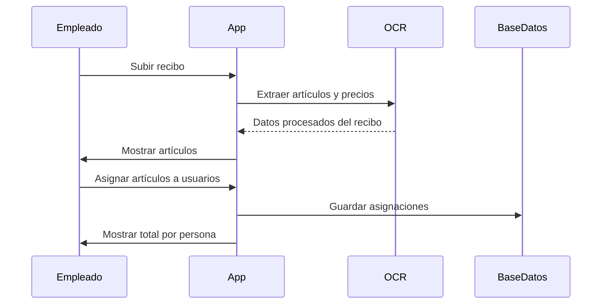
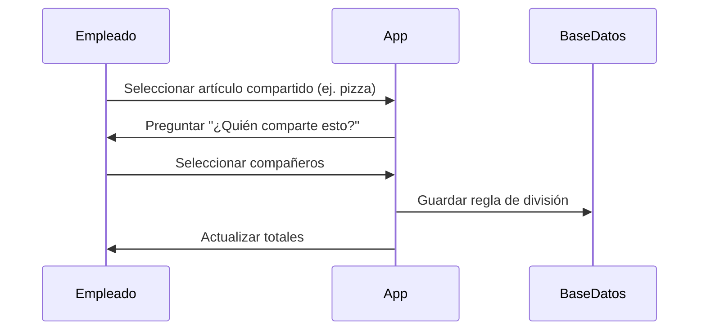
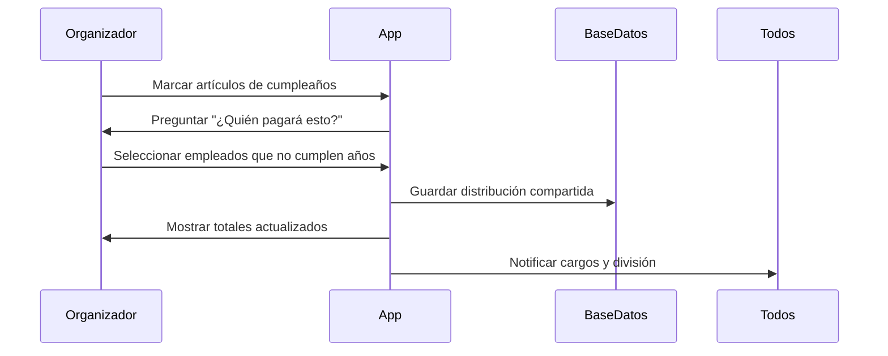
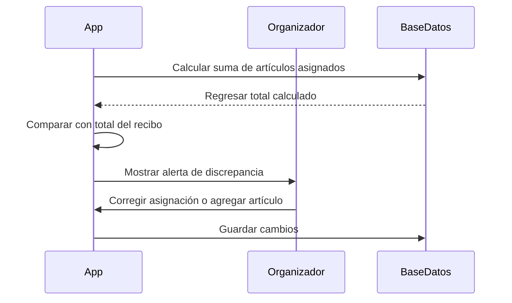
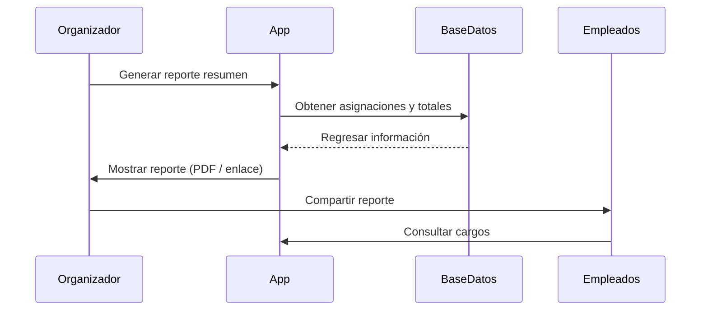

# Aplicación Divisor De Cuenta (Bill Splitter) – Documento Breve

## Descripción General

Nuestra empresa realiza con frecuencia pedidos grupales de comida. Actualmente, el proceso consiste en comparar manualmente el ticket o recibo con la lista interna de pedidos y posteriormente dividir el total entre los compañeros de trabajo. Este proceso es lento, propenso a errores y puede resultar confuso al manejar casos especiales como cumpleaños o artículos compartidos.

La aplicación **Divisor de Cuenta (Bill Splitter)** simplificará este proceso permitiendo a los usuarios subir un recibo, asociar los artículos con los compañeros de trabajo y calcular automáticamente la parte correspondiente de cada persona.

---

## Objetivos

- Eliminar cálculos manuales de cuentas.
    
- Garantizar una división justa y transparente de los pedidos grupales.
    
- Soportar escenarios especiales como cargos compartidos por cumpleaños.
    
- Mejorar la eficiencia y reducir errores.

---

## Funcionalidades Principales

### 1. Carga De Recibos

- Subir una fotografía o PDF del recibo.
    
- Utilizar OCR para extraer artículos, precios y totales.

### 2. Asociación De Pedidos

- Importar o ingresar manualmente los detalles del pedido grupal.
    
- Relacionar los artículos del recibo con los compañeros de trabajo.
    
- Detectar y marcar discrepancias entre el pedido y el recibo.

### 3. División De Cuenta

**División estándar**

- Cada persona paga únicamente los artículos que pidió.

**Artículos compartidos**

- Permitir dividir un artículo entre varios compañeros seleccionados.

**Compartir gastos de cumpleaños**

- Agrupar cargos relacionados con uno o varios cumpleaños.
    
- Dividir estos gastos entre el resto del equipo.

**Reglas de redondeo**

- Redondear cantidades al centavo o peso más cercano.

### 4. Resumen De Pagos

- Mostrar el total correspondiente a cada persona.
    
- Exportar o compartir el resumen (PDF, correo electrónico o enlace).
    
- Integración futura con aplicaciones de pago.

---

## Casos De Uso

### UC1: Pedido Regular De Comida

**Flujo:**

1. Los empleados realizan un pedido.
    
2. Se carga el recibo.
    
3. Los artículos se relacionan con los empleados.
    
4. Cada persona paga únicamente lo que consumió.

---

### UC2: Artículos Compartidos

**Flujo:**

1. Se ordena un artículo compartido (ej. pizza o postre).
    
2. El recibo muestra un solo artículo.
    
3. La aplicación permite dividirlo entre los compañeros seleccionados.

---

### UC3: Celebración De Cumpleaños

**Flujo:**

1. El equipo solicita alimentos o pastel adicional para cumpleaños.
    
2. Los cargos relacionados con cumpleaños se marcan en el sistema.
    
3. Los empleados que no cumplen años comparten dichos gastos.
    
4. Si existen varios cumpleaños simultáneamente, todos los gastos se agrupan y se dividen.

---

### UC4: Verificación De Errores O Discrepancias

**Flujo:**

1. El total del recibo no coincide con la suma de artículos asignados.
    
2. La aplicación detecta y muestra la discrepancia.
    
3. Se sugieren correcciones o ajustes.

---

### UC5: Reporte Final

**El sistema genera un resumen con:**

- Nombre de cada empleado.
    
- Artículos asignados.
    
- Total a pagar por persona.

El reporte podrá compartirse mediante correo o chat corporativo.

---

## Usuarios

### Empleados

- Subir recibos.
    
- Asociar artículos.
    
- Consultar cargos asignados.

### Organizador

- Supervisar asociaciones.
    
- Validar totales y resolver discrepancias.

### Equipo

- Consultar cargos compartidos y resumen final.

---

## Diagrams De Secuencia

### UC1: Pedido Regular

---

### UC2: Artículos Compartidos

---

### UC3: Celebración De Cumpleaños

---

### UC4: Verificación De Errores

---

### UC5: Reporte Final

