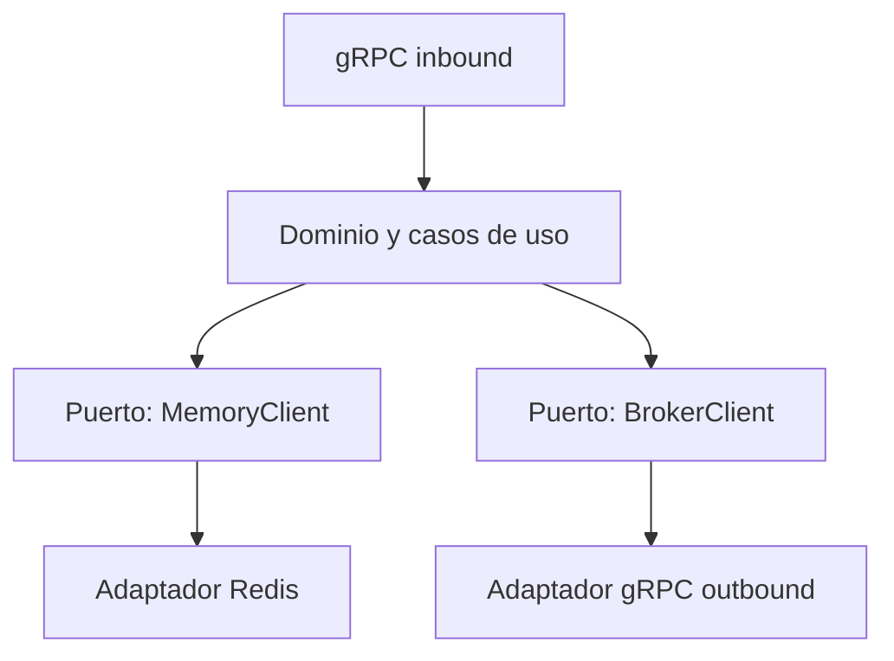
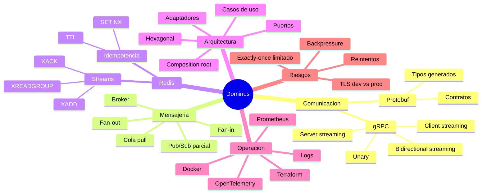

# Guia de conceptos Dominus para perfil junior/frontend

## 1. Como leer esta guia

Esta guia explica los conceptos complicados del TFM y de los 3 repos Dominus como si vienes de frontend y estas entrando a backend distribuido.

La idea es que puedas responder:

- que es cada tecnologia;
- por que existe;
- por que Dominus la usa;
- que se pudo haber usado en su lugar;
- por que la eleccion actual tiene sentido;
- que limitaciones debes reconocer al defender el proyecto.

Los repos relacionados son:

- `dominus-broker`: el servidor broker.
- `dominus-sdk`: libreria cliente para usar el broker.
- `dominus-proto-definition`: contratos protobuf/gRPC.

## 2. El resumen mas simple de Dominus

Dominus es un sistema para mover mensajes entre servicios.

Piensalo como una central de comunicacion:

- recibe mensajes de productores;
- los manda a consumidores;
- puede hacerlo en tiempo real;
- tambien puede guardarlos temporalmente para que un worker los consuma despues;
- usa gRPC para comunicarse;
- usa Redis para guardar mensajes y claves de idempotencia.

Analogia frontend:

Si en frontend tienes componentes que se comunican por eventos, Dominus seria algo parecido, pero entre servicios backend distribuidos.

En vez de:

```text
Button -> onClick -> Parent component -> Update state
```

Aqui tienes:

```text
Service A -> Dominus Broker -> Service B / Service C / Worker
```

## 3. Que es un sistema distribuido

Un sistema distribuido es un sistema formado por varias aplicaciones o servicios que corren separados y se comunican por red.

Ejemplo:

- servicio de usuarios;
- servicio de pagos;
- servicio de notificaciones;
- servicio de auditoria;
- servicio de reportes.

Cada uno puede estar en un proceso, contenedor o servidor diferente.

El problema:

Cuando todo esta separado, comunicar servicios se vuelve dificil.

Preguntas tipicas:

- Como mando datos de un servicio a otro?
- Que pasa si el receptor esta caido?
- Que pasa si el mensaje se duplica?
- Que pasa si necesito avisar a varios servicios?
- Que pasa si necesito respuesta en tiempo real?

Dominus existe para estudiar una respuesta a esas preguntas.

## 4. Que es un mensaje

Un mensaje es una unidad de informacion que viaja entre servicios.

Puede representar:

- un evento;
- una tarea;
- una orden;
- una notificacion;
- una respuesta;
- un payload generico.

Ejemplo:

```json
{
  "type": "payment.created",
  "paymentId": "pay_123",
  "amount": 100
}
```

En Dominus, muchos payloads se manejan como `bytes`.

Eso significa:

- el broker no entiende necesariamente el negocio interno del mensaje;
- solo lo transporta;
- el productor y consumidor deben acordar que significa el payload.

Ventaja:

- el broker es generico.

Desventaja:

- menos validacion de negocio dentro del broker.

## 5. Que es un broker

Un broker es un intermediario de mensajes.

Sin broker:

```text
Servicio A llama directamente a Servicio B
Servicio A llama directamente a Servicio C
Servicio A llama directamente a Servicio D
```

Con broker:

```text
Servicio A -> Broker -> B, C, D
```

El broker ayuda a:

- desacoplar servicios;
- centralizar distribucion de mensajes;
- manejar suscriptores;
- guardar mensajes;
- controlar confirmaciones;
- evitar que cada servicio implemente lo mismo.

Dominus es un broker porque recibe mensajes y decide como moverlos.

## 6. Que es desacoplamiento

Desacoplamiento significa que una parte del sistema no necesita conocer demasiados detalles de otra.

En frontend:

Un componente desacoplado recibe props y callbacks.
No sabe como se guarda la informacion en la base de datos.

En backend:

Un productor puede mandar un mensaje al broker sin saber exactamente quien lo procesara.

Ventaja:

- puedes cambiar consumidores sin tocar productores;
- puedes agregar nuevos servicios;
- puedes escalar partes separadas.

Dominus busca desacoplar productores y consumidores.

## 7. Comunicacion sincronica vs asincronica

### Comunicacion sincronica

El cliente espera una respuesta inmediata.

Ejemplo frontend:

```text
fetch('/api/user')
esperas response
```

Ejemplo backend:

```text
Servicio A pregunta a Servicio B y espera respuesta
```

Ventaja:

- simple de entender.

Desventaja:

- si B tarda o cae, A queda bloqueado o falla.

### Comunicacion asincronica

El cliente envia algo y no necesita que el receptor lo procese en ese instante.

Ejemplo:

```text
Servicio A publica "invoice.created"
Worker lo procesa despues
```

Ventaja:

- desacopla tiempos;
- tolera mejor picos de carga;
- permite workers.

Desventaja:

- es mas dificil razonar;
- necesitas ack, reintentos, idempotencia y monitoreo.

Dominus usa ambos:

- streaming gRPC para tiempo real;
- Redis Streams para asincronia tipo cola.

## 8. Que es gRPC

gRPC es una tecnologia para que servicios se comuniquen usando contratos formales y HTTP/2.

En REST normalmente haces:

```http
POST /users
Content-Type: application/json
```

En gRPC defines servicios y metodos en un archivo `.proto`:

```proto
service SqsAPI {
  rpc Producer(ProducerRequest) returns (ProducerResponse);
}
```

Luego se genera codigo cliente/servidor automaticamente.

### Por que gRPC es diferente a REST

REST normalmente usa:

- endpoints HTTP;
- JSON;
- contratos informales o documentados aparte;
- request/response.

gRPC usa:

- servicios y metodos;
- Protocol Buffers;
- contratos compilables;
- streaming nativo;
- HTTP/2.

### Por que Dominus usa gRPC

Dominus necesita:

- streaming de cliente;
- streaming de servidor;
- streaming bidireccional;
- contratos claros;
- buena eficiencia en servicios internos.

REST no encaja tan bien para streaming bidireccional persistente.

### Que se pudo usar en lugar de gRPC

Opciones:

- REST;
- WebSockets;
- GraphQL subscriptions;
- AMQP;
- NATS;
- Kafka clients.

Por que gRPC tiene sentido aqui:

- es fuerte para comunicacion servicio-a-servicio;
- soporta streaming de forma nativa;
- genera tipos;
- se integra bien con protobuf;
- permite interceptores para seguridad y metricas.

Cuando gRPC no seria ideal:

- APIs publicas para browsers directamente;
- equipos sin experiencia;
- integraciones donde todos esperan HTTP/JSON;
- debugging manual simple.

## 9. Que es HTTP/2

HTTP/2 es una version moderna del protocolo HTTP.

Para este proyecto importa porque permite:

- conexiones persistentes;
- multiplexacion;
- mejor manejo de streams;
- menor overhead que abrir muchas conexiones separadas.

No necesitas dominar HTTP/2 para defender Dominus.
Solo recuerda:

> gRPC se apoya en HTTP/2 para permitir comunicacion eficiente y streaming.

## 10. Que es Protocol Buffers o protobuf

Protocol Buffers es un formato para definir datos y servicios.

Se escribe en archivos `.proto`.

Ejemplo:

```proto
message ProducerRequest {
  bytes payload = 1;
}
```

Eso significa:

- existe un mensaje llamado `ProducerRequest`;
- tiene un campo `payload`;
- el campo es de tipo `bytes`;
- el numero `1` identifica el campo en la serializacion.

### Por que se usa protobuf

Porque permite:

- contratos explicitos;
- generar codigo;
- serializacion binaria eficiente;
- tipos compartidos entre cliente y servidor;
- evolucion de contratos con cuidado.

Analogia frontend:

Es parecido a tener tipos TypeScript compartidos entre frontend y backend, pero a nivel de red y serializacion.

### Que se pudo usar en lugar de protobuf

Opciones:

- JSON Schema;
- OpenAPI;
- Avro;
- MessagePack;
- Thrift.

Por que protobuf tiene sentido aqui:

- gRPC lo usa naturalmente;
- genera cliente y servidor;
- es eficiente;
- reduce ambiguedades.

Desventaja:

- es menos amigable de inspeccionar manualmente que JSON;
- requiere toolchain;
- los cambios deben manejarse con disciplina.

## 11. Que es un contrato

Un contrato define como dos partes se comunican.

En Dominus el contrato vive en:

`dominus-proto-definition/proto/dominus.proto`

Ese contrato dice:

- que servicios existen;
- que metodos tiene cada servicio;
- que request y response usa cada metodo;
- que campos contiene cada mensaje.

Por eso existe un repo separado de proto:

- broker y SDK usan la misma definicion;
- no duplican tipos;
- se reduce riesgo de inconsistencias.

## 12. Que es un SDK

SDK significa Software Development Kit.

En simple:

> Es una libreria para que otros programadores usen tu sistema mas facil.

Sin SDK, un cliente tendria que:

- crear conexion gRPC;
- agregar headers;
- manejar TLS;
- crear stubs;
- entender interceptores;
- serializar payloads;
- validar direcciones.

Con SDK:

```text
Configuras Dominus y llamas metodos mas simples
```

Dominus tiene `dominus-sdk` para facilitar consumo del broker.

Analogia frontend:

Usar el SDK es como usar `axios` o un cliente generado en vez de escribir `fetch` manual en cada pantalla.

## 13. Que es Redis

Redis es una base de datos en memoria muy rapida.

Se usa para:

- cache;
- locks;
- contadores;
- colas simples;
- streams;
- sesiones;
- claves temporales.

Dominus usa Redis para dos cosas:

1. Guardar mensajes asincronos con Redis Streams.
2. Guardar claves de idempotencia con TTL.

## 14. Que es Redis Streams

Redis Streams es una estructura de Redis para almacenar eventos ordenados.

Piensa en una lista append-only:

```text
mensaje 1
mensaje 2
mensaje 3
```

Pero con capacidades extra:

- IDs de mensaje;
- consumer groups;
- ack;
- pending messages.

Dominus usa Redis Streams para simular una cola asincrona.

### Comandos importantes

`XADD`:

Agrega un mensaje al stream.

`XREADGROUP`:

Lee mensajes desde un consumer group.

`XACK`:

Confirma que un mensaje fue procesado.

## 15. Que es un consumer group

Un consumer group permite que varios workers compartan el trabajo.

Ejemplo:

```text
Stream: consumer
Grupo: consumer-group
Workers: worker-1, worker-2, worker-3
```

Redis reparte mensajes entre workers.

Esto ayuda a:

- paralelizar procesamiento;
- evitar que todos procesen exactamente el mismo mensaje;
- llevar control de pendientes.

Dominus usa `group_id` y `worker_id` en `ConsumerRequest`.

## 16. Que es ACK

ACK significa acknowledgement.

En simple:

> Es decirle al sistema: ya procese este mensaje.

Flujo:

```text
Consumer pide mensaje
Consumer procesa mensaje
Consumer manda ACK
Broker marca mensaje como confirmado
```

Sin ACK:

- el sistema no sabe si el mensaje se proceso;
- puede quedar pendiente;
- puede necesitar reintento.

Dominus usa `SqsAPI.Ack` y Redis `XACK`.

## 17. Que es pull y que es push

### Push

El broker empuja mensajes al consumidor.

```text
Broker -> Consumer
```

Ventaja:

- entrega inmediata.

Desventaja:

- el consumidor puede saturarse.

### Pull

El consumidor pide mensajes cuando esta listo.

```text
Consumer -> Broker: dame un mensaje
```

Ventaja:

- el consumidor controla su ritmo.

Desventaja:

- puede introducir espera o polling.

Dominus usa:

- push/streaming en `BrokerAPI`;
- pull en `SqsAPI.Consumer`.

## 18. Que es fan-out

Fan-out significa que un mensaje se distribuye a varios destinos.

```text
Mensaje -> A
        -> B
        -> C
```

Ejemplo real:

Un pago confirmado debe avisar a:

- notificaciones;
- auditoria;
- antifraude;
- dashboard.

Dominus hace fan-out cuando recibe una lista de `subscribers` y manda el payload a varios endpoints gRPC.

## 19. Que es fan-in

Fan-in significa que varios resultados o mensajes se agregan hacia un destino.

```text
A ->
B -> Resultado unido
C ->
```

Ejemplo:

Varios servicios responden con datos parciales y el broker los devuelve al cliente original.

En Dominus, fan-in aparece de forma parcial cuando el broker recibe respuestas de multiples suscriptores y las manda de vuelta por el stream.

## 20. Que es streaming

Streaming significa enviar datos en partes a traves de una conexion que permanece abierta.

En REST comun:

```text
request -> response -> se acaba
```

En streaming:

```text
conexion abierta
mensaje 1
mensaje 2
mensaje 3
...
```

gRPC soporta:

- unary;
- client streaming;
- server streaming;
- bidirectional streaming.

## 21. Que es unary RPC

Unary significa:

```text
un request -> un response
```

En Dominus:

- `SqsAPI.Producer`;
- `SqsAPI.Consumer`;
- `SqsAPI.Ack`.

Tiene sentido porque esas operaciones son puntuales.

## 22. Que es client streaming

Client streaming:

```text
Cliente manda muchos mensajes -> servidor responde una vez
```

En Dominus:

`BrokerAPI.ClientStream`

Uso:

Un productor manda muchos payloads al broker en la misma conexion.

## 23. Que es server streaming

Server streaming:

```text
Cliente manda una request -> servidor manda muchas respuestas
```

En Dominus:

`BrokerAPI.ServerStream`

Uso:

El cliente abre una solicitud y recibe multiples respuestas desde suscriptores.

## 24. Que es bidirectional streaming

Bidirectional streaming:

```text
Cliente y servidor mandan mensajes al mismo tiempo
```

En Dominus:

`BrokerAPI.BidirectionalStream`

Uso:

El cliente y los suscriptores intercambian mensajes vivos por medio del broker.

Esto es mas complejo, pero es una de las razones fuertes para usar gRPC.

## 25. Que es idempotencia

Idempotencia significa que ejecutar la misma operacion mas de una vez produce el mismo efecto que ejecutarla una sola vez.

Ejemplo simple:

```text
DELETE /user/123
```

Si lo ejecutas una vez, borra el usuario.
Si lo ejecutas otra vez, el usuario ya no existe.
El resultado final es el mismo: usuario no existe.

Ejemplo no idempotente:

```text
POST /charge-credit-card
```

Si lo ejecutas dos veces, puedes cobrar dos veces.

### Por que importa en Dominus

En sistemas distribuidos hay reintentos.

Un cliente puede enviar un mensaje, tener timeout, y no saber si el broker lo proceso.
Entonces reintenta.

Sin idempotencia:

- se puede duplicar el mensaje;
- se puede procesar dos veces;
- puede haber efectos incorrectos.

Con idempotencia:

- el cliente manda una clave unica;
- el broker recuerda la clave por un tiempo;
- si llega la misma clave otra vez, la rechaza.

Dominus usa `idempotency-header`.

Limitacion:

La implementacion actual ayuda, pero no es perfecta bajo concurrencia extrema porque la reserva de clave deberia ser atomica.

## 26. Que es TTL

TTL significa Time To Live.

Es el tiempo que vive una clave antes de expirar.

Dominus guarda claves de idempotencia en Redis con TTL.

Por que:

- no quiere guardar claves para siempre;
- reduce uso de memoria;
- define una ventana de proteccion contra duplicados.

Ejemplo:

```text
TTL = 10 segundos
```

Durante 10 segundos, repetir la misma clave puede ser rechazado.
Despues, la clave expira.

## 27. Que es exactly-once, at-least-once y at-most-once

Estos terminos describen garantias de entrega/procesamiento.

### At-most-once

El mensaje se procesa cero o una vez.

Puede perderse.

### At-least-once

El mensaje se procesa una o mas veces.

No se pierde facilmente, pero puede duplicarse.

### Exactly-once

El mensaje se procesa exactamente una vez.

Es lo mas deseado, pero tambien lo mas dificil.

### Dominus que ofrece?

No conviene decir que Dominus garantiza exactly-once absoluto.

Lo correcto:

> Dominus implementa ack e idempotencia para reducir duplicados y controlar procesamiento, pero requiere mejoras para garantias fuertes exactly-once en escenarios concurrentes y distribuidos.

## 28. Que es backpressure

Backpressure significa controlar el flujo cuando el receptor no puede procesar tan rapido como el emisor manda.

Ejemplo frontend:

Si haces scroll infinito y disparas demasiadas requests, puedes saturar la UI o backend.
Necesitas debounce, throttle o paginacion.

En backend:

Si un productor manda 10,000 mensajes por segundo y un consumidor procesa 100, necesitas controlar presion.

Dominus tiene una debilidad aqui:

- fan-out lanza goroutines por mensaje/suscriptor;
- no hay un control robusto de limite o cola por suscriptor.

Para mejorar:

- worker pools;
- buffers limitados;
- circuit breakers;
- rate limits;
- colas por suscriptor.

## 29. Que son goroutines y channels

Go usa goroutines para concurrencia.

Una goroutine es una funcion ejecutandose concurrentemente.

```go
go doSomething()
```

Un channel permite comunicar goroutines.

```go
ch <- payload
payload := <-ch
```

Dominus usa goroutines y channels para:

- fan-out;
- recibir y enviar streams;
- coordinar cierre;
- mezclar respuestas.

Por que se usa:

- Go lo hace relativamente simple;
- gRPC + streams encajan con concurrencia.

Riesgo:

- si no se controlan bien, aparecen data races, deadlocks o goroutines sin limite.

## 30. Que es middleware

Middleware es codigo que se ejecuta antes o despues de la logica principal.

Frontend analogia:

En Next.js o Express puedes tener middleware para auth.

Backend:

```text
Request -> Middleware auth -> Middleware logs -> Handler real
```

Dominus usa middleware para:

- validar `x-api-key`;
- validar idempotencia;
- registrar logs;
- conectar metricas.

## 31. Que es un interceptor

En gRPC, un interceptor es parecido a middleware.

Puede interceptar llamadas:

- antes de enviarlas;
- antes de procesarlas;
- despues de recibir respuesta;
- cuando ocurre error.

Dominus usa interceptors para:

- agregar `x-api-key` en llamadas outbound;
- medir metricas;
- manejar auth en servidor.

## 32. Que es API key

Una API key es un secreto compartido.

El cliente manda:

```text
x-api-key: secret
```

El servidor compara contra su config.

Ventaja:

- simple.

Desventaja:

- no identifica usuarios;
- no maneja permisos finos;
- rotacion puede ser incomoda;
- si se filtra, cualquiera con la key puede llamar.

Dominus usa API key como seguridad basica.

Para produccion seria mejor evaluar:

- mTLS;
- OAuth2/JWT;
- permisos por servicio;
- rotacion de secretos.

## 33. Que es TLS

TLS cifra la comunicacion.

Es lo que hace HTTPS.

Dominus puede usar TLS para:

- gRPC;
- REST monitor.

Pero en local puede caer a modo inseguro si no hay certs.

Defensa correcta:

- esta bien para desarrollo;
- para produccion se debe exigir TLS explicitamente.

## 34. Que es observabilidad

Observabilidad es poder entender que pasa dentro del sistema desde fuera.

Incluye:

- logs;
- metricas;
- trazas.

Dominus usa:

- logs estructurados;
- Prometheus;
- OpenTelemetry;
- endpoint `/metrics`;
- endpoint `/health`.

Por que importa:

Un broker puede fallar por:

- consumidores lentos;
- Redis caido;
- duplicados;
- errores de stream;
- saturacion de CPU;
- memoria;
- latencia.

Sin observabilidad, defender el sistema es dificil.

## 35. Que es Prometheus

Prometheus recolecta metricas.

Dominus expone `/metrics`.
Prometheus puede leer ese endpoint.

Ejemplos de metricas:

- CPU;
- memoria;
- llamadas gRPC;
- duracion de requests;
- errores.

Analogia frontend:

Es parecido a tener analytics o performance monitoring, pero para backend.

## 36. Que es OpenTelemetry

OpenTelemetry es un estandar para instrumentar sistemas.

Ayuda con:

- trazas;
- metricas;
- correlacion entre servicios.

Dominus lo integra en gRPC para permitir observar comportamiento distribuido.

## 37. Que es arquitectura hexagonal

Arquitectura hexagonal tambien se conoce como Ports and Adapters.

La idea:

> La logica importante del sistema debe estar en el centro, y las tecnologias externas deben conectarse mediante adaptadores.

Centro:

- dominio;
- casos de uso.

Exterior:

- base de datos;
- API HTTP;
- gRPC;
- Redis;
- UI;
- archivos.

Diagrama:



## 38. Que es un puerto

Un puerto es una interfaz que dice que necesita el sistema.

Ejemplo Dominus:

```go
type MemoryClient interface {
    SendMessage(...)
    GetMessage(...)
    AckMessage(...)
}
```

Esto no dice "usa Redis".
Solo dice "necesito guardar, leer y confirmar mensajes".

## 39. Que es un adaptador

Un adaptador implementa un puerto usando una tecnologia concreta.

Ejemplo:

`redis/cmemory` implementa `MemoryClient` usando Redis Streams.

Ventaja:

Si manana cambias Redis por Kafka, idealmente cambias el adaptador, no toda la logica.

## 40. Por que Dominus usa arquitectura hexagonal/limpia

Porque mezcla muchas tecnologias:

- gRPC;
- Redis;
- fasthttp;
- Prometheus;
- OpenTelemetry;
- Docker/Terraform.

Si todo estuviera mezclado, seria dificil probar y mantener.

La separacion permite:

- probar casos de uso con mocks;
- cambiar infraestructura;
- entender responsabilidades;
- evitar que Redis contamine todo el codigo.

## 41. Que se pudo usar en lugar de arquitectura hexagonal

### Arquitectura por capas simple

```text
Controller -> Service -> Repository
```

Ventaja:

- mas facil para empezar.

Desventaja:

- puede acoplarse mucho a frameworks y base de datos.

### Arquitectura monolitica simple

Todo junto.

Ventaja:

- rapido para prototipo pequeno.

Desventaja:

- dificil de probar;
- dificil de explicar como TFM serio;
- dificil de evolucionar.

Por que hexagonal tiene sentido aqui:

- el TFM necesita justificar arquitectura;
- el sistema integra varias tecnologias;
- los tests con mocks son mas claros;
- se separa el "que hace" del "con que herramienta lo hace".

## 42. Que es Clean Architecture

Clean Architecture es una forma de organizar dependencias hacia adentro.

Regla clave:

> Las capas internas no deben depender de detalles externos.

Dominio y casos de uso no deberian depender directamente de Redis o gRPC.

Dominus no es una implementacion perfecta de Clean Architecture, pero toma ideas:

- casos de uso;
- interfaces;
- infraestructura separada;
- composition root en bootstrap.

## 43. Que es composition root

Composition root es el lugar donde se arman las dependencias reales.

En Dominus:

`internal/bootstraps/bootstraps.go`

Ahi se decide:

- Redis real;
- gRPC real;
- middlewares reales;
- use cases reales;
- servidores reales.

Esto evita que cada clase/funcion construya sus propias dependencias.

## 44. Que es Terraform

Terraform sirve para definir infraestructura como codigo.

Dominus usa Terraform para levantar localmente:

- broker;
- Redis;
- Prometheus;
- Grafana;
- sidecar;
- redes;
- volumenes.

Por que se usa:

- reproducibilidad;
- todos pueden levantar un entorno similar;
- la infraestructura queda documentada.

Que se pudo usar:

- Docker Compose.

Por que Docker Compose pudo ser mas simple:

- menor complejidad;
- mas comun para local dev.

Por que Terraform puede tener sentido:

- demuestra infraestructura como codigo;
- es mas formal;
- permite hablar de modulos y despliegue.

## 45. Que es Docker

Docker empaqueta aplicaciones en contenedores.

Dominus lo usa para:

- broker;
- Redis;
- Prometheus;
- Grafana;
- Nginx sidecar.

Ventaja:

- entorno repetible;
- menos "en mi maquina funciona".

## 46. Que es un sidecar

Un sidecar es un contenedor auxiliar que acompana a otro servicio.

Puede servir para:

- proxy;
- TLS;
- logging;
- configuracion de red;
- enrutamiento.

Dominus tiene un sidecar Nginx en Terraform.

No es el centro del proyecto, pero ayuda a representar un despliegue mas realista.

## 47. Que es SQS-like

SQS es Amazon Simple Queue Service.

Cuando Dominus dice `SqsAPI`, no significa que sea AWS SQS.

Significa:

> API estilo cola: Producer, Consumer y Ack.

Por eso es mejor decir "SQS-like" o "tipo cola".

Esto evita prometer compatibilidad real con AWS SQS.

## 48. Que es una cola

Una cola es una estructura donde entran mensajes y salen para procesamiento.

```text
Producer -> [mensaje1, mensaje2, mensaje3] -> Consumer
```

Dominus usa Redis Streams como base de cola.

## 49. Que es pub/sub

Pub/sub significa publish/subscribe.

- alguien publica;
- otros estan suscritos;
- reciben mensajes.

Dominus se acerca a pub/sub en la parte `BrokerAPI`, donde un productor manda mensajes a suscriptores.

## 50. Que es routing

Routing es decidir a donde va un mensaje.

En Dominus, el routing es simple:

- el request trae una lista de `subscribers`;
- el broker manda el payload a esos endpoints.

Alternativas mas avanzadas:

- topics;
- routing keys;
- exchanges;
- particiones;
- reglas dinamicas.

Dominus es mas simple, lo cual es bueno para prototipo pero limitado para producto.

## 51. Que es un topic

Un topic es una categoria/canal de mensajes.

Ejemplo:

```text
payments.created
orders.cancelled
users.registered
```

Kafka, Pulsar y otros brokers usan topics.

Dominus actual usa mas bien lista explicita de subscribers.

Eso simplifica, pero limita:

- descubrimiento;
- subscripciones dinamicas;
- routing por evento.

## 52. Que es una particion

En brokers como Kafka, una particion divide un topic para escalar.

Ventaja:

- mas throughput;
- consumidores paralelos.

Desventaja:

- orden global mas complejo.

Dominus no maneja particiones avanzadas.

Eso esta bien para prototipo, pero es una diferencia importante contra Kafka.

## 53. Que es orden de mensajes

Orden significa que los mensajes se procesan en la misma secuencia en que fueron enviados.

En sistemas distribuidos, el orden es dificil.

Dominus:

- Redis Stream mantiene orden dentro del stream;
- gRPC mantiene orden dentro de una llamada stream individual;
- fan-out concurrente puede complicar orden entre destinos.

No conviene prometer orden global absoluto.

## 54. Que son reintentos

Reintentos ocurren cuando un cliente vuelve a intentar una operacion.

Ejemplo:

```text
Envio mensaje
Timeout
No se si llego
Reintento
```

Problema:

Puede duplicarse.

Solucion:

- idempotencia;
- message IDs;
- deduplicacion;
- ACK;
- control de errores.

Dominus cubre parte de esto con idempotencia y Redis.

## 55. Que es resiliencia

Resiliencia es la capacidad de seguir funcionando o recuperarse ante fallos.

Ejemplos:

- Redis cae;
- subscriber no responde;
- cliente se desconecta;
- broker recibe duplicados;
- red falla.

Dominus tiene bases:

- reintentos outbound;
- Redis Streams;
- ack;
- idempotencia;
- logs.

Pero le falta hardening productivo:

- backoff;
- circuit breakers;
- DLQ;
- clustering;
- failover;
- limites por consumidor.

## 56. Que es DLQ

DLQ significa Dead Letter Queue.

Es una cola para mensajes que fallaron muchas veces.

Dominus no parece implementar una DLQ formal.

Esto seria mejora futura.

## 57. Que es circuit breaker

Un circuit breaker corta llamadas a un servicio que esta fallando mucho.

Ejemplo:

Si un subscriber falla 100 veces, el broker deja de llamarlo por un tiempo.

Dominus no parece tener circuit breaker formal.

Seria una mejora para produccion.

## 58. Que es un worker

Un worker es un proceso que toma trabajo y lo procesa.

En Dominus:

`worker_id` identifica al consumidor dentro de un consumer group.

Ejemplo:

```text
worker-1 consume reporte A
worker-2 consume reporte B
worker-3 consume reporte C
```

## 59. Que es payload

Payload es el contenido real del mensaje.

En frontend:

El body de una request puede ser payload.

En Dominus:

`payload` es `bytes`.

Eso significa que puede transportar:

- JSON;
- binario;
- protobuf serializado;
- texto.

Pero el broker no interpreta el negocio del payload.

## 60. Que es serialization

Serializar es convertir un objeto a un formato que pueda viajar o guardarse.

Ejemplo:

Objeto JS:

```js
{ name: "Ana" }
```

JSON:

```json
{"name":"Ana"}
```

Dominus usa:

- protobuf para contratos gRPC;
- JSON interno para guardar mensajes en Redis Stream.

## 61. Que es versionado de contratos

Cuando cambias un `.proto`, puedes romper clientes.

Ejemplo:

- eliminas campo;
- cambias tipo;
- reutilizas numero de campo;
- cambias servicio.

Por eso los contratos deben versionarse con cuidado.

Dominus usa version ligada a `dominus-proto-definition`.

## 62. Por que separar los 3 repos

### `dominus-proto-definition`

Existe para que todos usen el mismo contrato.

### `dominus-broker`

Existe para implementar el servidor real.

### `dominus-sdk`

Existe para facilitar que otros clientes usen el broker.

Separarlos evita mezclar:

- contrato;
- runtime;
- experiencia de cliente.

Esto es una decision defendible.

## 63. Que pudo haber sido mas simple

Se pudo hacer todo en un solo repo:

```text
broker/
  proto/
  server/
  sdk/
```

Ventaja:

- mas simple para empezar.

Desventaja:

- mas acoplamiento;
- versionado menos claro;
- SDK y broker evolucionan pegados;
- peor como ecosistema.

Para un TFM, separar repos ayuda a mostrar arquitectura y modularidad.

## 64. Que alternativas existen a Dominus

### Kafka

Excelente para event streaming a gran escala.

Mejor que Dominus en:

- durabilidad;
- particiones;
- throughput;
- ecosistema;
- procesamiento de streams.

Pero mas pesado y no centrado en gRPC.

### RabbitMQ

Excelente broker AMQP.

Mejor que Dominus en:

- enrutamiento;
- colas maduras;
- exchanges;
- acknowledgements.

Pero no usa gRPC como interfaz principal.

### NATS JetStream

Muy bueno para baja latencia, pub/sub y persistencia ligera.

Se parece mucho en algunas metas.

Pero es una plataforma existente, no una implementacion academica propia con gRPC + Redis.

### Redis Streams directo

Mas simple.

Pero no incluye:

- API gRPC;
- SDK;
- fan-out streaming;
- observabilidad integrada;
- arquitectura de broker.

### WebSockets

Buenos para tiempo real con browsers.

Pero menos ideal para contratos backend tipados y unary/streaming gRPC entre servicios.

## 65. Entonces por que lo que se uso puede ser mejor para este TFM

No porque sea mejor que todo en produccion.

Es mejor para este TFM porque:

- gRPC permite explicar streaming avanzado;
- protobuf permite explicar contratos formales;
- Redis Streams permite explicar cola, ack y consumer groups;
- Redis key-value permite explicar idempotencia;
- arquitectura hexagonal permite explicar separacion de responsabilidades;
- SDK permite explicar experiencia de consumo;
- Prometheus/OpenTelemetry permite explicar observabilidad;
- Terraform/Docker permite explicar despliegue reproducible.

En conjunto, el proyecto toca muchas competencias importantes de ingenieria de software.

## 66. Como defender sin exagerar

Frase mala:

> Dominus reemplaza Kafka/RabbitMQ.

Frase buena:

> Dominus no reemplaza brokers maduros; propone y demuestra una arquitectura hibrida controlada que integra gRPC streaming, Redis Streams, idempotencia y SDK para estudiar comunicacion distribuida en tiempo real y asincrona.

Frase mala:

> Dominus garantiza exactly-once.

Frase buena:

> Dominus incorpora idempotencia y ack para reducir duplicados, pero exactly-once fuerte requiere mejoras atomicas y definicion formal de garantias.

Frase mala:

> Redis hace todo.

Frase buena:

> Redis aporta almacenamiento temporal y consumer groups, pero Dominus agrega una capa de broker, contrato gRPC, SDK, seguridad basica y observabilidad.

## 67. Mapa mental final



## 68. Lo minimo que debes poder explicar

Si vas a defender el proyecto, debes poder explicar esto:

- Dominus es un broker hibrido.
- gRPC se usa por streaming y contratos.
- protobuf define los mensajes y servicios.
- Redis Streams se usa para cola asincrona.
- Redis tambien se usa para idempotencia.
- `BrokerAPI` es la parte streaming.
- `SqsAPI` es la parte tipo cola.
- El SDK reduce complejidad para clientes.
- La arquitectura hexagonal separa logica de tecnologias.
- El proyecto es fuerte como prototipo academico.
- No debe venderse como reemplazo directo de Kafka/RabbitMQ.
- Tiene mejoras pendientes para produccion.

## 69. Preguntas que te pueden hacer

### Por que no REST?

Porque REST es simple para request/response, pero Dominus necesita streaming avanzado entre servicios.

### Por que no WebSockets?

WebSockets sirven para tiempo real, especialmente con browsers, pero gRPC da contratos tipados, generacion de codigo e integracion mejor para backend-to-backend.

### Por que Redis?

Porque permite una cola ligera con Streams y una forma rapida de guardar claves de idempotencia con TTL.

### Por que no Kafka?

Kafka es mas robusto para event streaming productivo, pero Dominus busca una implementacion academica controlada con gRPC y Redis.

### Por que arquitectura hexagonal?

Porque separa casos de uso de detalles como Redis y gRPC, haciendo el sistema mas testeable y explicable.

### Que es idempotencia?

Evitar que reintentos generen efectos duplicados.

### Cual es la mayor debilidad?

Idempotencia y backpressure necesitan hardening para produccion.

## 70. Conclusion

Dominus es un proyecto bueno para aprender sistemas distribuidos porque combina muchos temas reales:

- contratos;
- streaming;
- colas;
- ack;
- idempotencia;
- arquitectura;
- SDK;
- observabilidad;
- despliegue local.

Como frontend developer, la forma mas facil de entenderlo es pensar:

- protobuf es como tipos compartidos;
- gRPC es como un cliente API tipado con streaming;
- broker es como un event bus entre servicios;
- Redis Streams es como una cola persistente;
- idempotencia es proteccion contra doble ejecucion;
- arquitectura hexagonal es separar logica de detalles externos.

La defensa madura del TFM debe reconocer tanto el valor como los limites:

> Dominus es valioso porque integra conceptos complejos en un prototipo funcional y defendible. No es una plataforma industrial completa, pero si una base excelente para demostrar arquitectura, mensajeria distribuida y analisis critico de decisiones tecnicas.
